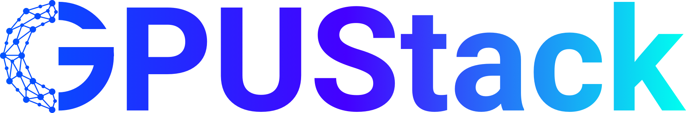
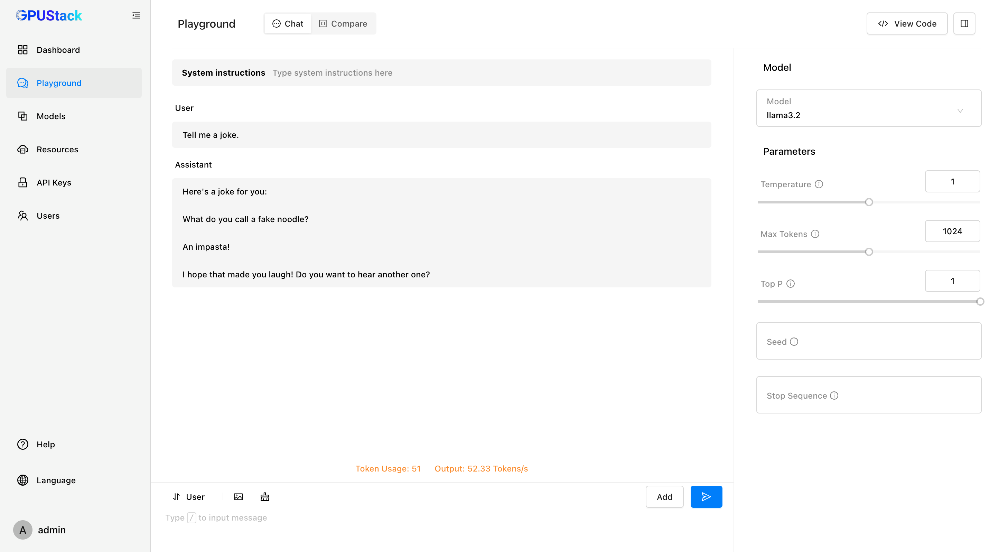

<br>
<p align="center">
    
</p>
<br>
<p align="center">
    <a href="https://docs.gpustack.ai" target="_blank">
        </a>
    <a href="./LICENSE" target="_blank">
        </a>
    <a href="./docs/assets/wechat-assistant.png" target="_blank">
        </a>
    <a href="https://discord.gg/VXYJzuaqwD" target="_blank">
        </a>
    <a href="https://twitter.com/intent/follow?screen_name=gpustack_ai" target="_blank">
        </a>
</p>
<br>


GPUStack is an open-source GPU cluster manager for running large language models(LLMs).

### Key Features

- **Supports a Wide Variety of Hardware:** Run with different brands of GPUs in Apple MacBooks, Windows PCs, and Linux servers.
- **Scales with Your GPU Inventory:** Easily add more GPUs or nodes to scale up your operations.
- **Distributed Inference**: Supports both single-node multi-GPU and multi-node inference and serving.
- **Multiple Inference Backends**: Supports llama-box (llama.cpp) and vLLM as the inference backends.
- **Lightweight Python Package:** Minimal dependencies and operational overhead.
- **OpenAI-compatible APIs:** Serve APIs that are compatible with OpenAI standards.
- **User and API key management:** Simplified management of users and API keys.
- **GPU metrics monitoring:** Monitor GPU performance and utilization in real-time.
- **Token usage and rate metrics:** Track token usage and manage rate limits effectively.

## Installation

### Linux or MacOS

GPUStack provides a script to install it as a service on systemd or launchd based systems. To install GPUStack using this method, just run:

```bash
curl -sfL https://get.gpustack.ai | sh -s -
```

### Windows

Run PowerShell as administrator (**avoid** using PowerShell ISE), then run the following command to install GPUStack:

```powershell
Invoke-Expression (Invoke-WebRequest -Uri "https://get.gpustack.ai" -UseBasicParsing).Content
```

### Other Installation Methods

For manual installation, docker installation or detailed configuration options, please refer to the [Installation Documentation](https://docs.gpustack.ai/latest/installation/installation-script/).

## Getting Started

1. Run and chat with the **llama3.2** model:

```bash
gpustack chat llama3.2 "tell me a joke."
```

2. Open `http://myserver` in the browser to access the GPUStack UI. Log in to GPUStack with username `admin` and the default password. You can run the following command to get the password for the default setup:

**Linux or MacOS**

```bash
cat /var/lib/gpustack/initial_admin_password
```

**Windows**

```powershell
Get-Content -Path "$env:APPDATA\gpustack\initial_admin_password" -Raw
```

3. Click `Playground` in the navigation menu. Now you can chat with the LLM in the UI playground.



4. Click `API Keys` in the navigation menu, then click the `New API Key` button.

5. Fill in the `Name` and click the `Save` button.

6. Copy the generated API key and save it somewhere safe. Please note that you can only see it once on creation.

7. Now you can use the API key to access the OpenAI-compatible API. For example, use curl as the following:

```bash
export GPUSTACK_API_KEY=myapikey
curl http://myserver/v1-openai/chat/completions \
  -H "Content-Type: application/json" \
  -H "Authorization: Bearer $GPUSTACK_API_KEY" \
  -d '{
    "model": "llama3.2",
    "messages": [
      {
        "role": "system",
        "content": "You are a helpful assistant."
      },
      {
        "role": "user",
        "content": "Hello!"
      }
    ],
    "stream": true
  }'
```

## Supported Platforms

- [x] MacOS
- [x] Linux
- [x] Windows

## Supported Accelerators

- [x] Apple Metal
- [x] NVIDIA CUDA
- [x] Ascend CANN
- [x] Moore Threads MUSA

We plan to support the following accelerators in future releases.

- [ ] AMD ROCm
- [ ] Intel oneAPI
- [ ] Qualcomm AI Engine

## Supported Models

GPUStack uses [llama.cpp](https://github.com/ggerganov/llama.cpp) and [vLLM](https://github.com/vllm-project/vllm) as the backends and supports a wide range of models. Models from the following sources are supported:

1. [Hugging Face](https://huggingface.co/)

2. [ModelScope](https://modelscope.cn/)

3. [Ollama Library](https://ollama.com/library)

Example language models:

- [x] [LLaMA](https://huggingface.co/meta-llama)
- [x] [Mistral 7B](https://huggingface.co/mistralai/Mistral-7B-v0.1)
- [x] [Mixtral MoE](https://huggingface.co/models?search=mistral-ai/Mixtral)
- [x] [Falcon](https://huggingface.co/models?search=tiiuae/falcon)
- [x] [Baichuan](https://huggingface.co/models?search=baichuan-inc/Baichuan)
- [x] [Yi](https://huggingface.co/models?search=01-ai/Yi)
- [x] [Deepseek](https://huggingface.co/models?search=deepseek-ai/deepseek)
- [x] [Qwen](https://huggingface.co/models?search=Qwen/Qwen)
- [x] [Phi](https://huggingface.co/models?search=microsoft/phi)
- [x] [Grok-1](https://huggingface.co/xai-org/grok-1)

Example multimodal models:

- [x] [Llama3.2-Vision](https://huggingface.co/models?pipeline_tag=image-text-to-text&search=llama3.2)
- [x] [Pixtral](https://huggingface.co/models?search=pixtral)
- [x] [Qwen2-VL](https://huggingface.co/models?search=Qwen/Qwen2-VL)
- [x] [LLaVA](https://huggingface.co/models?search=llava)
- [x] [InternVL2](https://huggingface.co/models?search=internvl2)

For full list of supported models, please refer to the supported models section in the [inference backends](https://docs.gpustack.ai/latest/user-guide/inference-backends/) documentation.

## OpenAI-Compatible APIs

GPUStack serves the following OpenAI compatible APIs under the `/v1-openai` path:

- [x] List Models
- [x] Create Completions
- [x] Create Chat Completions
- [x] Create Embeddings

For example, you can use the official [OpenAI Python API library](https://github.com/openai/openai-python) to consume the APIs:

```python
from openai import OpenAI
client = OpenAI(base_url="http://myserver/v1-openai", api_key="myapikey")

completion = client.chat.completions.create(
  model="llama3.2",
  messages=[
    {"role": "system", "content": "You are a helpful assistant."},
    {"role": "user", "content": "Hello!"}
  ]
)

print(completion.choices[0].message)
```

GPUStack users can generate their own API keys in the UI.

## Documentation

Please see the [official docs site](https://docs.gpustack.ai) for complete documentation.

## Build

1. Install `python 3.10+`.

2. Run `make build`.

You can find the built wheel package in `dist` directory.

## Contributing

Please read the [Contributing Guide](./docs/contributing.md) if you're interested in contributing to GPUStack.

## License

Copyright (c) 2024 The GPUStack authors

Licensed under the Apache License, Version 2.0 (the "License");
you may not use this file except in compliance with the License.
You may obtain a copy of the License at [LICENSE](./LICENSE) file for details.

Unless required by applicable law or agreed to in writing, software
distributed under the License is distributed on an "AS IS" BASIS,
WITHOUT WARRANTIES OR CONDITIONS OF ANY KIND, either express or implied.
See the License for the specific language governing permissions and
limitations under the License.
