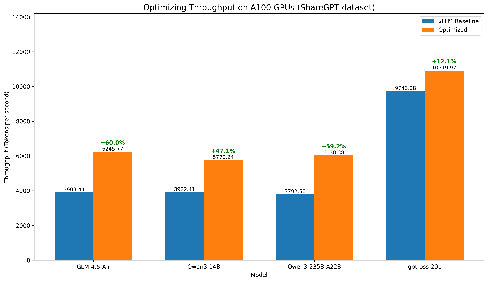

<br>

<p align="center">
    
</p>
<br>

<p align="center">
    <a href="https://docs.gpustack.ai" target="_blank">
        </a>
    <a href="./LICENSE" target="_blank">
        </a>
    <a href="./docs/assets/wechat-group-qrcode.jpg" target="_blank">
        </a>
    <a href="https://discord.gg/VXYJzuaqwD" target="_blank">
        </a>
    <a href="https://twitter.com/intent/follow?screen_name=gpustack_ai" target="_blank">
        </a>
</p>
<br>

<p align="center">
  <a href="./README.md">English</a> |
  <a href="./README_CN.md">简体中文</a> |
  <a href="./README_JP.md">日本語</a>
</p>

<br>

## Overview

GPUStack is an open-source GPU cluster manager designed for efficient AI model deployment. It lets you run models efficiently on your own GPU hardware by choosing the best inference engines, scheduling GPU resources, analyzing model architectures, and automatically configuring deployment parameters.

The following figure shows how GPUStack delivers improved inference throughput over the unoptimized vLLM baseline:



For detailed benchmarking methods and results, visit our [Inference Performance Lab](https://docs.gpustack.ai/latest/performance-lab/overview/).

## Tested Inference Engines, GPUs, and Models

GPUStack uses a plug-in architecture that makes it easy to add new AI models, inference engines, and GPU hardware. We work closely with partners and the open-source community to test and optimize emerging models across different inference engines and GPUs. Below is the current list of supported inference engines, GPUs, and models, which will continue to expand over time.

**Tested Inference Engines:**
- vLLM
- SGLang
- TensorRT-LLM
- MindIE

**Tested GPUs:**
- NVIDIA A100
- NVIDIA H100/H200
- Ascend 910B

**Tuned Models:**
- Qwen3
- gpt-oss
- GLM-4.5-Air
- GLM-4.5/4.6
- DeepSeek-R1

## Architecture

GPUStack enables development teams, IT organizations, and service providers to deliver Model-as-a-Service at scale. It supports industry-standard APIs for LLM, voice, image, and video models. The platform includes built-in user authentication and access control, real-time monitoring of GPU performance and utilization, and detailed metering of token usage and API request rates.

The figure below illustrates how a single GPUStack server can manage multiple GPU clusters across both on-premises and cloud environments. The GPUStack scheduler allocates GPUs to maximize resource utilization and selects the appropriate inference engines for optimal performance. Administrators also gain full visibility into system health and metrics through integrated Grafana and Prometheus dashboards.


GPUStack provides a powerful framework for deploying AI models. Its core features include:
- **Multi-Cluster GPU Management.** Manages GPU clusters across multiple environments. This includes on-premises servers, Kubernetes clusters, and cloud providers.
- **Pluggable Inference Engines.** Automatically configures high-performance inference engines such as vLLM, SGLang, and TensorRT-LLM. You can also add custom inference engines as needed.
- **Performance-Optimized Configurations.** Offers pre-tuned modes for low latency or high throughput. GPUStack supports extended KV cache systems like LMCache and HiCache to reduce TTFT. It also includes built-in support for speculative decoding methods such as EAGLE3, MTP, and N-grams.
- **Enterprise-Grade Operations.** Offers support for automated failure recovery, load balancing, monitoring, authentication, and access control.

## Quick Start

### Prerequisites

1. A node with at least one NVIDIA GPU. For other GPU types, please check the guidelines in the GPUStack UI when adding a worker, or refer to the [Installation documentation](https://docs.gpustack.ai/latest/installation/requirements/) for more details.
2. Ensure the NVIDIA driver, [Docker](https://docs.docker.com/engine/install/) and [NVIDIA Container Toolkit](https://docs.nvidia.com/datacenter/cloud-native/container-toolkit/install-guide.html) are installed on the worker node.
3. (Optional) A CPU node for hosting the GPUStack server. The GPUStack server does not require a GPU and can run on a CPU-only machine. [Docker](https://docs.docker.com/engine/install/) must be installed. Docker Desktop (for Windows and macOS) is also supported. If no dedicated CPU node is available, the GPUStack server can be installed on the same machine as a GPU worker node.
4. Only Linux is supported for GPUStack worker nodes. If you use Windows, consider using WSL2 and avoid using Docker Desktop. macOS is not supported for GPUStack worker nodes.

### Install GPUStack

Run the following command to install and start the GPUStack server using Docker:

```bash
sudo docker run -d --name gpustack \
    --restart unless-stopped \
    -p 80:80 \
    --volume gpustack-data:/var/lib/gpustack \
    gpustack/gpustack
```

<details>
<summary>Alternative: Use Quay Container Registry Mirror</summary>

If you cannot pull images from `Docker Hub` or the download is very slow, you can use our `Quay.io` mirror by pointing your registry to `quay.io`:

```bash
sudo docker run -d --name gpustack \
    --restart unless-stopped \
    -p 80:80 \
    --volume gpustack-data:/var/lib/gpustack \
    quay.io/gpustack/gpustack \
    --system-default-container-registry quay.io
```
</details>

Check the GPUStack startup logs:

```bash
sudo docker logs -f gpustack
```

After GPUStack starts, run the following command to get the default admin password:

```bash
sudo docker exec gpustack cat /var/lib/gpustack/initial_admin_password
```

Open your browser and navigate to `http://your_host_ip` to access the GPUStack UI. Use the default username `admin` and the password you retrieved above to log in.

### Set Up a GPU Cluster

1. On the GPUStack UI, navigate to the `Clusters` page.

2. Click the `Add Cluster` button.

3. Select `Docker` as the cluster provider.

4. Fill in the `Name` and `Description` fields for the new cluster, then click the `Save` button.

5. Follow the UI guidelines to configure the new worker node. You will need to run a Docker command on the worker node to connect it to the GPUStack server. The command will look similar to the following:

    ```bash
    sudo docker run -d --name gpustack-worker \
          --restart=unless-stopped \
          --privileged \
          --network=host \
          --volume /var/run/docker.sock:/var/run/docker.sock \
          --volume gpustack-data:/var/lib/gpustack \
          --runtime nvidia \
          gpustack/gpustack \
          --server-url http://your_gpustack_server_url \
          --token your_worker_token \
          --advertise-address 192.168.1.2
    ```

6. Execute the command on the worker node to connect it to the GPUStack server.

7. After the worker node connects successfully, it will appear on the `Workers` page in the GPUStack UI.

### Deploy a Model

1. Navigate to the `Catalog` page in the GPUStack UI.

2. Select the `Qwen3 0.6B` model from the list of available models.

3. After the deployment compatibility checks pass, click the `Save` button to deploy the model.


4. GPUStack will start downloading the model files and deploying the model. When the deployment status shows `Running`, the model has been deployed successfully.


5. Click `Playground - Chat` in the navigation menu, check that the model `qwen3-0.6b` is selected from the top-right `Model` dropdown. Now you can chat with the model in the UI playground.


### Use the model via API

1. Hover over the user avatar and navigate to the `API Keys` page, then click the `New API Key` button.

2. Fill in the `Name` and click the `Save` button.

3. Copy the generated API key and save it somewhere safe. Please note that you can only see it once on creation.

4. You can now use the API key to access the OpenAI-compatible API endpoints provided by GPUStack. For example, use curl as the following:

```bash
# Replace `your_api_key` and `your_gpustack_server_url`
# with your actual API key and GPUStack server URL.
export GPUSTACK_API_KEY=your_api_key
curl http://your_gpustack_server_url/v1/chat/completions \
  -H "Content-Type: application/json" \
  -H "Authorization: Bearer $GPUSTACK_API_KEY" \
  -d '{
    "model": "qwen3-0.6b",
    "messages": [
      {
        "role": "system",
        "content": "You are a helpful assistant."
      },
      {
        "role": "user",
        "content": "Tell me a joke."
      }
    ],
    "stream": true
  }'
```

## Documentation

Please see the [official docs site](https://docs.gpustack.ai) for complete documentation.

## Build

1. Install Python (version 3.10 to 3.12).

2. Run `make build`.

You can find the built wheel package in `dist` directory.

## Contributing

Please read the [Contributing Guide](./docs/contributing.md) if you're interested in contributing to GPUStack.

## Join Community

Any issues or have suggestions, feel free to join our [Community](https://discord.gg/VXYJzuaqwD) for support.

## License

Copyright (c) 2024-2025 The GPUStack authors

Licensed under the Apache License, Version 2.0 (the "License");
you may not use this file except in compliance with the License.
You may obtain a copy of the License at [LICENSE](./LICENSE) file for details.

Unless required by applicable law or agreed to in writing, software
distributed under the License is distributed on an "AS IS" BASIS,
WITHOUT WARRANTIES OR CONDITIONS OF ANY KIND, either express or implied.
See the License for the specific language governing permissions and
limitations under the License.
