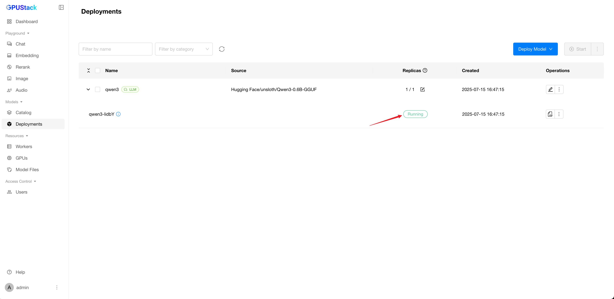

<br>

<p align="center">
    
</p>
<br>

<p align="center">
    <a href="https://docs.gpustack.ai" target="_blank">
        </a>
    <a href="./LICENSE" target="_blank">
        </a>
    <a href="./docs/assets/wechat-assistant.png" target="_blank">
        </a>
    <a href="https://discord.gg/VXYJzuaqwD" target="_blank">
        </a>
    <a href="https://twitter.com/intent/follow?screen_name=gpustack_ai" target="_blank">
        </a>
</p>
<br>

<p align="center">
  <a href="./README.md">English</a> |
  <a href="./README_CN.md">简体中文</a> |
  <a href="./README_JP.md">日本語</a>
</p>

<br>


GPUStack is an open-source GPU cluster manager for running AI models.

### Key Features

- **Broad GPU Compatibility:** Seamlessly supports GPUs from various vendors across Apple Macs, Windows PCs, and Linux servers.
- **Extensive Model Support:** Supports a wide range of models including LLMs, VLMs, image models, audio models, embedding models, and rerank models.
- **Flexible Inference Backends:** Flexibly integrates with multiple inference backends including vLLM, Ascend MindIE, llama-box (llama.cpp & stable-diffusion.cpp) and vox-box.
- **Multi-Version Backend Support:** Run multiple versions of inference backends concurrently to meet the diverse runtime requirements of different models.
- **Distributed Inference:** Supports single-node and multi-node multi-GPU inference, including heterogeneous GPUs across vendors and runtime environments.
- **Scalable GPU Architecture:** Easily scale up by adding more GPUs or nodes to your infrastructure.
- **Robust Model Stability:** Ensures high availability with automatic failure recovery, multi-instance redundancy, and load balancing for inference requests.
- **Intelligent Deployment Evaluation:** Automatically assess model resource requirements, backend and architecture compatibility, OS compatibility, and other deployment-related factors.
- **Automated Scheduling:** Dynamically allocate models based on available resources.
- **Lightweight Python Package:** Minimal dependencies and low operational overhead.
- **OpenAI-Compatible APIs:** Fully compatible with OpenAI’s API specifications for seamless integration.
- **User & API Key Management:** Simplified management of users and API keys.
- **Real-Time GPU Monitoring:** Track GPU performance and utilization in real time.
- **Token and Rate Metrics:** Monitor token usage and API request rates.

## Installation

### Linux

If you are using NVIDIA GPUs, ensure [Docker](https://docs.docker.com/engine/install/) and [NVIDIA Container Toolkit](https://docs.nvidia.com/datacenter/cloud-native/container-toolkit/install-guide.html) are installed on your system. Then, run the following command to start the GPUStack server.

```bash
docker run -d --name gpustack \
      --restart=unless-stopped \
      --gpus all \
      --network=host \
      --ipc=host \
      -v gpustack-data:/var/lib/gpustack \
      gpustack/gpustack
```

For more details on the installation or other GPU hardware platforms, please refer to the [Installation Documentation](docs/installation/installation-requirements.md).

After the server starts, run the following command to get the default admin password:

```bash
docker exec gpustack cat /var/lib/gpustack/initial_admin_password
```

Open your browser and navigate to `http://your_host_ip` to access the GPUStack UI. Use the default username `admin` and the password you retrieved above to log in.

### macOS & Windows

A desktop installer is available for macOS and Windows — see the [documentation](https://docs.gpustack.ai/latest/installation/desktop-installer/) for installation details.

## Deploy a Model

1. Navigate to the `Catalog` page in the GPUStack UI.

2. Select the `Qwen3` model from the list of available models.

3. After the deployment compatibility checks pass, click the `Save` button to deploy the model.


4. GPUStack will start downloading the model files and deploying the model. When the deployment status shows `Running`, the model has been deployed successfully.



5. Click `Playground - Chat` in the navigation menu, check that the model `qwen3` is selected from the top-right `Model` dropdown. Now you can chat with the model in the UI playground.


## Use the model via API

1. Hover over the user avatar and navigate to the `API Keys` page, then click the `New API Key` button.

2. Fill in the `Name` and click the `Save` button.

3. Copy the generated API key and save it somewhere safe. Please note that you can only see it once on creation.

4. You can now use the API key to access the OpenAI-compatible API endpoints provided by GPUStack. For example, use curl as the following:

```bash
# Replace `your_api_key` and `your_gpustack_server_url`
# with your actual API key and GPUStack server URL.
export GPUSTACK_API_KEY=your_api_key
curl http://your_gpustack_server_url/v1/chat/completions \
  -H "Content-Type: application/json" \
  -H "Authorization: Bearer $GPUSTACK_API_KEY" \
  -d '{
    "model": "qwen3",
    "messages": [
      {
        "role": "system",
        "content": "You are a helpful assistant."
      },
      {
        "role": "user",
        "content": "Tell me a joke."
      }
    ],
    "stream": true
  }'
```

## Supported Platforms

- [x] Linux
- [x] macOS
- [x] Windows

## Supported Accelerators

- [x] NVIDIA CUDA ([Compute Capability](https://developer.nvidia.com/cuda-gpus) 6.0 and above)
- [x] Apple Metal (M-series chips)
- [x] AMD ROCm
- [x] Ascend CANN
- [x] Hygon DTK
- [x] Moore Threads MUSA
- [x] Iluvatar Corex
- [x] Cambricon MLU

## Supported Models

GPUStack uses [vLLM](https://github.com/vllm-project/vllm), [Ascend MindIE](https://www.hiascend.com/en/software/mindie), [llama-box](https://github.com/gpustack/llama-box) (bundled [llama.cpp](https://github.com/ggml-org/llama.cpp) and [stable-diffusion.cpp](https://github.com/leejet/stable-diffusion.cpp) server) and [vox-box](https://github.com/gpustack/vox-box) as the backends and supports a wide range of models. Models from the following sources are supported:

1. [Hugging Face](https://huggingface.co/)

2. [ModelScope](https://modelscope.cn/)

3. Local File Path

### Example Models

| **Category**                     | **Models**                                                                                                                                                                                                                                                                                                                                       |
| -------------------------------- | ------------------------------------------------------------------------------------------------------------------------------------------------------------------------------------------------------------------------------------------------------------------------------------------------------------------------------------------------ |
| **Large Language Models(LLMs)**  | [Qwen](https://huggingface.co/models?search=Qwen/Qwen), [LLaMA](https://huggingface.co/meta-llama), [Mistral](https://huggingface.co/mistralai), [DeepSeek](https://huggingface.co/models?search=deepseek-ai/deepseek), [Phi](https://huggingface.co/models?search=microsoft/phi), [Gemma](https://huggingface.co/models?search=Google/gemma)    |
| **Vision Language Models(VLMs)** | [Llama3.2-Vision](https://huggingface.co/models?pipeline_tag=image-text-to-text&search=llama3.2), [Pixtral](https://huggingface.co/models?search=pixtral) , [Qwen2.5-VL](https://huggingface.co/models?search=Qwen/Qwen2.5-VL), [LLaVA](https://huggingface.co/models?search=llava), [InternVL3](https://huggingface.co/models?search=internvl3) |
| **Diffusion Models**             | [Stable Diffusion](https://huggingface.co/models?search=gpustack/stable-diffusion), [FLUX](https://huggingface.co/models?search=gpustack/flux)                                                                                                                                                                                                   |
| **Embedding Models**             | [BGE](https://huggingface.co/gpustack/bge-m3-GGUF), [BCE](https://huggingface.co/gpustack/bce-embedding-base_v1-GGUF), [Jina](https://huggingface.co/models?search=gpustack/jina-embeddings), [Qwen3-Embedding](https://huggingface.co/models?search=qwen/qwen3-embedding)                                                                       |
| **Reranker Models**              | [BGE](https://huggingface.co/gpustack/bge-reranker-v2-m3-GGUF), [BCE](https://huggingface.co/gpustack/bce-reranker-base_v1-GGUF), [Jina](https://huggingface.co/models?search=gpustack/jina-reranker), [Qwen3-Reranker](https://huggingface.co/models?search=qwen/qwen3-reranker)                                                                |
| **Audio Models**                 | [Whisper](https://huggingface.co/models?search=Systran/faster) (Speech-to-Text), [CosyVoice](https://huggingface.co/models?search=FunAudioLLM/CosyVoice) (Text-to-Speech)                                                                                                                                                                        |

For full list of supported models, please refer to the supported models section in the [inference backends](https://docs.gpustack.ai/latest/user-guide/inference-backends/) documentation.

## OpenAI-Compatible APIs

GPUStack serves the following OpenAI compatible APIs under the `/v1-openai` path:

- [x] [List Models](https://platform.openai.com/docs/api-reference/models/list)
- [x] [Create Completion](https://platform.openai.com/docs/api-reference/completions/create)
- [x] [Create Chat Completion](https://platform.openai.com/docs/api-reference/chat/create)
- [x] [Create Embeddings](https://platform.openai.com/docs/api-reference/embeddings/create)
- [x] [Create Image](https://platform.openai.com/docs/api-reference/images/create)
- [x] [Create Image Edit](https://platform.openai.com/docs/api-reference/images/createEdit)
- [x] [Create Speech](https://platform.openai.com/docs/api-reference/audio/createSpeech)
- [x] [Create Transcription](https://platform.openai.com/docs/api-reference/audio/createTranscription)

For example, you can use the official [OpenAI Python API library](https://github.com/openai/openai-python) to consume the APIs:

```python
from openai import OpenAI
client = OpenAI(base_url="http://your_gpustack_server_url/v1-openai", api_key="your_api_key")

completion = client.chat.completions.create(
  model="llama3.2",
  messages=[
    {"role": "system", "content": "You are a helpful assistant."},
    {"role": "user", "content": "Hello!"}
  ]
)

print(completion.choices[0].message)
```

GPUStack users can generate their own API keys in the UI.

## Documentation

Please see the [official docs site](https://docs.gpustack.ai) for complete documentation.

## Build

1. Install Python (version 3.10 to 3.12).

2. Run `make build`.

You can find the built wheel package in `dist` directory.

## Contributing

Please read the [Contributing Guide](./docs/contributing.md) if you're interested in contributing to GPUStack.

## Join Community

Any issues or have suggestions, feel free to join our [Community](https://discord.gg/VXYJzuaqwD) for support.

## License

Copyright (c) 2024 The GPUStack authors

Licensed under the Apache License, Version 2.0 (the "License");
you may not use this file except in compliance with the License.
You may obtain a copy of the License at [LICENSE](./LICENSE) file for details.

Unless required by applicable law or agreed to in writing, software
distributed under the License is distributed on an "AS IS" BASIS,
WITHOUT WARRANTIES OR CONDITIONS OF ANY KIND, either express or implied.
See the License for the specific language governing permissions and
limitations under the License.
