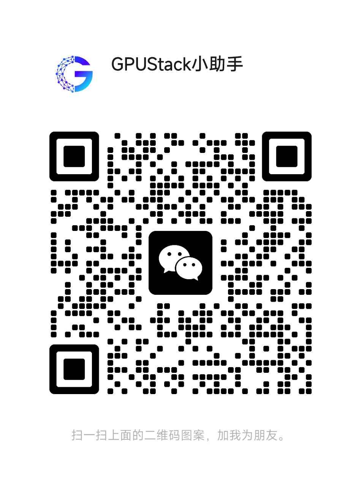

<br>

<p align="center">
    
</p>
<br>

<p align="center">
    <a href="https://docs.gpustack.ai" target="_blank">
        </a>
    <a href="./LICENSE" target="_blank">
        </a>
    <a href="./docs/assets/wechat-assistant.png" target="_blank">
        </a>
    <a href="https://discord.gg/VXYJzuaqwD" target="_blank">
        </a>
    <a href="https://twitter.com/intent/follow?screen_name=gpustack_ai" target="_blank">
        </a>
</p>
<br>

<p align="center">
  <a href="./README.md">English</a> |
  <a href="./README_CN.md">简体中文</a>
</p>

<br>


GPUStack 是一个用于运行 AI 模型的开源 GPU 集群管理器。

### 核心特性

- **广泛的硬件兼容性**：支持管理 Apple Mac、Windows PC 和 Linux 服务器上不同品牌的 GPU。
- **广泛的模型支持**：从大语言模型 LLM、多模态模型 VLM 到 Diffusion 扩散模型、STT 与 TTS 语音模型、文本嵌入和重排序模型的广泛支持。
- **异构 GPU 支持与扩展**：轻松添加异构 GPU 资源，按需扩展算力规模。
- **分布式推理**：支持单机多卡并行和多机多卡并行推理。
- **多推理后端支持**：支持 llama-box（基于 llama.cpp 和 stable-diffusion.cpp）、vox-box 和 vLLM 作为推理后端。
- **轻量级 Python 包**：最小的依赖和操作开销。
- **OpenAI 兼容 API**：提供兼容 OpenAI 标准的 API 服务。
- **用户和 API 密钥管理**：简化用户和 API 密钥的管理流程。
- **GPU 指标监控**：实时监控 GPU 性能和利用率。
- **Token 使用和速率统计**：有效跟踪 token 使用情况，并管理速率限制。

## 安装

### Linux 或 macOS

GPUStack 提供了安装脚本，可以将其安装为 Linux 的 systemd 服务或 macOS 的 launchd 服务，默认端口为 80。要使用此方法安装 GPUStack，执行以下命令：

```bash
curl -sfL https://get.gpustack.ai | INSTALL_INDEX_URL=https://pypi.tuna.tsinghua.edu.cn/simple sh -s -
```

### Windows

以管理员身份运行 PowerShell（**避免**使用 PowerShell ISE），然后执行以下命令安装 GPUStack：

```powershell
$env:INSTALL_INDEX_URL = "https://pypi.tuna.tsinghua.edu.cn/simple"
Invoke-Expression (Invoke-WebRequest -Uri "https://get.gpustack.ai" -UseBasicParsing).Content
```

### 其他安装方式

有关手动安装、Docker 安装或详细配置选项，请参考[安装文档](https://docs.gpustack.ai/latest/installation/installation-script/)。

## 新手入门

1. 在命令行运行 **llama3.2** 模型并进行对话：

```bash
gpustack chat llama3.2 "tell me a joke."
```

2. 运行 **stable-diffusion-v3-5-large-turbo** 模型并生成图像：

> ### 💡 Tip
>
> 此命令将从 Hugging Face 下载模型（约 12GB）。下载时间取决于你的网络速度。确保你有足够的磁盘空间和 VRAM（12GB）来运行模型。如果遇到问题，你可以跳过此步骤并转到下一步。

```bash
gpustack draw hf.co/gpustack/stable-diffusion-v3-5-large-turbo-GGUF:stable-diffusion-v3-5-large-turbo-Q4_0.gguf \
"A minion holding a sign that says 'GPUStack'. The background is filled with futuristic elements like neon lights, circuit boards, and holographic displays. The minion is wearing a tech-themed outfit, possibly with LED lights or digital patterns. The sign itself has a sleek, modern design with glowing edges. The overall atmosphere is high-tech and vibrant, with a mix of dark and neon colors." \
--sample-steps 5 --show
```

命令完成后，生成的图像将出现在默认查看器中。你可以尝试修改 prompt 和 CLI 参数来定制输出。


3. 在浏览器中打开 `http://myserver`，访问 GPUStack 界面。使用“admin”用户名和默认密码登录 GPUStack。可以执行以下命令获取默认密码：

**Linux or macOS**

```bash
cat /var/lib/gpustack/initial_admin_password
```

**Windows**

```powershell
Get-Content -Path "$env:APPDATA\gpustack\initial_admin_password" -Raw
```

4. 在菜单中点击“试验场 - 对话”，现在你可以在试验场中与 LLM 进行对话。


5. 在菜单中点击“API 秘钥”，然后点击“新建 API 秘钥”按钮。

6. 填写“名称”，然后点击“保存”按钮。

7. 复制生成的 API 密钥并将其保存。请注意，秘钥只在创建时可见。

8. 现在你可以使用 API 密钥访问 OpenAI 兼容 API。例如，curl 的用法如下：

```bash
export GPUSTACK_API_KEY=myapikey
curl http://myserver/v1-openai/chat/completions \
  -H "Content-Type: application/json" \
  -H "Authorization: Bearer $GPUSTACK_API_KEY" \
  -d '{
    "model": "llama3.2",
    "messages": [
      {
        "role": "system",
        "content": "You are a helpful assistant."
      },
      {
        "role": "user",
        "content": "Hello!"
      }
    ],
    "stream": true
  }'
```

## 平台支持

- [x] macOS
- [x] Linux
- [x] Windows

## 加速框架支持

- [x] Apple Metal (M 系列芯片)
- [x] NVIDIA CUDA ([Compute Capability](https://developer.nvidia.com/cuda-gpus) 6.0 以上)
- [x] AMD ROCm
- [x] 昇腾 CANN
- [x] 摩尔线程 MUSA

我们计划在未来的版本中支持以下加速框架：

- [ ] 海光 DCU
- [ ] Intel oneAPI
- [ ] Qualcomm AI Engine

## 模型支持

GPUStack 使用 [llama-box](https://github.com/gpustack/llama-box)（基于 [llama.cpp](https://github.com/ggerganov/llama.cpp) 和 [stable-diffusion.cpp](https://github.com/leejet/stable-diffusion.cpp)）、[vLLM](https://github.com/vllm-project/vllm) 和 [vox-box](https://github.com/gpustack/vox-box) 作为后端并提供广泛的模型支持。支持从以下来源部署模型：

1. [Hugging Face](https://huggingface.co/)

2. [ModelScope](https://modelscope.cn/)

3. [Ollama Library](https://ollama.com/library)

4. 本地文件路径

### 示例模型

| **类别**               | **模型**                                                                                                                                                                                                                                                                                                                                         |
| ---------------------- | ------------------------------------------------------------------------------------------------------------------------------------------------------------------------------------------------------------------------------------------------------------------------------------------------------------------------------------------------ |
| **大语言模型（LLM）**  | [Qwen](https://huggingface.co/models?search=Qwen/Qwen), [LLaMA](https://huggingface.co/meta-llama), [Mistral](https://huggingface.co/mistralai), [Deepseek](https://huggingface.co/models?search=deepseek-ai/deepseek), [Phi](https://huggingface.co/models?search=microsoft/phi), [Yi](https://huggingface.co/models?search=01-ai/Yi)           |
| **多模态模型（VLM）**  | [Llama3.2-Vision](https://huggingface.co/models?pipeline_tag=image-text-to-text&search=llama3.2), [Pixtral](https://huggingface.co/models?search=pixtral) , [Qwen2-VL](https://huggingface.co/models?search=Qwen/Qwen2-VL), [LLaVA](https://huggingface.co/models?search=llava), [InternVL2.5](https://huggingface.co/models?search=internvl2_5) |
| **Diffusion 扩散模型** | [Stable Diffusion](https://huggingface.co/models?search=gpustack/stable-diffusion), [FLUX](https://huggingface.co/models?search=gpustack/flux)                                                                                                                                                                                                   |
| **Embedding 模型**     | [BGE](https://huggingface.co/gpustack/bge-m3-GGUF), [BCE](https://huggingface.co/gpustack/bce-embedding-base_v1-GGUF), [Jina](https://huggingface.co/models?search=gpustack/jina-embeddings)                                                                                                                                                     |
| **Reranker 模型**      | [BGE](https://huggingface.co/gpustack/bge-reranker-v2-m3-GGUF), [BCE](https://huggingface.co/gpustack/bce-reranker-base_v1-GGUF), [Jina](https://huggingface.co/models?search=gpustack/jina-reranker)                                                                                                                                            |
| **语音模型**           | [Whisper](https://huggingface.co/models?search=Systran/faster) (speech-to-text), [CosyVoice](https://huggingface.co/models?search=FunAudioLLM/CosyVoice) (text-to-speech)                                                                                                                                                                        |

有关支持模型的完整列表，请参阅 [inference backends](https://docs.gpustack.ai/latest/user-guide/inference-backends/) 文档中的 Supported Models 部分。

## OpenAI 兼容 API

GPUStack 在 `/v1-openai` 路径提供以下 OpenAI 兼容 API：

- [x] [List Models](https://platform.openai.com/docs/api-reference/models/list)
- [x] [Create Completion](https://platform.openai.com/docs/api-reference/completions/create)
- [x] [Create Chat Completion](https://platform.openai.com/docs/api-reference/chat/create)
- [x] [Create Embeddings](https://platform.openai.com/docs/api-reference/embeddings/create)
- [x] [Create Image](https://platform.openai.com/docs/api-reference/images/create)
- [x] [Create Image Edit](https://platform.openai.com/docs/api-reference/images/createEdit)
- [x] [Create Speech](https://platform.openai.com/docs/api-reference/audio/createSpeech)
- [x] [Create Transcription](https://platform.openai.com/docs/api-reference/audio/createTranscription)

例如，你可以使用官方的 [OpenAI Python API 库](https://github.com/openai/openai-python)来调用 API：

```python
from openai import OpenAI
client = OpenAI(base_url="http://myserver/v1-openai", api_key="myapikey")

completion = client.chat.completions.create(
  model="llama3.2",
  messages=[
    {"role": "system", "content": "You are a helpful assistant."},
    {"role": "user", "content": "Hello!"}
  ]
)

print(completion.choices[0].message)
```

GPUStack 用户可以在 UI 中生成自己的 API 密钥。

## 文档

完整文档请参见[官方文档](https://docs.gpustack.ai)。

## 构建

1. 安装 Python（版本 3.10 ~ 3.12）。

2. 运行 `make build`。

你可以在 `dist` 目录下找到构建的 wheel 包。

## Contributing

如果你有兴趣参与 GPUStack 贡献代码，请阅读[贡献指南](./docs/contributing.md)。

## 加入社区

扫码添加 GPUStack 微信小助手加入社区群：

<p align="left">
    
</p>

## License

版权所有 (c) 2024 GPUStack 作者

本项目基于 Apache-2.0 许可证（以下简称“许可证”）授权。  
您只能在遵守许可证条款的前提下使用本项目。  
许可证的完整内容请参阅 [LICENSE](./LICENSE) 文件。

除非适用法律另有规定或双方另有书面约定，依据许可证分发的软件按“原样”提供，  
不附带任何明示或暗示的保证或条件。
有关许可证规定的具体权利和限制，请参阅许可证了解更多详细信息。
