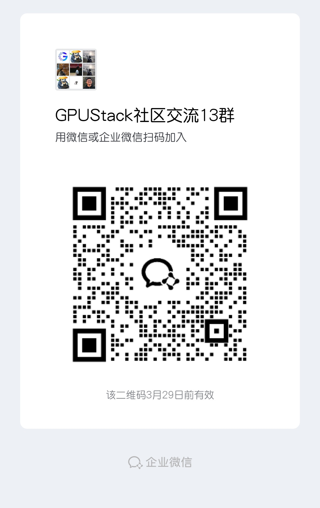

<br>

<p align="center">
    
</p>
<br>

<p align="center">
    <a href="https://docs.gpustack.ai" target="_blank">
        </a>
    <a href="./LICENSE" target="_blank">
        </a>
    <a href="./docs/assets/wechat-group-qrcode.jpg" target="_blank">
        </a>
    <a href="https://discord.gg/VXYJzuaqwD" target="_blank">
        </a>
    <a href="https://twitter.com/intent/follow?screen_name=gpustack_ai" target="_blank">
        </a>
</p>
<br>

<p align="center">
  <a href="./README.md">English</a> |
  <a href="./README_CN.md">简体中文</a> |
  <a href="./README_JP.md">日本語</a>
</p>

<br>

GPUStack 是一个用于运行 AI 模型的开源 GPU 集群管理器。

### 核心特性

- **广泛的 GPU 兼容性**：无缝支持 Apple Mac、Windows PC 和 Linux 服务器上各种供应商的 GPU。
- **广泛的模型支持**：支持各种模型，包括 LLM、多模态 VLM、图像模型、语音模型、文本嵌入模型和重排序模型。
- **灵活的推理后端**：支持与 vLLM 、 Ascend MindIE、llama-box（llama.cpp 和 stable-diffusion.cpp）和 vox-box 等多种推理后端的灵活集成。
- **多版本后端支持**：同时运行推理后端的多个版本，以满足不同模型的不同运行依赖。
- **分布式推理**：支持单机和多机多卡并行推理，包括跨供应商和运行环境的异构 GPU。
- **可扩展的 GPU 架构**：通过向基础设施添加更多 GPU 或节点轻松进行扩展。
- **强大的模型稳定性**：通过自动故障恢复、多实例冗余和推理请求的负载平衡确保高可用性。
- **智能部署评估**：自动评估模型资源需求、后端和架构兼容性、操作系统兼容性以及其他与部署相关的因素。
- **自动调度**：根据可用资源动态分配模型。
- **轻量级 Python 包**：最小依赖性和低操作开销。
- **OpenAI 兼容 API**：完全兼容 OpenAI 的 API 规范，实现无缝集成。
- **用户和 API 密钥管理**：简化用户和 API 密钥的管理。
- **实时 GPU 监控**：实时跟踪 GPU 性能和利用率。
- **令牌和速率指标**：监控 Token 使用情况和 API 请求速率。

## 安装

> GPUStack 现在仅支持 Linux。对于 Windows，请使用 WSL2 并避免使用 Docker Desktop。

如果你是 NVIDIA GPU 环境，请确保 NVIDIA 驱动，[Docker](https://docs.docker.com/engine/install/) 和 [NVIDIA Container Toolkit](https://docs.nvidia.com/datacenter/cloud-native/container-toolkit/install-guide.html) 都已经在系统中安装。 然后，执行如下命令启动 GPUStack：

```bash
sudo docker run -d --name gpustack \
    --restart unless-stopped \
    --privileged \
    --network host \
    --volume /var/run/docker.sock:/var/run/docker.sock \
    --volume gpustack-data:/var/lib/gpustack \
    --runtime nvidia \
    gpustack/gpustack
```

如果你不能从 `Docker Hub` 下载镜像或下载速度很慢，你可以使用我们提供的 `Quay.io` 镜像源。通过将 Registry 指向 `quay.io` 来使用镜像源：

```bash
sudo docker run -d --name gpustack \
    --restart unless-stopped \
    --privileged \
    --network host \
    --volume /var/run/docker.sock:/var/run/docker.sock \
    --volume gpustack-data:/var/lib/gpustack \
    --runtime nvidia \
    quay.io/gpustack/gpustack \
    --system-default-container-registry quay.io
```

有关其它平台的安装或详细配置选项，请参考[安装需求](docs/installation/requirements.md)。

检查 GPUStack 的启动日志：

```bash
sudo docker logs -f gpustack
```

容器正常运行后，执行以下命令获取默认密码：

```bash
sudo docker exec -it gpustack cat /var/lib/gpustack/initial_admin_password
```

在浏览器中打开 `http://your_host_ip`，访问 GPUStack 界面。使用 `admin` 用户名和默认密码登录 GPUStack。

## 部署模型

1. 在 GPUStack 界面，在菜单中点击“模型库”。

2. 从模型列表中选择 `Qwen3 0.6B` 模型。

3. 在部署兼容性检查通过之后，选择保存部署模型。


4. GPUStack 将开始下载模型文件并部署模型。当部署状态显示为 `Running` 时，表示模型已成功部署。


5. 点击菜单中的“试验场 - 对话”，在右上方模型菜单中选择模型 `qwen3-0.6b`。现在你可以在试验场中与 LLM 进行对话。


## 通过 API 使用模型

1. 将鼠标移动到右下角的用户头像上，选择“API 密钥”，然后点击“新建 API 秘钥”按钮。

2. 填写“名称”，然后点击“保存”按钮。

3. 复制生成的 API 密钥并将其保存。请注意，秘钥只在创建时可见。

4. 现在你可以使用 API 密钥访问 OpenAI 兼容 API。例如，curl 的用法如下：

```bash
# Replace `your_api_key` and `your_gpustack_server_url`
# with your actual API key and GPUStack server URL.
export GPUSTACK_API_KEY=your_api_key
curl http://your_gpustack_server_url/v1/chat/completions \
  -H "Content-Type: application/json" \
  -H "Authorization: Bearer $GPUSTACK_API_KEY" \
  -d '{
    "model": "qwen3-0.6b",
    "messages": [
      {
        "role": "system",
        "content": "You are a helpful assistant."
      },
      {
        "role": "user",
        "content": "Tell me a joke."
      }
    ],
    "stream": true
  }'
```

## 加速器支持

- [x] NVIDIA GPU
- [x] AMD GPU
- [x] 昇腾 NPU
- [x] 海光 DCU （实验性）
- [x] 摩尔线程 GPU （实验性）
- [x] 天数智芯 GPU （实验性）
- [x] 沐曦 GPU （实验性）
- [x] 寒武纪 MLU （实验性）

## 模型支持

GPUStack 使用 [vLLM](https://github.com/vllm-project/vllm)、[SGLang](https://github.com/sgl-project/sglang)、[MindIE](https://www.hiascend.com/en/software/mindie) 和 [vox-box](https://github.com/gpustack/vox-box) 作为内置推理后端，还支持自定义任何可以在容器中运行并公开服务 API 的后端。这使得 GPUStack 可以提供广泛的模型支持。

支持从以下来源部署模型：

1. [Hugging Face](https://huggingface.co/)

2. [ModelScope](https://modelscope.cn/)

3. 本地文件路径

有关每个内置推理后端支持哪些模型的信息，请参阅 [Built-in Inference Backends](https://docs.gpustack.ai/latest/user-guide/built-in-inference-backends/) 文档中的 Supported Models 部分。

## OpenAI 兼容 API

GPUStack 在 `/v1` 路径提供以下 OpenAI 兼容 API：

- [x] [List Models](https://platform.openai.com/docs/api-reference/models/list)
- [x] [Create Completion](https://platform.openai.com/docs/api-reference/completions/create)
- [x] [Create Chat Completion](https://platform.openai.com/docs/api-reference/chat/create)
- [x] [Create Embeddings](https://platform.openai.com/docs/api-reference/embeddings/create)
- [x] [Create Image](https://platform.openai.com/docs/api-reference/images/create)
- [x] [Create Image Edit](https://platform.openai.com/docs/api-reference/images/createEdit)
- [x] [Create Speech](https://platform.openai.com/docs/api-reference/audio/createSpeech)
- [x] [Create Transcription](https://platform.openai.com/docs/api-reference/audio/createTranscription)

例如，你可以使用官方的 [OpenAI Python API 库](https://github.com/openai/openai-python)来调用 API：

```python
from openai import OpenAI
client = OpenAI(base_url="http://your_gpustack_server_url/v1", api_key="your_api_key")

completion = client.chat.completions.create(
  model="llama3.2",
  messages=[
    {"role": "system", "content": "You are a helpful assistant."},
    {"role": "user", "content": "Hello!"}
  ]
)

print(completion.choices[0].message)
```

GPUStack 用户可以在 UI 中生成自己的 API 密钥。

## 文档

完整文档请参见[官方文档](https://docs.gpustack.ai)。

## 构建

1. 安装 Python（版本 3.10 ~ 3.12）。

2. 运行 `make build`。

你可以在 `dist` 目录下找到构建的 wheel 包。

## Contributing

如果你有兴趣参与 GPUStack 贡献代码，请阅读[贡献指南](./docs/contributing.md)。

## 加入社区

扫码加入社区群：

<p align="left">
    
</p>

## License

版权所有 (c) 2024 GPUStack 作者

本项目基于 Apache-2.0 许可证（以下简称“许可证”）授权。
您只能在遵守许可证条款的前提下使用本项目。
许可证的完整内容请参阅 [LICENSE](./LICENSE) 文件。

除非适用法律另有规定或双方另有书面约定，依据许可证分发的软件按“原样”提供，
不附带任何明示或暗示的保证或条件。
有关许可证规定的具体权利和限制，请参阅许可证了解更多详细信息。
