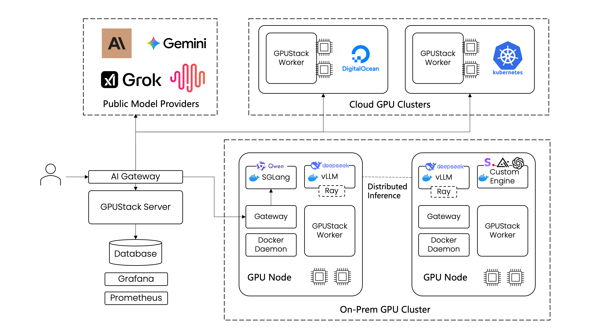
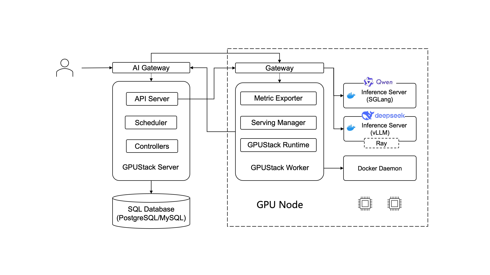

# Architecture

The diagram below provides a high-level view of the GPUStack architecture.

The diagram below details the internal components and their interactions.

### Server

The GPUStack server consists of the following components:

- **API Server:** Provides a RESTful interface for clients to interact with the system. It handles authentication and authorization.
- **Scheduler:** Responsible for assigning model instances to workers.
- **Controllers:** Manages the state of resources in the system. For example, they handle the rollout and scaling of model instances to match the desired number of replicas.

### Worker

The GPUStack worker consists of the following components:

- **GPUStack Runtime:** Detects GPU devices and interacts with the container runtime to deploy model instances.
- **Serving Manager:** Manages the lifecycle of model instances on the worker.
- **Metric Exporter:** Exports metrics about the model instances and their performance.

### AI Gateway

The AI Gateway handles incoming API requests from clients. It routes requests to the appropriate model instances based on the requested model. GPUStack uses [Higress](https://github.com/alibaba/higress) for API routing and load balancing.

### SQL Database

The GPUStack server connects to a SQL database as the datastore. GPUStack uses an Embedded PostgreSQL by default, but you can configure it to use an external PostgreSQL or MySQL as well.

### Inference Server

Inference servers are the backends that perform the inference tasks. GPUStack supports [vLLM](https://github.com/vllm-project/vllm), [SGLang](https://github.com/sgl-project/sglang), [Ascend MindIE](https://www.hiascend.com/en/software/mindie) and [VoxBox](https://github.com/gpustack/vox-box) as the built-in inference server. You can also add custom inference backends.

### Ray

[Ray](https://ray.io) is a distributed computing framework that GPUStack utilizes to run distributed vLLM. GPUStack bootstraps Ray cluster on-demand to run distributed vLLM across multiple workers.
