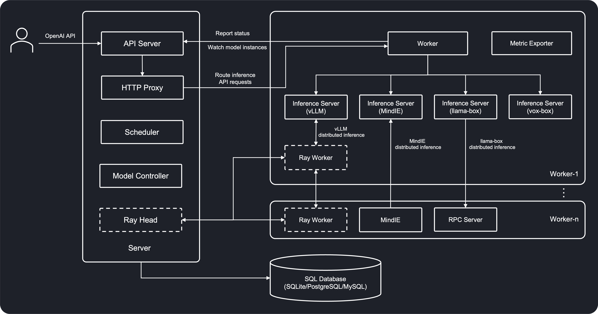

# Architecture

The following diagram shows the architecture of GPUStack:

### Server

The GPUStack server consists of the following components:

- **API Server**: Provides a RESTful interface for clients to interact with the system. It handles authentication and authorization.
- **Scheduler**: Responsible for assigning model instances to workers.
- **Model Controller**: Manages the rollout and scaling of model instances to match the desired model replicas.
- **HTTP Proxy**: Routes inference API requests to workers.

### Worker

GPUStack workers are responsible for:

- Running inference servers for model instances assigned to the worker.
- Reporting status to the server.
- Routes inference API requests to backend inference servers.

### SQL Database

The GPUStack server connects to a SQL database as the datastore. GPUStack uses PostgreSQL by default, but you can configure it to use an external MySQL as well.

### Inference Server

Inference servers are the backends that performs the inference tasks. GPUStack supports [vLLM](https://github.com/vllm-project/vllm), [Ascend MindIE](https://www.hiascend.com/en/software/mindie), [llama-box](https://github.com/gpustack/llama-box) and [vox-box](https://github.com/gpustack/vox-box) as the inference server.

### RPC Server

The RPC server enables running llama-box backend on a remote host. The Inference Server communicates with one or several instances of RPC server, offloading computations to these remote hosts. This setup allows for distributed LLM inference across multiple workers, enabling the system to load larger models even when individual resources are limited.

### Ray Head/Worker

[Ray](https://ray.io) is a distributed computing framework that GPUStack utilizes to run distributed vLLM. Users can enable a Ray cluster in GPUStack to run vLLM across multiple workers. By default, it is disabled.
