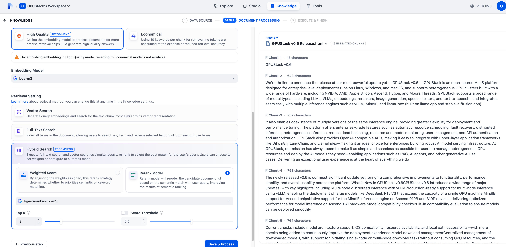
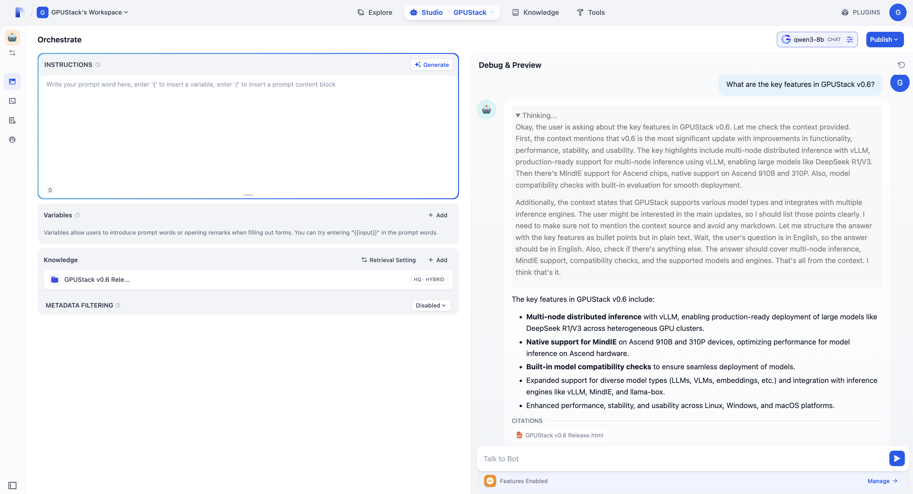
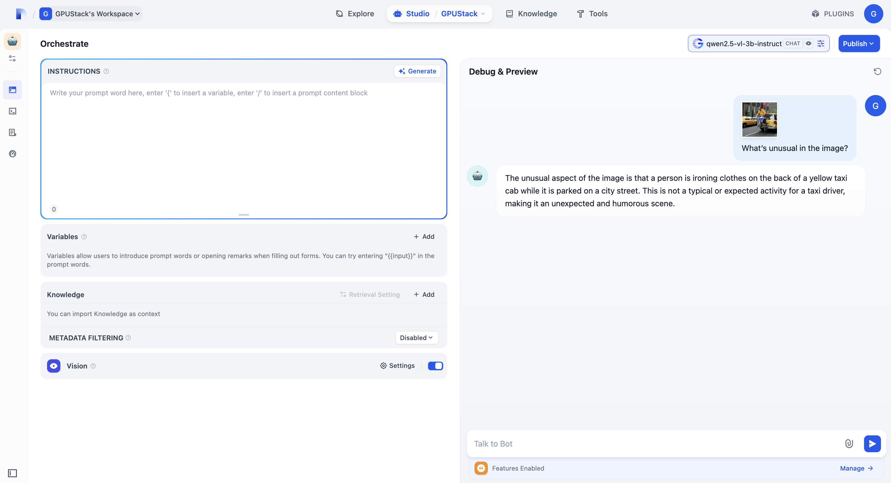

# Integrate with Dify

Dify can integrate with GPUStack to leverage locally deployed LLMs, embeddings, reranking, image generation, Speech-to-Text and Text-to-Speech capabilities.

## Deploying Models

1. In GPUStack UI, navigate to the `Deployments` page and click on `Deploy Model` to deploy the models you need. Here are some example models:

- qwen3-8b
- qwen2.5-vl-3b-instruct
- bge-m3
- bge-reranker-v2-m3


2. In the model’s Operations, open `API Access Info` to see how to integrate with this model.


## Create an API Key

1. Hover over the user avatar and navigate to the `API Keys` page, then click on `New API Key`.

2. Fill in the name, then click `Save`.

3. Copy the API key and save it for later use.

## Integrating GPUStack into Dify

1. Access the Dify UI, go to the top right corner and click on `PLUGINS`, select `Install from Marketplace`, search for the GPUStack plugin, and choose to install it.


2. After installed, go to `Settings > Model Provider > GPUStack`, then select `Add Model` and fill in:

- Model Type: Select the model type based on the model.

- Model Name: The name must match the model name deployed on GPUStack.

- Server URL: `http://your-gpustack-url`, do not use `localhost`, as it refers to the container’s internal network. If you’re using a custom port, make sure to include it. Also, ensure the URL is accessible from inside the Dify container (you can test this with `curl`).

- API Key: Input the API key you copied from previous steps.

Click `Save` to add the model:


Add other models as needed, then select the added models in the `System Model Settings` and save:


You can now use the models in the `Studio` and `Knowledge`, here is a simple case:

1. Go to `Knowledge` to create a knowledge, and upload your documents:


2. Configure the Chunk Settings and Retrieval Settings. Use the embedding model to generate document embeddings, and the rerank model to perform retrieval ranking.



3. After successfully importing the documents, create an application in the `Studio`, add the previously created knowledge, select the chat model, and interact with it:



4. Switch the model to `qwen2.5-vl-3b-instruct`, remove the previously added knowledge base, enable `Vision`, and upload an image in the chat to activate multimodal input:



---

## Notes for Docker Desktop Installed Dify

If GPUStack runs on the **host machine**, while **Dify runs inside Docker container**, you must ensure proper network access between them.

### Correct Configuration

Inside Dify, when adding the GPUStack model:

| Field          | Value                                                                  |
| -------------- | ---------------------------------------------------------------------- |
| **Server URL** | `http://host.docker.internal:80/v1-openai` <br>(for macOS/Windows)<br> |
| **API Key**    | Your API Key from GPUStack                                             |
| **Model Name** | Must match the deployed model name in GPUStack (e.g., `qwen3`)         |

### Test Connectivity (inside the Dify container)

You can test the connection from inside the Dify container:

```bash
docker exec -it <dify-container-name> curl http://host.docker.internal:80/v1-openai/models
```

If it returns the list of models, the integration is successful.

### Notes

- On **macOS or Windows**, use `host.docker.internal` to access services on the host machine from inside Docker.
- `localhost` or `0.0.0.0` **does not work inside Docker containers** unless Dify and GPUStack are running inside the same container.

### Quick Reference

| <div style="width:220px">Scenario</div>            | Server URL                                                                                           |
| -------------------------------------------------- | ---------------------------------------------------------------------------------------------------- |
| Host machine deployed GPUStack <br>(macOS/Windows) | `http://host.docker.internal:80/v1-openai`                                                           |
| GPUStack running in Docker                         | Use `--network=host` (Linux) or expose port to host (macOS/Windows) and use appropriate host address |

> 💡 If you did not specify the `--port` parameter when installing GPUStack, the default port is `80`. Therefore, the Server URL should be set to `http://host.docker.internal:80/v1-openai`.
