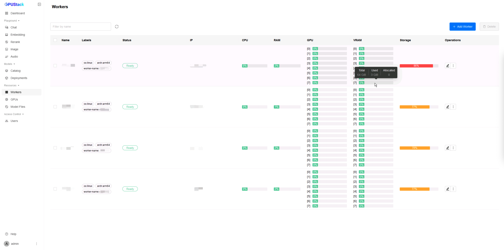
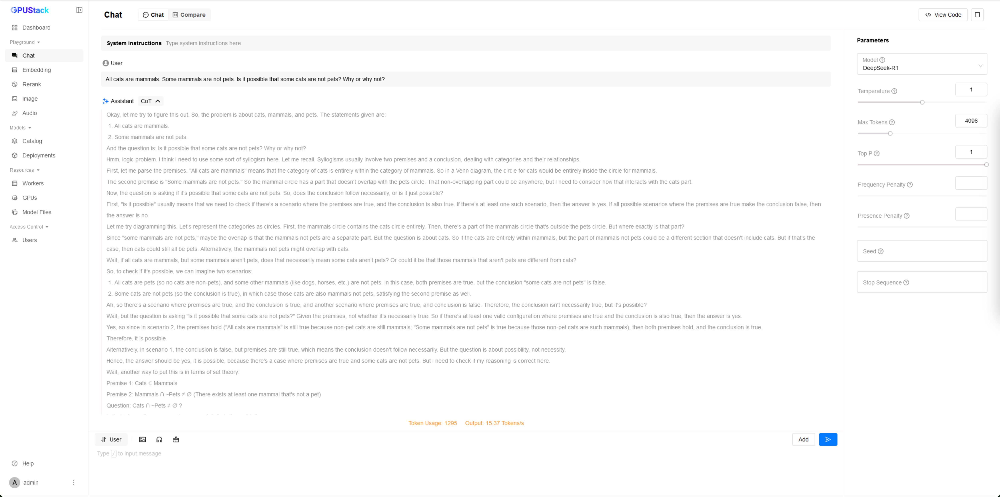
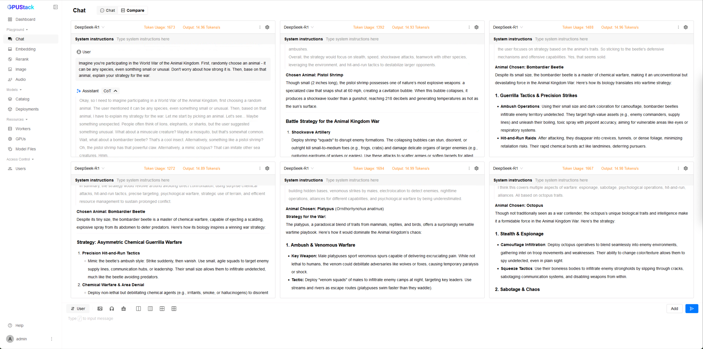

# Running DeepSeek R1 671B with Distributed Ascend MindIE

This tutorial guides you through the process of configuring and running the original **DeepSeek R1 671B** using **Distributed Ascend MindIE** on a GPUStack cluster.

Due to the extremely large size of the model, distributed inference across multiple workers is usually required.

GPUStack enables easy setup and orchestration of distributed inference using Ascend MindIE, making it possible to run massive models like DeepSeek R1 with minimal manual configuration.

## Prerequisites

Before you begin, make sure the following requirements are met:

- You have access to a sufficient number of Linux nodes, each equipped with the required Ascend Atlas AI processors. For example:

<div class="center-table" markdown>

| **Server(NPU)**           | **Number of Nodes** |
| ------------------------- | ------------------- |
| Atlas 800T A2 (910B3 x 8) | 4                   |

</div>

- All nodes need to support Huawei Collective Communication adaptive Protocol (HCCP), installed Huawei Collective Communication Library (HCCL), and enabled Huawei Cache Coherence System (HCCS).
- Model files should be downloaded to the same path on each node. While GPUStack supports on-the-fly model downloading, pre-downloading is recommended as it can be time consuming depending on the network speed.

!!! note

    - In this tutorial, we assume a setup of 4 nodes, each equipped with 8 910B3 NPUs and connected via 200G Huawei Cache Conherence Network (HCCN).
    - Altas NPUs do not support the FP8 precision originally used by DeepSeek R1. Hence, we use the BF16 version from [Unsloth](https://huggingface.co/unsloth/DeepSeek-R1-BF16).

## Step 1: Install GPUStack Server

In this tutorial, we will use Docker to install GPUStack. You can also use other installation methods if you prefer.

Use the following command to start the GPUStack server:

```bash
docker run -d --name gpustack \
    --restart=unless-stopped \
    --device /dev/davinci0 \
    --device /dev/davinci1 \
    --device /dev/davinci2 \
    --device /dev/davinci3 \
    --device /dev/davinci4 \
    --device /dev/davinci5 \
    --device /dev/davinci6 \
    --device /dev/davinci7 \
    --device /dev/davinci_manager \
    --device /dev/devmm_svm \
    --device /dev/hisi_hdc \
    -v /usr/local/dcmi:/usr/local/dcmi \
    -v /usr/local/bin/npu-smi:/usr/local/bin/npu-smi \
    -v /usr/local/Ascend/driver:/usr/local/Ascend/driver:ro \
    -v /usr/local/Ascend/firmware:/usr/local/Ascend/firmware:ro \
    -v /etc/hccn.conf:/etc/hccn.conf:ro \
    -v /etc/ascend_install.info:/etc/ascend_install.info:ro \
    -v gpustack-data:/var/lib/gpustack \
    -v /path/to/your/model:/path/to/your/model \
    --shm-size=1g \
    --network=host \
    --ipc=host \
    gpustack/gpustack:latest-npu
```

!!! note

    - Replace `/path/to/your/model` with the actual path on your system where the DeepSeek R1 model files are stored.
    - Ensure the `npu-smi` tool is installed and configured correctly on your system. This is required for discovering the NPU devices.
      Replace `/usr/local/bin/npu-smi:/usr/local/bin/npu-smi` with the actual path to the `npu-smi` binary if it is located elsewhere,
      e.g., `/path/to/your/npu-smi:/usr/local/bin/npu-smi`.
    - Ensure the `hccn_tool` tool is installed and configured correctly on your system. This is required for discvoring the HCCN network communication.
      Add `/path/to/your/hccn_tool:/usr/local/Ascend/driver/tools/hccn_tool` to the `-v` options if it is located elsewhere.

After GPUStack server is up and running, run the following commands to get the initial admin password and the token for worker registration:

```bash
docker exec gpustack cat /var/lib/gpustack/initial_admin_password
docker exec gpustack cat /var/lib/gpustack/token
```

## Step 2: Install GPUStack Workers

On **each worker node**, run the following command to start a GPUStack worker:

```bash
docker run -d --name gpustack \
    --restart=unless-stopped \
    --device /dev/davinci0 \
    --device /dev/davinci1 \
    --device /dev/davinci2 \
    --device /dev/davinci3 \
    --device /dev/davinci4 \
    --device /dev/davinci5 \
    --device /dev/davinci6 \
    --device /dev/davinci7 \
    --device /dev/davinci_manager \
    --device /dev/devmm_svm \
    --device /dev/hisi_hdc \
    -v /usr/local/dcmi:/usr/local/dcmi \
    -v /usr/local/bin/npu-smi:/usr/local/bin/npu-smi \
    -v /usr/local/Ascend/driver:/usr/local/Ascend/driver:ro \
    -v /usr/local/Ascend/firmware:/usr/local/Ascend/firmware:ro \
    -v /etc/hccn.conf:/etc/hccn.conf:ro \
    -v /etc/ascend_install.info:/etc/ascend_install.info:ro \
    -v gpustack-data:/var/lib/gpustack \
    -v /path/to/your/model:/path/to/your/model \
    --shm-size=1g \
    --network=host \
    --ipc=host \
    gpustack/gpustack:latest-npu \
    --server-url http://your_gpustack_server_ip_or_hostname \
    --token your_gpustack_token
```

!!! note

    - Replace the placeholder paths, IP address/hostname, and token accordingly.
    - Replace `/path/to/your/model` with the actual path on your system where the DeepSeek R1 model files are stored.
    - Ensure the `npu-smi` tool is installed and configured correctly on your system. This is required for discovering the NPU devices.
      Replace `/usr/local/bin/npu-smi:/usr/local/bin/npu-smi` with the actual path to the `npu-smi` binary if it is located elsewhere,
      e.g., `/path/to/your/npu-smi:/usr/local/bin/npu-smi`.
    - Ensure the `hccn_tool` tool is installed and configured correctly on your system. This is required for discvoring the HCCN network communication.
      Add `/path/to/your/hccn_tool:/usr/local/Ascend/driver/tools/hccn_tool` to the `-v` options if it is located elsewhere.

## Step 3: Access GPUStack UI

Once the server and all workers are running, access the GPUStack UI via your browser:

```
http://your_gpustack_server_ip_or_hostname
```

Log in using the `admin` username and the password obtained in Step 1. Navigate to the `Workers` page to verify that all workers are in the Ready state and their GPUs are listed.



## Step 4: Deploy the DeepSeek R1 Model

1. Go to the `Deployments` page.
2. Click `Deploy Model`.
3. Select `Local Path` as your source.
4. Enter a name (e.g., `DeepSeek-R1`) in the `Name` field.
5. Specify the `Model Path` as the directory that contains the DeepSeek R1 model files on each worker node.
6. Ensure the `Backend` is set to `Ascend MindIE`.
7. Expand `Advanced`, append following parameters to `Backend Parameters`:
   - `--data-parallel-size=4`
   - `--tensor-parallel-size=8`
   - `--moe-tensor-parallel-size=1`
   - `--moe-expert-parallel-size=32`
   - `--npu-memory-fraction=0.95`, since we are using Data Parallelism, the memory fraction should be set to 0.95 to ensure efficient memory usage across all NPUs.
8. After passing the compatibility check, click `Save` to deploy.


## Step 5: Monitor Deployment

You can monitor the deployment status on the `Deployments` page. Hover over `distributed across workers` to view GPU and worker usage. Click `View Logs` to see real-time logs showing model loading progress. It may take a few minutes to load the model.


After the model is running, navigate to the `Workers` page to check GPU utilization. Ascend MindIE uses 95% of NPU memory with above settings.


## Step 6: Run Inference via Playground

Once the model is deployed and running, you can test it using the GPUStack Playground.

1. Navigate to the `Playground` -> `Chat`.
2. If only one model is deployed, it will be selected by default. Otherwise, use the dropdown menu to choose `DeepSeek-R1`.
3. Enter prompts and interact with the model.



You can also use the `Compare` tab to test concurrent inference scenarios.



You have now successfully deployed and run DeepSeek R1 671B using Distributed Ascend MindIE on a GPUStack cluster. Explore the model's performance and capabilities in your own applications.

For further assistance, feel free to reach out to the GPUStack community or support team.
