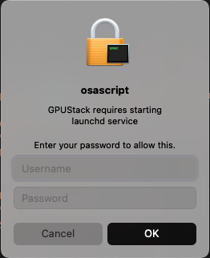

# Desktop Setup

!!! note

    Supported since v0.7.0

You can install GPUStack on macOS and Windows using an installer. The **GPUStackHelper**, a system tray application for managing GPUStack, will be installed during setup. Follow the [Desktop Installer](../installation/desktop-installer.md) guide to complete the installation.

## GPUStackHelper

GPUStackHelper provides the following functions to configure and manage GPUStack.


- **Status** - Shows the current state of the GPUStack service. The Status submenu supports Start, Stop, and Restart operations.
- **Web Console** - Opens the GPUStack portal in your default browser if the service is running.
- **Run at Startup** - Configures whether GPUStack should automatically start at system boot.
- **Quick Config** - Opens the [Quick Config Dialog](#quick-config-dialog).
- **Config Directory** - Opens the directory containing the GPUStack configuration file `config.yaml`. Configurations not available in `Quick Config` can be modified manually here.
- **Copy Token** - Copies the token for worker registration.
- **Show Log** - Opens a console or notepad window to view GPUStack logs.
- **About** - Shows version information.

## Configuration

GPUStack can be configured through GPUStackHelper in several ways. It is **recommended** to use the config file instead of command-line arguments or environment variables. Certain GPUStack arguments are fixed and managed by the helper and should not be modified manually.

For example, in the GPUStack `launchd` configuration on macOS (`/Library/LaunchDaemons/ai.gpustack.plist`):

```xml
<?xml version="1.0" encoding="UTF-8"?>
<!DOCTYPE plist PUBLIC "-//Apple//DTD PLIST 1.0//EN" "http://www.apple.com/DTDs/PropertyList-1.0.dtd">
<plist version="1.0">
<dict>
    <key>EnableTransactions</key>
    <true/>
    <key>EnvironmentVariables</key>
    <dict>
        <key>HOME</key>
        <string>/Library/Application Support/GPUStack/root</string>
    </dict>
    <key>KeepAlive</key>
    <true/>
    <key>Label</key>
    <string>ai.gpustack</string>
    <key>ProgramArguments</key>
    <array>
        <string>/Applications/GPUStack.app/Contents/MacOS/gpustack</string>
        <string>start</string>
        <string>--config-file=/Library/Application Support/GPUStack/config.yaml</string>
        <string>--data-dir=/Library/Application Support/GPUStack</string>
    </array>
    <key>RunAtLoad</key>
    <false/>
    <key>StandardErrorPath</key>
    <string>/var/log/gpustack.log</string>
    <key>StandardOutPath</key>
    <string>/var/log/gpustack.log</string>
</dict>
</plist>
```

- **ProgramArguments** specifies the fixed arguments for GPUStack, such as `--config-file` and `--data-dir`. On Windows, similar fixed configurations exist in the NSSM service. You can inspect them using `nssm dump gpustack` after GPUStack is installed and started on Windows.
- The `HOME` variable in **EnvironmentVariables** is set to avoid using the root user's home directory as the default cache path. This setting applies to macOS only.

### Quick Config Dialog


The **General** tab contains commonly used configurations. Refer to the [config-file](../cli-reference/start.md#config-file) documentation for more details.

- Server Role - Refer to the `disable_worker` configuration.

    - All (Both Server and Worker)
    - Worker
    - Server Only

- Server URL - Refer to the `server_url` configuration.
- Token - Refer to the `token` configuration.
- Port - Refer to the `port` configuration.


The **Environments** tab is used to set environment variables for the GPUStack service. Common environment variables are listed in the key options:

- HF_ENDPOINT - Hugging Face Hub endpoint, e.g., `https://hf-mirror.com`.
- HF_TOKEN - Hugging Face token.
- HTTP_PROXY, HTTPS_PROXY and NO_PROXY - Proxy-related environment variables.

You can also manually enter custom variable keys and values.

!!! note

    GPUStack supports configuration via `GPUSTACK_` environment variables. However, it's recommended to use the config file. For example, if `GPUSTACK_PORT` is set via an environment variable, it won't be recognized by the `Web Console` function, which will result in the browser opening the default port or the one specified in the config file.

## Status and Start

GPUStack may display one of the following status values:

- Stopped
- Running
- To Upgrade - This state indicates that GPUStack should be upgraded from a script-based installation.
- To Restart|Running - This state indicates that GPUStack should be restarted due to a configuration change.

### Platform Notes

- On Windows, GPUStackHelper requires UAC (User Account Control) to start because it needs privileges to operate the GPUStack service.  
- On macOS, GPUStackHelper runs in the background for the logged-in user and prompts for root privileges when starting/stopping/restarting the GPUStack service, as shown in the image below.

{width=30%}
