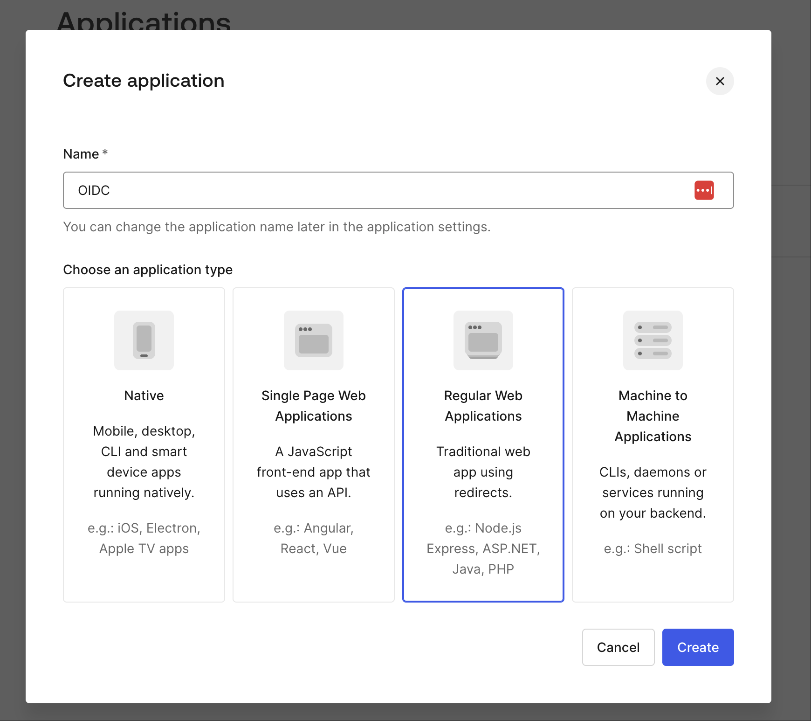
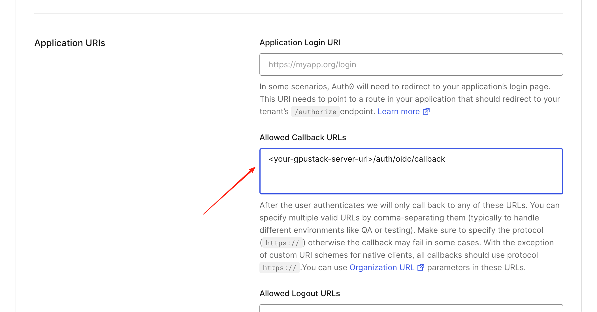
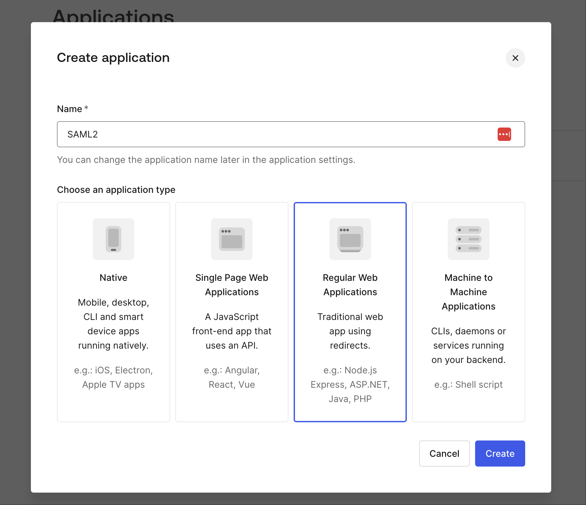
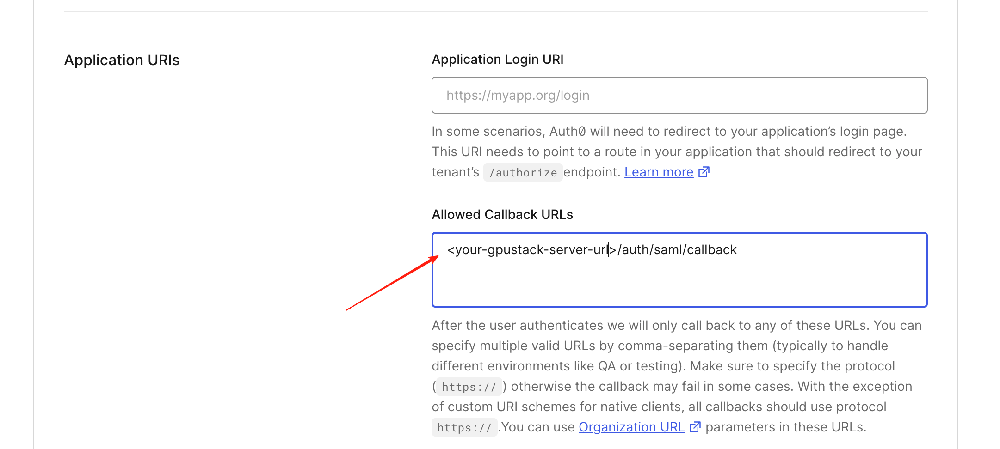
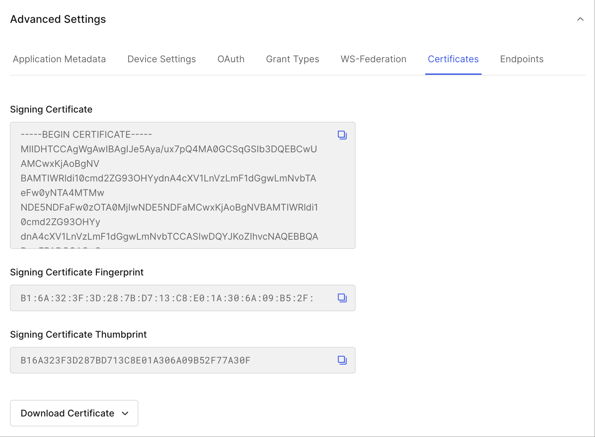
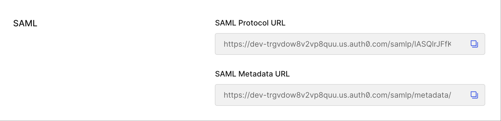

# Single Sign-On (SSO) Authentication

GPUStack supports Single Sign-On (SSO) authentication methods such as OIDC and SAML. This allows users to log in using their existing credentials from an external identity provider.

## OIDC

Any authentication provider that supports OIDC can be configured. The `email`, `name` and `picture` claims are used if available. The allowed redirect URI should include `<server-url>/auth/oidc/callback`.

The following CLI flags are available for OIDC configuration:

| <div style="width:180px">Flag</div>     | Description                                                                                                                                                          |
| --------------------------------------- | -------------------------------------------------------------------------------------------------------------------------------------------------------------------- |
| `--oidc-issuer`                         | OIDC issuer URL. OIDC discovery under `<issuer>/.well-known/openid-configuration` will be used to discover the OIDC configuration.                                   |
| `--oidc-client-id`                      | OIDC client ID.                                                                                                                                                      |
| `--oidc-client-secret`                  | OIDC client secret.                                                                                                                                                  |
| `--oidc-redirect-uri`                   | The redirect URI configured in your OIDC application. This must be set to `<server-url>/auth/oidc/callback`.                                                         |
| `--external-auth-name` (Optional)       | Mapping of OIDC user information to username, e.g., `preferred_username`. By default, the `email` claim is used if available.                                        |
| `--external-auth-full-name` (Optional)  | Mapping of OIDC user information to user's full name. Multiple elements can be combined, e.g., `name` or `firstName+lastName`. By default, the `name` claim is used. |
| `--external-auth-avatar-url` (Optional) | Mapping of OIDC user information to user's avatar URL. By default, the `picture` claim is used if available.                                                         |

You can also set these options via environment variables instead of CLI flags:

```bash
GPUSTACK_OIDC_ISSUER="your-oidc-issuer-url"
GPUSTACK_OIDC_CLIENT_ID="your-client-id"
GPUSTACK_OIDC_CLIENT_SECRET="your-client-secret"
GPUSTACK_OIDC_REDIRECT_URI="{your-server-url}/auth/oidc/callback"
# Optional
GPUSTACK_EXTERNAL_AUTH_NAME="email"
GPUSTACK_EXTERNAL_AUTH_FULL_NAME="name"
GPUSTACK_EXTERNAL_AUTH_AVATAR_URL="picture"
```

### Example: Integrate with Auth0 OIDC

To configure GPUStack with Auth0 as the OIDC provider:

1. Go to [auth0](https://auth0.com) and create a new application with type `Regular Web Applications`.



2. Get the `Domain`, `Client ID`, and `Client Secret` from the application settings.


3. Add `<your-server-url>/auth/oidc/callback` in the Allowed Callback URLs. Adapt the URL to match your server's URL.



Then, run GPUStack with relevant OIDC configuration. The following example uses Docker with CUDA:

```bash
docker run -d --name gpustack \
    --restart=unless-stopped \
    --gpus all \
    --network=host \
    --ipc=host \
    -v gpustack-data:/var/lib/gpustack \
    -e GPUSTACK_OIDC_ISSUER="https://<your-auth0-domain>" \
    -e GPUSTACK_OIDC_CLIENT_ID="<your-client-id>" \
    -e GPUSTACK_OIDC_CLIENT_SECRET="<your-client-secret>" \
    -e GPUSTACK_OIDC_REDIRECT_URI="<your-server-url>/auth/oidc/callback" \
    gpustack/gpustack
```

## SAML

GPUStack supports SAML authentication for Single Sign-On (SSO). This allows users to log in using their existing credentials from an external identity provider that supports SAML.

The following CLI flags are available for SAML configuration:

| <div style="width:180px">Flag</div>     | Description                                                                                                                                                                                                                                                    |
| --------------------------------------- | -------------------------------------------------------------------------------------------------------------------------------------------------------------------------------------------------------------------------------------------------------------- |
| `--saml-idp-server-url`                 | SAML Identity Provider server URL.                                                                                                                                                                                                                             |
| `--saml-idp-entity-id`                  | SAML Identity Provider entity ID.                                                                                                                                                                                                                              |
| `--saml-idp-x509-cert`                  | SAML Identity Provider X.509 certificate.                                                                                                                                                                                                                      |
| `--saml-sp-entity-id`                   | SAML Service Provider entity ID.                                                                                                                                                                                                                               |
| `--saml-sp-acs-url`                     | SAML Service Provider Assertion Consumer Service URL. It should be set to `<gpustack-server-url>/auth/saml/callback`.                                                                                                                                          |
| `--saml-sp-x509-cert`                   | SAML Service Provider X.509 certificate.                                                                                                                                                                                                                       |
| `--saml-sp-private-key`                 | SAML Service Provider private key.                                                                                                                                                                                                                             |
| `--saml-sp-attribute-prefix` (Optional) | SAML Service Provider attribute prefix, which is used for fetching the attributes that are specified by --external-auth-\*. e.g., 'http://schemas.auth0.com/'.                                                                                                 |
| `--saml-security` (Optional)            | SAML security settings in JSON format.                                                                                                                                                                                                                         |
| `--external-auth-name` (Optional)       | Mapping of SAML user information to username. You must configure the full attribute name like 'http://schemas.xmlsoap.org/ws/2005/05/identity/claims/emailaddress' or simplify with 'emailaddress' by '--saml-sp-attribute-prefix'.                            |
| `--external-auth-full-name` (Optional)  | Mapping of SAML user information to user's full name. Multiple elements can be combined. You must configure the full attribute name like 'http://schemas.xmlsoap.org/ws/2005/05/identity/claims/name' or simplify with 'name' by '--saml-sp-attribute-prefix'. |
| `--external-auth-avatar-url` (Optional) | Mapping of SAML user information to user's avatar URL. You must configure the full attribute name like 'http://schemas.auth0.com/picture' or simplify with 'picture' by '--saml-sp-attribute-prefix'.                                                          |

You can also set these options via environment variables instead of CLI flags:

```bash
GPUSTACK_SAML_IDP_SERVER_URL="https://idp.example.com"
GPUSTACK_SAML_IDP_ENTITY_ID="your-idp-entity-id"
GPUSTACK_SAML_IDP_X509_CERT="your-idp-x509-cert"
GPUSTACK_SAML_SP_ENTITY_ID="your-sp-entity-id"
GPUSTACK_SAML_SP_ACS_URL="{your-server-url}/auth/saml/callback"
GPUSTACK_SAML_SP_X509_CERT="your-sp-x509-cert"
GPUSTACK_SAML_SP_PRIVATE_KEY="your-sp-private-key"
# Optional
GPUSTACK_SAML_SP_ATTRIBUTE_PREFIX="http://schemas.auth0.com/"
GPUSTACK_SAML_SECURITY="{}"
GPUSTACK_EXTERNAL_AUTH_NAME="emailaddress"
GPUSTACK_EXTERNAL_AUTH_FULL_NAME="name"
GPUSTACK_EXTERNAL_AUTH_AVATAR_URL="picture"
```

### Example: Integrate with Auth0 SAML

To configure GPUStack with Auth0 as the SAML provider:

1. Go to [auth0](https://auth0.com) and create a new application with type `Regular Web Applications`.



2. Get the `Domain` from the application settings and add `<your-server-url>/auth/saml/callback` in the Allowed Callback URLs. Adapt the URL to match your server's URL.



3. In **Advanced Settings → Certificates**, copy the IdP `X.509 Certificate`.



4. In **Endpoints** tab, find the `SAML Protocol URL`, which is your IdP server URL.



5. Generate SP certificate and private key:

```bash
openssl req -x509 -newkey rsa:2048 -keyout myservice.key -out myservice.cert -days 365 -nodes -subj "/CN=myservice.example.com"
```

!!! note

    myservice.cert and myservice.key will be used for the SP configuration.

6. Run GPUStack with relevant SAML configuration. The following example uses Docker with CUDA:

```bash
SP_CERT="$(cat myservice.cert)"
SP_PRIVATE_KEY="$(cat myservice.key)"
SP_ATTRIBUTE_PREFIX="http://schemas.auth0.com/"

docker run -d --name gpustack \
    --restart=unless-stopped \
    --gpus all \
    --network=host \
    --ipc=host \
    -v gpustack-data:/var/lib/gpustack \
    -e GPUSTACK_SAML_IDP_SERVER_URL="<auth0-saml-protocol-url>" \
    -e GPUSTACK_SAML_IDP_ENTITY_ID="urn:<auth0-domain>" \
    -e GPUSTACK_SAML_IDP_X509_CERT="<auth0-x509-cert>" \
    -e GPUSTACK_SAML_SP_ENTITY_ID="urn:gpustack:sp" \
    -e GPUSTACK_SAML_SP_ACS_URL="<your-gpustack-server-url>/auth/saml/callback" \
    -e GPUSTACK_SAML_SP_X509_CERT="$SP_CERT" \
    -e GPUSTACK_SAML_SP_PRIVATE_KEY="$SP_PRIVATE_KEY" \
    -e GPUSTACK_SAML_SP_ATTRIBUTE_PREFIX="$SP_ATTRIBUTE_PREFIX" \
    gpustack/gpustack
```
