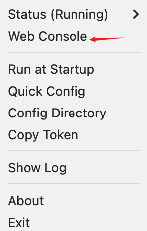
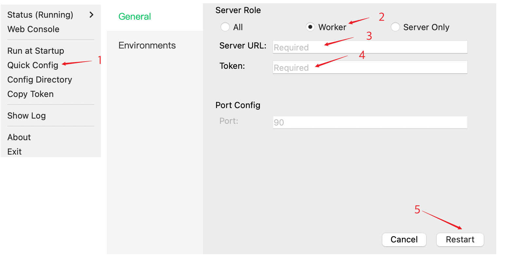

# Desktop Installer

## Download Installer

=== "macOS"

    - Only supported: Apple Silicon (M series), macOS 14+
    - [Download the installer](https://gpustack.ai)

=== "Windows"

    - Only supported: win 10, win 11
    - [Download the installer](https://gpustack.ai)

## Run GPUStack

Double-click the downloaded installer and follow the on-screen instructions to complete the installation.

## Open GPUStack UI

Click the `GPUStack icon` in the menu bar (on macOS) or system tray (on Windows), then select the `Web Console` menu.

## (Optional) Add Worker

### 1. Get Token

Click the `GPUStack icon` in the menu bar (macOS) or system tray (Windows), then select the `Copy Token` menu on the server machine.

### 2. Register Worker

On the worker machine:

1. Click the `GPUStack icon`, then select the `Quick Config` menu.

2. Select `Worker` as the service role.

3. Enter the `Server URL`.

4. Paste the `Token` copied from the server.

5. Click `Restart` to apply the settings.

6. Refresh the worker list on the server to confirm the new worker has been added.

