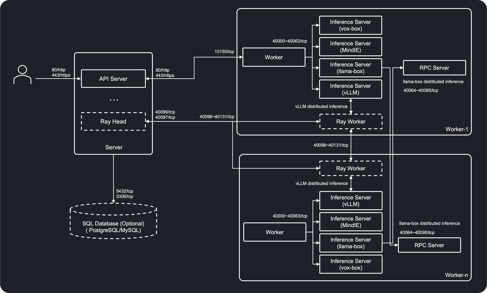

# Installation Requirements

This page describes the software and networking requirements for the nodes where GPUStack will be installed.

## Operating System Requirements

GPUStack is supported on the following operating systems:

- [x] Linux
- [x] macOS
- [x] Windows

GPUStack has been tested and verified to work on the following operating systems:

| OS        | Versions        |
| --------- | --------------- |
| Ubuntu    | \>= 20.04       |
| Debian    | \>= 11          |
| RHEL      | \>= 8           |
| Rocky     | \>= 8           |
| Fedora    | \>= 36          |
| OpenSUSE  | \>= 15.3 (leap) |
| OpenEuler | \>= 22.03       |
| macOS     | \>= 14          |
| Windows   | 10, 11          |

!!! note

    The installation of GPUStack worker on a Linux system requires that the GLIBC version be 2.29 or higher. If your system uses a lower GLIBC version, consider using the `Docker Installation` method as an alternative.

    Use the following command to check the GLIBC version:

    ```
    ldd --version
    ```

### Supported Architectures

GPUStack supports both **AMD64** and **ARM64** architectures, with the following notes:

- On Linux and macOS, when using Python versions below 3.12, ensure that the installed Python distribution corresponds to your system architecture.
- On Windows, please use the AMD64 distribution of Python, as wheel packages for certain dependencies are unavailable for ARM64. If you use tools like `conda`, this will be handled automatically, as conda installs the AMD64 distribution by default.

## Accelerator Runtime Requirements

GPUStack supports the following accelerators:

- [x] NVIDIA CUDA ([Compute Capability](https://developer.nvidia.com/cuda-gpus) 6.0 and above)
- [x] Apple Metal (M-series chips)
- [x] AMD ROCm
- [x] Ascend CANN
- [x] Hygon DTK
- [x] Moore Threads MUSA
- [x] Iluvatar Corex
- [x] Cambricon MLU
- [x] Insi Mars

Ensure all necessary drivers and libraries are installed on the system prior to installing GPUStack.

### NVIDIA CUDA

To use NVIDIA CUDA as an accelerator, ensure the following components are installed:

- [NVIDIA Driver](https://www.nvidia.com/en-us/drivers/)
- [NVIDIA CUDA Toolkit 12](https://developer.nvidia.com/cuda-toolkit) (Optional, required for non-Docker installations)
- [NVIDIA cuDNN 9](https://developer.nvidia.com/cudnn) (Optional, required for audio models when not using Docker)
- [NVIDIA Container Toolkit](https://docs.nvidia.com/datacenter/cloud-native/container-toolkit) (Optional, required for Docker installation)

### AMD ROCm

To use AMD ROCm as an accelerator, ensure the following components are installed:

- [ROCm](https://rocm.docs.amd.com/en/docs-6.2.4/)

### Ascend CANN

For Ascend CANN as an accelerator, ensure the following components are installed:

- [Ascend NPU Driver & Firmware](https://www.hiascend.com/hardware/firmware-drivers/community)
- [Ascend CANN Toolkit & Kernels](https://www.hiascend.com/developer/download/community/result?module=cann&cann=8.1.RC1.beta1) (Optional, required for non-Docker installations)

### Hygon DTK

To use Hygon DTK as an accelerator, ensure the following components are installed:

- [DCU Driver](https://developer.sourcefind.cn/tool/)
- [DCU Toolkit](https://developer.sourcefind.cn/tool/)

### Moore Threads MUSA

To use Moore Threads MUSA as an accelerator, ensure the following components are installed:

- [MUSA SDK](https://developer.mthreads.com/sdk/download/musa)
- [MT Container Toolkits](https://developer.mthreads.com/sdk/download/CloudNative) (Optional, required for docker installation)

### Iluvatar Corex

To use Iluvatar Corex as an accelerator, ensure the following components are installed:

- [Corex driver](https://support.iluvatar.com/#/ProductLine?id=2)
- [Corex Toolkits](https://support.iluvatar.com/#/ProductLine?id=2)

### Cambricon MLU

To use Cambricon MLU as an accelerator, ensure the following components are installed:

- Cambricon Driver

### Insi Mars

To use Insi Mars as an accelerator, ensure the following components are installed:

- Insi Mars Driver

## Networking Requirements

### Network Architecture

The following diagram shows the network architecture of GPUStack:



### Connectivity Requirements

The following network connectivity is required to ensure GPUStack functions properly:

**Server-to-Worker:** The server must be able to reach the workers for proxying inference requests.

**Worker-to-Server:** Workers must be able to reach the server to register themselves and send updates.

**Worker-to-Worker:** Necessary for distributed inference across multiple workers

### Port Requirements

GPUStack uses the following ports for communication:

#### Server Ports

| Port    | Description                                                              |
| ------- | ------------------------------------------------------------------------ |
| TCP 80  | Default port for the GPUStack UI and API endpoints                       |
| TCP 443 | Default port for the GPUStack UI and API endpoints (when TLS is enabled) |

The following ports are used on GPUStack server when Ray is enabled for distributed vLLM across workers:

| Ray Port  | Description                                      |
|-----------|--------------------------------------------------|
| TCP 40096 | Default port for Ray (GCS server)                |
| TCP 40097 | Default port for Ray Client Server               |
| TCP 40098 | Default port for Ray node manager                |
| TCP 40099 | Default port for Ray object manager              |
| TCP 40100 | Default port for Ray runtime env agent           |
| TCP 8265  | Default Port for Ray dashboard                   |
| TCP 40101 | Default port for Ray dashboard agent gRPC listen |
| TCP 52365 | Default port for Ray dashboard agent HTTP listen |
| TCP 40103 | Default port for Ray metrics export              |

For more information about Ray ports, refer to the [Ray documentation](https://docs.ray.io/en/latest/ray-core/configure.html#ports-configurations).

#### Worker Ports

| Port            | Description                                    |
| --------------- | ---------------------------------------------- |
| TCP 10150       | Default port for the GPUStack worker           |
| TCP 10151       | Default port for exposing metrics              |
| TCP 40000-40063 | Port range allocated for inference services    |
| TCP 40064-40095 | Port range allocated for llama-box RPC servers |

The following ports are used on GPUStack worker when Ray is enabled for distributed vLLM across workers:

| Ray Port        | Description                                      |
| --------------- | ------------------------------------------------ |
| TCP 40098       | Default port for Ray node manager                |
| TCP 40099       | Default port for Ray object manager              |
| TCP 40101       | Default port for Ray dashboard agent gRPC listen |
| TCP 52365       | Default port for Ray dashboard agent HTTP listen |
| TCP 40103       | Default port for Ray metrics export              |
| TCP 40200-40999 | Port range for Ray worker processes              |
