# Integrate with CherryStudio

CherryStudio integrates with GPUStack to leverage locally hosted LLMs, embeddings and reranking capabilities.

## Deploying Models

1. In GPUStack UI, navigate to the `Deployments` page and click on `Deploy Model` to deploy the models you need. Here are some example models:

    - qwen3-instruct-2507
    - qwen2.5-vl-7b
    - bge-m3
    - bge-reranker-v2-m3

   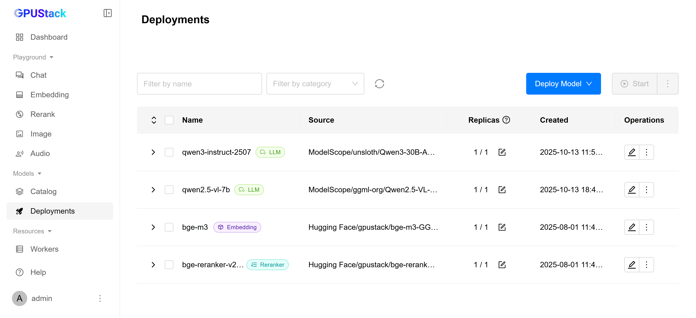

2. In the model’s Operations, open `API Access Info` to see how to integrate with this model:

   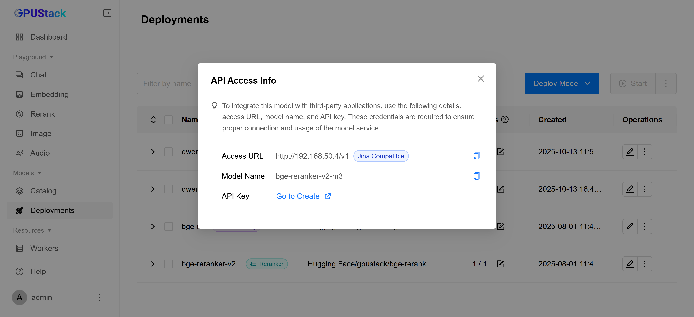

## Create an API Key

1. Hover over the user avatar and navigate to the `API Keys` page, then click on `New API Key`.

2. Fill in the name, then click `Save`.

3. Copy the API key and save it for later use.

## Integrating GPUStack into CherryStudio

1. Open CherryStudio, go to `Settings` → `Model Provider`, find GPUStack, enable it, and configure it as shown:

    - `API Key`: Input the API key you copied from previous steps.

    - `API Host`: `Access URL` in the `API Access Info` panel.

   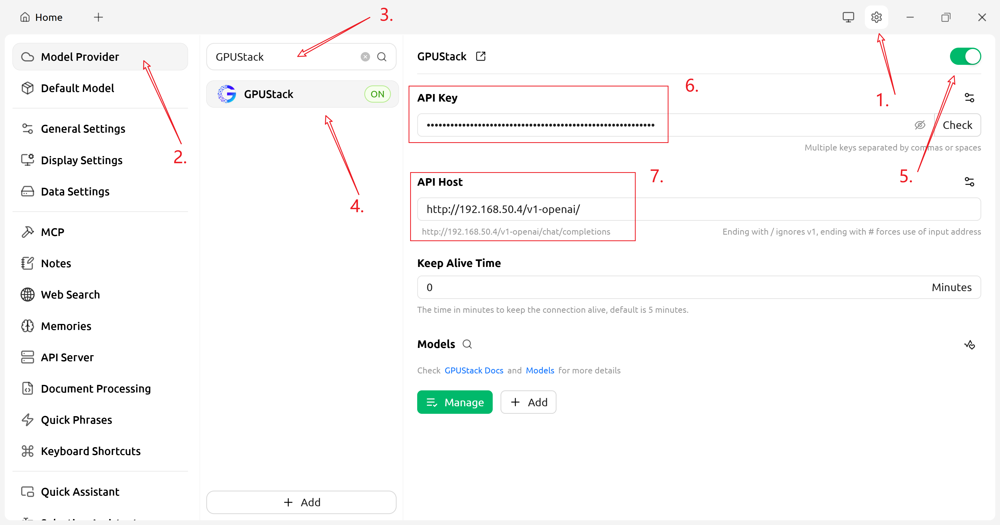

2. In the GPUStack provider configuration, click "Manage" and enable the models you need:

   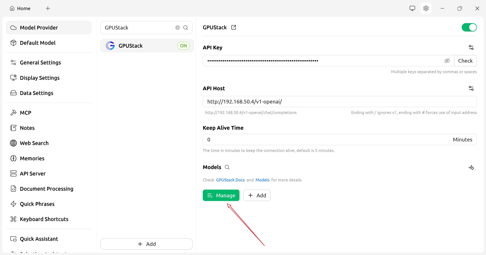

   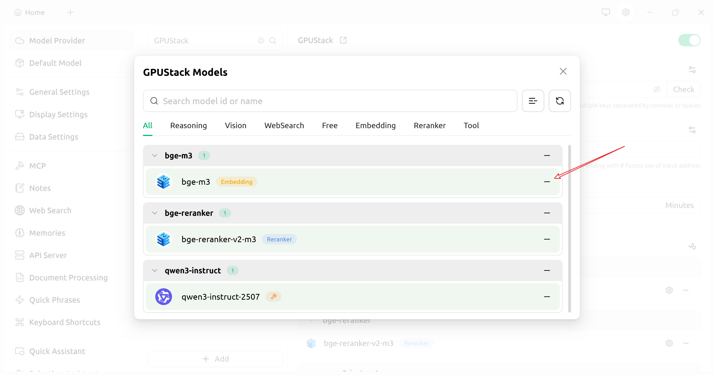

3. (Optional) Test the API:

   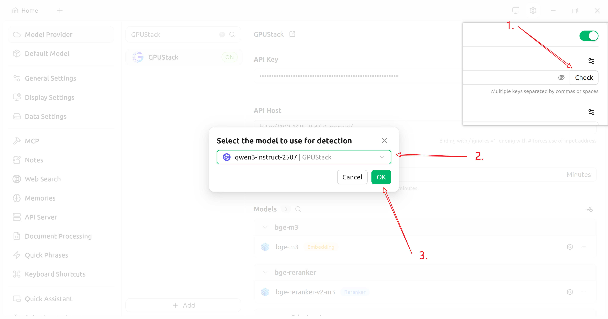

After configuration, return to the CherryStudio home page and start using your models.

## Using LLMs

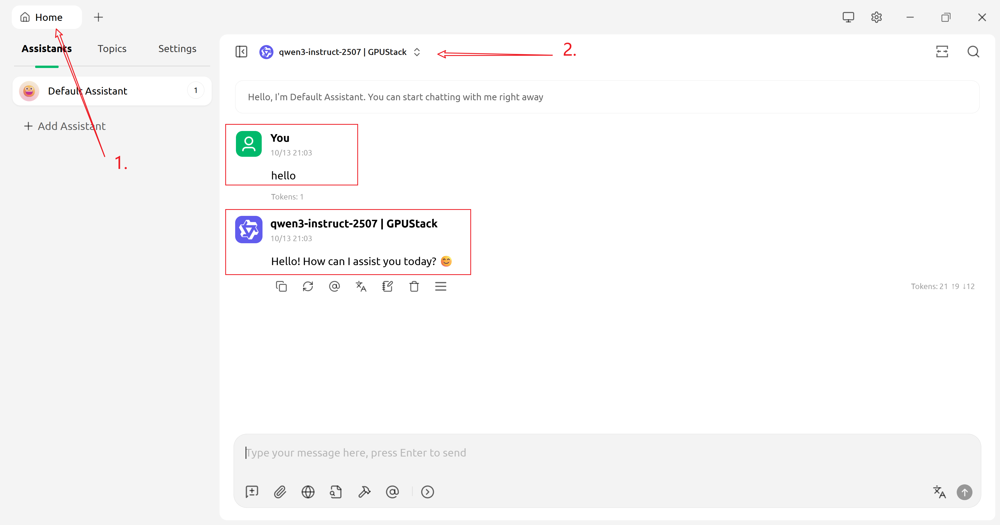

## Using Multimodal Models

1. Select a multimodal model:

   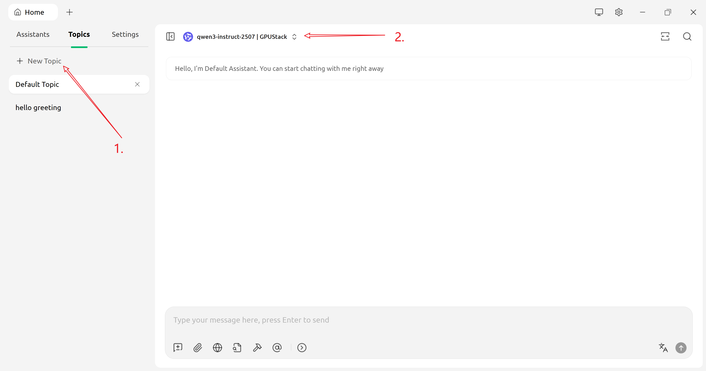

2. Ask multimodal questions:

   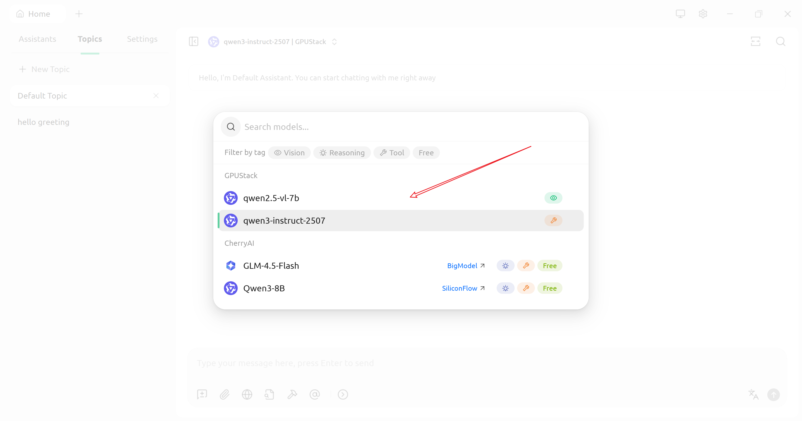

   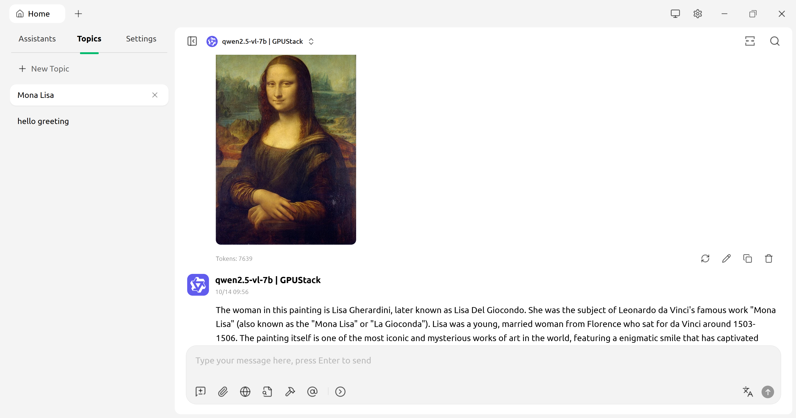

## Use Embeddings and Reranking to Improve Knowledge Base Q&A

1. Open the Knowledge Base configuration page:

   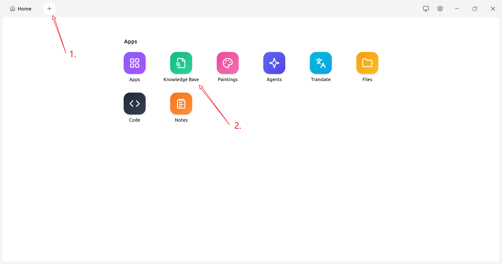

2. Add a knowledge base:

   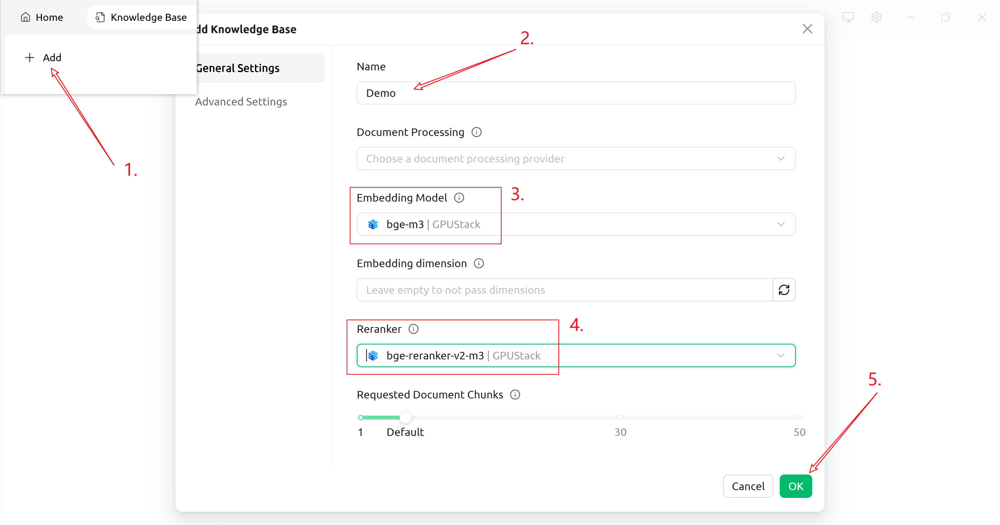

3. Add content to the knowledge base (using “Notes” as an example):

   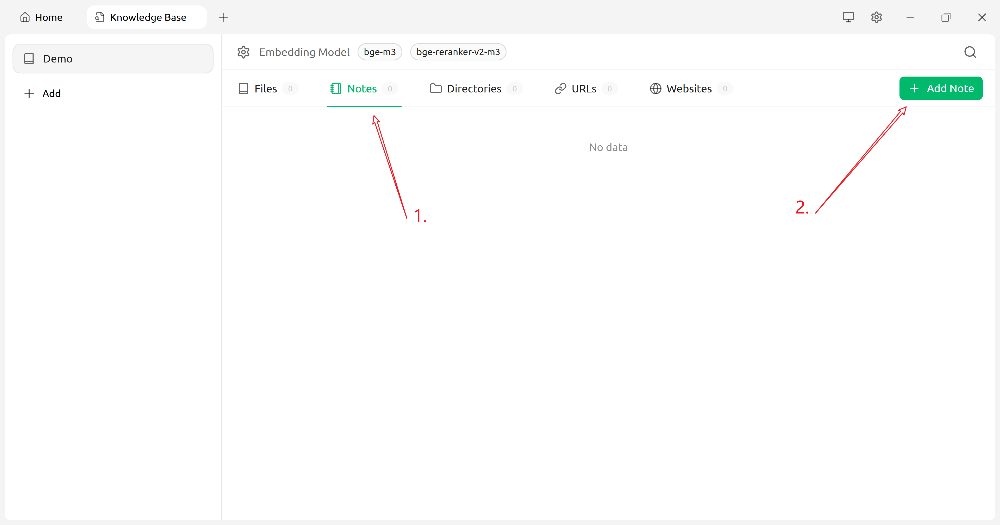

   

4. Return to the home page and use knowledge base Q&A:

   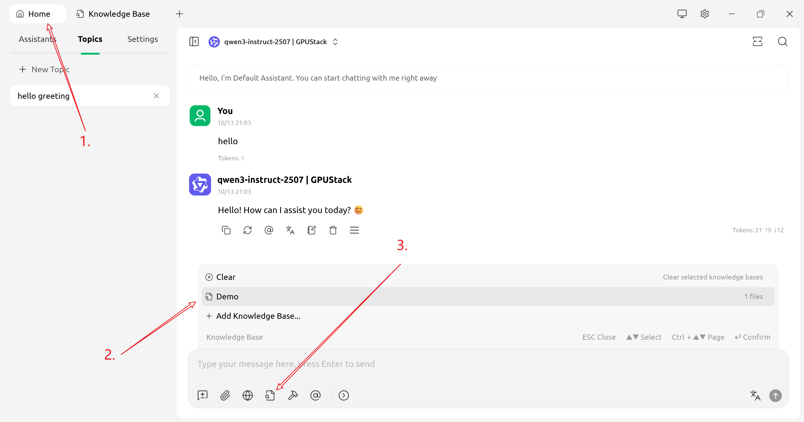

   
