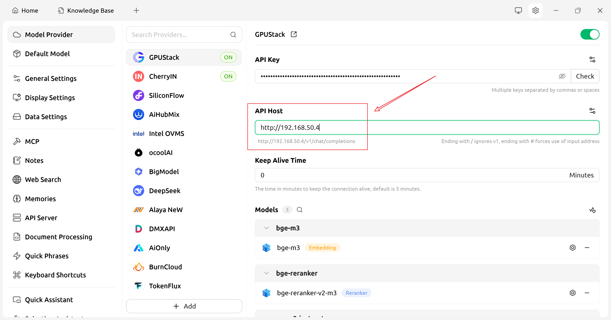
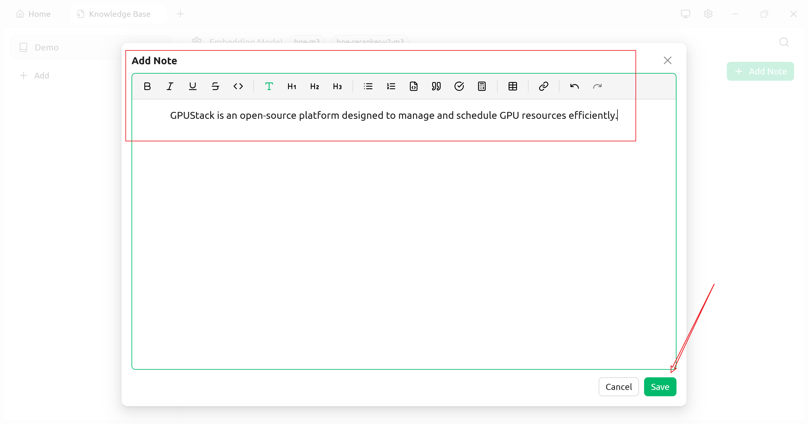
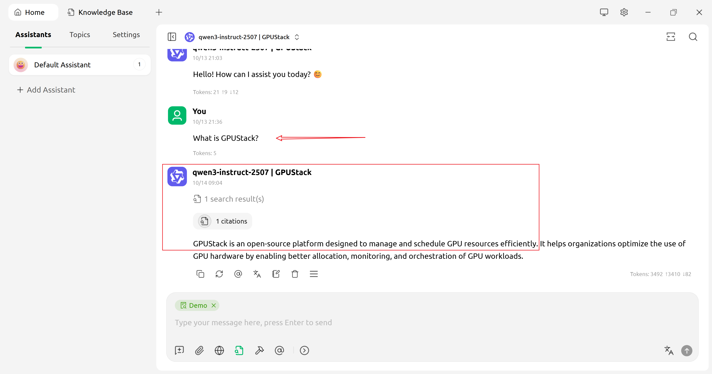

# Integrate with CherryStudio

CherryStudio integrates with GPUStack to leverage locally hosted LLMs, embeddings, and reranking.

## Deploy Models

1. In GPUStack UI, navigate to the `Deployments` page and click on `Deploy Model` to deploy the models you need. Here are some example models:

    - qwen3-instruct-2507
    - qwen2.5-vl-7b
    - bge-m3
    - bge-reranker-v2-m3

   

2. In the model’s Operations, open `API Access Info` to see how to integrate with this model.

   

## Create an API Key

1. Hover over the user avatar and navigate to the `API Keys` page, then click on `New API Key`.

2. Fill in the name, then click `Save`.

3. Copy the API key and save it for later use.

## Integrate GPUStack with CherryStudio

1. Open CherryStudio, go to Settings → Model Provider, find GPUStack, enable it, and configure it as shown:

   

2. In the GPUStack provider configuration, click "Manage" and enable the models you need:

   

   

   Because OpenAI does not provide a dedicated reranker model, GPUStack exposes the `/rerank` API under `/v1` instead of `/v1-openai`.

   In the current GPUStack version, the `/v1/models` endpoint is for internal use and does not support the "list models" operation. To enable automatic model listing in CherryStudio, first set API Host to: `http://your_host_ip/v1-openai/` (the trailing slash is required).

   Then change API Host to: `http://your_host_ip`, so the reranker endpoint works correctly, as shown below:

   

3. (Optional) Test the API:

   

After configuration, return to the CherryStudio home page and start using your models.

## Use LLMs

## Use Multimodal Models

1. Select a multimodal model

   

2. Ask multimodal questions

   

   

## Use Embeddings and Reranking to Improve Knowledge Base Q&A

1. Open the Knowledge Base configuration page

   

2. Add a knowledge base

   

3. Add content to the knowledge base (using “Notes” as an example)

   

   

4. Return to the home page and use knowledge base Q&A

   

   
