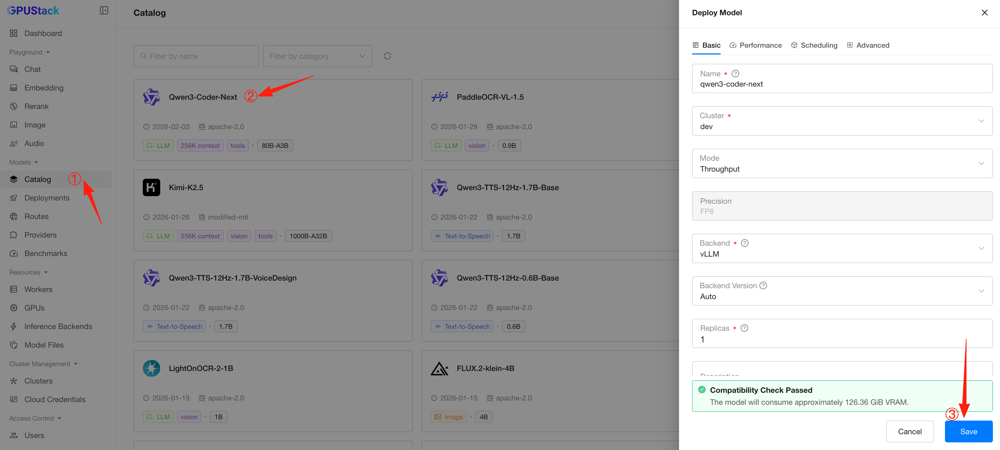
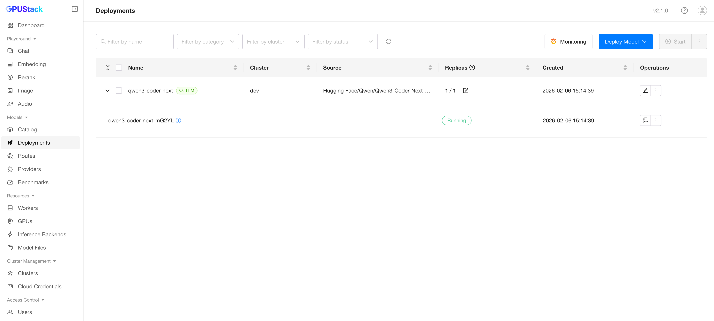
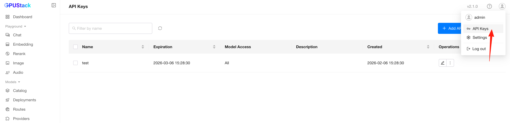
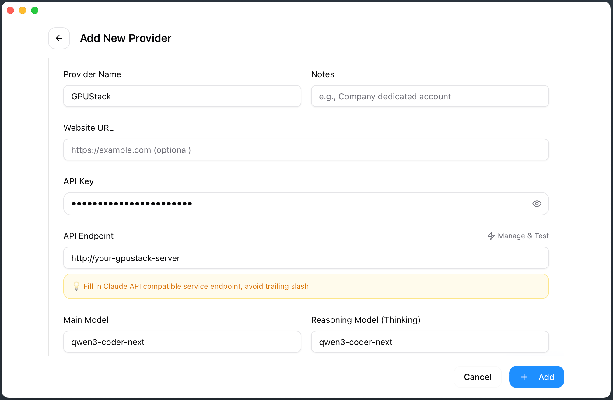
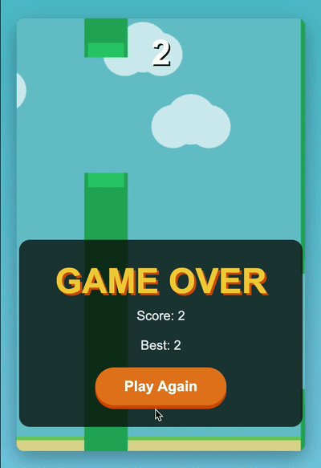

# Integrate with Claude Code

Claude Code is an agentic coding tool from Anthropic. Since model deployments on GPUStack are compatible with the Anthropic API, you can easily connect Claude Code to your GPUStack deployment and use it for code generation tasks. In this guide, we will walk through the steps to integrate Claude Code with GPUStack and test the integration by asking Claude to create a Flappy Bird game.

## Prerequisites

- One or more GPUs with at least 100 GB of VRAM in total
- GPUStack installed and running
- Access to Hugging Face or ModelScope to download model files

!!! note

    In this guide, a single NVIDIA H200 GPU is used to serve the `Qwen3-Coder-Next` model with FP8 quantization.

## Deploy the Model

1. In the GPUStack UI, navigate to the **Model Catalog** page.

2. Search for `Qwen3-Coder-Next` and deploy the model using the default configuration.

   

3. Once deployed, the model is ready for inference using the Anthropic-compatible API.

   

## Create an API Key

1. Hover over the user avatar and navigate to the **API Keys** page, then click **Add API Key**.

2. Enter a name, then click **Save**.

3. Copy the API key and save it for later use.

   

## Install Claude Code

Follow the [Claude Code documentation](https://github.com/anthropics/claude-code) to install Claude Code on your system.

## Install CC-Switch (Optional)

To easily switch between different model providers, you can use CC-Switch or similar tools. This step is optional—you can also configure Claude Code manually or use another tool of your choice.

Install [CC-Switch](https://github.com/farion1231/cc-switch) following its documentation.

## Configure Claude Code with GPUStack

1. Open CC-Switch and add a custom provider with the following settings:

   - **Provider Name**: `GPUStack`
   - **API Endpoint**: Your GPUStack server URL
   - **API Key**: The API key you created earlier

2. Configure all models to use `qwen3-coder-next`.

   

## Test the Integration

1. Create a new directory and start Claude Code:

   ```bash
   mkdir flappybird && cd flappybird
   claude
   ```

2. Verify that the configuration is correct by using the `/status` command.

3. Ask Claude to create a Flappy Bird game:

   ```
   Write a Flappy Bird game.
   ```

   

4. Once Claude Code completes, open the generated HTML file in your browser to test the result.

   

## Conclusion

In this guide, we successfully integrated Claude Code with GPUStack and used it to generate a Flappy Bird game. You can now explore more complex coding tasks with Claude Code and leverage the power of GPUStack for efficient model serving.
