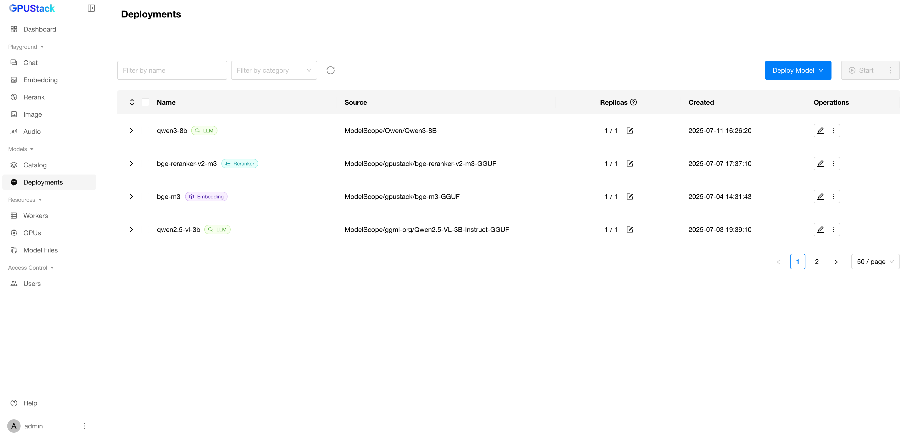
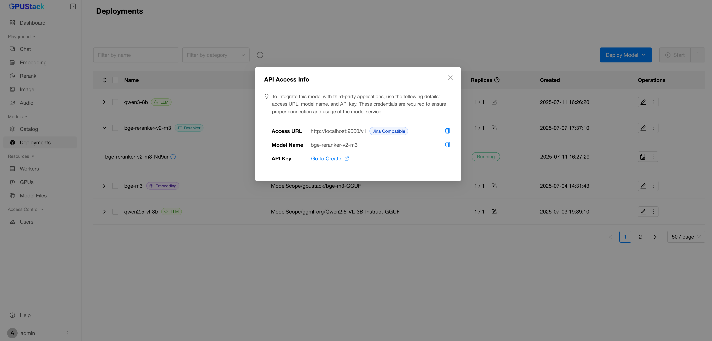
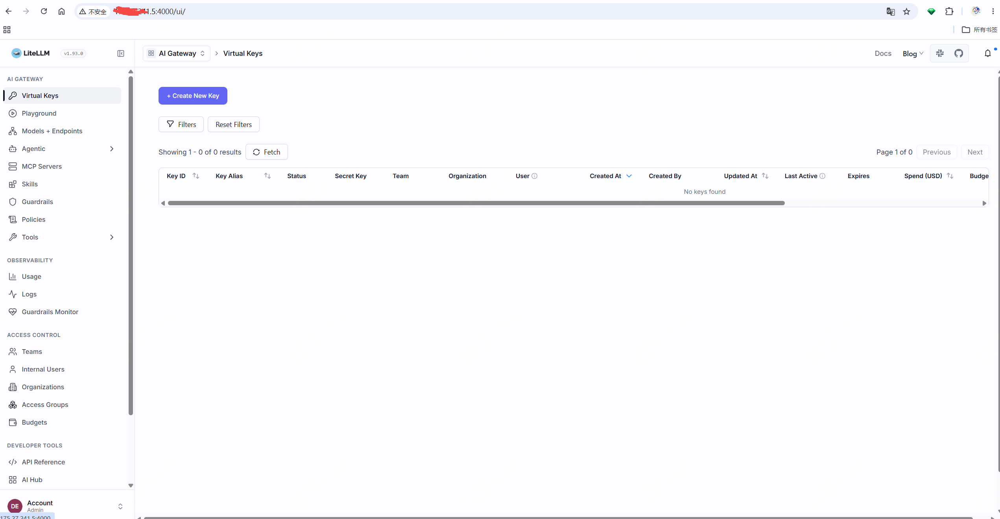
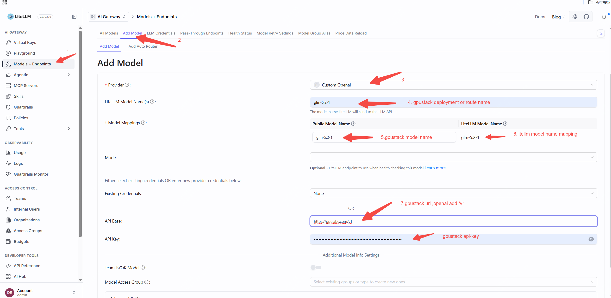
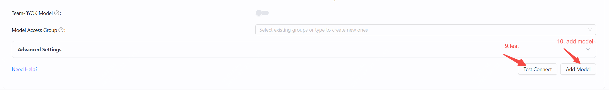
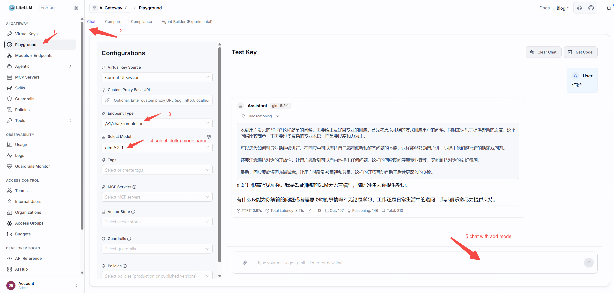

# Integrate with LiteLLM

LiteLLM can integrate with GPUStack to aggregate locally deployed LLMs, embeddings, reranking, Speech-to-Text, and Text-to-Speech capabilities into a unified OpenAI-compatible API gateway for enterprise employees.

## Deploying Models in GPUStack

1. In GPUStack UI, navigate to the `Deployments` page and click on `Deploy Model` to deploy the models you need. Here are some example models:

- qwen3-8b
- qwen2.5-vl-3b-instruct
- bge-m3
- bge-reranker-v2-m3

2. In the model’s Operations, open `API Access Info` to see how to integrate with this model.

## Create an API Key in GPUStack

1. Navigate to the `Access Control` > `API Keys` page in GPUStack, then click on `New API Key`.

2. Fill in the name, then click `Save`.

3. Copy the API key and save it for later use.

## Integrating GPUStack into LiteLLM 

1. Open LiteLLM manage ui

http://$litellmip:4000/ui

2. open models+endpoints menu -> add model

3. test in litellm  ->playgroud

