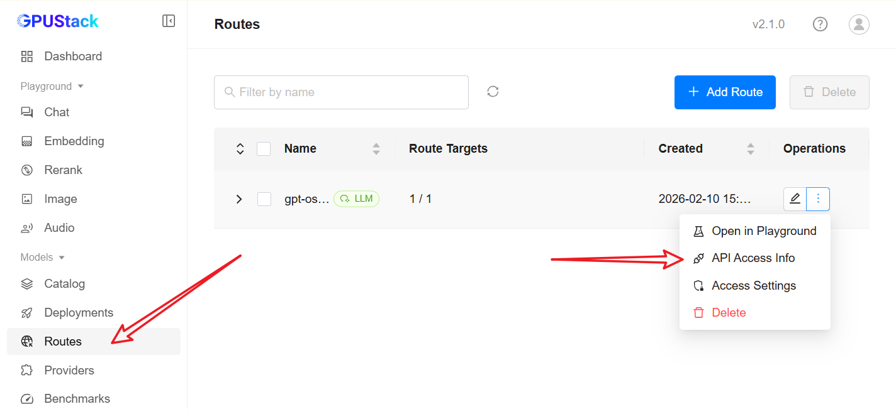
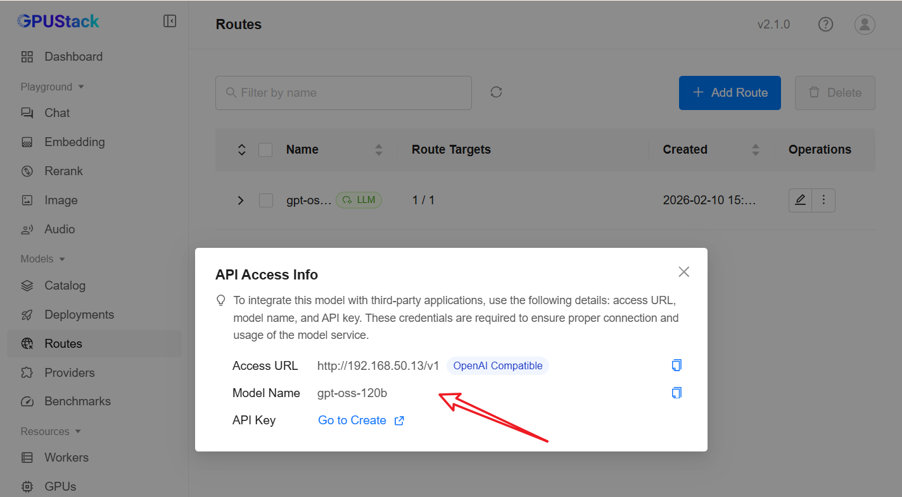
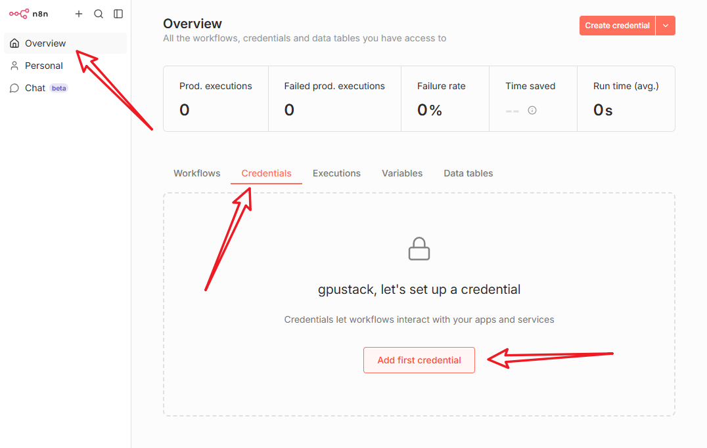
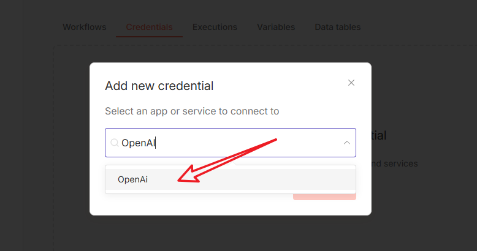
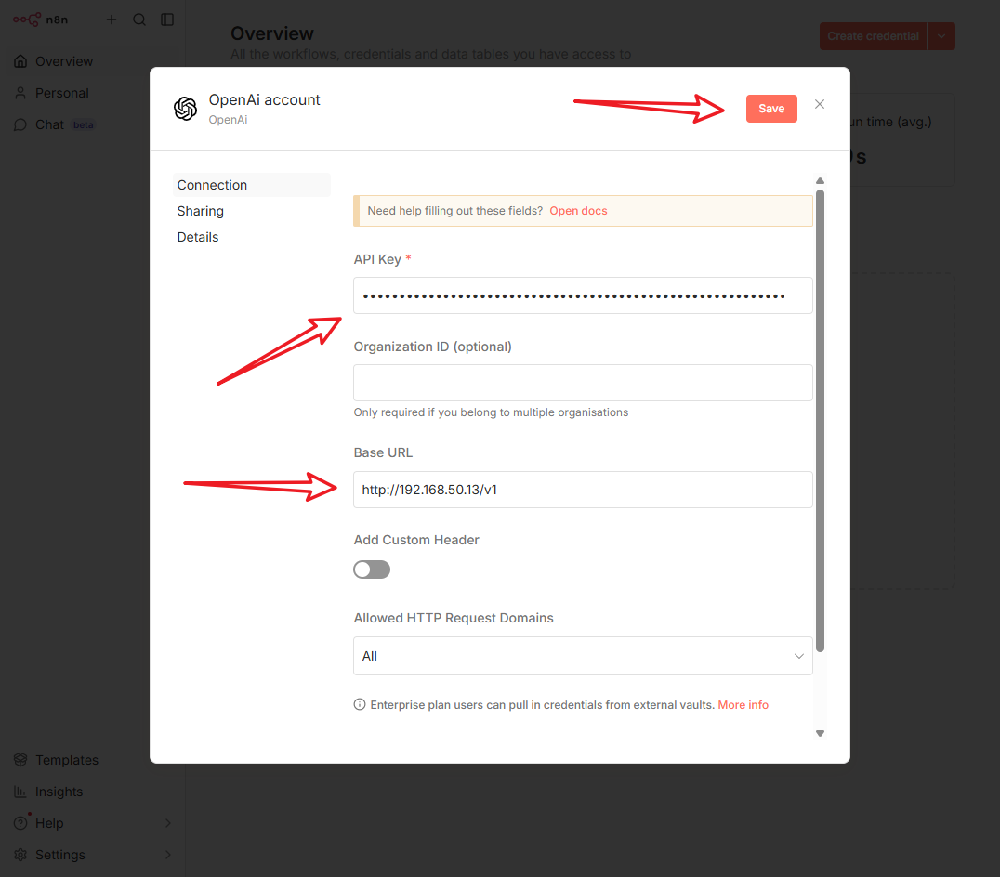
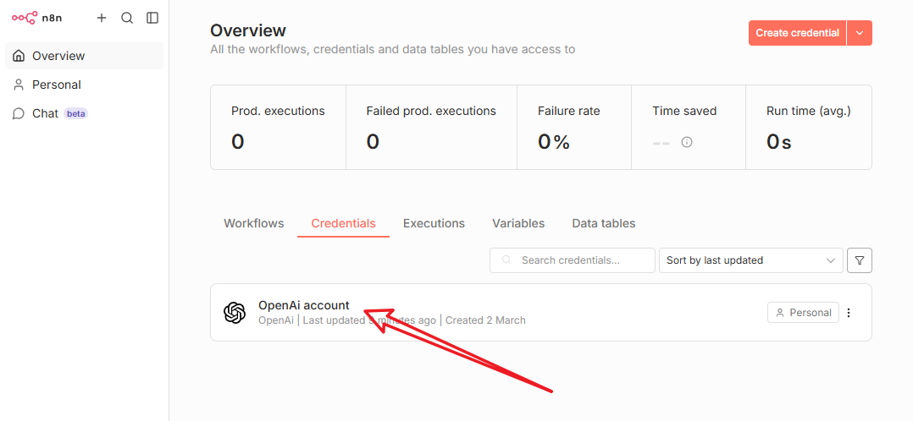
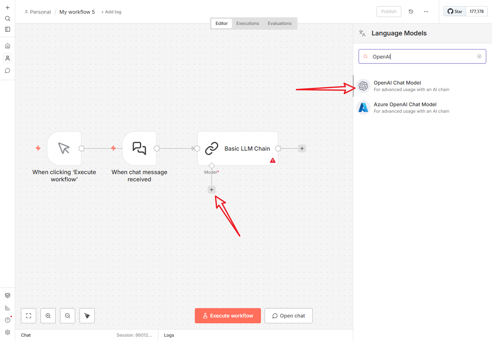
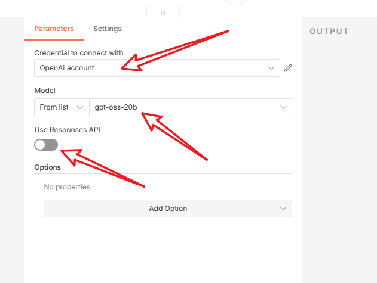

# Integrating with n8n

[n8n](https://n8n.io/) is an extendable workflow automation tool distributed under a fair-code model. It allows you to connect any application with an API to manipulate and automate tasks. With its advanced AI nodes, you can easily integrate large language models into your automated workflows.

## Deploy the Model

Please refer to the **[Model Deployment](../user-guide/model-deployment-management.md#deploy-model)** section in the GPUStack documentation to complete model deployment.

## API Access Info

1. Log in to the GPUStack Web UI
2. Navigate to the **Routes** page
3. From the menu on the right side of the target model, select **API Access Info**

Record the following information (if an API Key has not been created yet, follow the on-page instructions to create one):

* **Access URL**
* **API Key**

## Install n8n

Follow the official n8n documentation to complete a self-hosted installation, or use the n8n Cloud service directly:
[https://docs.n8n.io/hosting/](https://docs.n8n.io/hosting/)

## Integrating GPUStack in n8n

Since GPUStack provides an OpenAI-compatible API, you can directly use the OpenAI nodes in n8n for configuration:

1. Add a **Credential** in n8n

   
   
   

   It will look like the following after successful addition:

   

2. Use the GPUStack Credential

   
   

## Build Advanced AI Workflows

Refer to the official n8n documentation to learn how to combine various app nodes with AI to build powerful automated processes:
[https://docs.n8n.io/advanced-ai/](https://docs.n8n.io/advanced-ai/)
