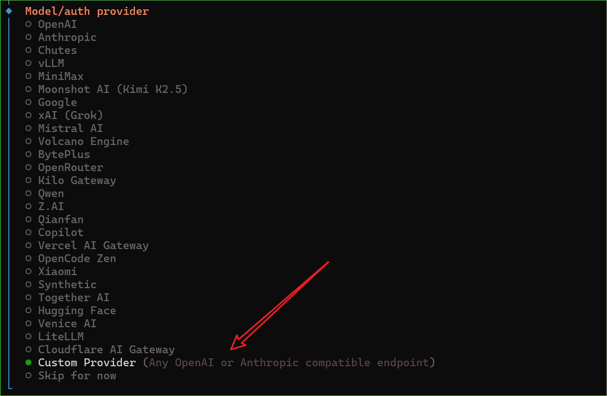
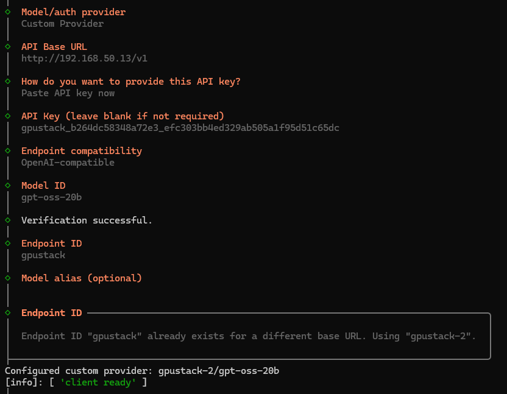

# Integrating with OpenClaw

[OpenClaw](https://openclaw.ai/) is a personal AI assistant that runs on local devices and supports interaction through common channels such as Telegram, WhatsApp, Slack, and Discord.

## Deploy the Model

Please refer to the [**Model Deployment**](../user-guide/model-deployment-management.md#deploy-model) section in the GPUStack documentation to complete model deployment.

## API Access Info

1. Log in to the GPUStack Web UI
2. Navigate to the **Routes** page
3. From the menu on the right side of the target model, select **API Access Info**


Record the following information (if an API Key has not been created yet, follow the on-page instructions to create one):

* **Access URL**
* **Model Name**
* **API Key**

## Install OpenClaw

Follow the official OpenClaw documentation to complete the installation:
[https://docs.openclaw.ai/install](https://docs.openclaw.ai/install)

## Configure GPUStack in OpenClaw

1. Start the interactive configuration wizard:

   ```bash
   openclaw onboard --install-daemon
   ```

2. In the **Model / Auth Provider** selection, choose **Custom Provider**

   

3. Fill in the information provided by GPUStack as prompted:

    * **API Base URL**: Access URL
    * **API Key**: API Key
    * **Model ID**: Model Name

   

After completing these steps, OpenClaw will use GPUStack to invoke the corresponding model for inference.

## Configure Channels

Follow the official OpenClaw documentation to configure the desired communication channel:
[https://docs.openclaw.ai/channels](https://docs.openclaw.ai/channels)
