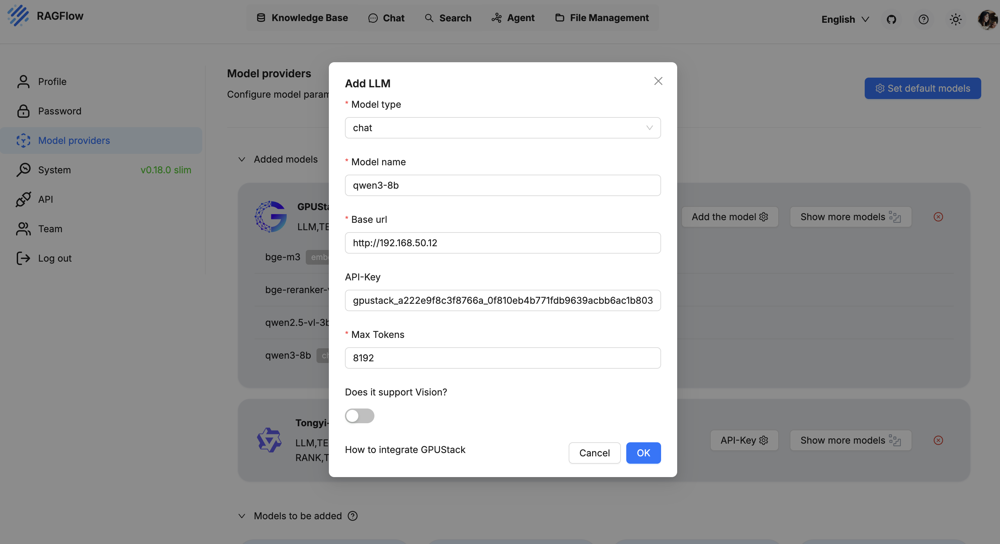

# Integrate with RAGFlow

RAGFlow can integrate with GPUStack to leverage locally deployed LLMs, embeddings, reranking, Speech-to-Text and Text-to-Speech capabilities.

## Deploying Models

1. In GPUStack UI, navigate to the `Models` page and click on `Deploy Model` to deploy the models you need. Here are some example models:

- qwen3-8b
- qwen2.5-vl-3b-instruct
- bge-m3
- bge-reranker-v2-m3

2. In the model’s Operations, open `API Access Info` to see how to integrate with this model.

## Create an API Key

1. Hover over the user avatar and navigate to the `API Keys` page, then click on `New API Key`.

2. Fill in the name, then click `Save`.

3. Copy the API key and save it for later use.

## Integrating GPUStack into RAGFlow

1. Access the RAGFlow UI, go to the top right corner and click the avatar, select `Model Providers > GPUStack`, then select `Add the model` and fill in:

- Model type: Select the model type based on the model.

- Model name: The name must match the model name deployed on GPUStack.

- Base URL: `http://your-gpustack-url`, the URL should not include the path and do not use `localhost`, as it refers to the container’s internal network. If you’re using a custom port, make sure to include it. Also, ensure the URL is accessible from inside the RAGFlow container (you can test this with `curl`).

- API-Key: Input the API key you copied from previous steps.

- Max Tokens: Input the max tokens supported by current model configuration.

Click `OK` to add the model:

2. Add other models as needed, then select the added models in the `Set default models` and save:

You can now use the models in the `Chat` and `Knowledge Base`, here is a simple case:

1. Go to `Knowledge base` to create a new knowledge base and add your file:

2. Navigate to `Retrieval testing` and set the rerank model to `bge-reranker-v2-m3`:

3. In `Chat`, create an assistant, link the previously created knowledge base, and select a chat model:

4. Create a chat session — you can now interact with the model and query the knowledge base:

5. Edit the assistant and switch the model to `qwen2.5-vl-3b-instruct`. After saving, create a new chat and upload an image to enable multimodal input:

