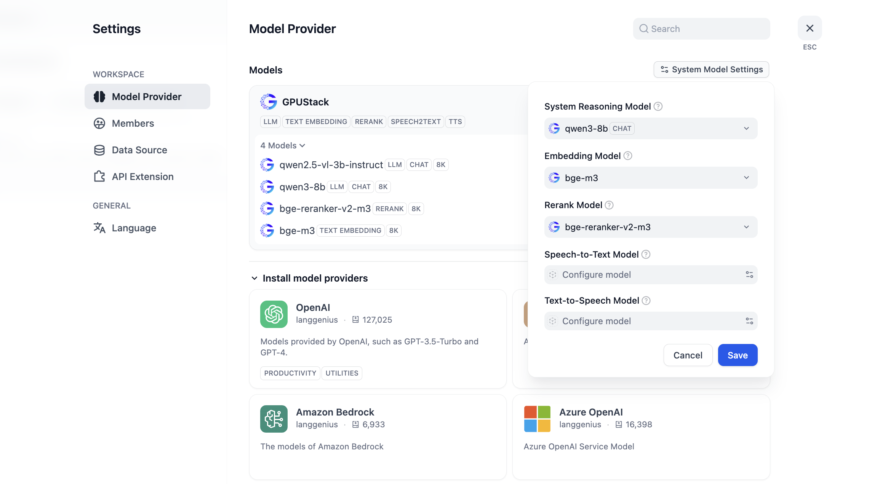

# Integrate with Dify

Dify can integrate with GPUStack to leverage locally deployed LLMs, embeddings, reranking, image generation, Speech-to-Text and Text-to-Speech capabilities.

## Deploying Models

In GPUStack UI, navigate to the `Models` page and click on `Deploy Model` to deploy the models you need.

## Create an API Key

1. Navigate to the `API Keys` page and click on `New API Key`.

2. Fill in the name, then click `Save`.

3. Copy the API key and save it for later use.

## Integrating GPUStack into Dify

Go to `Settings > Model Provider > GPUStack` and fill in:

- Model Type: Select the model type based on the model.

- Model Name: The name must match the model name deployed on GPUStack.

- Server URL: `http://your-gpustack-url`, the URL should not include the path and cannot be `localhost`, as `localhost` is limited to the container’s internal network. Ensure the URL is accessible from within the Dify container. You can test this by using `curl`.

- API Key: Input the API key you copied from previous steps.

Click `Save` to add the model:

Select the added models in the `System Model Settings` and save:

You can now use the models in the application.
