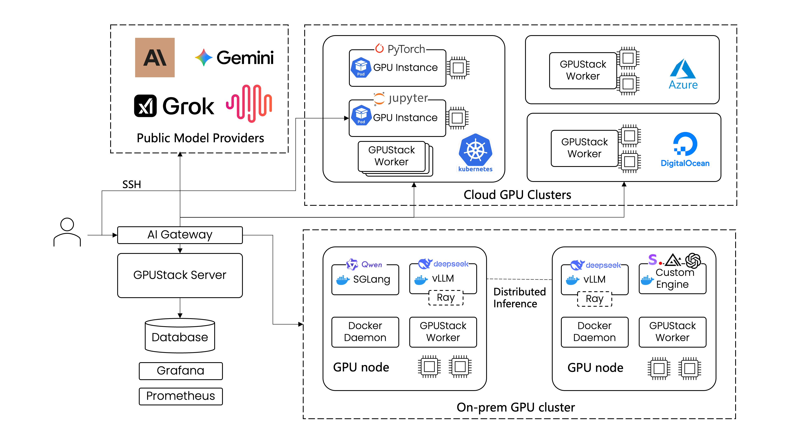
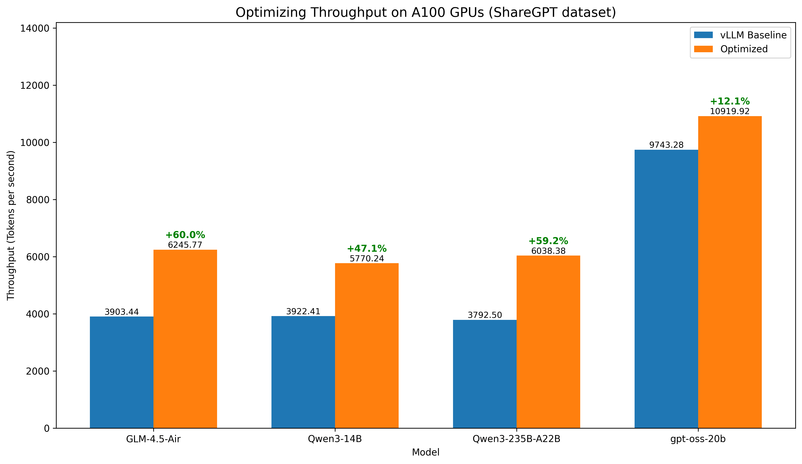

 

    

 

  
  
  

  
  <a class="github-button" href="https://github.com/gpustack/gpustack" data-show-count="true" data-size="large" aria-label="Star">Star</a>
  <a class="github-button" href="https://github.com/gpustack/gpustack/subscription" data-icon="octicon-eye" data-size="large" aria-label="Watch">Watch</a>
  <a class="github-button" href="https://github.com/gpustack/gpustack/fork" data-show-count="true" data-icon="octicon-repo-forked" data-size="large" aria-label="Fork">Fork</a>

## Overview

GPUStack is an open-source GPU cluster manager designed for efficient AI model deployment. It configures and orchestrates inference engines — vLLM, SGLang, TensorRT-LLM, or your own — to optimize performance across GPU clusters.

-   :material-server-network:{ .lg .middle .icon-blue } __Multi-Cluster GPU Management__

    ---

    Manages GPU clusters across multiple environments. This includes on-premises servers, Kubernetes clusters, and cloud providers.

-   :material-engine-outline:{ .lg .middle .icon-green } __Pluggable Inference Engines__

    ---

    Automatically configures high-performance inference engines such as vLLM, SGLang, and TensorRT-LLM. You can also add custom inference engines as needed.

-   :material-rocket-launch-outline:{ .lg .middle .icon-orange } __Day 0 Model Support__

    ---

    GPUStack's pluggable engine architecture enables you to deploy new models on the day they are released.

-   :material-speedometer:{ .lg .middle .icon-red } __Performance-Optimized__

    ---

    Offers pre-tuned modes for low latency or high throughput. Supports extended KV cache (LMCache, HiCache) and speculative decoding (EAGLE3, MTP).

-   :material-shield-check-outline:{ .lg .middle .icon-purple } __Enterprise-Grade Operations__

    ---

    Offers support for automated failure recovery, load balancing, monitoring, authentication, and access control.

## Architecture

GPUStack enables development teams, IT organizations, and service providers to deliver Model-as-a-Service at scale. It supports industry-standard APIs for LLM, voice, image, and video models. The platform includes built-in user authentication and access control, real-time monitoring of GPU performance and utilization, and detailed metering of token usage and API request rates.

The figure below illustrates how a single GPUStack server can manage multiple GPU clusters across both on-premises and cloud environments. The GPUStack scheduler allocates GPUs to maximize resource utilization and selects the appropriate inference engines for optimal performance. Administrators also gain full visibility into system health and metrics through integrated Grafana and Prometheus dashboards.

## Optimized Inference Performance

GPUStack's automated engine selection and parameter optimization deliver strong inference performance out of the box. The following figure shows throughput improvements over default vLLM configurations:

For detailed benchmarking methods and results, visit our [Inference Performance Lab](https://docs.gpustack.ai/latest/performance-lab/overview/).

## Supported Accelerators

GPUStack supports a wide range of accelerators for AI inference:

    

        
    

    

        
    

    

        
    

    

        
    

    

        
    

    

        
    

    

        
    

    

        
    

    

        
    

For detailed requirements and setup instructions, see the [Installation Requirements](installation/requirements.md) documentation.
