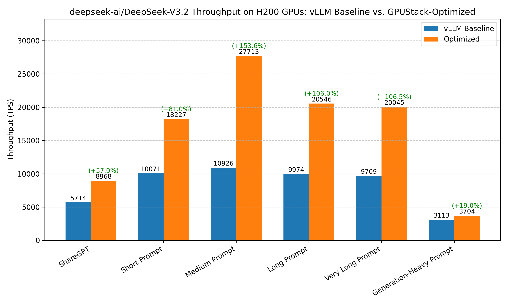

# Optimizing DeepSeek-V3.2 Throughput on NVIDIA H200 GPUs

## Conclusion


Recommended configuration for optimizing throughput of DeepSeek-V3.2 on a single node with H200x8:

???+ tip "Serving Command"
    ```bash
    python3 -m sglang.launch_server --model deepseek-ai/DeepSeek-V3.2 \
    --chat-template ./tool_chat_template_deepseekv32.jinja \
    --tp-size 8 --dp-size 8 --enable-dp-attention
    --reasoning-parser deepseek-v3 \
    --tool-call-parser deepseekv32
    ```

Link for [tool_chat_template_deepseekv32.jinja](https://github.com/sgl-project/sglang/blob/main/examples/chat_template/tool_chat_template_deepseekv32.jinja). 

Based on the below benchmarks, we recommend the above configuration for optimizing **DeepSeek-V3.2** throughput on **8×H200**.

**Parallelism** and **Tool Call Configuration** provide the largest performance gains and are therefore included in the recommended command. **Context Length Adjustment** can further improve throughput but is highly workload-dependent and should be tuned according to actual usage.
While **Attention Backend** optimizations show positive effects, their gains are relatively small and may vary across datasets, so they are not included in the default recommendation.

Comparison of benchmark results before and after optimization:

| Benchmark Case | baseline (vLLM without any optimizations) | Optimized |
|---------------|--------------------------------------------|-----------|
| **ShareGPT** | Total TPS: 4113.24<br>Mean TPOT(ms): 613.22 | Total TPS: 7351.59 <span style="background-color:lightgreen;">(+78.8%)</span><br>Mean TPOT(ms): 287.86 |
| **Short Prompt** | Total TPS: 10539.36<br>Mean TPOT(ms): 747.47 | Total TPS: 19778.53 <span style="background-color:lightgreen;">(+87.7%)</span><br>Mean TPOT(ms): 753.97 |
| **Medium Prompt** | Total TPS: 10488.24<br>Mean TPOT(ms): 375.72 | Total TPS: 27385.86 <span style="background-color:lightgreen;">(+161.1%)</span><br>Mean TPOT(ms): 200.06 |
| **Long Prompt** | Total TPS: 9313.06<br>Mean TPOT(ms): 245.07 | Total TPS: 20094.60 <span style="background-color:lightgreen;">(+115.8%)</span><br>Mean TPOT(ms): 171.34 |
| **Very Long Prompt** | Total TPS: 9789.64<br>Mean TPOT(ms): 463.89 | Total TPS: 20022.76 <span style="background-color:lightgreen;">(+104.5%)</span><br>Mean TPOT(ms): 245.69 |
| **Ultra Long Prompt** | Total TPS: 6288.25<br>Mean TPOT(ms): 619.71 | Total TPS: 16442.29 <span style="background-color:lightgreen;">(+161.5%)</span><br>Mean TPOT(ms): 51.45 |
| **Generation-Heavy Prompt** | Total TPS: 3112.52<br>Mean TPOT(ms): 45.72 | Total TPS: 3611.95 <span style="background-color:lightgreen;">(+16.0%)</span><br>Mean TPOT(ms): 40.25 |

!!! note
    1. Our benchmark tests do not cover all possible optimization combinations. For example, we select the inference engine that performs best under its default configuration as the starting point for further tuning. This pruning approach yields a local optimum, which may not be the global optimum.
    2. There are other optimization methods that depend on specific user scenarios, including max batch size, schedule configuration, extended KV cache, CUDA graph, etc. The conclusions in this document can serve as a starting point for more targeted optimizations.
    3. The tests are conducted on specific hardware and software setups. Advances in the inference engine may lead to new conclusions.

If there are any missing points or updates reflecting new changes, please [let us know](https://github.com/gpustack/gpustack/issues/new/choose).


## Optimization Objective

Achieve high throughput under high-concurrency request scenarios.

## Experimental Setup

### Model

deepseek-ai/DeepSeek-V3.2

### Hardware

NVIDIA H200 GPUs

### Engine Version

- vLLM: v0.13.0
- SGLang: v0.5.6.post2
- TensorRT-LLM: 1.2.0rc5

### Benchmark Dataset

1. ShareGPT
2. Random dataset with varying sequence lengths:
    - Very long prompt: 32000 input tokens, 100 output tokens
    - Long prompt: 4000 input tokens, 200 output tokens
    - Medium prompt: 2000 input tokens, 100 output tokens
    - Short prompt: 128 input tokens, 4 output tokens
    - Generation-Heavy Prompt: 1K input tokens, 2K output tokens

### Benchmark Script

We use the **vLLM bench CLI** tool to benchmark the model performance. The following command is used to run the benchmark:

```bash
# Prepare the ShareGPT dataset
wget https://huggingface.co/datasets/anon8231489123/ShareGPT_Vicuna_unfiltered/resolve/main/ShareGPT_V3_unfiltered_cleaned_split.json

# Benchmark on ShareGPT dataset
vllm bench serve --model deepseek-ai/DeepSeek-V3.2 --backend openai-chat --endpoint /v1/chat/completions --dataset-name sharegpt --dataset-path ShareGPT_V3_unfiltered_cleaned_split.json --num-prompts 1000

# Benchmark on random dataset (fixed seed for reproducibility)
vllm bench serve --model deepseek-ai/DeepSeek-V3.2 --backend openai-chat --endpoint /v1/chat/completions --dataset-name random --random-input-len 4000 --random-output-len 200 --num-prompts 500 --seed 42
```

## Experiment Results

### 1. Baseline of the Inference Engine

vLLM
??? info "Serving script"
    ```bash

    vllm serve deepseek-ai/DeepSeek-V3.2 -tp 8 --tokenizer-mode deepseek_v32 --reasoning-parser deepseek_v3
    ```

??? info "Benchmark result"
    ```
    ============ Serving Benchmark Result ============
    Successful requests:                     1000
    Benchmark duration (s):                  72.75
    Total input tokens:                      219111
    Total generated tokens:                  196599
    Request throughput (req/s):              13.75
    Output token throughput (tok/s):         2702.26
    Peak output token throughput (tok/s):    6009.00
    Peak concurrent requests:                1000.00
    Total Token throughput (tok/s):          5713.95
    ---------------Time to First Token----------------
    Mean TTFT (ms):                          13054.63
    Median TTFT (ms):                        12849.39
    P99 TTFT (ms):                           22754.42
    -----Time per Output Token (excl. 1st token)------
    Mean TPOT (ms):                          275.03
    Median TPOT (ms):                        171.63
    P99 TPOT (ms):                           666.78
    ---------------Inter-token Latency----------------
    Mean ITL (ms):                           131.14
    Median ITL (ms):                         81.97
    P99 ITL (ms):                            668.29
    ==================================================
    ```

SGLang
??? info "Serving script"
    ```bash
    python3 -m sglang.launch_server --model-path deepseek-ai/DeepSeek-V3.2 --host 0.0.0.0 --port 8000 \
    --chat-template ./tool_chat_template_deepseekv32.jinja \
    --tp-size 8
    ```

??? info "Benchmark result"
    ```
    ============ Serving Benchmark Result ============
    Successful requests:                     1000
    Benchmark duration (s):                  138.25
    Total input tokens:                      219111
    Total generated tokens:                  197337
    Request throughput (req/s):              7.23
    Output token throughput (tok/s):         1427.44
    Peak output token throughput (tok/s):    7949.00
    Peak concurrent requests:                1000.00
    Total Token throughput (tok/s):          3012.37
    ---------------Time to First Token----------------
    Mean TTFT (ms):                          11470.15
    Median TTFT (ms):                        11240.35
    P99 TTFT (ms):                           22363.90
    -----Time per Output Token (excl. 1st token)------
    Mean TPOT (ms):                          1103.96
    Median TPOT (ms):                        672.86
    P99 TPOT (ms):                           4231.55
    ---------------Inter-token Latency----------------
    Mean ITL (ms):                           389.06
    Median ITL (ms):                         64.46
    P99 ITL (ms):                            3013.62
    ==================================================
    ```

TensorRT-LLM
??? info "Serving script"
    ```bash
    trtllm-serve /workspace/DeepSeek-v3.2 --tp_size 8
    ```

??? info "Benchmark result"
    ```
    ============ Serving Benchmark Result ============
    Successful requests:                     984
    Benchmark duration (s):                  236.70
    Total input tokens:                      215176
    Total generated tokens:                  194893
    Request throughput (req/s):              4.16
    Output token throughput (tok/s):         823.39
    Peak output token throughput (tok/s):    4212.00
    Peak concurrent requests:                984.00
    Total Token throughput (tok/s):          1732.48
    ---------------Time to First Token----------------
    Mean TTFT (ms):                          65710.22
    Median TTFT (ms):                        66076.17
    P99 TTFT (ms):                           125723.14
    -----Time per Output Token (excl. 1st token)------
    Mean TPOT (ms):                          1391.76
    Median TPOT (ms):                        608.74
    P99 TPOT (ms):                           4785.14
    ---------------Inter-token Latency----------------
    Mean ITL (ms):                           459.69
    Median ITL (ms):                         141.56
    P99 ITL (ms):                            4910.46
    ==================================================
    ```

Result: vLLM (5713.95 tok/s) > SGLang(3012.37 tok/s) > TensorRT-LLM (1732.48 tok/s)

### 2. Optimizing vLLM

#### Parallelism: DP+EP

??? info "Serving script"
    ```bash
    # 81920 is half context, full context OOM
    vllm serve deepseek-ai/DeepSeek-V3.2 --tokenizer-mode deepseek_v32 --reasoning-parser deepseek_v3 \
    -tp 1 -dp 8 --enable-expert-parallel --max-model-len 81920
    ```

??? info "Benchmark result"
    ```
    Successful requests:                     1000
    Benchmark duration (s):                  65.62
    Total input tokens:                      219111
    Total generated tokens:                  197109
    Request throughput (req/s):              15.24
    Output token throughput (tok/s):         3003.90
    Peak output token throughput (tok/s):    10222.00
    Peak concurrent requests:                1000.00
    Total Token throughput (tok/s):          6343.10
    ---------------Time to First Token----------------
    Mean TTFT (ms):                          9144.24
    Median TTFT (ms):                        10233.68
    P99 TTFT (ms):                           14920.03
    -----Time per Output Token (excl. 1st token)------
    Mean TPOT (ms):                          278.22
    Median TPOT (ms):                        115.72
    P99 TPOT (ms):                           2048.82
    ---------------Inter-token Latency----------------
    Mean ITL (ms):                           100.47
    Median ITL (ms):                         74.61
    P99 ITL (ms):                            1239.62
    ==================================================
    ```

#### Parallelism: DCP

??? info "Serving script"
    ```bash
    vllm serve deepseek-ai/DeepSeek-V3.2 -tp 8 --tokenizer-mode deepseek_v32 --reasoning-parser deepseek_v3 \
    -dcp 8
    ```

DeepSeek V3.2 relies on the FlashMLA sparse attention backend, which currently does not expose softmax log-sum-exp (LSE) during the decode phase. Since Decode Context Parallelism (DCP) requires softmax LSE for correct cross-rank aggregation, DCP is not supported with FlashMLA at this time, leading to a runtime failure in vLLM. This limitation has been discussed in the vLLM repository (see issue [#27544](https://github.com/vllm-project/vllm/issues/27544)).

#### MTP

??? info "Serving script"
    ```bash
    vllm serve deepseek-ai/DeepSeek-V3.2 -tp 8 --tokenizer-mode deepseek_v32 --reasoning-parser deepseek_v3 \
    --speculative-config {"method":"mtp","num_speculative_tokens":1}
    ```

??? info "Benchmark result"
    ```
    ============ Serving Benchmark Result ============
    Successful requests:                     1000
    Benchmark duration (s):                  75.13
    Total input tokens:                      219111
    Total generated tokens:                  197345
    Request throughput (req/s):              13.31
    Output token throughput (tok/s):         2626.63
    Peak output token throughput (tok/s):    3940.00
    Peak concurrent requests:                1000.00
    Total Token throughput (tok/s):          5542.96
    ---------------Time to First Token----------------
    Mean TTFT (ms):                          11110.51
    Median TTFT (ms):                        10739.31
    P99 TTFT (ms):                           21886.92
    -----Time per Output Token (excl. 1st token)------
    Mean TPOT (ms):                          291.48
    Median TPOT (ms):                        250.14
    P99 TPOT (ms):                           735.48
    ---------------Inter-token Latency----------------
    Mean ITL (ms):                           290.48
    Median ITL (ms):                         144.81
    P99 ITL (ms):                            4636.00
    ==================================================
    ```

#### Turn off DeepGEMM in vLLM

??? info "Serving script"
    ```bash
    export VLLM_USE_DEEP_GEMM=0
    vllm serve deepseek-ai/DeepSeek-V3.2 -tp 8 --tokenizer-mode deepseek_v32 --reasoning-parser deepseek_v3
    ```

??? info "Benchmark result"
    ```
    ============ Serving Benchmark Result ============
    Successful requests:                     1000
    Benchmark duration (s):                  74.92
    Total input tokens:                      219111
    Total generated tokens:                  197222
    Request throughput (req/s):              13.35
    Output token throughput (tok/s):         2632.38
    Peak output token throughput (tok/s):    6010.00
    Peak concurrent requests:                1000.00
    Total Token throughput (tok/s):          5556.92
    ---------------Time to First Token----------------
    Mean TTFT (ms):                          11250.21
    Median TTFT (ms):                        10762.25
    P99 TTFT (ms):                           20723.94
    -----Time per Output Token (excl. 1st token)------
    Mean TPOT (ms):                          287.49
    Median TPOT (ms):                        188.99
    P99 TPOT (ms):                           667.67
    ---------------Inter-token Latency----------------
    Mean ITL (ms):                           140.98
    Median ITL (ms):                         83.88
    P99 ITL (ms):                            671.43
    ==================================================
    ```

#### Enable Tool Call Configuration

??? info "Serving script"
    ```bash
    vllm serve deepseek-ai/DeepSeek-V3.2 -tp 8 --tokenizer-mode deepseek_v32 --reasoning-parser deepseek_v3 --tool-call-parser deepseek_v32 --enable-auto-tool-choice
    ```

??? info "Benchmark result"
    ```
    ============ Serving Benchmark Result ============
    Successful requests:                     1000
    Benchmark duration (s):                  74.16
    Total input tokens:                      219111
    Total generated tokens:                  197012
    Request throughput (req/s):              13.48
    Output token throughput (tok/s):         2656.40
    Peak output token throughput (tok/s):    6095.00
    Peak concurrent requests:                1000.00
    Total Token throughput (tok/s):          5610.78
    ---------------Time to First Token----------------
    Mean TTFT (ms):                          13648.83
    Median TTFT (ms):                        13557.38
    P99 TTFT (ms):                           23498.54
    -----Time per Output Token (excl. 1st token)------
    Mean TPOT (ms):                          280.78
    Median TPOT (ms):                        176.29
    P99 TPOT (ms):                           677.36
    ---------------Inter-token Latency----------------
    Mean ITL (ms):                           132.99
    Median ITL (ms):                         82.69
    P99 ITL (ms):                            683.11
    ==================================================
    ```

#### Context Length Adjustment

??? info "Serving script"
    ```bash
    vllm serve deepseek-ai/DeepSeek-V3.2 -tp 8 --tokenizer-mode deepseek_v32 --reasoning-parser deepseek_v3 --max-model-len 32768
    ```

??? info "Benchmark result"
    ```bash
    ============ Serving Benchmark Result ============
    Successful requests:                     1000
    Benchmark duration (s):                  75.12
    Total input tokens:                      219111
    Total generated tokens:                  196938
    Request throughput (req/s):              13.31
    Output token throughput (tok/s):         2621.48
    Peak output token throughput (tok/s):    6293.00
    Peak concurrent requests:                1000.00
    Total Token throughput (tok/s):          5538.11
    ---------------Time to First Token----------------
    Mean TTFT (ms):                          10439.14
    Median TTFT (ms):                        10296.60
    P99 TTFT (ms):                           23842.17
    -----Time per Output Token (excl. 1st token)------
    Mean TPOT (ms):                          357.68
    Median TPOT (ms):                        223.35
    P99 TPOT (ms):                           1169.74
    ---------------Inter-token Latency----------------
    Mean ITL (ms):                           154.24
    Median ITL (ms):                         78.13
    P99 ITL (ms):                            660.95
    ==================================================
    ```

#### Attention Backend: CUTLASS_MLA

??? info "Serving script"
    ```bash
    export VLLM_ATTENTION_BACKEND="CUTLASS_MLA"
    vllm serve deepseek-ai/DeepSeek-V3.2 -tp 8 --tokenizer-mode deepseek_v32 --reasoning-parser deepseek_v3
    ```

ValueError: Selected backend AttentionBackendEnum.CUTLASS_MLA is not valid for this configuration. Reason: ['sparse not supported', 'compute capability not supported']

#### Attention Backend: FLASHMLA

??? info "Serving script"
    ```bash
    export VLLM_ATTENTION_BACKEND="FLASHMLA"
    ```

ValueError: Selected backend AttentionBackendEnum.FLASHMLA is not valid for this configuration. Reason: ['sparse not supported']


#### Attention Backend: TRITON_MLA

??? info "Serving script"
    ```bash
    export VLLM_ATTENTION_BACKEND="TRITON_MLA"
    vllm serve deepseek-ai/DeepSeek-V3.2 -tp 8 --tokenizer-mode deepseek_v32 --reasoning-parser deepseek_v3
    ```
ValueError: Selected backend AttentionBackendEnum.TRITON_MLA is not valid for this configuration. Reason: ['sparse not supported']

### 3. Optimizing SGLang

#### Parallelism: TP+DP Attention

??? info "Serving script"
    ```bash
    python3 -m sglang.launch_server --model-path deepseek-ai/DeepSeek-V3.2 --host 0.0.0.0 --port 8000 \
    --chat-template ./tool_chat_template_deepseekv32.jinja \
    --tp-size 8 --enable-dp-attention
    ```

??? info "Benchmark result"
    ```
    ============ Serving Benchmark Result ============
    Successful requests:                     1000
    Benchmark duration (s):                  99.46
    Total input tokens:                      219111
    Total generated tokens:                  197633
    Request throughput (req/s):              10.05
    Output token throughput (tok/s):         1987.11
    Peak output token throughput (tok/s):    8911.00
    Peak concurrent requests:                1000.00
    Total Token throughput (tok/s):          4190.17
    ---------------Time to First Token----------------
    Mean TTFT (ms):                          13679.11
    Median TTFT (ms):                        12663.74
    P99 TTFT (ms):                           21665.97
    -----Time per Output Token (excl. 1st token)------
    Mean TPOT (ms):                          608.90
    Median TPOT (ms):                        398.19
    P99 TPOT (ms):                           3453.39
    ---------------Inter-token Latency----------------
    Mean ITL (ms):                           230.03
    Median ITL (ms):                         59.95
    P99 ITL (ms):                            1824.84
    ==================================================
    ```

#### Parallelism: TP+DP+DP Attention

??? info "Serving script"
    ```bash
    python3 -m sglang.launch_server --model-path deepseek-ai/DeepSeek-V3.2 --host 0.0.0.0 --port 8000 \
    --chat-template ./tool_chat_template_deepseekv32.jinja \
    --tp-size 8 --dp-size 8 --enable-dp-attention
    ```

??? info "Benchmark result"
    ```
    ============ Serving Benchmark Result ============
    Successful requests:                     1000
    Benchmark duration (s):                  56.62
    Total input tokens:                      219111
    Total generated tokens:                  197116
    Request throughput (req/s):              17.66
    Output token throughput (tok/s):         3481.55
    Peak output token throughput (tok/s):    11298.00
    Peak concurrent requests:                1000.00
    Total Token throughput (tok/s):          7351.59
    ---------------Time to First Token----------------
    Mean TTFT (ms):                          7815.00
    Median TTFT (ms):                        8024.81
    P99 TTFT (ms):                           12928.46
    -----Time per Output Token (excl. 1st token)------
    Mean TPOT (ms):                          287.86
    Median TPOT (ms):                        107.58
    P99 TPOT (ms):                           2096.18
    ---------------Inter-token Latency----------------
    Mean ITL (ms):                           91.68
    Median ITL (ms):                         58.87
    P99 ITL (ms):                            317.43
    ==================================================
    ```

#### Parallelism: TP+DP+DP Attention+EP

??? info "Serving script"
    ```bash
    python3 -m sglang.launch_server --model-path deepseek-ai/DeepSeek-V3.2 --host 0.0.0.0 --port 8000 \
    --chat-template ./tool_chat_template_deepseekv32.jinja \
    --tp-size 8 --dp-size 8 --enable-dp-attention --ep-size 8
    ```

??? info "Benchmark result"
    ```
    ============ Serving Benchmark Result ============
    Successful requests:                     1000
    Benchmark duration (s):                  57.14
    Total input tokens:                      219111
    Total generated tokens:                  197614
    Request throughput (req/s):              17.50
    Output token throughput (tok/s):         3458.68
    Peak output token throughput (tok/s):    11757.00
    Peak concurrent requests:                1000.00
    Total Token throughput (tok/s):          7293.61
    ---------------Time to First Token----------------
    Mean TTFT (ms):                          8437.36
    Median TTFT (ms):                        8346.50
    P99 TTFT (ms):                           15410.07
    -----Time per Output Token (excl. 1st token)------
    Mean TPOT (ms):                          319.46
    Median TPOT (ms):                        111.65
    P99 TPOT (ms):                           2443.91
    ---------------Inter-token Latency----------------
    Mean ITL (ms):                           94.48
    Median ITL (ms):                         56.54
    P99 ITL (ms):                            451.92
    ==================================================
    ```

#### MTP

??? info "Serving script"
    ```bash
    python3 -m sglang.launch_server --model-path deepseek-ai/DeepSeek-V3.2 --host 0.0.0.0 --port 8000 \
    --tp-size 8 \
    --speculative-algorithm EAGLE --speculative-num-steps 1 --speculative-eagle-topk 1 --speculative-num-draft-tokens 2
    ```

??? info "Benchmark result"
    ```
    ============ Serving Benchmark Result ============
    Successful requests:                     1000
    Benchmark duration (s):                  278.36
    Total input tokens:                      219111
    Total generated tokens:                  193349
    Request throughput (req/s):              3.59
    Output token throughput (tok/s):         694.61
    Peak output token throughput (tok/s):    974.00
    Peak concurrent requests:                1000.00
    Total Token throughput (tok/s):          1481.77
    ---------------Time to First Token----------------
    Mean TTFT (ms):                          139046.94
    Median TTFT (ms):                        144733.94
    P99 TTFT (ms):                           260932.68
    -----Time per Output Token (excl. 1st token)------
    Mean TPOT (ms):                          68.88
    Median TPOT (ms):                        63.31
    P99 TPOT (ms):                           280.02
    ---------------Inter-token Latency----------------
    Mean ITL (ms):                           115.50
    Median ITL (ms):                         48.42
    P99 ITL (ms):                            337.68
    ==================================================
    ```

#### Turn off DeepGEMM

??? info "Serving script"
    ```bash
    export SGLANG_ENABLE_JIT_DEEPGEMM=0
    python3 -m sglang.launch_server --model-path deepseek-ai/DeepSeek-V3.2 --host 0.0.0.0 --port 8000 \
    --chat-template ./tool_chat_template_deepseekv32.jinja \
    --tp-size 8
    ```

The server fails to start when DeepGEMM is disabled.

#### Enable Tool Call Configuration

??? info "Serving script"
    ```bash
    python3 -m sglang.launch_server --model-path deepseek-ai/DeepSeek-V3.2 --host 0.0.0.0 --port 8000 \
    --chat-template ./tool_chat_template_deepseekv32.jinja \
    --tp-size 8 \
    --enable-dp-attention \
    --dp 8 \
    --reasoning-parser deepseek-v3 \
    --tool-call-parser deepseekv32
    ```

??? info "Benchmark result"
    ```
    ============ Serving Benchmark Result ============
    Successful requests:                     1000
    Benchmark duration (s):                  49.70
    Total input tokens:                      219111
    Total generated tokens:                  197192
    Request throughput (req/s):              20.12
    Output token throughput (tok/s):         3967.70
    Peak output token throughput (tok/s):    13083.00
    Peak concurrent requests:                1000.00
    Total Token throughput (tok/s):          8376.43
    ---------------Time to First Token----------------
    Mean TTFT (ms):                          6577.70
    Median TTFT (ms):                        6815.18
    P99 TTFT (ms):                           11936.83
    -----Time per Output Token (excl. 1st token)------
    Mean TPOT (ms):                          250.64
    Median TPOT (ms):                        95.20
    P99 TPOT (ms):                           1825.45
    ---------------Inter-token Latency----------------
    Mean ITL (ms):                           81.42
    Median ITL (ms):                         53.51
    P99 ITL (ms):                            269.50
    ==================================================
    ```

#### Context Length Adjustment

??? info "Serving script"
    ```bash
    python3 -m sglang.launch_server --model-path deepseek-ai/DeepSeek-V3.2 --host 0.0.0.0 --port 8000 \
    --chat-template ./tool_chat_template_deepseekv32.jinja \
    --tp-size 8 \
    --enable-dp-attention \
    --dp 8 \
    --reasoning-parser deepseek-v3 \
    --tool-call-parser deepseekv32 \
    --context-length=32768
    ```

??? info "Benchmark result"
    ```
    ============ Serving Benchmark Result ============
    Successful requests:                     1000
    Benchmark duration (s):                  47.60
    Total input tokens:                      219111
    Total generated tokens:                  197380
    Request throughput (req/s):              21.01
    Output token throughput (tok/s):         4146.96
    Peak output token throughput (tok/s):    12798.00
    Peak concurrent requests:                1000.00
    Total Token throughput (tok/s):          8750.49
    ---------------Time to First Token----------------
    Mean TTFT (ms):                          5615.34
    Median TTFT (ms):                        5448.81
    P99 TTFT (ms):                           10053.28
    -----Time per Output Token (excl. 1st token)------
    Mean TPOT (ms):                          214.05
    Median TPOT (ms):                        87.57
    P99 TPOT (ms):                           1553.18
    ---------------Inter-token Latency----------------
    Mean ITL (ms):                           76.04
    Median ITL (ms):                         54.16
    P99 ITL (ms):                            210.36
    ==================================================
    ```

#### KV Cache DType

??? info "Serving script"
    ```bash
    python3 -m sglang.launch_server --model-path deepseek-ai/DeepSeek-V3.2 --host 0.0.0.0 --port 8000 \
    --chat-template ./tool_chat_template_deepseekv32.jinja \
    --tp-size 8 \
    --enable-dp-attention \
    --dp 8 \
    --reasoning-parser deepseek-v3 \
    --tool-call-parser deepseekv32 \
    --context-length=32768 \
    --kv-cache-dtype fp8_e4m3
    ```

??? info "Benchmark result"
    ```
    ============ Serving Benchmark Result ============
    Successful requests:                     1000
    Benchmark duration (s):                  49.00
    Total input tokens:                      219111
    Total generated tokens:                  197078
    Request throughput (req/s):              20.41
    Output token throughput (tok/s):         4022.27
    Peak output token throughput (tok/s):    12674.00
    Peak concurrent requests:                1000.00
    Total Token throughput (tok/s):          8494.23
    ---------------Time to First Token----------------
    Mean TTFT (ms):                          5472.04
    Median TTFT (ms):                        5289.41
    P99 TTFT (ms):                           9731.02
    -----Time per Output Token (excl. 1st token)------
    Mean TPOT (ms):                          213.50
    Median TPOT (ms):                        92.04
    P99 TPOT (ms):                           1471.85
    ---------------Inter-token Latency----------------
    Mean ITL (ms):                           79.15
    Median ITL (ms):                         58.50
    P99 ITL (ms):                            100.53
    ==================================================
    ```

#### Attention Backend: fa3 + fa3

??? info "Serving script"
    ```bash
    python3 -m sglang.launch_server --model-path deepseek-ai/DeepSeek-V3.2 --host 0.0.0.0 --port 8000 \
    --chat-template ./tool_chat_template_deepseekv32.jinja \
    --tp-size 8 \
    --enable-dp-attention \
    --dp 8 \
    --reasoning-parser deepseek-v3 \
    --tool-call-parser deepseekv32 \
    --context-length=32768 \
    --attention-backend nsa \
    --nsa-prefill-backend fa3 \
    --nsa-decode-backend fa3
    ```

??? info "Benchmark result"
    ```
    ============ Serving Benchmark Result ============
    Successful requests:                     1000
    Benchmark duration (s):                  46.37
    Total input tokens:                      219111
    Total generated tokens:                  196786
    Request throughput (req/s):              21.56
    Output token throughput (tok/s):         4243.46
    Peak output token throughput (tok/s):    13860.00
    Peak concurrent requests:                1000.00
    Total Token throughput (tok/s):          8968.32
    ---------------Time to First Token----------------
    Mean TTFT (ms):                          5303.50
    Median TTFT (ms):                        5145.47
    P99 TTFT (ms):                           9366.93
    -----Time per Output Token (excl. 1st token)------
    Mean TPOT (ms):                          203.05
    Median TPOT (ms):                        85.23
    P99 TPOT (ms):                           1399.48
    ---------------Inter-token Latency----------------
    Mean ITL (ms):                           74.03
    Median ITL (ms):                         53.86
    P99 ITL (ms):                            177.03
    ==================================================
    ```

#### Attention Backend: flashmla_sparse + flashmla_kv

??? info "Serving script"
    ```bash
    python3 -m sglang.launch_server --model-path deepseek-ai/DeepSeek-V3.2 --host 0.0.0.0 --port 8000 \
    --chat-template ./tool_chat_template_deepseekv32.jinja \
    --tp-size 8 \
    --enable-dp-attention \
    --dp 8 \
    --reasoning-parser deepseek-v3 \
    --tool-call-parser deepseekv32 \
    --context-length=32768 \
    --attention-backend nsa \
    --nsa-prefill-backend flashmla_sparse \
    --nsa-decode-backend flashmla_kv
    ```

??? info "Benchmark result"
    ```
    ============ Serving Benchmark Result ============
    Successful requests:                     1000
    Benchmark duration (s):                  77.68
    Total input tokens:                      219111
    Total generated tokens:                  197443
    Request throughput (req/s):              12.87
    Output token throughput (tok/s):         2541.62
    Peak output token throughput (tok/s):    8352.00
    Peak concurrent requests:                1000.00
    Total Token throughput (tok/s):          5362.16
    ---------------Time to First Token----------------
    Mean TTFT (ms):                          4811.25
    Median TTFT (ms):                        4727.17
    P99 TTFT (ms):                           9086.60
    -----Time per Output Token (excl. 1st token)------
    Mean TPOT (ms):                          260.25
    Median TPOT (ms):                        128.33
    P99 TPOT (ms):                           1625.53
    ---------------Inter-token Latency----------------
    Mean ITL (ms):                           114.47
    Median ITL (ms):                         91.44
    P99 ITL (ms):                            256.14
    ==================================================
    ```

### 4. Optimizing TensorRT-LLM

#### Parallelism: TP+EP

??? info "Serving script"
    ```bash
    trtllm-serve /workspace/DeepSeek-v3.2 --tp_size 8 --ep_size 8 --pp_size 1
    ```

??? info "Benchmark result"
    ```
    ============ Serving Benchmark Result ============
    Successful requests:                     984
    Benchmark duration (s):                  142.99
    Total input tokens:                      216405
    Total generated tokens:                  195740
    Request throughput (req/s):              6.88
    Output token throughput (tok/s):         1368.90
    Peak output token throughput (tok/s):    4635.00
    Peak concurrent requests:                984.00
    Total Token throughput (tok/s):          2882.32
    ---------------Time to First Token----------------
    Mean TTFT (ms):                          24155.45
    Median TTFT (ms):                        23945.42
    P99 TTFT (ms):                           45683.09
    -----Time per Output Token (excl. 1st token)------
    Mean TPOT (ms):                          561.24
    Median TPOT (ms):                        312.75
    P99 TPOT (ms):                           1473.03
    ---------------Inter-token Latency----------------
    Mean ITL (ms):                           248.40
    Median ITL (ms):                         142.18
    P99 ITL (ms):                            1819.83
    ==================================================
    ```

#### Turn off DeepGEMM

??? info "Serving script"
    ```bash
    export TRTLLM_DG_ENABLED=0
    trtllm-serve /workspace/DeepSeek-v3.2 --tp_size 8 --ep_size 8 --pp_size 1
    ```

??? info "Benchmark result"
    ```
    ============ Serving Benchmark Result ============
    Successful requests:                     984
    Benchmark duration (s):                  134.65
    Total input tokens:                      216484
    Total generated tokens:                  194509
    Request throughput (req/s):              7.31
    Output token throughput (tok/s):         1444.56
    Peak output token throughput (tok/s):    4661.00
    Peak concurrent requests:                984.00
    Total Token throughput (tok/s):          3052.33
    ---------------Time to First Token----------------
    Mean TTFT (ms):                          23229.65
    Median TTFT (ms):                        23100.28
    P99 TTFT (ms):                           44648.94
    -----Time per Output Token (excl. 1st token)------
    Mean TPOT (ms):                          541.07
    Median TPOT (ms):                        264.04
    P99 TPOT (ms):                           1588.04
    ---------------Inter-token Latency----------------
    Mean ITL (ms):                           226.30
    Median ITL (ms):                         137.80
    P99 ITL (ms):                            1624.47
    ==================================================
    ```

### Summary of Optimization Options

| Optimization Option     | Throughput Improvement                                    |
| ----------------------- | --------------------------------------------------------- |
| Parallelism             | <span style="background-color:lightgreen;">+28.66%</span> |
| Tool Call Configuration | <span style="background-color:lightgreen;">+13.94%</span> |
| Context Length Adjust   | <span style="background-color:lightgreen;">+4.47%</span>  |
| Attention Backend       | <span style="background-color:lightgreen;">+2.49%</span>  |
| KV Cache Dtype          | -                                                         |
| MTP                     | -                                                         |
| DeepGEMM                | -                                                         |
| Total(vs Baseline)      | <span style="background-color:lightgreen;">+56.97%</span> |


### Other Benchmark Cases

We further benchmarked the optimized configuration to evaluate its generalization under various workloads.

??? info "Baseline serving script"
    ```bash
    vllm serve deepseek-ai/DeepSeek-V3.2 -tp 8 --tokenizer-mode deepseek_v32 --reasoning-parser deepseek_v3
    ```

??? info "Baseline benchmark results"
    ```bash
    # random 128 input
    ============ Serving Benchmark Result ============
    Successful requests:                     1000
    Benchmark duration (s):                  13.11
    Total input tokens:                      128000
    Total generated tokens:                  4000
    Request throughput (req/s):              76.30
    Output token throughput (tok/s):         305.20
    Peak output token throughput (tok/s):    1029.00
    Peak concurrent requests:                1000.00
    Total Token throughput (tok/s):          10071.49
    ---------------Time to First Token----------------
    Mean TTFT (ms):                          5786.15
    Median TTFT (ms):                        4666.02
    P99 TTFT (ms):                           12922.46
    -----Time per Output Token (excl. 1st token)------
    Mean TPOT (ms):                          781.80
    Median TPOT (ms):                        687.63
    P99 TPOT (ms):                           1637.52
    ---------------Inter-token Latency----------------
    Mean ITL (ms):                           586.79
    Median ITL (ms):                         664.73
    P99 ITL (ms):                            3545.51
    ==================================================


    # random 2K input
    ============ Serving Benchmark Result ============
    Successful requests:                     500
    Benchmark duration (s):                  96.10
    Total input tokens:                      1000000
    Total generated tokens:                  50000
    Request throughput (req/s):              5.20
    Output token throughput (tok/s):         520.27
    Peak output token throughput (tok/s):    4085.00
    Peak concurrent requests:                500.00
    Total Token throughput (tok/s):          10925.59
    ---------------Time to First Token----------------
    Mean TTFT (ms):                          45667.57
    Median TTFT (ms):                        43997.53
    P99 TTFT (ms):                           87384.57
    -----Time per Output Token (excl. 1st token)------
    Mean TPOT (ms):                          354.59
    Median TPOT (ms):                        433.59
    P99 TPOT (ms):                           452.30
    ---------------Inter-token Latency----------------
    Mean ITL (ms):                           353.26
    Median ITL (ms):                         68.59
    P99 ITL (ms):                            661.87
    ==================================================


    # random 4K input
    ============ Serving Benchmark Result ============
    Successful requests:                     500
    Benchmark duration (s):                  210.54
    Total input tokens:                      2000000
    Total generated tokens:                  100000
    Request throughput (req/s):              2.37
    Output token throughput (tok/s):         474.96
    Peak output token throughput (tok/s):    2769.00
    Peak concurrent requests:                500.00
    Total Token throughput (tok/s):          9974.26
    ---------------Time to First Token----------------
    Mean TTFT (ms):                          103386.88
    Median TTFT (ms):                        97324.68
    P99 TTFT (ms):                           200514.23
    -----Time per Output Token (excl. 1st token)------
    Mean TPOT (ms):                          226.74
    Median TPOT (ms):                        246.98
    P99 TPOT (ms):                           275.68
    ---------------Inter-token Latency----------------
    Mean ITL (ms):                           228.79
    Median ITL (ms):                         49.50
    P99 ITL (ms):                            683.63
    ==================================================


    # random 32k input
    ============ Serving Benchmark Result ============
    Successful requests:                     100
    Benchmark duration (s):                  330.61
    Total input tokens:                      3200000
    Total generated tokens:                  10000
    Request throughput (req/s):              0.30
    Output token throughput (tok/s):         30.25
    Peak output token throughput (tok/s):    384.00
    Peak concurrent requests:                100.00
    Total Token throughput (tok/s):          9709.27
    ---------------Time to First Token----------------
    Mean TTFT (ms):                          164003.81
    Median TTFT (ms):                        164174.93
    P99 TTFT (ms):                           325134.01
    -----Time per Output Token (excl. 1st token)------
    Mean TPOT (ms):                          472.52
    Median TPOT (ms):                        512.36
    P99 TPOT (ms):                           514.39
    ---------------Inter-token Latency----------------
    Mean ITL (ms):                           477.69
    Median ITL (ms):                         741.90
    P99 ITL (ms):                            949.57
    ==================================================


    1k random input + 2k generation
    ============ Serving Benchmark Result ============
    Successful requests:                     100
    Benchmark duration (s):                  96.39
    Total input tokens:                      100000
    Total generated tokens:                  200000
    Request throughput (req/s):              1.04
    Output token throughput (tok/s):         2075.01
    Peak output token throughput (tok/s):    2598.00
    Peak concurrent requests:                100.00
    Total Token throughput (tok/s):          3112.52
    ---------------Time to First Token----------------
    Mean TTFT (ms):                          4789.20
    Median TTFT (ms):                        4590.83
    P99 TTFT (ms):                           10608.88
    -----Time per Output Token (excl. 1st token)------
    Mean TPOT (ms):                          45.72
    Median TPOT (ms):                        45.83
    P99 TPOT (ms):                           47.44
    ---------------Inter-token Latency----------------
    Mean ITL (ms):                           46.34
    Median ITL (ms):                         43.13
    P99 ITL (ms):                            44.29
    ==================================================
    ```

??? info "Optimized serving script"
    ```bash
    python3 -m sglang.launch_server --model deepseek-ai/DeepSeek-V3.2 \
    --chat-template ./tool_chat_template_deepseekv32.jinja \
    --tp-size 8 --dp-size 8 --enable-dp-attention \
    --reasoning-parser deepseek-v3 \
    --tool-call-parser deepseekv32 \
    --context-length=32768 \
    --attention-backend nsa \
    --nsa-prefill-backend fa3 \
    --nsa-decode-backend fa3
    ```

??? info "Optimized benchmark results"
    ```bash
    # random 128 input
    ============ Serving Benchmark Result ============
    Successful requests:                     984
    Benchmark duration (s):                  7.13
    Total input tokens:                      125952
    Total generated tokens:                  3936
    Request throughput (req/s):              138.09
    Output token throughput (tok/s):         552.34
    Peak output token throughput (tok/s):    2526.00
    Peak concurrent requests:                984.00
    Total Token throughput (tok/s):          18227.38
    ---------------Time to First Token----------------
    Mean TTFT (ms):                          4441.81
    Median TTFT (ms):                        4685.89
    P99 TTFT (ms):                           6735.22
    -----Time per Output Token (excl. 1st token)------
    Mean TPOT (ms):                          776.55
    Median TPOT (ms):                        714.97
    P99 TPOT (ms):                           1659.07
    ---------------Inter-token Latency----------------
    Mean ITL (ms):                           465.93
    Median ITL (ms):                         59.97
    P99 ITL (ms):                            4564.16
    ==================================================


    # random 2K input
    ============ Serving Benchmark Result ============
    Successful requests:                     500
    Benchmark duration (s):                  37.89
    Total input tokens:                      1000000
    Total generated tokens:                  50000
    Request throughput (req/s):              13.20
    Output token throughput (tok/s):         1319.64
    Peak output token throughput (tok/s):    9477.00
    Peak concurrent requests:                500.00
    Total Token throughput (tok/s):          27712.54
    ---------------Time to First Token----------------
    Mean TTFT (ms):                          18696.78
    Median TTFT (ms):                        18939.89
    P99 TTFT (ms):                           32138.14
    -----Time per Output Token (excl. 1st token)------
    Mean TPOT (ms):                          192.24
    Median TPOT (ms):                        189.20
    P99 TPOT (ms):                           349.96
    ---------------Inter-token Latency----------------
    Mean ITL (ms):                           189.18
    Median ITL (ms):                         55.05
    P99 ITL (ms):                            219.74
    ==================================================


    # random 4K input
    ============ Serving Benchmark Result ============
    Successful requests:                     500
    Benchmark duration (s):                  102.21
    Total input tokens:                      2000000
    Total generated tokens:                  100000
    Request throughput (req/s):              4.89
    Output token throughput (tok/s):         978.37
    Peak output token throughput (tok/s):    7180.00
    Peak concurrent requests:                500.00
    Total Token throughput (tok/s):          20545.67
    ---------------Time to First Token----------------
    Mean TTFT (ms):                          44019.81
    Median TTFT (ms):                        40806.24
    P99 TTFT (ms):                           90171.38
    -----Time per Output Token (excl. 1st token)------
    Mean TPOT (ms):                          177.95
    Median TPOT (ms):                        161.14
    P99 TPOT (ms):                           321.10
    ---------------Inter-token Latency----------------
    Mean ITL (ms):                           177.57
    Median ITL (ms):                         49.55
    P99 ITL (ms):                            224.52
    ==================================================


    # random 32k input
    ============ Serving Benchmark Result ============
    Successful requests:                     100
    Benchmark duration (s):                  160.14
    Total input tokens:                      3200000
    Total generated tokens:                  10000
    Request throughput (req/s):              0.62
    Output token throughput (tok/s):         62.45
    Peak output token throughput (tok/s):    1189.00
    Peak concurrent requests:                100.00
    Total Token throughput (tok/s):          20045.18
    ---------------Time to First Token----------------
    Mean TTFT (ms):                          83964.72
    Median TTFT (ms):                        88265.70
    P99 TTFT (ms):                           157005.30
    -----Time per Output Token (excl. 1st token)------
    Mean TPOT (ms):                          246.26
    Median TPOT (ms):                        229.67
    P99 TPOT (ms):                           514.42
    ---------------Inter-token Latency----------------
    Mean ITL (ms):                           244.63
    Median ITL (ms):                         33.21
    P99 ITL (ms):                            898.58
    ==================================================


    1k random input + 2k generation
    ============ Serving Benchmark Result ============
    Successful requests:                     100
    Benchmark duration (s):                  80.99
    Total input tokens:                      100000
    Total generated tokens:                  200000
    Request throughput (req/s):              1.23
    Output token throughput (tok/s):         2469.32
    Peak output token throughput (tok/s):    2800.00
    Peak concurrent requests:                100.00
    Total Token throughput (tok/s):          3703.98
    ---------------Time to First Token----------------
    Mean TTFT (ms):                          2103.54
    Median TTFT (ms):                        2216.52
    P99 TTFT (ms):                           3514.77
    -----Time per Output Token (excl. 1st token)------
    Mean TPOT (ms):                          39.45
    Median TPOT (ms):                        39.40
    P99 TPOT (ms):                           40.17
    ---------------Inter-token Latency----------------
    Mean ITL (ms):                           40.56
    Median ITL (ms):                         38.90
    P99 ITL (ms):                            43.63
    ==================================================
    ```
