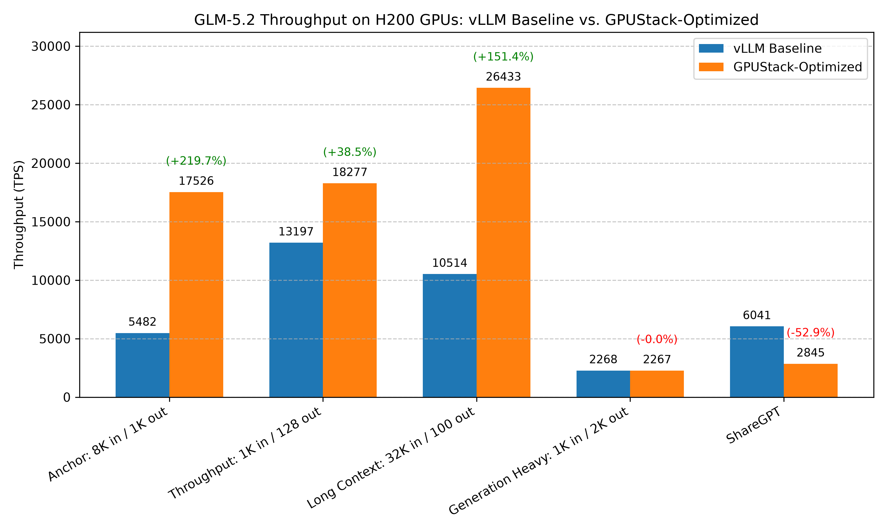

# Optimizing GLM-5.2 Throughput on H200

## Conclusion



Recommended configuration for optimizing throughput of zai-org/GLM-5.2-FP8 on NVIDIA H200x8:

???+ tip "Serving Command"
    ```bash
    python3 -m sglang.launch_server \
        --model-path zai-org/GLM-5.2-FP8 \
        --tp-size=8 \
        --dp-size=8 \
        --enable-dp-attention \
        --mem-fraction-static=0.85 \
        --moe-a2a-backend=deepep \
        --max-running-requests=256 \
        --kv-cache-dtype=fp8_e4m3
    ```

Comparison of benchmark results before and after optimization:

| Benchmark Case | baseline (vLLM without any optimizations) | Optimized |
|----------|-------------------------------------------|-----------|
| **Balanced: 8K in / 1K out (optimization target)** | Total TPS: 5481.90<br>Mean TPOT(ms): 636.24 | Total TPS: 17525.76 <span style="background-color:lightgreen;">(+219.70%)</span><br>Mean TPOT(ms): 217.89 |
| **Short Context (1K in / 128 out)** | Total TPS: 13196.90<br>Mean TPOT(ms): 316.73 | Total TPS: 18276.60 <span style="background-color:lightgreen;">(+38.49%)</span><br>Mean TPOT(ms): 211.06 |
| **Long Context (32K in / 100 out)** | Total TPS: 10513.68<br>Mean TPOT(ms): 1320.02 | Total TPS: 26433.15 <span style="background-color:lightgreen;">(+151.42%)</span><br>Mean TPOT(ms): 537.26 |
| **Generation Heavy (1K in / 2K out)** | Total TPS: 2268.18<br>Mean TPOT(ms): 42.11 | Total TPS: 2267.33 <span style="background-color:#ffd6d6;">(-0.04%)</span><br>Mean TPOT(ms): 46.54 |
| **ShareGPT** | Total TPS: 6040.94<br>Mean TPOT(ms): 149.24 | Total TPS: 2845.48 <span style="background-color:#ffd6d6;">(-52.90%)</span><br>Mean TPOT(ms): 331.21 |

!!! note
    1. Our benchmark tests do not cover all possible optimization combinations. For example, we select the inference engine that performs best under its default configuration as the starting point for further tuning. This pruning approach yields a local optimum, which may not be the global optimum.
    2. There are other optimization methods that depend on specific user scenarios, including max batch size, schedule configuration, extended KV cache, CUDA graph, etc. The conclusions in this document can serve as a starting point for more targeted optimizations.
    3. The tests are conducted on specific hardware and software setups. Advances in the inference engine may lead to new conclusions.
    4. Although using quantization may impact accuracy. FP8 quantization can achieve less than 1% accuracy drop for most models. See the [evaluation results](https://github.com/Tencent/AngelSlim/blob/main/README_en.md#-benchmark) for more details. Therefore, it is highly recommended to use FP8 quantization for low-latency serving scenarios.
    5. The recommended configuration is tuned for high-concurrency, medium-to-long input (the anchor 8K in / 1K out workload). On short input/output conversational workloads such as ShareGPT it regresses versus plain tensor parallelism, because the DP-attention and DeepEP optimizations are designed for long sequences and their overhead is not amortized by short requests (see ShareGPT under Other Benchmark Cases). This trade-off suits GLM-5.2's target use case: its strong coding ability makes coding-agent serving the primary scenario, where context is predominantly long — exactly the regime this configuration is optimized for.

If there are any missing points or updates reflecting new changes, please [let us know](https://github.com/gpustack/gpustack/issues/new/choose).

## Experimental Setup

### Model

zai-org/GLM-5.2-FP8

### Hardware

NVIDIA H200x8

### Engine Version

- vLLM v0.24.0
- SGLang v0.5.14

### Benchmark Method

This project uses GPUStack's one-click benchmark capability for serving workloads. The benchmark tests in this document were executed with that workflow.

GPUStack's benchmark implementation is built on top of [guidellm](https://github.com/vllm-project/guidellm) via the wrapper project [benchmark-runner](https://github.com/gpustack/benchmark-runner).

GPUStack handles model deployment, benchmark job submission, and result collection for the benchmark configurations listed below.

#### Benchmark Profiles

##### Balanced

```yaml
dataset_name: Random
dataset_input_tokens: 8192
dataset_output_tokens: 1024
dataset_seed: 42
request_rate: 1000
total_requests: 1000
```

##### Short Context

```yaml
dataset_name: Random
dataset_input_tokens: 1024
dataset_output_tokens: 128
dataset_seed: 42
request_rate: 1000
total_requests: 1000
```

##### Long Context

```yaml
dataset_name: Random
dataset_input_tokens: 32000
dataset_output_tokens: 100
dataset_seed: 42
request_rate: 1
total_requests: 100
```

##### Generation Heavy

```yaml
dataset_name: Random
dataset_input_tokens: 1000
dataset_output_tokens: 2000
dataset_seed: 42
request_rate: 1
total_requests: 200
```

##### ShareGPT

```yaml
dataset_name: ShareGPT
request_rate: 1000
total_requests: 1000
```

## Experiment Results

### Choosing the Inference Engine

#### vLLM

- Profile: `Balanced`
- Backend Parameters:
  ```bash
  --tensor-parallel-size=8
  ```

??? info "Benchmark result"
    ```
    ============ Serving Benchmark Result ============
    Successful requests:                     1000
    Maximum request concurrency:             512
    Benchmark duration (s):                  1684.76
    Total input tokens:                      8204000
    Total generated tokens:                  1024000
    Request throughput (req/s):              0.59
    Output token throughput (tok/s):         608.31
    Peak output token throughput (tok/s):    21900.04
    Peak concurrent requests:                512.00
    Total Token throughput (tok/s):          5481.90
    ----------------------Latency---------------------
    Mean Latency(s):                          651.51
    Median Latency(s):                        823.57
    P95 Latency(s):                           857.92
    P99 Latency(s):                           858.57
    ---------------Time to First Token----------------
    Mean TTFT (ms):                          592315.54
    Median TTFT (ms):                        762631.30
    P95 TTFT (ms):                           799738.92
    P99 TTFT (ms):                           800277.09
    -----Time per Output Token (excl. 1st token)------
    Mean TPOT (ms):                          636.24
    Median TPOT (ms):                        804.27
    P95 TPOT (ms):                           837.81
    P99 TPOT (ms):                           838.45
    ---------------Inter-token Latency----------------
    Mean ITL (ms):                           57.86
    Median ITL (ms):                         56.85
    P95 ITL (ms):                            69.41
    P99 ITL (ms):                            90.01
    ==================================================
    ```

#### SGLang

- Profile: `Balanced`
- Backend Parameters:
  ```bash
  --tp-size=8
  ```

??? info "Benchmark result"
    ```
    ============ Serving Benchmark Result ============
    Successful requests:                     1000
    Maximum request concurrency:             512
    Benchmark duration (s):                  1425.58
    Total input tokens:                      8204000
    Total generated tokens:                  1024000
    Request throughput (req/s):              0.70
    Output token throughput (tok/s):         719.90
    Peak output token throughput (tok/s):    36770.60
    Peak concurrent requests:                512.00
    Total Token throughput (tok/s):          6487.53
    ----------------------Latency---------------------
    Mean Latency(s):                          553.77
    Median Latency(s):                        674.98
    P95 Latency(s):                           738.28
    P99 Latency(s):                           1087.06
    ---------------Time to First Token----------------
    Mean TTFT (ms):                          499353.08
    Median TTFT (ms):                        640537.31
    P95 TTFT (ms):                           692823.09
    P99 TTFT (ms):                           694859.54
    -----Time per Output Token (excl. 1st token)------
    Mean TPOT (ms):                          540.79
    Median TPOT (ms):                        659.16
    P95 TPOT (ms):                           720.97
    P99 TPOT (ms):                           1061.58
    ---------------Inter-token Latency----------------
    Mean ITL (ms):                           53.19
    Median ITL (ms):                         41.87
    P95 ITL (ms):                            53.14
    P99 ITL (ms):                            661.38
    ==================================================
    ```

- Summary: `SGLang` Total TPS = 6487.53, `vLLM` Total TPS = 5481.90. `SGLang` is faster by 1005.62 tok/s (18.34%); Mean TPOT = 540.79 ms vs 636.24 ms, reduced by 95.45 ms (15.00%).

### Parallel Strategy

#### TP

- Profile: `Balanced`
- Backend Parameters:
  ```bash
  --tp-size=8
  ```

??? info "Benchmark result"
    ```
    ============ Serving Benchmark Result ============
    Successful requests:                     1000
    Maximum request concurrency:             512
    Benchmark duration (s):                  1425.58
    Total input tokens:                      8204000
    Total generated tokens:                  1024000
    Request throughput (req/s):              0.70
    Output token throughput (tok/s):         719.90
    Peak output token throughput (tok/s):    36770.60
    Peak concurrent requests:                512.00
    Total Token throughput (tok/s):          6487.53
    ----------------------Latency---------------------
    Mean Latency(s):                          553.77
    Median Latency(s):                        674.98
    P95 Latency(s):                           738.28
    P99 Latency(s):                           1087.06
    ---------------Time to First Token----------------
    Mean TTFT (ms):                          499353.08
    Median TTFT (ms):                        640537.31
    P95 TTFT (ms):                           692823.09
    P99 TTFT (ms):                           694859.54
    -----Time per Output Token (excl. 1st token)------
    Mean TPOT (ms):                          540.79
    Median TPOT (ms):                        659.16
    P95 TPOT (ms):                           720.97
    P99 TPOT (ms):                           1061.58
    ---------------Inter-token Latency----------------
    Mean ITL (ms):                           53.19
    Median ITL (ms):                         41.87
    P95 ITL (ms):                            53.14
    P99 ITL (ms):                            661.38
    ==================================================
    ```

#### TP + DP-Attention

- Profile: `Balanced`
- Backend Parameters:
  ```bash
  --tp-size=8
  --enable-dp-attention
  ```

??? info "Benchmark result"
    ```
    ============ Serving Benchmark Result ============
    Successful requests:                     1000
    Maximum request concurrency:             512
    Benchmark duration (s):                  1464.79
    Total input tokens:                      8204000
    Total generated tokens:                  1024000
    Request throughput (req/s):              0.68
    Output token throughput (tok/s):         707.03
    Peak output token throughput (tok/s):    36792.16
    Peak concurrent requests:                512.00
    Total Token throughput (tok/s):          6371.59
    ----------------------Latency---------------------
    Mean Latency(s):                          566.77
    Median Latency(s):                        691.84
    P95 Latency(s):                           758.76
    P99 Latency(s):                           1226.15
    ---------------Time to First Token----------------
    Mean TTFT (ms):                          508420.96
    Median TTFT (ms):                        649948.91
    P95 TTFT (ms):                           704806.45
    P99 TTFT (ms):                           709287.86
    -----Time per Output Token (excl. 1st token)------
    Mean TPOT (ms):                          553.48
    Median TPOT (ms):                        675.62
    P95 TPOT (ms):                           740.98
    P99 TPOT (ms):                           1197.41
    ---------------Inter-token Latency----------------
    Mean ITL (ms):                           57.03
    Median ITL (ms):                         40.44
    P95 ITL (ms):                            52.07
    P99 ITL (ms):                            658.59
    ==================================================
    ```

#### TP + DP + DP-Attention

- Profile: `Balanced`
- Backend Parameters:
  ```bash
  --tp-size=8
  --dp-size=8
  --enable-dp-attention
  ```

??? info "Benchmark result"
    ```
    ============ Serving Benchmark Result ============
    Successful requests:                     1000
    Maximum request concurrency:             512
    Benchmark duration (s):                  1334.85
    Total input tokens:                      8204000
    Total generated tokens:                  1024000
    Request throughput (req/s):              0.75
    Output token throughput (tok/s):         778.01
    Peak output token throughput (tok/s):    33009.89
    Peak concurrent requests:                512.00
    Total Token throughput (tok/s):          7011.17
    ----------------------Latency---------------------
    Mean Latency(s):                          509.42
    Median Latency(s):                        662.31
    P95 Latency(s):                           667.58
    P99 Latency(s):                           667.92
    ---------------Time to First Token----------------
    Mean TTFT (ms):                          474839.81
    Median TTFT (ms):                        625093.03
    P95 TTFT (ms):                           635816.93
    P99 TTFT (ms):                           636463.47
    -----Time per Output Token (excl. 1st token)------
    Mean TPOT (ms):                          497.48
    Median TPOT (ms):                        646.79
    P95 TPOT (ms):                           651.93
    P99 TPOT (ms):                           652.26
    ---------------Inter-token Latency----------------
    Mean ITL (ms):                           33.81
    Median ITL (ms):                         33.03
    P95 ITL (ms):                            37.77
    P99 ITL (ms):                            38.03
    ==================================================
    ```

#### TP + DP + DP-Attention + EP

- Profile: `Balanced`
- Backend Parameters:
  ```bash
  --tp-size=8
  --enable-dp-attention
  --dp-size=8
  --ep-size=8
  ```

??? info "Benchmark result"
    ```
    ============ Serving Benchmark Result ============
    Successful requests:                     1000
    Maximum request concurrency:             512
    Benchmark duration (s):                  1430.76
    Total input tokens:                      8204000
    Total generated tokens:                  1024000
    Request throughput (req/s):              0.70
    Output token throughput (tok/s):         724.90
    Peak output token throughput (tok/s):    36964.00
    Peak concurrent requests:                512.00
    Total Token throughput (tok/s):          6532.56
    ----------------------Latency---------------------
    Mean Latency(s):                          546.29
    Median Latency(s):                        710.24
    P95 Latency(s):                           716.16
    P99 Latency(s):                           716.23
    ---------------Time to First Token----------------
    Mean TTFT (ms):                          509145.51
    Median TTFT (ms):                        672291.77
    P95 TTFT (ms):                           682441.07
    P99 TTFT (ms):                           682611.26
    -----Time per Output Token (excl. 1st token)------
    Mean TPOT (ms):                          533.49
    Median TPOT (ms):                        693.59
    P95 TPOT (ms):                           699.37
    P99 TPOT (ms):                           699.44
    ---------------Inter-token Latency----------------
    Mean ITL (ms):                           36.31
    Median ITL (ms):                         35.36
    P95 ITL (ms):                            40.52
    P99 ITL (ms):                            40.69
    ==================================================
    ```

- Summary: `TP + DP + DP-Attention` Total TPS = 7011.17, `TP + DP-Attention` Total TPS = 6371.59. `TP + DP + DP-Attention` is faster by 639.58 tok/s (10.04%); Mean TPOT = 497.48 ms vs 553.48 ms, reduced by 56.00 ms (10.12%).

### Memory Fraction

#### auto

- Profile: `Balanced`
- Backend Parameters:
  ```bash
  --tp-size=8
  --dp-size=8
  --enable-dp-attention
  ```

??? info "Benchmark result"
    ```
    ============ Serving Benchmark Result ============
    Successful requests:                     1000
    Maximum request concurrency:             512
    Benchmark duration (s):                  1587.01
    Total input tokens:                      8204000
    Total generated tokens:                  1024000
    Request throughput (req/s):              0.63
    Output token throughput (tok/s):         652.68
    Peak output token throughput (tok/s):    28960.54
    Peak concurrent requests:                512.00
    Total Token throughput (tok/s):          5881.79
    ----------------------Latency---------------------
    Mean Latency(s):                          608.53
    Median Latency(s):                        792.41
    P95 Latency(s):                           798.47
    P99 Latency(s):                           798.63
    ---------------Time to First Token----------------
    Mean TTFT (ms):                          565850.91
    Median TTFT (ms):                        749005.91
    P95 TTFT (ms):                           758437.70
    P99 TTFT (ms):                           759022.89
    -----Time per Output Token (excl. 1st token)------
    Mean TPOT (ms):                          594.26
    Median TPOT (ms):                        773.84
    P95 TPOT (ms):                           779.76
    P99 TPOT (ms):                           779.91
    ---------------Inter-token Latency----------------
    Mean ITL (ms):                           41.71
    Median ITL (ms):                         41.02
    P95 ITL (ms):                            45.77
    P99 ITL (ms):                            45.99
    ==================================================
    ```

#### 0.8

- Profile: `Balanced`
- Backend Parameters:
  ```bash
  --tp-size=8
  --dp-size=8
  --enable-dp-attention
  --mem-fraction-static=0.8
  ```

??? info "Benchmark result"
    ```
    ============ Serving Benchmark Result ============
    Successful requests:                     1000
    Maximum request concurrency:             512
    Benchmark duration (s):                  890.94
    Total input tokens:                      8204000
    Total generated tokens:                  1024000
    Request throughput (req/s):              1.12
    Output token throughput (tok/s):         1173.22
    Peak output token throughput (tok/s):    36646.25
    Peak concurrent requests:                512.00
    Total Token throughput (tok/s):          10572.77
    ----------------------Latency---------------------
    Mean Latency(s):                          352.36
    Median Latency(s):                        385.98
    P95 Latency(s):                           453.81
    P99 Latency(s):                           743.15
    ---------------Time to First Token----------------
    Mean TTFT (ms):                          283237.85
    Median TTFT (ms):                        338538.99
    P95 TTFT (ms):                           395476.65
    P99 TTFT (ms):                           398036.19
    -----Time per Output Token (excl. 1st token)------
    Mean TPOT (ms):                          344.10
    Median TPOT (ms):                        376.93
    P95 TPOT (ms):                           443.17
    P99 TPOT (ms):                           725.73
    ---------------Inter-token Latency----------------
    Mean ITL (ms):                           67.57
    Median ITL (ms):                         52.23
    P95 ITL (ms):                            61.80
    P99 ITL (ms):                            400.53
    ==================================================
    ```

#### 0.85

- Profile: `Balanced`
- Backend Parameters:
  ```bash
  --tp-size=8
  --dp-size=8
  --enable-dp-attention
  --mem-fraction-static=0.85
  ```

??? info "Benchmark result"
    ```
    ============ Serving Benchmark Result ============
    Successful requests:                     1000
    Maximum request concurrency:             512
    Benchmark duration (s):                  688.60
    Total input tokens:                      8204000
    Total generated tokens:                  1024000
    Request throughput (req/s):              1.45
    Output token throughput (tok/s):         1527.01
    Peak output token throughput (tok/s):    46500.08
    Peak concurrent requests:                512.00
    Total Token throughput (tok/s):          13760.98
    ----------------------Latency---------------------
    Mean Latency(s):                          273.29
    Median Latency(s):                        272.67
    P95 Latency(s):                           362.52
    P99 Latency(s):                           488.73
    ---------------Time to First Token----------------
    Mean TTFT (ms):                          201642.60
    Median TTFT (ms):                        219374.83
    P95 TTFT (ms):                           293139.84
    P99 TTFT (ms):                           297529.93
    -----Time per Output Token (excl. 1st token)------
    Mean TPOT (ms):                          266.89
    Median TPOT (ms):                        266.28
    P95 TPOT (ms):                           354.02
    P99 TPOT (ms):                           477.28
    ---------------Inter-token Latency----------------
    Mean ITL (ms):                           70.04
    Median ITL (ms):                         65.72
    P95 ITL (ms):                            85.73
    P99 ITL (ms):                            276.51
    ==================================================
    ```

- Summary: `0.85` Total TPS = 13760.98, `auto` Total TPS = 5881.79. `0.85` is faster by 7879.19 tok/s (133.96%); Mean TPOT = 266.89 ms vs 594.26 ms, reduced by 327.38 ms (55.09%).

### Chunked Prefill Size

#### default

- Profile: `Balanced`
- Backend Parameters:
  ```bash
  --tp-size=8
  --dp-size=8
  --enable-dp-attention
  --mem-fraction-static=0.85
  ```

??? info "Benchmark result"
    ```
    ============ Serving Benchmark Result ============
    Successful requests:                     1000
    Maximum request concurrency:             512
    Benchmark duration (s):                  688.60
    Total input tokens:                      8204000
    Total generated tokens:                  1024000
    Request throughput (req/s):              1.45
    Output token throughput (tok/s):         1527.01
    Peak output token throughput (tok/s):    46500.08
    Peak concurrent requests:                512.00
    Total Token throughput (tok/s):          13760.98
    ----------------------Latency---------------------
    Mean Latency(s):                          273.29
    Median Latency(s):                        272.67
    P95 Latency(s):                           362.52
    P99 Latency(s):                           488.73
    ---------------Time to First Token----------------
    Mean TTFT (ms):                          201642.60
    Median TTFT (ms):                        219374.83
    P95 TTFT (ms):                           293139.84
    P99 TTFT (ms):                           297529.93
    -----Time per Output Token (excl. 1st token)------
    Mean TPOT (ms):                          266.89
    Median TPOT (ms):                        266.28
    P95 TPOT (ms):                           354.02
    P99 TPOT (ms):                           477.28
    ---------------Inter-token Latency----------------
    Mean ITL (ms):                           70.04
    Median ITL (ms):                         65.72
    P95 ITL (ms):                            85.73
    P99 ITL (ms):                            276.51
    ==================================================
    ```

#### 8K

- Profile: `Balanced`
- Backend Parameters:
  ```bash
  --tp-size=8
  --dp-size=8
  --enable-dp-attention
  --mem-fraction-static=0.85
  --chunked-prefill-size=8192
  ```

??? info "Benchmark result"
    ```
    ============ Serving Benchmark Result ============
    Successful requests:                     1000
    Maximum request concurrency:             512
    Benchmark duration (s):                  689.11
    Total input tokens:                      8204000
    Total generated tokens:                  1024000
    Request throughput (req/s):              1.45
    Output token throughput (tok/s):         1526.75
    Peak output token throughput (tok/s):    52394.68
    Peak concurrent requests:                512.00
    Total Token throughput (tok/s):          13758.60
    ----------------------Latency---------------------
    Mean Latency(s):                          273.27
    Median Latency(s):                        272.75
    P95 Latency(s):                           362.79
    P99 Latency(s):                           489.22
    ---------------Time to First Token----------------
    Mean TTFT (ms):                          201640.48
    Median TTFT (ms):                        219319.19
    P95 TTFT (ms):                           293076.86
    P99 TTFT (ms):                           297429.96
    -----Time per Output Token (excl. 1st token)------
    Mean TPOT (ms):                          266.86
    Median TPOT (ms):                        266.36
    P95 TPOT (ms):                           354.28
    P99 TPOT (ms):                           477.76
    ---------------Inter-token Latency----------------
    Mean ITL (ms):                           70.02
    Median ITL (ms):                         65.70
    P95 ITL (ms):                            85.80
    P99 ITL (ms):                            276.29
    ==================================================
    ```

- Summary: `default` Total TPS = 13760.98, `8K` Total TPS = 13758.60. `default` is faster by 2.37 tok/s (0.02%); Mean TPOT = 266.89 ms vs 266.86 ms, increased by 0.03 ms (0.01% slower).

!!! warning "Larger chunked-prefill sizes OOM"
    Setting `--chunked-prefill-size` to **16384 or 32768 crashes with an out-of-memory error** on this configuration: a larger chunked-prefill size raises the activation reserve, which the memory planner subtracts from the KV-cache budget, leaving too little for the ~700B FP8 weights plus KV cache. Only `8192` (and the default) run, and they are within noise of each other. **Chunked-prefill size offers no throughput benefit at 8K input and is left at its default in the recommended configuration.**

### DeepEP + Max Running Requests

#### max-running 64

- Profile: `Balanced`
- Backend Parameters:
  ```bash
  --tp-size=8
  --dp-size=8
  --enable-dp-attention
  --mem-fraction-static=0.85
  --moe-a2a-backend=deepep
  --max-running-requests=64
  ```

??? info "Benchmark result"
    ```
    ============ Serving Benchmark Result ============
    Successful requests:                     1000
    Maximum request concurrency:             512
    Benchmark duration (s):                  945.02
    Total input tokens:                      8204000
    Total generated tokens:                  1024000
    Request throughput (req/s):              1.05
    Output token throughput (tok/s):         1105.14
    Peak output token throughput (tok/s):    49070.69
    Peak concurrent requests:                512.00
    Total Token throughput (tok/s):          9959.18
    ----------------------Latency---------------------
    Mean Latency(s):                          367.92
    Median Latency(s):                        462.73
    P95 Latency(s):                           516.66
    P99 Latency(s):                           517.52
    ---------------Time to First Token----------------
    Mean TTFT (ms):                          325930.74
    Median TTFT (ms):                        419854.01
    P95 TTFT (ms):                           468446.97
    P99 TTFT (ms):                           469030.86
    -----Time per Output Token (excl. 1st token)------
    Mean TPOT (ms):                          359.30
    Median TPOT (ms):                        451.88
    P95 TPOT (ms):                           504.55
    P99 TPOT (ms):                           505.39
    ---------------Inter-token Latency----------------
    Mean ITL (ms):                           41.05
    Median ITL (ms):                         41.00
    P95 ITL (ms):                            47.87
    P99 ITL (ms):                            48.31
    ==================================================
    ```

#### max-running 256

- Profile: `Balanced`
- Backend Parameters:
  ```bash
  --tp-size=8
  --dp-size=8
  --enable-dp-attention
  --moe-a2a-backend=deepep
  --mem-fraction-static=0.85
  --max-running-requests=256
  ```

??? info "Benchmark result"
    ```
    ============ Serving Benchmark Result ============
    Successful requests:                     1000
    Maximum request concurrency:             512
    Benchmark duration (s):                  657.33
    Total input tokens:                      8204000
    Total generated tokens:                  1024000
    Request throughput (req/s):              1.52
    Output token throughput (tok/s):         1603.58
    Peak output token throughput (tok/s):    53623.54
    Peak concurrent requests:                512.00
    Total Token throughput (tok/s):          14451.05
    ----------------------Latency---------------------
    Mean Latency(s):                          261.76
    Median Latency(s):                        288.37
    P95 Latency(s):                           362.40
    P99 Latency(s):                           474.82
    ---------------Time to First Token----------------
    Mean TTFT (ms):                          200415.03
    Median TTFT (ms):                        235618.38
    P95 TTFT (ms):                           296378.61
    P99 TTFT (ms):                           299199.52
    -----Time per Output Token (excl. 1st token)------
    Mean TPOT (ms):                          255.63
    Median TPOT (ms):                        281.61
    P95 TPOT (ms):                           353.91
    P99 TPOT (ms):                           463.69
    ---------------Inter-token Latency----------------
    Mean ITL (ms):                           59.97
    Median ITL (ms):                         53.70
    P95 ITL (ms):                            70.44
    P99 ITL (ms):                            286.92
    ==================================================
    ```

#### max-running 512

- Profile: `Balanced`
- Backend Parameters:
  ```bash
  --tp-size=8
  --dp-size=8
  --enable-dp-attention
  --mem-fraction-static=0.85
  --moe-a2a-backend=deepep
  --max-running-requests=512
  ```

??? info "Benchmark result"
    ```
    ============ Serving Benchmark Result ============
    Successful requests:                     1000
    Maximum request concurrency:             512
    Benchmark duration (s):                  666.14
    Total input tokens:                      8204000
    Total generated tokens:                  1024000
    Request throughput (req/s):              1.50
    Output token throughput (tok/s):         1581.39
    Peak output token throughput (tok/s):    38164.10
    Peak concurrent requests:                512.00
    Total Token throughput (tok/s):          14251.08
    ----------------------Latency---------------------
    Mean Latency(s):                          265.47
    Median Latency(s):                        292.45
    P95 Latency(s):                           368.40
    P99 Latency(s):                           482.40
    ---------------Time to First Token----------------
    Mean TTFT (ms):                          203755.52
    Median TTFT (ms):                        239495.62
    P95 TTFT (ms):                           301525.04
    P99 TTFT (ms):                           304478.79
    -----Time per Output Token (excl. 1st token)------
    Mean TPOT (ms):                          259.25
    Median TPOT (ms):                        285.59
    P95 TPOT (ms):                           359.76
    P99 TPOT (ms):                           471.09
    ---------------Inter-token Latency----------------
    Mean ITL (ms):                           60.33
    Median ITL (ms):                         54.22
    P95 ITL (ms):                            70.59
    P99 ITL (ms):                            291.22
    ==================================================
    ```

- Summary: `max-running 256` Total TPS = 14451.05, `max-running 64` Total TPS = 9959.18. `max-running 256` is faster by 4491.87 tok/s (45.10%); Mean TPOT = 255.63 ms vs 359.30 ms, reduced by 103.67 ms (28.85%).

### DeepEP Mode

#### auto

- Profile: `Balanced`
- Backend Parameters:
  ```bash
  --tp-size=8
  --dp-size=8
  --enable-dp-attention
  --moe-a2a-backend=deepep
  --mem-fraction-static=0.85
  --max-running-requests=256
  ```

??? info "Benchmark result"
    ```
    ============ Serving Benchmark Result ============
    Successful requests:                     1000
    Maximum request concurrency:             512
    Benchmark duration (s):                  657.33
    Total input tokens:                      8204000
    Total generated tokens:                  1024000
    Request throughput (req/s):              1.52
    Output token throughput (tok/s):         1603.58
    Peak output token throughput (tok/s):    53623.54
    Peak concurrent requests:                512.00
    Total Token throughput (tok/s):          14451.05
    ----------------------Latency---------------------
    Mean Latency(s):                          261.76
    Median Latency(s):                        288.37
    P95 Latency(s):                           362.40
    P99 Latency(s):                           474.82
    ---------------Time to First Token----------------
    Mean TTFT (ms):                          200415.03
    Median TTFT (ms):                        235618.38
    P95 TTFT (ms):                           296378.61
    P99 TTFT (ms):                           299199.52
    -----Time per Output Token (excl. 1st token)------
    Mean TPOT (ms):                          255.63
    Median TPOT (ms):                        281.61
    P95 TPOT (ms):                           353.91
    P99 TPOT (ms):                           463.69
    ---------------Inter-token Latency----------------
    Mean ITL (ms):                           59.97
    Median ITL (ms):                         53.70
    P95 ITL (ms):                            70.44
    P99 ITL (ms):                            286.92
    ==================================================
    ```

#### normal

- Profile: `Balanced`
- Backend Parameters:
  ```bash
  --tp-size=8
  --dp-size=8
  --enable-dp-attention
  --mem-fraction-static=0.85
  --moe-a2a-backend=deepep
  --max-running-requests=256
  --deepep-mode=normal
  ```

??? info "Benchmark result"
    ```
    ============ Serving Benchmark Result ============
    Successful requests:                     1000
    Maximum request concurrency:             512
    Benchmark duration (s):                  2722.41
    Total input tokens:                      8204000
    Total generated tokens:                  1024000
    Request throughput (req/s):              0.37
    Output token throughput (tok/s):         378.79
    Peak output token throughput (tok/s):    63639.56
    Peak concurrent requests:                512.00
    Total Token throughput (tok/s):          3413.56
    ----------------------Latency---------------------
    Mean Latency(s):                          1084.11
    Median Latency(s):                        1206.16
    P95 Latency(s):                           1510.02
    P99 Latency(s):                           1897.83
    ---------------Time to First Token----------------
    Mean TTFT (ms):                          773983.92
    Median TTFT (ms):                        924140.14
    P95 TTFT (ms):                           1214572.96
    P99 TTFT (ms):                           1217017.99
    -----Time per Output Token (excl. 1st token)------
    Mean TPOT (ms):                          1058.70
    Median TPOT (ms):                        1177.89
    P95 TPOT (ms):                           1474.63
    P99 TPOT (ms):                           1853.35
    ---------------Inter-token Latency----------------
    Mean ITL (ms):                           303.15
    Median ITL (ms):                         277.82
    P95 ITL (ms):                            294.11
    P99 ITL (ms):                            1229.38
    ==================================================
    ```

- Summary: `auto` Total TPS = 14451.05, `normal` Total TPS = 3413.56. `auto` is faster by 11037.49 tok/s (323.34%); Mean TPOT = 255.63 ms vs 1058.70 ms, reduced by 803.07 ms (75.85%).

### KV Cache DType

#### bf16

- Profile: `Balanced`
- Backend Parameters:
  ```bash
  --tp-size=8
  --dp-size=8
  --enable-dp-attention
  --moe-a2a-backend=deepep
  --mem-fraction-static=0.85
  --max-running-requests=256
  ```

??? info "Benchmark result"
    ```
    ============ Serving Benchmark Result ============
    Successful requests:                     1000
    Maximum request concurrency:             512
    Benchmark duration (s):                  657.33
    Total input tokens:                      8204000
    Total generated tokens:                  1024000
    Request throughput (req/s):              1.52
    Output token throughput (tok/s):         1603.58
    Peak output token throughput (tok/s):    53623.54
    Peak concurrent requests:                512.00
    Total Token throughput (tok/s):          14451.05
    ----------------------Latency---------------------
    Mean Latency(s):                          261.76
    Median Latency(s):                        288.37
    P95 Latency(s):                           362.40
    P99 Latency(s):                           474.82
    ---------------Time to First Token----------------
    Mean TTFT (ms):                          200415.03
    Median TTFT (ms):                        235618.38
    P95 TTFT (ms):                           296378.61
    P99 TTFT (ms):                           299199.52
    -----Time per Output Token (excl. 1st token)------
    Mean TPOT (ms):                          255.63
    Median TPOT (ms):                        281.61
    P95 TPOT (ms):                           353.91
    P99 TPOT (ms):                           463.69
    ---------------Inter-token Latency----------------
    Mean ITL (ms):                           59.97
    Median ITL (ms):                         53.70
    P95 ITL (ms):                            70.44
    P99 ITL (ms):                            286.92
    ==================================================
    ```

#### fp8_e4m3

- Profile: `Balanced`
- Backend Parameters:
  ```bash
  --tp-size=8
  --dp-size=8
  --enable-dp-attention
  --mem-fraction-static=0.85
  --moe-a2a-backend=deepep
  --max-running-requests=256
  --kv-cache-dtype=fp8_e4m3
  ```

??? info "Benchmark result"
    ```
    ============ Serving Benchmark Result ============
    Successful requests:                     1000
    Maximum request concurrency:             512
    Benchmark duration (s):                  539.39
    Total input tokens:                      8204000
    Total generated tokens:                  1024000
    Request throughput (req/s):              1.85
    Output token throughput (tok/s):         1944.77
    Peak output token throughput (tok/s):    60301.69
    Peak concurrent requests:                512.00
    Total Token throughput (tok/s):          17525.76
    ----------------------Latency---------------------
    Mean Latency(s):                          223.12
    Median Latency(s):                        219.64
    P95 Latency(s):                           327.25
    P99 Latency(s):                           327.80
    ---------------Time to First Token----------------
    Mean TTFT (ms):                          143076.43
    Median TTFT (ms):                        151142.06
    P95 TTFT (ms):                           234645.47
    P99 TTFT (ms):                           239552.62
    -----Time per Output Token (excl. 1st token)------
    Mean TPOT (ms):                          217.89
    Median TPOT (ms):                        214.49
    P95 TPOT (ms):                           319.58
    P99 TPOT (ms):                           320.12
    ---------------Inter-token Latency----------------
    Mean ITL (ms):                           78.24
    Median ITL (ms):                         74.83
    P95 ITL (ms):                            105.11
    P99 ITL (ms):                            217.21
    ==================================================
    ```

- Summary: `fp8_e4m3` Total TPS = 17525.76, `bf16` Total TPS = 14451.05. `fp8_e4m3` is faster by 3074.72 tok/s (21.28%); Mean TPOT = 217.89 ms vs 255.63 ms, reduced by 37.74 ms (14.76%).

!!! note "FP8 KV cache accuracy check (GSM8K)"
    FP8 KV cache is not the default on Hopper (SGLang auto-selects bf16); it improves throughput only in the KV-bound (high-concurrency, long-context) regime. To confirm it does not degrade quality, we ran a GSM8K sanity check (200 examples, thinking off, greedy):

    | KV dtype | GSM8K score |
    |---|---|
    | bf16 | 0.975 |
    | fp8_e4m3 | 0.980 |

    The difference is within noise (~1 question / 200), i.e. no measurable accuracy degradation. Still, validate accuracy for your own workload — especially long-context, where FP8 quantization error can accumulate.

### Summary of Optimization Options

| Benchmark Cases | Optimized | Baseline |
| --------------------------------------- | ------------------------------------------------------------------------------------------------------- | ------------------------------------------ |
| Choosing the Inference Engine | Total TPS: 6487.53 <span style="background-color:lightgreen;">(+18.34%)</span><br>Mean TPOT(ms): 540.79 | Total TPS: 5481.90<br>Mean TPOT(ms): 636.24 |
| Parallel Strategy | Total TPS: 7011.17 <span style="background-color:lightgreen;">(+27.90%)</span><br>Mean TPOT(ms): 497.48 | Total TPS: 5481.90<br>Mean TPOT(ms): 636.24 |
| Memory Fraction | Total TPS: 13760.98 <span style="background-color:lightgreen;">(+151.03%)</span><br>Mean TPOT(ms): 266.89 | Total TPS: 5481.90<br>Mean TPOT(ms): 636.24 |
| Chunked Prefill Size | Total TPS: 13760.98 <span style="background-color:lightgreen;">(+151.03%)</span><br>Mean TPOT(ms): 266.89 | Total TPS: 5481.90<br>Mean TPOT(ms): 636.24 |
| DeepEP + Max Running Requests | Total TPS: 14451.05 <span style="background-color:lightgreen;">(+163.61%)</span><br>Mean TPOT(ms): 255.63 | Total TPS: 5481.90<br>Mean TPOT(ms): 636.24 |
| DeepEP Mode | Total TPS: 14451.05 <span style="background-color:lightgreen;">(+163.61%)</span><br>Mean TPOT(ms): 255.63 | Total TPS: 5481.90<br>Mean TPOT(ms): 636.24 |
| KV Cache DType | Total TPS: 17525.76 <span style="background-color:lightgreen;">(+219.70%)</span><br>Mean TPOT(ms): 217.89 | Total TPS: 5481.90<br>Mean TPOT(ms): 636.24 |

### Other Benchmark Cases

#### Balanced: 8K in / 1K out (optimization target)

- Baseline Backend Parameters:
  ```bash
  --tensor-parallel-size=8
  ```

??? info "Baseline benchmark result"
    ```
    ============ Serving Benchmark Result ============
    Successful requests:                     1000
    Maximum request concurrency:             512
    Benchmark duration (s):                  1684.76
    Total input tokens:                      8204000
    Total generated tokens:                  1024000
    Request throughput (req/s):              0.59
    Output token throughput (tok/s):         608.31
    Peak output token throughput (tok/s):    21900.04
    Peak concurrent requests:                512.00
    Total Token throughput (tok/s):          5481.90
    ----------------------Latency---------------------
    Mean Latency(s):                          651.51
    Median Latency(s):                        823.57
    P95 Latency(s):                           857.92
    P99 Latency(s):                           858.57
    ---------------Time to First Token----------------
    Mean TTFT (ms):                          592315.54
    Median TTFT (ms):                        762631.30
    P95 TTFT (ms):                           799738.92
    P99 TTFT (ms):                           800277.09
    -----Time per Output Token (excl. 1st token)------
    Mean TPOT (ms):                          636.24
    Median TPOT (ms):                        804.27
    P95 TPOT (ms):                           837.81
    P99 TPOT (ms):                           838.45
    ---------------Inter-token Latency----------------
    Mean ITL (ms):                           57.86
    Median ITL (ms):                         56.85
    P95 ITL (ms):                            69.41
    P99 ITL (ms):                            90.01
    ==================================================
    ```

- Optimized Backend Parameters:
  ```bash
  --tp-size=8
  --dp-size=8
  --enable-dp-attention
  --mem-fraction-static=0.85
  --moe-a2a-backend=deepep
  --max-running-requests=256
  --kv-cache-dtype=fp8_e4m3
  ```

??? info "Optimized benchmark result"
    ```
    ============ Serving Benchmark Result ============
    Successful requests:                     1000
    Maximum request concurrency:             512
    Benchmark duration (s):                  539.39
    Total input tokens:                      8204000
    Total generated tokens:                  1024000
    Request throughput (req/s):              1.85
    Output token throughput (tok/s):         1944.77
    Peak output token throughput (tok/s):    60301.69
    Peak concurrent requests:                512.00
    Total Token throughput (tok/s):          17525.76
    ----------------------Latency---------------------
    Mean Latency(s):                          223.12
    Median Latency(s):                        219.64
    P95 Latency(s):                           327.25
    P99 Latency(s):                           327.80
    ---------------Time to First Token----------------
    Mean TTFT (ms):                          143076.43
    Median TTFT (ms):                        151142.06
    P95 TTFT (ms):                           234645.47
    P99 TTFT (ms):                           239552.62
    -----Time per Output Token (excl. 1st token)------
    Mean TPOT (ms):                          217.89
    Median TPOT (ms):                        214.49
    P95 TPOT (ms):                           319.58
    P99 TPOT (ms):                           320.12
    ---------------Inter-token Latency----------------
    Mean ITL (ms):                           78.24
    Median ITL (ms):                         74.83
    P95 ITL (ms):                            105.11
    P99 ITL (ms):                            217.21
    ==================================================
    ```

#### Short Context (1K in / 128 out)

- Baseline Backend Parameters:N/A

??? info "Baseline benchmark result"
    ```
    ============ Serving Benchmark Result ============
    Successful requests:                     1000
    Maximum request concurrency:             512
    Benchmark duration (s):                  88.45
    Total input tokens:                      1036000
    Total generated tokens:                  128000
    Request throughput (req/s):              11.29
    Output token throughput (tok/s):         1451.20
    Peak output token throughput (tok/s):    102180.57
    Peak concurrent requests:                512.00
    Total Token throughput (tok/s):          13196.90
    ----------------------Latency---------------------
    Mean Latency(s):                          40.54
    Median Latency(s):                        39.42
    P95 Latency(s):                           57.97
    P99 Latency(s):                           60.17
    ---------------Time to First Token----------------
    Mean TTFT (ms):                          19596.45
    Median TTFT (ms):                        22675.56
    P95 TTFT (ms):                           34452.65
    P99 TTFT (ms):                           36690.09
    -----Time per Output Token (excl. 1st token)------
    Mean TPOT (ms):                          316.73
    Median TPOT (ms):                        307.96
    P95 TPOT (ms):                           452.86
    P99 TPOT (ms):                           470.04
    ---------------Inter-token Latency----------------
    Mean ITL (ms):                           164.92
    Median ITL (ms):                         179.87
    P95 ITL (ms):                            185.20
    P99 ITL (ms):                            223.80
    ==================================================
    ```

- Optimized Backend Parameters:
  ```bash
  --tp-size=8
  --dp-size=8
  --enable-dp-attention
  --mem-fraction-static=0.85
  --moe-a2a-backend=deepep
  --max-running-requests=256
  --kv-cache-dtype=fp8_e4m3
  ```

??? info "Optimized benchmark result"
    ```
    ============ Serving Benchmark Result ============
    Successful requests:                     1000
    Maximum request concurrency:             512
    Benchmark duration (s):                  65.34
    Total input tokens:                      1036000
    Total generated tokens:                  128000
    Request throughput (req/s):              15.29
    Output token throughput (tok/s):         2009.80
    Peak output token throughput (tok/s):    54517.94
    Peak concurrent requests:                512.00
    Total Token throughput (tok/s):          18276.60
    ----------------------Latency---------------------
    Mean Latency(s):                          27.02
    Median Latency(s):                        29.93
    P95 Latency(s):                           30.87
    P99 Latency(s):                           44.75
    ---------------Time to First Token----------------
    Mean TTFT (ms):                          17437.67
    Median TTFT (ms):                        19408.58
    P95 TTFT (ms):                           24509.18
    P99 TTFT (ms):                           31027.97
    -----Time per Output Token (excl. 1st token)------
    Mean TPOT (ms):                          211.06
    Median TPOT (ms):                        233.85
    P95 TPOT (ms):                           241.16
    P99 TPOT (ms):                           349.60
    ---------------Inter-token Latency----------------
    Mean ITL (ms):                           75.41
    Median ITL (ms):                         75.81
    P95 ITL (ms):                            109.63
    P99 ITL (ms):                            113.08
    ==================================================
    ```

#### Long Context (32K in / 100 out)

- Baseline Backend Parameters:N/A

??? info "Baseline benchmark result"
    ```
    ============ Serving Benchmark Result ============
    Successful requests:                     100
    Maximum request concurrency:             77
    Benchmark duration (s):                  308.44
    Total input tokens:                      3201200
    Total generated tokens:                  10000
    Request throughput (req/s):              0.32
    Output token throughput (tok/s):         32.74
    Peak output token throughput (tok/s):    4245.77
    Peak concurrent requests:                77.00
    Total Token throughput (tok/s):          10513.68
    ----------------------Latency---------------------
    Mean Latency(s):                          132.00
    Median Latency(s):                        131.48
    P95 Latency(s):                           214.57
    P99 Latency(s):                           217.83
    ---------------Time to First Token----------------
    Mean TTFT (ms):                          106054.23
    Median TTFT (ms):                        104360.05
    P95 TTFT (ms):                           198608.95
    P99 TTFT (ms):                           206310.90
    -----Time per Output Token (excl. 1st token)------
    Mean TPOT (ms):                          1320.02
    Median TPOT (ms):                        1314.76
    P95 TPOT (ms):                           2145.71
    P99 TPOT (ms):                           2178.26
    ---------------Inter-token Latency----------------
    Mean ITL (ms):                           262.10
    Median ITL (ms):                         274.05
    P95 ITL (ms):                            281.04
    P99 ITL (ms):                            281.32
    ==================================================
    ```

- Optimized Backend Parameters:
  ```bash
  --tp-size=8
  --dp-size=8
  --enable-dp-attention
  --mem-fraction-static=0.85
  --moe-a2a-backend=deepep
  --max-running-requests=256
  --kv-cache-dtype=fp8_e4m3
  ```

??? info "Optimized benchmark result"
    ```
    ============ Serving Benchmark Result ============
    Successful requests:                     100
    Maximum request concurrency:             77
    Benchmark duration (s):                  135.63
    Total input tokens:                      3201200
    Total generated tokens:                  10000
    Request throughput (req/s):              0.74
    Output token throughput (tok/s):         82.32
    Peak output token throughput (tok/s):    13906.10
    Peak concurrent requests:                77.00
    Total Token throughput (tok/s):          26433.15
    ----------------------Latency---------------------
    Mean Latency(s):                          53.73
    Median Latency(s):                        53.63
    P95 Latency(s):                           76.27
    P99 Latency(s):                           78.63
    ---------------Time to First Token----------------
    Mean TTFT (ms):                          23225.41
    Median TTFT (ms):                        20088.83
    P95 TTFT (ms):                           34063.13
    P99 TTFT (ms):                           35622.03
    -----Time per Output Token (excl. 1st token)------
    Mean TPOT (ms):                          537.26
    Median TPOT (ms):                        536.30
    P95 TPOT (ms):                           762.65
    P99 TPOT (ms):                           786.26
    ---------------Inter-token Latency----------------
    Mean ITL (ms):                           308.09
    Median ITL (ms):                         304.06
    P95 ITL (ms):                            621.19
    P99 ITL (ms):                            625.53
    ==================================================
    ```

#### Generation Heavy (1K in / 2K out)

- Baseline Backend Parameters:N/A

??? info "Baseline benchmark result"
    ```
    ============ Serving Benchmark Result ============
    Successful requests:                     200
    Maximum request concurrency:             91
    Benchmark duration (s):                  265.81
    Total input tokens:                      202400
    Total generated tokens:                  400000
    Request throughput (req/s):              0.75
    Output token throughput (tok/s):         1506.10
    Peak output token throughput (tok/s):    41424.97
    Peak concurrent requests:                91.00
    Total Token throughput (tok/s):          2268.18
    ----------------------Latency---------------------
    Mean Latency(s):                          84.22
    Median Latency(s):                        86.45
    P95 Latency(s):                           90.73
    P99 Latency(s):                           90.83
    ---------------Time to First Token----------------
    Mean TTFT (ms):                          236.63
    Median TTFT (ms):                        235.39
    P95 TTFT (ms):                           254.39
    P99 TTFT (ms):                           257.63
    -----Time per Output Token (excl. 1st token)------
    Mean TPOT (ms):                          42.11
    Median TPOT (ms):                        43.22
    P95 TPOT (ms):                           45.37
    P99 TPOT (ms):                           45.42
    ---------------Inter-token Latency----------------
    Mean ITL (ms):                           42.01
    Median ITL (ms):                         43.13
    P95 ITL (ms):                            45.27
    P99 ITL (ms):                            45.32
    ==================================================
    ```

- Optimized Backend Parameters:
  ```bash
  --tp-size=8
  --dp-size=8
  --enable-dp-attention
  --mem-fraction-static=0.85
  --moe-a2a-backend=deepep
  --max-running-requests=256
  --kv-cache-dtype=fp8_e4m3
  ```

??? info "Optimized benchmark result"
    ```
    ============ Serving Benchmark Result ============
    Successful requests:                     200
    Maximum request concurrency:             103
    Benchmark duration (s):                  266.01
    Total input tokens:                      202400
    Total generated tokens:                  400000
    Request throughput (req/s):              0.75
    Output token throughput (tok/s):         1505.53
    Peak output token throughput (tok/s):    33577.32
    Peak concurrent requests:                103.00
    Total Token throughput (tok/s):          2267.33
    ----------------------Latency---------------------
    Mean Latency(s):                          93.09
    Median Latency(s):                        96.15
    P95 Latency(s):                           102.79
    P99 Latency(s):                           102.95
    ---------------Time to First Token----------------
    Mean TTFT (ms):                          374.11
    Median TTFT (ms):                        355.12
    P95 TTFT (ms):                           479.63
    P99 TTFT (ms):                           747.34
    -----Time per Output Token (excl. 1st token)------
    Mean TPOT (ms):                          46.54
    Median TPOT (ms):                        48.07
    P95 TPOT (ms):                           51.40
    P99 TPOT (ms):                           51.47
    ---------------Inter-token Latency----------------
    Mean ITL (ms):                           46.38
    Median ITL (ms):                         47.92
    P95 ITL (ms):                            51.24
    P99 ITL (ms):                            51.32
    ==================================================
    ```

#### ShareGPT

- Baseline Backend Parameters:N/A

??? info "Baseline benchmark result"
    ```
    ============ Serving Benchmark Result ============
    Successful requests:                     1000
    Maximum request concurrency:             512
    Benchmark duration (s):                  99.70
    Total input tokens:                      328145
    Total generated tokens:                  270248
    Request throughput (req/s):              10.03
    Output token throughput (tok/s):         2728.23
    Peak output token throughput (tok/s):    99078.05
    Peak concurrent requests:                512.00
    Total Token throughput (tok/s):          6040.94
    ----------------------Latency---------------------
    Mean Latency(s):                          40.33
    Median Latency(s):                        36.92
    P95 Latency(s):                           80.82
    P99 Latency(s):                           89.73
    ---------------Time to First Token----------------
    Mean TTFT (ms):                          3745.78
    Median TTFT (ms):                        1735.57
    P95 TTFT (ms):                           11581.05
    P99 TTFT (ms):                           13380.09
    -----Time per Output Token (excl. 1st token)------
    Mean TPOT (ms):                          149.24
    Median TPOT (ms):                        140.13
    P95 TPOT (ms):                           242.35
    P99 TPOT (ms):                           318.37
    ---------------Inter-token Latency----------------
    Mean ITL (ms):                           135.88
    Median ITL (ms):                         132.05
    P95 ITL (ms):                            209.02
    P99 ITL (ms):                            246.28
    ==================================================
    ```

- Optimized Backend Parameters:
  ```bash
  --tp-size=8
  --dp-size=8
  --enable-dp-attention
  --mem-fraction-static=0.85
  --moe-a2a-backend=deepep
  --max-running-requests=256
  --kv-cache-dtype=fp8_e4m3
  ```

??? info "Optimized benchmark result"
    ```
    ============ Serving Benchmark Result ============
    Successful requests:                     1000
    Maximum request concurrency:             512
    Benchmark duration (s):                  211.07
    Total input tokens:                      328145
    Total generated tokens:                  270248
    Request throughput (req/s):              4.74
    Output token throughput (tok/s):         1285.09
    Peak output token throughput (tok/s):    33224.09
    Peak concurrent requests:                512.00
    Total Token throughput (tok/s):          2845.48
    ----------------------Latency---------------------
    Mean Latency(s):                          89.51
    Median Latency(s):                        87.50
    P95 Latency(s):                           162.23
    P99 Latency(s):                           186.86
    ---------------Time to First Token----------------
    Mean TTFT (ms):                          41335.55
    Median TTFT (ms):                        53587.71
    P95 TTFT (ms):                           71490.14
    P99 TTFT (ms):                           79840.34
    -----Time per Output Token (excl. 1st token)------
    Mean TPOT (ms):                          331.21
    Median TPOT (ms):                        270.24
    P95 TPOT (ms):                           620.79
    P99 TPOT (ms):                           1143.93
    ---------------Inter-token Latency----------------
    Mean ITL (ms):                           178.92
    Median ITL (ms):                         205.22
    P95 ITL (ms):                            223.71
    P99 ITL (ms):                            239.28
    ==================================================
    ```
