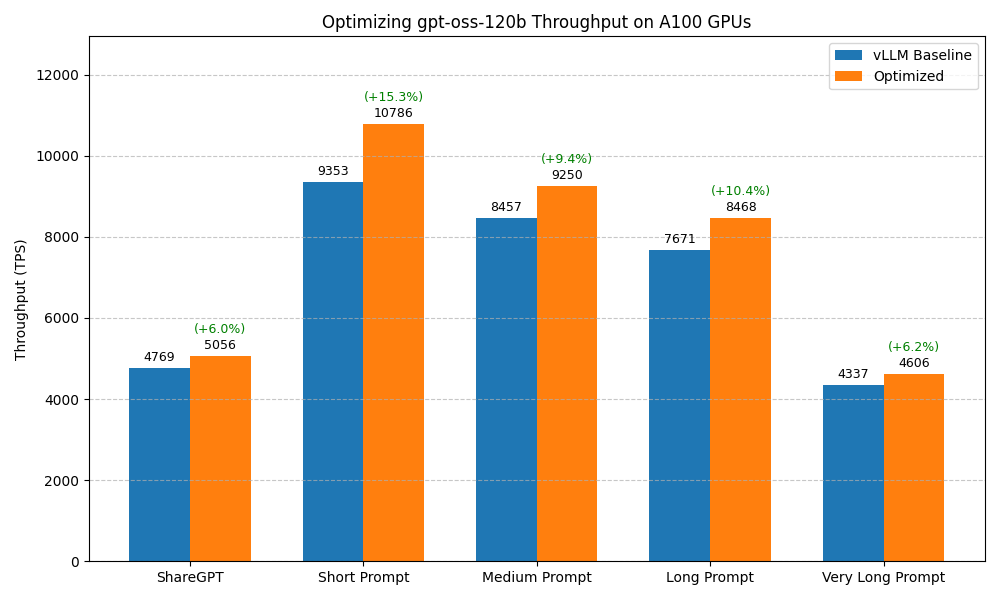

# Optimizing GPT-OSS-120B Throughput on NVIDIA A100 GPUs


## Conclusion



Recommended configuration for maximizing throughput of GPT-OSS-120B on A100 GPUs:

???+ tip "Serving Command"
    ```bash
    vllm serve openai/gpt-oss-120b --max-model-len 32768 --async-scheduling --max-num-batched-tokens 4096
    ```

Comparison of benchmark results before and after optimization:

| Benchmark Case | baseline (vLLM without any optimizations) | Optimized |
|----------|-------------------------------------------|-----------|
| **ShareGPT** | Total TPS: 4768.75<br>Mean TPOT(ms): 97.57 | Total TPS: 5055.82 <span style="background-color:lightgreen;">(+6.0%)</span><br>Mean TPOT(ms): 94.55 |
| **Short Prompt** | Total TPS: 9353.12<br>Mean TPOT(ms): 182.75 | Total TPS: 10785.60 <span style="background-color:lightgreen;">(+15.3%)</span><br>Mean TPOT(ms): 301.66 |
| **Medium Prompt** | Total TPS: 8456.65<br>Mean TPOT(ms): 131.94 | Total TPS: 9249.89 <span style="background-color:lightgreen;">(+9.4%)</span><br>Mean TPOT(ms): 117.85 |
| **Long Prompt** | Total TPS: 7671.00<br>Mean TPOT(ms): 112.18 | Total TPS: 8468.21 <span style="background-color:lightgreen;">(+10.4%)</span><br>Mean TPOT(ms): 99.77 |
| **Very Long Prompt** | Total TPS: 4337.21<br>Mean TPOT(ms): 224.58 | Total TPS: 4605.91 <span style="background-color:lightgreen;">(+6.2%/GPU)</span><br>Mean TPOT(ms): 201.61 |
| **ShareGPT batch size 4** | Total TPS: 671.05<br>Mean TTFT(ms): 61.91<br>Mean TPOT(ms): 11.67 | Total TPS: 708.71<span style="background-color:lightgreen;">(+5.6%)</span><br>Mean TTFT(ms): 71.15<span style="background-color:#fbcaca;">(+14.9%)</span><br>Mean TPOT(ms): 11.03<span style="background-color:lightgreen;">(-5.5%)</span> |


!!! note
    1. Our benchmark tests do not cover all possible optimization combinations. For example, we select the inference engine that performs best under its default configuration as the starting point for further tuning. This pruning approach yields a local optimum, which may not be the global optimum.
    2. There are other optimization methods that depend on specific user scenarios, including max batch size, schedule configuration, extended KV cache, CUDA graph, Torch Compile, etc. The conclusions in this document can serve as a starting point for more targeted optimizations.
    3. The tests are conducted on specific hardware and software setups. Advances in the inference engine may lead to new conclusions.

If there are any missing points or updates reflecting new changes, please [let us know](https://github.com/gpustack/gpustack/issues/new/choose).


## Optimization Objective

Achieve high throughput under high-concurrency request scenarios.

## Experimental Setup

### Model

GPT-OSS-120B

### Hardware

NVIDIA A100 GPUs

### Engine Version

- vLLM: v0.11.0
- SGLang: v0.5.3
- TensorRT-LLM: v1.2.0rc0

### Benchmark Dataset

1. ShareGPT
2. Random dataset with varying sequence lengths:
    - Very long prompt: 32000 input tokens, 100 output tokens
    - Long prompt: 4000 input tokens, 200 output tokens
    - Medium prompt: 2000 input tokens, 100 output tokens
    - Short prompt: 128 input tokens, 4 output tokens

### Benchmark Script

We use the **vLLM bench CLI** tool to benchmark the model performance. The following command is used to run the benchmark:

```bash
# Prepare the ShareGPT dataset
wget https://huggingface.co/datasets/anon8231489123/ShareGPT_Vicuna_unfiltered/resolve/main/ShareGPT_V3_unfiltered_cleaned_split.json

# Benchmark on ShareGPT dataset
vllm bench serve --model openai/gpt-oss-120b --backend openai-chat --endpoint /v1/chat/completions --dataset-name sharegpt --dataset-path ShareGPT_V3_unfiltered_cleaned_split.json --num-prompts 1000

# Benchmark on random dataset (fixed seed for reproducibility)
vllm bench serve --model openai/gpt-oss-120b --backend openai-chat --endpoint /v1/chat/completions --dataset-name random --random-input-len 4000 --random-output-len 200 --num-prompts 500 --seed 42
```

## Experiment Results

### 1. Choosing the Inference Engine

vLLM
??? info "Serving script"
    ```bash
    vllm serve openai/gpt-oss-120b --max-model-len 32768
    ```

??? info "Benchmark result"
    ```
    ============ Serving Benchmark Result ============
    Successful requests:                     1000
    Benchmark duration (s):                  86.39
    Total input tokens:                      215312
    Total generated tokens:                  196656
    Request throughput (req/s):              11.58
    Output token throughput (tok/s):         2276.40
    Peak output token throughput (tok/s):    3572.00
    Peak concurrent requests:                1000.00
    Total Token throughput (tok/s):          4768.75
    ---------------Time to First Token----------------
    Mean TTFT (ms):                          25918.79
    Median TTFT (ms):                        24822.43
    P99 TTFT (ms):                           59731.55
    -----Time per Output Token (excl. 1st token)------
    Mean TPOT (ms):                          97.57
    Median TPOT (ms):                        90.70
    P99 TPOT (ms):                           206.31
    ---------------Inter-token Latency----------------
    Mean ITL (ms):                           86.67
    Median ITL (ms):                         70.10
    P99 ITL (ms):                            210.76
    ==================================================
    ```

SGLang
??? info "Serving script"
    ```bash
    python3 -m sglang.launch_server --model-path openai/gpt-oss-120b --host 0.0.0.0 --port 8000 
    ```

??? info "Benchmark result"
    ```
    ============ Serving Benchmark Result ============
    Successful requests:                     1000
    Benchmark duration (s):                  597.93
    Total input tokens:                      215312
    Total generated tokens:                  197133
    Request throughput (req/s):              1.67
    Output token throughput (tok/s):         329.69
    Peak output token throughput (tok/s):    1865.00
    Peak concurrent requests:                1000.00
    Total Token throughput (tok/s):          689.79
    ---------------Time to First Token----------------
    Mean TTFT (ms):                          275030.66
    Median TTFT (ms):                        270126.72
    P99 TTFT (ms):                           550929.50
    -----Time per Output Token (excl. 1st token)------
    Mean TPOT (ms):                          765.78
    Median TPOT (ms):                        486.18
    P99 TPOT (ms):                           6656.59
    ---------------Inter-token Latency----------------
    Mean ITL (ms):                           458.97
    Median ITL (ms):                         112.65
    P99 ITL (ms):                            6667.80
    ==================================================
    ```

TensorRT-LLM
??? info "Serving script"
    ```bash
    trtllm-serve openai/gpt-oss-120b --max_seq_len 32768
    ```

??? info "Benchmark result"
    ```
    NotImplementedError: WFP4A16 MoE is unsupported on SM80.
    ```
Result: vLLM (4768.75 tok/s) > SGLang(689.79 tok/s) > TensorRT-LLM (Not supported)

### 2. Async scheduling in vLLM

??? info "Serving script"
    ```bash
    vllm serve openai/gpt-oss-120b --max-model-len 32768 --async-scheduling
    ```

??? info "Benchmark result"
    ```
    ============ Serving Benchmark Result ============
    Successful requests:                     1000
    Benchmark duration (s):                  82.35
    Total input tokens:                      215312
    Total generated tokens:                  195312
    Request throughput (req/s):              12.14
    Output token throughput (tok/s):         2371.67
    Peak output token throughput (tok/s):    3615.00
    Peak concurrent requests:                1000.00
    Total Token throughput (tok/s):          4986.20
    ---------------Time to First Token----------------
    Mean TTFT (ms):                          24787.19
    Median TTFT (ms):                        23575.09
    P99 TTFT (ms):                           56631.39
    -----Time per Output Token (excl. 1st token)------
    Mean TPOT (ms):                          92.70
    Median TPOT (ms):                        86.19
    P99 TPOT (ms):                           203.05
    ---------------Inter-token Latency----------------
    Mean ITL (ms):                           82.31
    Median ITL (ms):                         65.76
    P99 ITL (ms):                            205.68
    ==================================================
    ```
Result: Throughput improved from 4768.75 tok/s to 4986.20 tok/s by enabling async scheduling.

### 3. Parallelism in vLLM

TP2
??? info "Serving script"
    ```bash
    vllm serve openai/gpt-oss-120b --max-model-len 32768 --async-scheduling -tp 2
    ```

??? info "Benchmark result"
    ```
    ============ Serving Benchmark Result ============
    Successful requests:                     1000
    Benchmark duration (s):                  52.10
    Total input tokens:                      215312
    Total generated tokens:                  196156
    Request throughput (req/s):              19.19
    Output token throughput (tok/s):         3765.02
    Peak output token throughput (tok/s):    5687.00
    Peak concurrent requests:                1000.00
    Total Token throughput (tok/s):          7897.72
    ---------------Time to First Token----------------
    Mean TTFT (ms):                          16190.50
    Median TTFT (ms):                        15435.84
    P99 TTFT (ms):                           36099.41
    -----Time per Output Token (excl. 1st token)------
    Mean TPOT (ms):                          57.98
    Median TPOT (ms):                        53.39
    P99 TPOT (ms):                           132.88
    ---------------Inter-token Latency----------------
    Mean ITL (ms):                           51.20
    Median ITL (ms):                         40.51
    P99 ITL (ms):                            134.62
    ==================================================
    ```

### 4. Attention Backend in vLLM

FlashAttention is the default.

FlashInfer
??? info "Serving script"
    ```bash
    VLLM_ATTENTION_BACKEND=FLASHINFER vllm serve openai/gpt-oss-120b --max-model-len 32768
    ```

??? info "Benchmark result"
    ```
    RuntimeError: Worker failed with error 'FlashInfer backend currently does not support attention sinks, please use trtllm on blackwell or flash attention on earlier GPUs.', please check the stack trace above for the root cause
    ```

### 5. Chunked Prefill in vLLM

??? info "Serving script"
    ```bash
    vllm serve openai/gpt-oss-120b --max-model-len 32768 --async-scheduling --max-num-batched-tokens 4096
    ```

??? info "Benchmark result"
    ```
    # --max-num-batched-tokens 4096
    ============ Serving Benchmark Result ============
    Successful requests:                     1000
    Benchmark duration (s):                  81.24
    Total input tokens:                      215312
    Total generated tokens:                  195400
    Request throughput (req/s):              12.31
    Output token throughput (tok/s):         2405.35
    Peak output token throughput (tok/s):    3767.00
    Peak concurrent requests:                1000.00
    Total Token throughput (tok/s):          5055.82
    ---------------Time to First Token----------------
    Mean TTFT (ms):                          24102.33
    Median TTFT (ms):                        23200.31
    P99 TTFT (ms):                           55834.89
    -----Time per Output Token (excl. 1st token)------
    Mean TPOT (ms):                          94.55
    Median TPOT (ms):                        84.96
    P99 TPOT (ms):                           332.44
    ---------------Inter-token Latency----------------
    Mean ITL (ms):                           81.69
    Median ITL (ms):                         65.37
    P99 ITL (ms):                            263.32
    ==================================================
    # --max-num-batched-tokens 8192
    ============ Serving Benchmark Result ============
    Successful requests:                     1000
    Benchmark duration (s):                  81.65
    Total input tokens:                      215312
    Total generated tokens:                  196734
    Request throughput (req/s):              12.25
    Output token throughput (tok/s):         2409.38
    Peak output token throughput (tok/s):    4073.00
    Peak concurrent requests:                1000.00
    Total Token throughput (tok/s):          5046.28
    ---------------Time to First Token----------------
    Mean TTFT (ms):                          24118.79
    Median TTFT (ms):                        22914.78
    P99 TTFT (ms):                           56155.47
    -----Time per Output Token (excl. 1st token)------
    Mean TPOT (ms):                          95.68
    Median TPOT (ms):                        85.26
    P99 TPOT (ms):                           379.93
    ---------------Inter-token Latency----------------
    Mean ITL (ms):                           81.81
    Median ITL (ms):                         65.77
    P99 ITL (ms):                            232.43
    ==================================================
    ```
Result: Throughput improved from 4986.20 tok/s to 5046.28 tok/s when increasing max-num-batched-tokens.

### Summary of Optimization Options
| Optimization Option               | Throughput Improvement               |
|-----------------------------|-------------------------------------|
| Engine Selection            | -                                   |
| Async Scheduling            | <span style="background-color:lightgreen;">+4.6%</span>                               |
| Parallelism                 | -                              |
| Attention Backend           | -                                   |
| Chunked Prefill             | <span style="background-color:lightgreen;">+1.2%</span>                                   |

### Other Benchmark Cases

We further benchmarked the optimized configuration to evaluate its generalization under various workloads.

??? info "Baseline serving script"
    ```bash
    vllm serve openai/gpt-oss-120b --max-model-len 32768
    ```

??? info "Baseline benchmark results"
    ```bash
    # random 32K input
    ============ Serving Benchmark Result ============
    Successful requests:                     100
    Benchmark duration (s):                  740.10
    Total input tokens:                      3200000
    Total generated tokens:                  9988
    Request throughput (req/s):              0.14
    Output token throughput (tok/s):         13.50
    Peak output token throughput (tok/s):    176.00
    Peak concurrent requests:                100.00
    Total Token throughput (tok/s):          4337.21
    ---------------Time to First Token----------------
    Mean TTFT (ms):                          368856.64
    Median TTFT (ms):                        368713.30
    P99 TTFT (ms):                           730947.33
    -----Time per Output Token (excl. 1st token)------
    Mean TPOT (ms):                          224.58
    Median TPOT (ms):                        228.19
    P99 TPOT (ms):                           231.28
    ---------------Inter-token Latency----------------
    Mean ITL (ms):                           233.21
    Median ITL (ms):                         24.23
    P99 ITL (ms):                            676.79
    ==================================================

    # random 4K input
    ============ Serving Benchmark Result ============
    Successful requests:                     500
    Benchmark duration (s):                  269.39
    Total input tokens:                      1999249
    Total generated tokens:                  67259
    Request throughput (req/s):              1.86
    Output token throughput (tok/s):         249.67
    Peak output token throughput (tok/s):    1146.00
    Peak concurrent requests:                500.00
    Total Token throughput (tok/s):          7671.00
    ---------------Time to First Token----------------
    Mean TTFT (ms):                          133561.13
    Median TTFT (ms):                        134006.62
    P99 TTFT (ms):                           263106.36
    -----Time per Output Token (excl. 1st token)------
    Mean TPOT (ms):                          112.18
    Median TPOT (ms):                        114.77
    P99 TPOT (ms):                           136.26
    ---------------Inter-token Latency----------------
    Mean ITL (ms):                           117.62
    Median ITL (ms):                         27.99
    P99 ITL (ms):                            353.98
    ==================================================

    # random 2K input
    ============ Serving Benchmark Result ============
    Successful requests:                     500
    Benchmark duration (s):                  123.94
    Total input tokens:                      999120
    Total generated tokens:                  48981
    Request throughput (req/s):              4.03
    Output token throughput (tok/s):         395.21
    Peak output token throughput (tok/s):    1696.00
    Peak concurrent requests:                500.00
    Total Token throughput (tok/s):          8456.65
    ---------------Time to First Token----------------
    Mean TTFT (ms):                          61328.02
    Median TTFT (ms):                        61764.97
    P99 TTFT (ms):                           120670.44
    -----Time per Output Token (excl. 1st token)------
    Mean TPOT (ms):                          131.94
    Median TPOT (ms):                        138.30
    P99 TPOT (ms):                           150.84
    ---------------Inter-token Latency----------------
    Mean ITL (ms):                           139.51
    Median ITL (ms):                         214.02
    P99 ITL (ms):                            432.26
    ==================================================

    # random 128 input
    ============ Serving Benchmark Result ============
    Successful requests:                     1000
    Benchmark duration (s):                  14.09
    Total input tokens:                      127755
    Total generated tokens:                  4000
    Request throughput (req/s):              70.99
    Output token throughput (tok/s):         283.95
    Peak output token throughput (tok/s):    273.00
    Peak concurrent requests:                1000.00
    Total Token throughput (tok/s):          9353.12
    ---------------Time to First Token----------------
    Mean TTFT (ms):                          7813.18
    Median TTFT (ms):                        7750.58
    P99 TTFT (ms):                           13935.99
    -----Time per Output Token (excl. 1st token)------
    Mean TPOT (ms):                          182.75
    Median TPOT (ms):                        189.53
    P99 TPOT (ms):                           193.12
    ---------------Inter-token Latency----------------
    Mean ITL (ms):                           274.25
    Median ITL (ms):                         196.02
    P99 ITL (ms):                            386.54
    ==================================================

    # ShareGPT batch size 4
    ============ Serving Benchmark Result ============
    Successful requests:                     100
    Maximum request concurrency:             4
    Benchmark duration (s):                  66.52
    Total input tokens:                      22946
    Total generated tokens:                  21691
    Request throughput (req/s):              1.50
    Output token throughput (tok/s):         326.09
    Peak output token throughput (tok/s):    368.00
    Peak concurrent requests:                11.00
    Total Token throughput (tok/s):          671.05
    ---------------Time to First Token----------------
    Mean TTFT (ms):                          61.91
    Median TTFT (ms):                        61.55
    P99 TTFT (ms):                           112.05
    -----Time per Output Token (excl. 1st token)------
    Mean TPOT (ms):                          11.67
    Median TPOT (ms):                        11.44
    P99 TPOT (ms):                           15.03
    ---------------Inter-token Latency----------------
    Mean ITL (ms):                           11.74
    Median ITL (ms):                         11.14
    P99 ITL (ms):                            38.75
    ==================================================  
    ```

??? info "Optimized serving script"
    ```bash
    vllm serve openai/gpt-oss-120b --max-model-len 32768 --async-scheduling --max-num-batched-tokens 4096
    ```

??? info "Optimized benchmark results"
    ```bash
    # random 32K input
    ============ Serving Benchmark Result ============
    Successful requests:                     100
    Benchmark duration (s):                  696.89
    Total input tokens:                      3200000
    Total generated tokens:                  9828
    Request throughput (req/s):              0.14
    Output token throughput (tok/s):         14.10
    Peak output token throughput (tok/s):    196.00
    Peak concurrent requests:                100.00
    Total Token throughput (tok/s):          4605.91
    ---------------Time to First Token----------------
    Mean TTFT (ms):                          346799.49
    Median TTFT (ms):                        346737.12
    P99 TTFT (ms):                           687309.14
    -----Time per Output Token (excl. 1st token)------
    Mean TPOT (ms):                          201.61
    Median TPOT (ms):                        203.58
    P99 TPOT (ms):                           271.48
    ---------------Inter-token Latency----------------
    Mean ITL (ms):                           209.02
    Median ITL (ms):                         20.50
    P99 ITL (ms):                            1206.69
    ==================================================

    # random 4K input
    ============ Serving Benchmark Result ============
    Successful requests:                     500
    Benchmark duration (s):                  244.13
    Total input tokens:                      1999249
    Total generated tokens:                  68059
    Request throughput (req/s):              2.05
    Output token throughput (tok/s):         278.79
    Peak output token throughput (tok/s):    1289.00
    Peak concurrent requests:                500.00
    Total Token throughput (tok/s):          8468.21
    ---------------Time to First Token----------------
    Mean TTFT (ms):                          121158.11
    Median TTFT (ms):                        121158.59
    P99 TTFT (ms):                           238837.53
    -----Time per Output Token (excl. 1st token)------
    Mean TPOT (ms):                          99.77
    Median TPOT (ms):                        102.46
    P99 TPOT (ms):                           122.61
    ---------------Inter-token Latency----------------
    Mean ITL (ms):                           104.98
    Median ITL (ms):                         25.69
    P99 ITL (ms):                            397.17
    ==================================================

    # random 2K input
    ============ Serving Benchmark Result ============
    Successful requests:                     500
    Benchmark duration (s):                  113.32
    Total input tokens:                      999120
    Total generated tokens:                  49103
    Request throughput (req/s):              4.41
    Output token throughput (tok/s):         433.30
    Peak output token throughput (tok/s):    1893.00
    Peak concurrent requests:                500.00
    Total Token throughput (tok/s):          9249.89
    ---------------Time to First Token----------------
    Mean TTFT (ms):                          55458.38
    Median TTFT (ms):                        56144.82
    P99 TTFT (ms):                           110079.18
    -----Time per Output Token (excl. 1st token)------
    Mean TPOT (ms):                          117.85
    Median TPOT (ms):                        125.32
    P99 TPOT (ms):                           135.13
    ---------------Inter-token Latency----------------
    Mean ITL (ms):                           125.08
    Median ITL (ms):                         31.45
    P99 ITL (ms):                            575.36
    ==================================================

    # random 128 input
    ============ Serving Benchmark Result ============
    Successful requests:                     1000
    Benchmark duration (s):                  12.22
    Total input tokens:                      127755
    Total generated tokens:                  4000
    Request throughput (req/s):              81.86
    Output token throughput (tok/s):         327.44
    Peak output token throughput (tok/s):    360.00
    Peak concurrent requests:                1000.00
    Total Token throughput (tok/s):          10785.60
    ---------------Time to First Token----------------
    Mean TTFT (ms):                          6900.44
    Median TTFT (ms):                        6888.59
    P99 TTFT (ms):                           11990.00
    -----Time per Output Token (excl. 1st token)------
    Mean TPOT (ms):                          301.66
    Median TPOT (ms):                        320.19
    P99 TPOT (ms):                           323.93
    ---------------Inter-token Latency----------------
    Mean ITL (ms):                           452.71
    Median ITL (ms):                         327.62
    P99 ITL (ms):                            652.15
    ==================================================

    # ShareGPT batch size 4
    ============ Serving Benchmark Result ============
    Successful requests:                     100
    Maximum request concurrency:             4
    Benchmark duration (s):                  62.98
    Total input tokens:                      22946
    Total generated tokens:                  21691
    Request throughput (req/s):              1.59
    Output token throughput (tok/s):         344.39
    Peak output token throughput (tok/s):    387.00
    Peak concurrent requests:                11.00
    Total Token throughput (tok/s):          708.71
    ---------------Time to First Token----------------
    Mean TTFT (ms):                          71.15
    Median TTFT (ms):                        70.23
    P99 TTFT (ms):                           131.39
    -----Time per Output Token (excl. 1st token)------
    Mean TPOT (ms):                          11.03
    Median TPOT (ms):                        10.78
    P99 TPOT (ms):                           15.48
    ---------------Inter-token Latency----------------
    Mean ITL (ms):                           11.07
    Median ITL (ms):                         10.49
    P99 ITL (ms):                            36.80
    ==================================================
    ```
