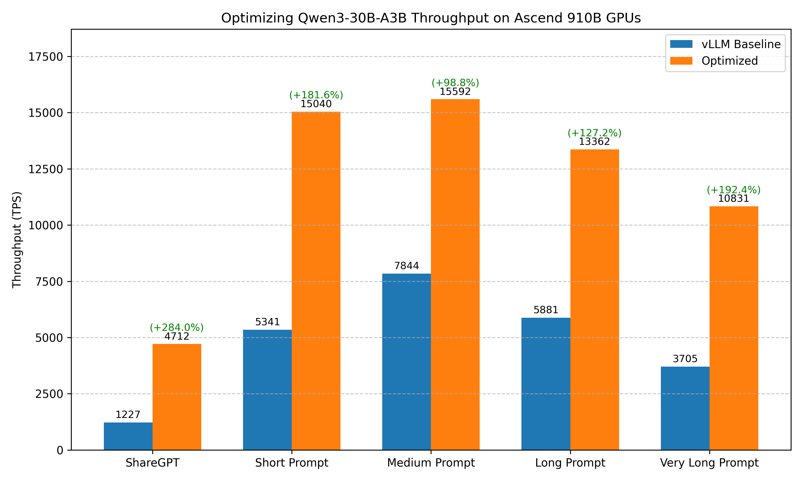

# Optimizing Qwen3-30B-A3B Throughput on ASCEND 910B NPUs

## Conclusion



Recommended configuration for optimizing throughput of Qwen3-30B-A3B on ASCEND 910B NPUs:

???+ tip "Serving Command"
    ```bash
    # This is a simplified vLLM-like command. GPUStack maps arguments to the
    # corresponding MindIE JSON configuration and runs with mindieservice_daemon.
    mindie serve Qwen/Qwen3-30B-A3B
    ```

Comparison of benchmark results before and after optimization:

| Benchmark Case | baseline (vLLM without any optimizations) | Optimized |
|----------|-------------------------------------------|-----------|
| **ShareGPT** | Total TPS: 1227.19<br>Mean TPOT(ms): 318.03 | Total TPS: 4712.47 <span style="background-color:lightgreen;">(+284.0%)</span><br>Mean TPOT(ms): 964.45 |
| **Short Prompt** | Total TPS: 5340.68<br>Mean TPOT(ms): 312.49 | Total TPS: 15040.15 <span style="background-color:lightgreen;">(+181.6%)</span><br>Mean TPOT(ms): 1249.72 |
| **Medium Prompt** | Total TPS: 7843.85<br>Mean TPOT(ms): 344.86 | Total TPS: 15591.71 <span style="background-color:lightgreen;">(+98.8%)</span><br>Mean TPOT(ms): 194.54 |
| **Long Prompt** | Total TPS: 5881.36<br>Mean TPOT(ms): 277.5 | Total TPS: 13362.49 <span style="background-color:lightgreen;">(+127.2%)</span><br>Mean TPOT(ms): 130.97 |
| **Very Long Prompt** | Total TPS: 3704.57<br>Mean TPOT(ms): 503.84 | Total TPS: 10830.52 <span style="background-color:lightgreen;">(+192.4%)</span><br>Mean TPOT(ms): 242.08 |


!!! note
    1. Our benchmark tests do not cover all possible optimization combinations. For example, we select the inference engine that performs best under its default configuration as the starting point for further tuning. This pruning approach yields a local optimum, which may not be the global optimum.
    2. There are other optimization methods that depend on specific user scenarios, including max batch size, schedule configuration, extended KV cache, CUDA graph, Torch Compile, etc. The conclusions in this document can serve as a starting point for more targeted optimizations.
    3. The tests are conducted on specific hardware and software setups. Advances in the inference engine may lead to new conclusions.

If there are any missing points or updates reflecting new changes, please [let us know](https://github.com/gpustack/gpustack/issues/new/choose).

## Optimization Objective

Achieve high throughput under high-concurrency request scenarios.

## Experimental Setup

### Model

Qwen/Qwen3-30B-A3B

### Hardware

A single Ascend 910B NPU.

### Engine Version

- vLLM-Ascend: v0.9.1
- MindIE: 2.1RC1

### Benchmark Dataset

1. ShareGPT
2. Random dataset with varying sequence lengths:
    - Very long prompt: 32000 input tokens, 100 output tokens
    - Long prompt: 4000 input tokens, 200 output tokens
    - Medium prompt: 2000 input tokens, 100 output tokens
    - Short prompt: 128 input tokens, 4 output tokens

### Benchmark Script

We use the **vLLM bench CLI** tool to benchmark the model performance. The following command is used to run the benchmark:

```bash
# Prepare the ShareGPT dataset
wget https://huggingface.co/datasets/anon8231489123/ShareGPT_Vicuna_unfiltered/resolve/main/ShareGPT_V3_unfiltered_cleaned_split.json

# Benchmark on ShareGPT dataset
vllm bench serve --model Qwen/Qwen3-30B-A3B --backend openai-chat --endpoint /v1/chat/completions --dataset-name sharegpt --dataset-path ShareGPT_V3_unfiltered_cleaned_split.json --num-prompts 1000

# Benchmark on random dataset (fixed seed for reproducibility)
vllm bench serve --model Qwen/Qwen3-30B-A3B --backend openai-chat --endpoint /v1/chat/completions --dataset-name random --random-input-len 4000 --random-output-len 200 --num-prompts 500 --seed 42
```

## Experiment Results

### 1. Choosing the Inference Engine

vLLM
??? info "Serving script"
    ```bash
    vllm serve Qwen/Qwen3-30B-A3B -tp 2
    ```

??? info "Benchmark result"
    ```
    ============ Serving Benchmark Result ============
    Successful requests:                     1000
    Benchmark duration (s):                  341.49
    Total input tokens:                      217393
    Total generated tokens:                  201675
    Request throughput (req/s):              2.93
    Output token throughput (tok/s):         590.58
    Peak output token throughput (tok/s):    1283.00
    Peak concurrent requests:                1000.00
    Total Token throughput (tok/s):          1227.19
    ---------------Time to First Token----------------
    Mean TTFT (ms):                          91791.47
    Median TTFT (ms):                        85430.73
    P99 TTFT (ms):                           217017.19
    -----Time per Output Token (excl. 1st token)------
    Mean TPOT (ms):                          318.03
    Median TPOT (ms):                        326.12
    P99 TPOT (ms):                           376.59
    ---------------Inter-token Latency----------------
    Mean ITL (ms):                           302.02
    Median ITL (ms):                         245.14
    P99 ITL (ms):                            557.35
    ==================================================
    ```

MindIE
??? info "Serving script"
    ```bash
    # This is a simplified vLLM-like command. GPUStack maps arguments to the
    # corresponding MindIE JSON configuration and runs with mindieservice_daemon.
    mindie serve Qwen3-30B-A3B
    ```

??? info "Benchmark result"
    ```
    ============ Serving Benchmark Result ============
    Successful requests:                     1000
    Benchmark duration (s):                  88.95
    Total input tokens:                      217393
    Total generated tokens:                  201779
    Request throughput (req/s):              11.24
    Output token throughput (tok/s):         2268.46
    Peak output token throughput (tok/s):    3394.00
    Peak concurrent requests:                1000.00
    Total Token throughput (tok/s):          4712.47
    ---------------Time to First Token----------------
    Mean TTFT (ms):                          6315.01
    Median TTFT (ms):                        6421.94
    P99 TTFT (ms):                           11305.60
    -----Time per Output Token (excl. 1st token)------
    Mean TPOT (ms):                          964.45
    Median TPOT (ms):                        242.38
    P99 TPOT (ms):                           8546.71
    ---------------Inter-token Latency----------------
    Mean ITL (ms):                           183.79
    Median ITL (ms):                         60.42
    P99 ITL (ms):                            74.07
    ==================================================
    ```

Result: MineIE (4712.47 tok/s) > vLLM (1227.19 tok/s)

### 2. Enable Prefix Cache in MindIE

??? info "Serving script"
    ```bash
    # This is a simplified vLLM-like command. GPUStack maps arguments to the
    # corresponding MindIE JSON configuration and runs with mindieservice_daemon.
    mindie serve Qwen3-30B-A3B --enable-prefix-caching
    ```

??? info "Benchmark result"
    ```
    # Crash, not supported for the model
    ```

### 3. Quantization in MindIE

??? info "Serving script"
    ```bash
    # This is a simplified vLLM-like command. GPUStack maps arguments to the
    # corresponding MindIE JSON configuration and runs with mindieservice_daemon.
    mindie serve vllm-ascend/Qwen3-8B-W8A8
    ```

??? info "Benchmark result"
    ```
    ============ Serving Benchmark Result ============
    Successful requests:                     1000
    Benchmark duration (s):                  92.29
    Total input tokens:                      217393
    Total generated tokens:                  201586
    Request throughput (req/s):              10.84
    Output token throughput (tok/s):         2184.30
    Peak output token throughput (tok/s):    3392.00
    Peak concurrent requests:                1000.00
    Total Token throughput (tok/s):          4539.88
    ---------------Time to First Token----------------
    Mean TTFT (ms):                          5588.80
    Median TTFT (ms):                        4708.65
    P99 TTFT (ms):                           18446.14
    -----Time per Output Token (excl. 1st token)------
    Mean TPOT (ms):                          988.22
    Median TPOT (ms):                        240.48
    P99 TPOT (ms):                           11241.85
    ---------------Inter-token Latency----------------
    Mean ITL (ms):                           195.17
    Median ITL (ms):                         62.16
    P99 ITL (ms):                            226.37
    ==================================================
    ```

### Summary of Optimization Options
| Optimization Option               | Throughput Improvement               |
|-----------------------------|-------------------------------------|
| Engine Selection            | <span style="background-color:lightgreen;">+284.0%</span>                                   |
| Prefix Caching            | -                               |
| Quantization                 | -                              |

### Other Benchmark Cases

We further benchmarked the optimized configuration to evaluate its generalization under various workloads.

??? info "Baseline serving script"
    ```bash
    vllm serve Qwen/Qwen3-30B-A3B -tp 2
    ```

??? info "Baseline benchmark results"
    ```bash
    # random 32K input
    ============ Serving Benchmark Result ============
    Successful requests:                     100
    Benchmark duration (s):                  866.50
    Total input tokens:                      3200000
    Total generated tokens:                  10000
    Request throughput (req/s):              0.12
    Output token throughput (tok/s):         11.54
    Peak output token throughput (tok/s):    117.00
    Peak concurrent requests:                100.00
    Total Token throughput (tok/s):          3704.57
    ---------------Time to First Token----------------
    Mean TTFT (ms):                          442404.81
    Median TTFT (ms):                        440136.40
    P99 TTFT (ms):                           853640.24
    -----Time per Output Token (excl. 1st token)------
    Mean TPOT (ms):                          503.84
    Median TPOT (ms):                        498.47
    P99 TPOT (ms):                           998.84
    ---------------Inter-token Latency----------------
    Mean ITL (ms):                           498.80
    Median ITL (ms):                         125.10
    P99 ITL (ms):                            177.10
    ==================================================

    # random 4K input
    ============ Serving Benchmark Result ============
    Successful requests:                     500
    Benchmark duration (s):                  357.03
    Total input tokens:                      2000000
    Total generated tokens:                  99842
    Request throughput (req/s):              1.40
    Output token throughput (tok/s):         279.64
    Peak output token throughput (tok/s):    864.00
    Peak concurrent requests:                500.00
    Total Token throughput (tok/s):          5881.36
    ---------------Time to First Token----------------
    Mean TTFT (ms):                          156755.15
    Median TTFT (ms):                        163311.37
    P99 TTFT (ms):                           314736.64
    -----Time per Output Token (excl. 1st token)------
    Mean TPOT (ms):                          277.51
    Median TPOT (ms):                        273.18
    P99 TPOT (ms):                           452.09
    ---------------Inter-token Latency----------------
    Mean ITL (ms):                           276.20
    Median ITL (ms):                         243.71
    P99 ITL (ms):                            499.20
    ==================================================

    # random 2K input
    ============ Serving Benchmark Result ============
    Successful requests:                     500
    Benchmark duration (s):                  133.86
    Total input tokens:                      1000000
    Total generated tokens:                  50000
    Request throughput (req/s):              3.74
    Output token throughput (tok/s):         373.52
    Peak output token throughput (tok/s):    1080.00
    Peak concurrent requests:                500.00
    Total Token throughput (tok/s):          7843.85
    ---------------Time to First Token----------------
    Mean TTFT (ms):                          56434.48
    Median TTFT (ms):                        62622.42
    P99 TTFT (ms):                           117368.72
    -----Time per Output Token (excl. 1st token)------
    Mean TPOT (ms):                          344.86
    Median TPOT (ms):                        350.15
    P99 TPOT (ms):                           667.15
    ---------------Inter-token Latency----------------
    Mean ITL (ms):                           341.55
    Median ITL (ms):                         240.26
    P99 ITL (ms):                            1189.67
    ==================================================

    # random 128 input
    ============ Serving Benchmark Result ============
    Successful requests:                     1000
    Benchmark duration (s):                  24.72
    Total input tokens:                      128000
    Total generated tokens:                  4000
    Request throughput (req/s):              40.46
    Output token throughput (tok/s):         161.84
    Peak output token throughput (tok/s):    768.00
    Peak concurrent requests:                1000.00
    Total Token throughput (tok/s):          5340.68
    ---------------Time to First Token----------------
    Mean TTFT (ms):                          19130.06
    Median TTFT (ms):                        17860.56
    P99 TTFT (ms):                           23751.62
    -----Time per Output Token (excl. 1st token)------
    Mean TPOT (ms):                          312.49
    Median TPOT (ms):                        308.02
    P99 TPOT (ms):                           338.42
    ---------------Inter-token Latency----------------
    Mean ITL (ms):                           234.36
    Median ITL (ms):                         269.04
    P99 ITL (ms):                            465.28
    ==================================================

    # ShareGPT batch size 4
    ============ Serving Benchmark Result ============
    Successful requests:                     1000
    Maximum request concurrency:             4
    Benchmark duration (s):                  6271.85
    Total input tokens:                      217393
    Total generated tokens:                  201847
    Request throughput (req/s):              0.16
    Output token throughput (tok/s):         32.18
    Peak output token throughput (tok/s):    40.00
    Peak concurrent requests:                7.00
    Total Token throughput (tok/s):          66.84
    ---------------Time to First Token----------------
    Mean TTFT (ms):                          359.99
    Median TTFT (ms):                        357.20
    P99 TTFT (ms):                           445.74
    -----Time per Output Token (excl. 1st token)------
    Mean TPOT (ms):                          122.71
    Median TPOT (ms):                        122.70
    P99 TPOT (ms):                           134.22
    ---------------Inter-token Latency----------------
    Mean ITL (ms):                           122.00
    Median ITL (ms):                         120.56
    P99 ITL (ms):                            236.94
    ==================================================
    ```

??? info "Optimized serving script"
    ```bash
    # This is a simplified vLLM-like command. GPUStack maps arguments to the
    # corresponding MindIE JSON configuration and runs with mindieservice_daemon.
    mindie serve Qwen3-30B-A3B
    ```

??? info "Optimized benchmark results"
    ```bash
    # random 32K input
    ============ Serving Benchmark Result ============
    Successful requests:                     100
    Benchmark duration (s):                  296.36
    Total input tokens:                      3200000
    Total generated tokens:                  9693
    Request throughput (req/s):              0.34
    Output token throughput (tok/s):         32.71
    Peak output token throughput (tok/s):    330.00
    Peak concurrent requests:                100.00
    Total Token throughput (tok/s):          10830.52
    ---------------Time to First Token----------------
    Mean TTFT (ms):                          147133.58
    Median TTFT (ms):                        147851.57
    P99 TTFT (ms):                           289974.37
    -----Time per Output Token (excl. 1st token)------
    Mean TPOT (ms):                          242.08
    Median TPOT (ms):                        232.74
    P99 TPOT (ms):                           741.49
    ---------------Inter-token Latency----------------
    Mean ITL (ms):                           225.71
    Median ITL (ms):                         46.46
    P99 ITL (ms):                            56.81
    ==================================================

    # random 4K input
    ============ Serving Benchmark Result ============
    Successful requests:                     500
    Benchmark duration (s):                  157.15
    Total input tokens:                      2000000
    Total generated tokens:                  99961
    Request throughput (req/s):              3.18
    Output token throughput (tok/s):         636.07
    Peak output token throughput (tok/s):    2142.00
    Peak concurrent requests:                500.00
    Total Token throughput (tok/s):          13362.49
    ---------------Time to First Token----------------
    Mean TTFT (ms):                          70716.71
    Median TTFT (ms):                        74982.88
    P99 TTFT (ms):                           148427.09
    -----Time per Output Token (excl. 1st token)------
    Mean TPOT (ms):                          130.97
    Median TPOT (ms):                        134.98
    P99 TPOT (ms):                           208.16
    ---------------Inter-token Latency----------------
    Mean ITL (ms):                           130.95
    Median ITL (ms):                         63.84
    P99 ITL (ms):                            489.52
    ==================================================

    # random 2K input
    ============ Serving Benchmark Result ============
    Successful requests:                     500
    Benchmark duration (s):                  67.34
    Total input tokens:                      1000000
    Total generated tokens:                  49975
    Request throughput (req/s):              7.42
    Output token throughput (tok/s):         742.11
    Peak output token throughput (tok/s):    3000.00
    Peak concurrent requests:                500.00
    Total Token throughput (tok/s):          15591.71
    ---------------Time to First Token----------------
    Mean TTFT (ms):                          29078.68
    Median TTFT (ms):                        32203.66
    P99 TTFT (ms):                           62077.78
    -----Time per Output Token (excl. 1st token)------
    Mean TPOT (ms):                          194.54
    Median TPOT (ms):                        192.07
    P99 TPOT (ms):                           358.38
    ---------------Inter-token Latency----------------
    Mean ITL (ms):                           194.46
    Median ITL (ms):                         68.54
    P99 ITL (ms):                            4496.71
    ==================================================

    # random 128 input
    ============ Serving Benchmark Result ============
    Successful requests:                     1000
    Benchmark duration (s):                  8.78
    Total input tokens:                      128000
    Total generated tokens:                  4000
    Request throughput (req/s):              113.94
    Output token throughput (tok/s):         455.76
    Peak output token throughput (tok/s):    2511.00
    Peak concurrent requests:                1000.00
    Total Token throughput (tok/s):          15040.15
    ---------------Time to First Token----------------
    Mean TTFT (ms):                          4491.88
    Median TTFT (ms):                        4467.47
    P99 TTFT (ms):                           7693.24
    -----Time per Output Token (excl. 1st token)------
    Mean TPOT (ms):                          1249.72
    Median TPOT (ms):                        1258.92
    P99 TPOT (ms):                           2252.88
    ---------------Inter-token Latency----------------
    Mean ITL (ms):                           1249.72
    Median ITL (ms):                         54.67
    P99 ITL (ms):                            6378.56
    ==================================================

    # ShareGPT batch size 4
    ============ Serving Benchmark Result ============
    Successful requests:                     1000
    Maximum request concurrency:             4
    Benchmark duration (s):                  1292.33
    Total input tokens:                      217393
    Total generated tokens:                  201773
    Request throughput (req/s):              0.77
    Output token throughput (tok/s):         156.13
    Peak output token throughput (tok/s):    200.00
    Peak concurrent requests:                9.00
    Total Token throughput (tok/s):          324.35
    ---------------Time to First Token----------------
    Mean TTFT (ms):                          112.38
    Median TTFT (ms):                        111.05
    P99 TTFT (ms):                           154.06
    -----Time per Output Token (excl. 1st token)------
    Mean TPOT (ms):                          25.42
    Median TPOT (ms):                        24.47
    P99 TPOT (ms):                           35.05
    ---------------Inter-token Latency----------------
    Mean ITL (ms):                           25.08
    Median ITL (ms):                         23.05
    P99 ITL (ms):                            79.54
    ==================================================
    ```
