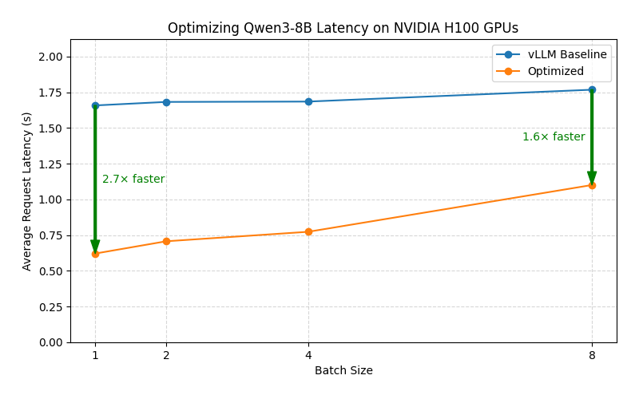

# Optimizing Qwen3-8B Latency on NVIDIA H100 GPUs

## Conclusion



Recommended configuration for optimizing latency of Qwen3-8B on H100 GPUs:

???+ tip "Serving Command"
    ```bash
    python3 -m sglang.launch_server \
        --model Qwen/Qwen3-8B-FP8 \
        --speculative-algorithm EAGLE3 \
        --speculative-draft-model-path Tengyunw/qwen3_8b_eagle3 \
        --speculative-num-steps 4 --speculative-eagle-topk 4 --speculative-num-draft-tokens 16
    ```

Comparison of benchmark results before and after optimization:

| Benchmark Case | Baseline (vLLM without any optimizations) | Optimized |
|----------|-------------------------------------------|-----------|
| **ShareGPT BS=1** | Mean latency: 1.66s/req | Mean latency: 0.62s/req <span style="background-color:lightgreen;">(2.7x faster)</span> |
| **ShareGPT BS=2** | Mean latency: 1.68s/req | Mean latency: 0.71s/req <span style="background-color:lightgreen;">(2.4x faster)</span> |
| **ShareGPT BS=4** | Mean latency: 1.68s/req | Mean latency: 0.77s/req <span style="background-color:lightgreen;">(2.2x faster)</span> |
| **ShareGPT BS=8** | Mean latency: 1.78s/req | Mean latency: 1.10s/req <span style="background-color:lightgreen;">(1.6x faster)</span> |


!!! note
    1. Our benchmark tests do not cover all possible optimization combinations. For example, we select the inference engine that performs best under its default configuration as the starting point for further tuning. This pruning approach yields a local optimum, which may not be the global optimum.
    2. There are other optimization methods that depend on specific user scenarios, including max batch size, schedule configuration, extended KV cache, CUDA graph, etc. The conclusions in this document can serve as a starting point for more targeted optimizations.
    3. The tests are conducted on specific hardware and software setups. Advances in the inference engine may lead to new conclusions.
    4. Although using quantization may impact accuracy. FP8 quantization can achieves less than 1% accuracy drop for most models. See the [evaluation results](https://github.com/Tencent/AngelSlim/blob/main/README_en.md#-benchmark) for more details. Therefore, it is highly recommended to use FP8 quantization for low-latency serving scenarios.
    5. Speculative decoding can significantly reduce latency for low-concurrency requests. However, the acceleration effect may vary depending on the data distribution of different benchmark datasets and the choice of draft models. For example, the chosen draft model here is trained on English data, which may lead to suboptimal performance on other languages.

If there are any missing points or updates reflecting new changes, please [let us know](https://github.com/gpustack/gpustack/issues/new/choose).

## Optimization Objective

Achieve low latency under low-concurrency (batch size < 8) request scenarios.

## Experimental Setup

### Model

Qwen/Qwen3-8B

### Hardware

NVIDIA H100 GPUs

### Engine Version

- vLLM: v0.11.0
- SGLang: v0.5.3.post3
- TensorRT-LLM: v1.2.0rc1

### Benchmark Dataset

ShareGPT

### Benchmark Script

We use the **vLLM bench CLI** tool to benchmark the model performance. The following command is used to run the benchmark:

```bash
# Prepare the ShareGPT dataset
wget https://huggingface.co/datasets/anon8231489123/ShareGPT_Vicuna_unfiltered/resolve/main/ShareGPT_V3_unfiltered_cleaned_split.json

# Benchmark on ShareGPT dataset
vllm bench serve --model Qwen/Qwen3-8B --backend openai-chat --endpoint /v1/chat/completions --dataset-name sharegpt --dataset-path ShareGPT_V3_unfiltered_cleaned_split.json --num-prompts 100 --max-concurrency 4
```

## Experiment Results

### 1. Choosing the Inference Engine

vLLM
??? info "Serving script"
    ```bash
    vllm serve Qwen/Qwen3-8B
    ```

??? info "Benchmark result"
    ```
    ============ Serving Benchmark Result ============
    Successful requests:                     100
    Maximum request concurrency:             4
    Benchmark duration (s):                  44.40
    Total input tokens:                      23260
    Total generated tokens:                  22061
    Request throughput (req/s):              2.25
    Output token throughput (tok/s):         496.88
    Peak output token throughput (tok/s):    540.00
    Peak concurrent requests:                13.00
    Total Token throughput (tok/s):          1020.76
    ---------------Time to First Token----------------
    Mean TTFT (ms):                          64.00
    Median TTFT (ms):                        60.26
    P99 TTFT (ms):                           98.59
    -----Time per Output Token (excl. 1st token)------
    Mean TPOT (ms):                          7.38
    Median TPOT (ms):                        7.40
    P99 TPOT (ms):                           7.96
    ---------------Inter-token Latency----------------
    Mean ITL (ms):                           7.78
    Median ITL (ms):                         7.37
    P99 ITL (ms):                            40.98
    ==================================================
    ```

SGLang
??? info "Serving script"
    ```bash
    python3 -m sglang.launch_server --model-path Qwen/Qwen3-8B
    ```

??? info "Benchmark result"
    ```
    ============ Serving Benchmark Result ============
    Successful requests:                     100
    Maximum request concurrency:             4
    Benchmark duration (s):                  41.97
    Total input tokens:                      23260
    Total generated tokens:                  22061
    Request throughput (req/s):              2.38
    Output token throughput (tok/s):         525.59
    Peak output token throughput (tok/s):    572.00
    Peak concurrent requests:                12.00
    Total Token throughput (tok/s):          1079.74
    ---------------Time to First Token----------------
    Mean TTFT (ms):                          27.70
    Median TTFT (ms):                        27.25
    P99 TTFT (ms):                           43.35
    -----Time per Output Token (excl. 1st token)------
    Mean TPOT (ms):                          7.19
    Median TPOT (ms):                        7.14
    P99 TPOT (ms):                           7.90
    ---------------Inter-token Latency----------------
    Mean ITL (ms):                           7.08
    Median ITL (ms):                         7.04
    P99 ITL (ms):                            11.48
    ==================================================
    ```

TensorRT-LLM
??? info "Serving script"
    ```bash
    trtllm-serve Qwen/Qwen3-8B
    ```

??? info "Benchmark result"
    ```
    ============ Serving Benchmark Result ============
    Successful requests:                     100
    Maximum request concurrency:             4
    Benchmark duration (s):                  45.26
    Total input tokens:                      23260
    Total generated tokens:                  22061
    Request throughput (req/s):              2.21
    Output token throughput (tok/s):         487.38
    Peak output token throughput (tok/s):    541.00
    Peak concurrent requests:                11.00
    Total Token throughput (tok/s):          1001.25
    ---------------Time to First Token----------------
    Mean TTFT (ms):                          51.61
    Median TTFT (ms):                        45.46
    P99 TTFT (ms):                           134.71
    -----Time per Output Token (excl. 1st token)------
    Mean TPOT (ms):                          7.67
    Median TPOT (ms):                        7.58
    P99 TPOT (ms):                           10.15
    ---------------Inter-token Latency----------------
    Mean ITL (ms):                           7.59
    Median ITL (ms):                         7.41
    P99 ITL (ms):                            24.38
    ==================================================
    ```

Mean latency per request: SGLang(1.61 s) < vLLM (1.68 s) > TensorRT-LLM (1.74 s)

### 2. Maximum batch size for cuda graph in SGLang

??? info "Serving script"
    ```bash
    python3 -m sglang.launch_server --model-path Qwen/Qwen3-8B --cuda-graph-max-bs 8
    ```
??? info "Benchmark result"
    ```
    ============ Serving Benchmark Result ============
    Successful requests:                     100
    Maximum request concurrency:             4
    Benchmark duration (s):                  42.04
    Total input tokens:                      23260
    Total generated tokens:                  22061
    Request throughput (req/s):              2.38
    Output token throughput (tok/s):         524.71
    Peak output token throughput (tok/s):    572.00
    Peak concurrent requests:                11.00
    Total Token throughput (tok/s):          1077.94
    ---------------Time to First Token----------------
    Mean TTFT (ms):                          28.46
    Median TTFT (ms):                        27.35
    P99 TTFT (ms):                           39.82
    -----Time per Output Token (excl. 1st token)------
    Mean TPOT (ms):                          7.20
    Median TPOT (ms):                        7.15
    P99 TPOT (ms):                           8.13
    ---------------Inter-token Latency----------------
    Mean ITL (ms):                           7.09
    Median ITL (ms):                         7.04
    P99 ITL (ms):                            11.56
    ==================================================
    ```

### 3. Quantization

??? info "Serving script"
    ```bash
    python3 -m sglang.launch_server --model-path Qwen/Qwen3-8B-FP8
    ```
??? info "Benchmark result"
    ```
    ============ Serving Benchmark Result ============
    Successful requests:                     100
    Maximum request concurrency:             4
    Benchmark duration (s):                  33.54
    Total input tokens:                      23260
    Total generated tokens:                  22061
    Request throughput (req/s):              2.98
    Output token throughput (tok/s):         657.83
    Peak output token throughput (tok/s):    741.00
    Peak concurrent requests:                11.00
    Total Token throughput (tok/s):          1351.41
    ---------------Time to First Token----------------
    Mean TTFT (ms):                          39.66
    Median TTFT (ms):                        33.38
    P99 TTFT (ms):                           134.98
    -----Time per Output Token (excl. 1st token)------
    Mean TPOT (ms):                          5.65
    Median TPOT (ms):                        5.58
    P99 TPOT (ms):                           7.35
    ---------------Inter-token Latency----------------
    Mean ITL (ms):                           5.58
    Median ITL (ms):                         5.39
    P99 ITL (ms):                            22.20
    ==================================================
    ```

### 4. Attention Backend

??? info "Serving script"
    ```bash
    python3 -m sglang.launch_server --model-path Qwen/Qwen3-8B-FP8 --attention-backend triton
    ```
??? info "Benchmark result"
    ```
    # triton
    ============ Serving Benchmark Result ============
    Successful requests:                     100
    Maximum request concurrency:             4
    Benchmark duration (s):                  34.73
    Total input tokens:                      23260
    Total generated tokens:                  22061
    Request throughput (req/s):              2.88
    Output token throughput (tok/s):         635.15
    Peak output token throughput (tok/s):    744.00
    Peak concurrent requests:                10.00
    Total Token throughput (tok/s):          1304.82
    ---------------Time to First Token----------------
    Mean TTFT (ms):                          60.18
    Median TTFT (ms):                        43.84
    P99 TTFT (ms):                           493.14
    -----Time per Output Token (excl. 1st token)------
    Mean TPOT (ms):                          5.77
    Median TPOT (ms):                        5.63
    P99 TPOT (ms):                           7.78
    ---------------Inter-token Latency----------------
    Mean ITL (ms):                           5.71
    Median ITL (ms):                         5.40
    P99 ITL (ms):                            28.58
    ==================================================

    # flashinfer
    ============ Serving Benchmark Result ============
    Successful requests:                     100
    Maximum request concurrency:             4
    Benchmark duration (s):                  39.63
    Total input tokens:                      23260
    Total generated tokens:                  22061
    Request throughput (req/s):              2.52
    Output token throughput (tok/s):         556.61
    Peak output token throughput (tok/s):    728.00
    Peak concurrent requests:                11.00
    Total Token throughput (tok/s):          1143.47
    ---------------Time to First Token----------------
    Mean TTFT (ms):                          269.33
    Median TTFT (ms):                        40.70
    P99 TTFT (ms):                           5700.99
    -----Time per Output Token (excl. 1st token)------
    Mean TPOT (ms):                          5.71
    Median TPOT (ms):                        5.63
    P99 TPOT (ms):                           7.44
    ---------------Inter-token Latency----------------
    Mean ITL (ms):                           5.65
    Median ITL (ms):                         5.40
    P99 ITL (ms):                            28.71
    ==================================================
    ```

### 5. Speculative Decoding

??? info "Serving script"
    ```bash
    python3 -m sglang.launch_server --model-path Qwen/Qwen3-8B-FP8 \
        --speculative-algorithm EAGLE3 \
        --speculative-draft-model-path Tengyunw/qwen3_8b_eagle3 \
        --speculative-num-steps 4 --speculative-eagle-topk 4 --speculative-num-draft-tokens 16
    ```
??? info "Benchmark result"
    ```
    # --speculative-algorithm EAGLE3 --speculative-draft-model-path Tengyunw/qwen3_8b_eagle3 --speculative-num-steps 4 --speculative-eagle-topk 4 --speculative-num-draft-tokens 16
    ============ Serving Benchmark Result ============
    Successful requests:                     100
    Maximum request concurrency:             4
    Benchmark duration (s):                  22.53
    Total input tokens:                      23260
    Total generated tokens:                  22061
    Request throughput (req/s):              4.44
    Output token throughput (tok/s):         979.24
    Peak output token throughput (tok/s):    393.00
    Peak concurrent requests:                15.00
    Total Token throughput (tok/s):          2011.70
    ---------------Time to First Token----------------
    Mean TTFT (ms):                          50.70
    Median TTFT (ms):                        43.71
    P99 TTFT (ms):                           368.54
    -----Time per Output Token (excl. 1st token)------
    Mean TPOT (ms):                          3.75
    Median TPOT (ms):                        3.32
    P99 TPOT (ms):                           9.63
    ---------------Inter-token Latency----------------
    Mean ITL (ms):                           11.05
    Median ITL (ms):                         9.86
    P99 ITL (ms):                            38.76
    ==================================================

    # --speculative-algorithm EAGLE3 --speculative-draft-model-path AngelSlim/Qwen3-8B_eagle3 --speculative-num-steps 4 --speculative-eagle-topk 4 --speculative-num-draft-tokens 16
    ============ Serving Benchmark Result ============
    Successful requests:                     100
    Maximum request concurrency:             4
    Benchmark duration (s):                  26.89
    Total input tokens:                      23260
    Total generated tokens:                  22061
    Request throughput (req/s):              3.72
    Output token throughput (tok/s):         820.28
    Peak output token throughput (tok/s):    404.00
    Peak concurrent requests:                13.00
    Total Token throughput (tok/s):          1685.15
    ---------------Time to First Token----------------
    Mean TTFT (ms):                          44.60
    Median TTFT (ms):                        44.68
    P99 TTFT (ms):                           78.96
    -----Time per Output Token (excl. 1st token)------
    Mean TPOT (ms):                          4.45
    Median TPOT (ms):                        4.40
    P99 TPOT (ms):                           7.91
    ---------------Inter-token Latency----------------
    Mean ITL (ms):                           10.49
    Median ITL (ms):                         9.88
    P99 ITL (ms):                            38.17
    ==================================================

    # --speculative-algorithm EAGLE3 --speculative-draft-model-path Tengyunw/qwen3_8b_eagle3 --speculative-num-steps 2 --speculative-eagle-topk 4 --speculative-num-draft-tokens 16
    ============ Serving Benchmark Result ============
    Successful requests:                     100
    Maximum request concurrency:             4
    Benchmark duration (s):                  24.16
    Total input tokens:                      23260
    Total generated tokens:                  22061
    Request throughput (req/s):              4.14
    Output token throughput (tok/s):         913.20
    Peak output token throughput (tok/s):    433.00
    Peak concurrent requests:                12.00
    Total Token throughput (tok/s):          1876.03
    ---------------Time to First Token----------------
    Mean TTFT (ms):                          49.89
    Median TTFT (ms):                        44.38
    P99 TTFT (ms):                           277.15
    -----Time per Output Token (excl. 1st token)------
    Mean TPOT (ms):                          3.98
    Median TPOT (ms):                        3.74
    P99 TPOT (ms):                           7.81
    ---------------Inter-token Latency----------------
    Mean ITL (ms):                           9.82
    Median ITL (ms):                         8.86
    P99 ITL (ms):                            38.40
    ==================================================
    # --speculative-algorithm EAGLE3 --speculative-draft-model-path Tengyunw/qwen3_8b_eagle3 --speculative-num-steps 8 --speculative-eagle-topk 4 --speculative-num-draft-tokens 16
    ============ Serving Benchmark Result ============
    Successful requests:                     100
    Maximum request concurrency:             4
    Benchmark duration (s):                  27.17
    Total input tokens:                      23260
    Total generated tokens:                  22061
    Request throughput (req/s):              3.68
    Output token throughput (tok/s):         811.85
    Peak output token throughput (tok/s):    336.00
    Peak concurrent requests:                11.00
    Total Token throughput (tok/s):          1667.83
    ---------------Time to First Token----------------
    Mean TTFT (ms):                          64.58
    Median TTFT (ms):                        56.79
    P99 TTFT (ms):                           366.49
    -----Time per Output Token (excl. 1st token)------
    Mean TPOT (ms):                          4.27
    Median TPOT (ms):                        4.00
    P99 TPOT (ms):                           8.41
    ---------------Inter-token Latency----------------
    Mean ITL (ms):                           13.94
    Median ITL (ms):                         12.20
    P99 ITL (ms):                            63.04
    ==================================================
    # --speculative-algorithm EAGLE3 --speculative-draft-model-path Tengyunw/qwen3_8b_eagle3 --speculative-num-steps 4 --speculative-eagle-topk 8 --speculative-num-draft-tokens 16
    ============ Serving Benchmark Result ============
    Successful requests:                     100
    Maximum request concurrency:             4
    Benchmark duration (s):                  22.72
    Total input tokens:                      23260
    Total generated tokens:                  22061
    Request throughput (req/s):              4.40
    Output token throughput (tok/s):         971.03
    Peak output token throughput (tok/s):    382.00
    Peak concurrent requests:                14.00
    Total Token throughput (tok/s):          1994.83
    ---------------Time to First Token----------------
    Mean TTFT (ms):                          49.08
    Median TTFT (ms):                        36.31
    P99 TTFT (ms):                           335.43
    -----Time per Output Token (excl. 1st token)------
    Mean TPOT (ms):                          3.62
    Median TPOT (ms):                        3.36
    P99 TPOT (ms):                           9.61
    ---------------Inter-token Latency----------------
    Mean ITL (ms):                           11.24
    Median ITL (ms):                         10.14
    P99 ITL (ms):                            41.05
    ==================================================

    # --speculative-algorithm EAGLE3 --speculative-draft-model-path Tengyunw/qwen3_8b_eagle3 --speculative-num-steps 4 --speculative-eagle-topk 4 --speculative-num-draft-tokens 32
    ============ Serving Benchmark Result ============
    Successful requests:                     100
    Maximum request concurrency:             4
    Benchmark duration (s):                  22.68
    Total input tokens:                      23260
    Total generated tokens:                  22061
    Request throughput (req/s):              4.41
    Output token throughput (tok/s):         972.69
    Peak output token throughput (tok/s):    354.00
    Peak concurrent requests:                15.00
    Total Token throughput (tok/s):          1998.25
    ---------------Time to First Token----------------
    Mean TTFT (ms):                          50.97
    Median TTFT (ms):                        40.01
    P99 TTFT (ms):                           361.52
    -----Time per Output Token (excl. 1st token)------
    Mean TPOT (ms):                          3.54
    Median TPOT (ms):                        3.38
    P99 TPOT (ms):                           7.82
    ---------------Inter-token Latency----------------
    Mean ITL (ms):                           11.90
    Median ITL (ms):                         10.67
    P99 ITL (ms):                            40.09
    ==================================================


    # --speculative-algorithm EAGLE3 --speculative-draft-model-path Tengyunw/qwen3_8b_eagle3 --speculative-num-steps 4 --speculative-eagle-topk 4 --speculative-num-draft-tokens 8
    ============ Serving Benchmark Result ============
    Successful requests:                     100
    Maximum request concurrency:             4
    Benchmark duration (s):                  23.94
    Total input tokens:                      23260
    Total generated tokens:                  22061
    Request throughput (req/s):              4.18
    Output token throughput (tok/s):         921.47
    Peak output token throughput (tok/s):    399.00
    Peak concurrent requests:                14.00
    Total Token throughput (tok/s):          1893.03
    ---------------Time to First Token----------------
    Mean TTFT (ms):                          47.83
    Median TTFT (ms):                        45.01
    P99 TTFT (ms):                           255.59
    -----Time per Output Token (excl. 1st token)------
    Mean TPOT (ms):                          3.71
    Median TPOT (ms):                        3.59
    P99 TPOT (ms):                           6.20
    ---------------Inter-token Latency----------------
    Mean ITL (ms):                           10.71
    Median ITL (ms):                         9.78
    P99 ITL (ms):                            39.48
    ==================================================

    # --speculative-algorithm EAGLE3 --speculative-draft-model-path Tengyunw/qwen3_8b_eagle3 --speculative-num-steps 2 --speculative-eagle-topk 1 --speculative-num-draft-tokens 4
    ============ Serving Benchmark Result ============
    Successful requests:                     100
    Maximum request concurrency:             4
    Benchmark duration (s):                  26.70
    Total input tokens:                      23260
    Total generated tokens:                  22061
    Request throughput (req/s):              3.75
    Output token throughput (tok/s):         826.28
    Peak output token throughput (tok/s):    521.00
    Peak concurrent requests:                12.00
    Total Token throughput (tok/s):          1697.47
    ---------------Time to First Token----------------
    Mean TTFT (ms):                          56.09
    Median TTFT (ms):                        44.66
    P99 TTFT (ms):                           327.69
    -----Time per Output Token (excl. 1st token)------
    Mean TPOT (ms):                          4.37
    Median TPOT (ms):                        4.10
    P99 TPOT (ms):                           7.78
    ---------------Inter-token Latency----------------
    Mean ITL (ms):                           8.78
    Median ITL (ms):                         7.62
    P99 ITL (ms):                            48.17
    ==================================================

    # --speculative-algorithm EAGLE3 --speculative-draft-model-path Tengyunw/qwen3_8b_eagle3
    ============ Serving Benchmark Result ============
    Successful requests:                     100
    Maximum request concurrency:             4
    Benchmark duration (s):                  25.80
    Total input tokens:                      23260
    Total generated tokens:                  22061
    Request throughput (req/s):              3.88
    Output token throughput (tok/s):         854.98
    Peak output token throughput (tok/s):    392.00
    Peak concurrent requests:                11.00
    Total Token throughput (tok/s):          1756.43
    ---------------Time to First Token----------------
    Mean TTFT (ms):                          53.61
    Median TTFT (ms):                        45.08
    P99 TTFT (ms):                           374.04
    -----Time per Output Token (excl. 1st token)------
    Mean TPOT (ms):                          4.07
    Median TPOT (ms):                        3.68
    P99 TPOT (ms):                           12.12
    ---------------Inter-token Latency----------------
    Mean ITL (ms):                           11.69
    Median ITL (ms):                         10.35
    P99 ITL (ms):                            40.08
    ==================================================
    ```

### 6. Torch.compile

??? info "Serving script"
    ```bash
    python3 -m sglang.launch_server --model-path Qwen/Qwen3-8B-FP8 \
      --enable-torch-compile \
      --speculative-algorithm EAGLE3 \
      --speculative-draft-model-path Tengyunw/qwen3_8b_eagle3 \
      --speculative-num-steps 4 --speculative-eagle-topk 4 --speculative-num-draft-tokens 16
    ```
??? info "Benchmark result"
    ```
    ============ Serving Benchmark Result ============
    Successful requests:                     100
    Maximum request concurrency:             4
    Benchmark duration (s):                  23.14
    Total input tokens:                      23260
    Total generated tokens:                  22061
    Request throughput (req/s):              4.32
    Output token throughput (tok/s):         953.40
    Peak output token throughput (tok/s):    386.00
    Peak concurrent requests:                14.00
    Total Token throughput (tok/s):          1958.61
    ---------------Time to First Token----------------
    Mean TTFT (ms):                          54.86
    Median TTFT (ms):                        45.34
    P99 TTFT (ms):                           410.48
    -----Time per Output Token (excl. 1st token)------
    Mean TPOT (ms):                          3.53
    Median TPOT (ms):                        3.30
    P99 TPOT (ms):                           9.67
    ---------------Inter-token Latency----------------
    Mean ITL (ms):                           11.38
    Median ITL (ms):                         9.96
    P99 ITL (ms):                            41.21
    ==================================================
    ```


### Summary of Optimization Options
| Optimization Option         | Throughput Improvement               |
|-----------------------------|-------------------------------------|
| Engine Selection            | <span style="background-color:lightgreen;">+4.3%</span>                             |
| Quantization                | <span style="background-color:lightgreen;">+25.8%</span>                             |
| Speculative Decoding        | <span style="background-color:lightgreen;">+66.2%</span>                             |
| Max CUDA graph batch size   | -                                   |
| Attention Backend           | -                                   |
| Torch.compile               | -                                   |


### Other Benchmark Cases

We further benchmarked the optimized configuration with different batch sizes.

??? info "Baseline serving script"
    ```bash
    vllm serve Qwen/Qwen3-8B
    ```

??? info "Baseline benchmark results"
    ```bash
    # BS=1
    ============ Serving Benchmark Result ============
    Successful requests:                     100
    Maximum request concurrency:             1
    Benchmark duration (s):                  166.04
    Total input tokens:                      23260
    Total generated tokens:                  22061
    Request throughput (req/s):              0.60
    Output token throughput (tok/s):         132.86
    Peak output token throughput (tok/s):    140.00
    Peak concurrent requests:                5.00
    Total Token throughput (tok/s):          272.95
    ---------------Time to First Token----------------
    Mean TTFT (ms):                          59.01
    Median TTFT (ms):                        60.38
    P99 TTFT (ms):                           73.49
    -----Time per Output Token (excl. 1st token)------
    Mean TPOT (ms):                          7.28
    Median TPOT (ms):                        7.22
    P99 TPOT (ms):                           7.52
    ---------------Inter-token Latency----------------
    Mean ITL (ms):                           7.26
    Median ITL (ms):                         7.23
    P99 ITL (ms):                            8.17
    ==================================================

    # BS=2
    ============ Serving Benchmark Result ============
    Successful requests:                     100
    Maximum request concurrency:             2
    Benchmark duration (s):                  85.78
    Total input tokens:                      23260
    Total generated tokens:                  22061
    Request throughput (req/s):              1.17
    Output token throughput (tok/s):         257.19
    Peak output token throughput (tok/s):    277.00
    Peak concurrent requests:                7.00
    Total Token throughput (tok/s):          528.35
    ---------------Time to First Token----------------
    Mean TTFT (ms):                          63.78
    Median TTFT (ms):                        64.78
    P99 TTFT (ms):                           93.70
    -----Time per Output Token (excl. 1st token)------
    Mean TPOT (ms):                          7.37
    Median TPOT (ms):                        7.30
    P99 TPOT (ms):                           8.57
    ---------------Inter-token Latency----------------
    Mean ITL (ms):                           7.44
    Median ITL (ms):                         7.28
    P99 ITL (ms):                            8.75
    ==================================================

    # BS=4
    ============ Serving Benchmark Result ============
    Successful requests:                     100
    Maximum request concurrency:             4
    Benchmark duration (s):                  44.40
    Total input tokens:                      23260
    Total generated tokens:                  22061
    Request throughput (req/s):              2.25
    Output token throughput (tok/s):         496.88
    Peak output token throughput (tok/s):    540.00
    Peak concurrent requests:                13.00
    Total Token throughput (tok/s):          1020.76
    ---------------Time to First Token----------------
    Mean TTFT (ms):                          64.00
    Median TTFT (ms):                        60.26
    P99 TTFT (ms):                           98.59
    -----Time per Output Token (excl. 1st token)------
    Mean TPOT (ms):                          7.38
    Median TPOT (ms):                        7.40
    P99 TPOT (ms):                           7.96
    ---------------Inter-token Latency----------------
    Mean ITL (ms):                           7.78
    Median ITL (ms):                         7.37
    P99 ITL (ms):                            40.98
    ==================================================

    # BS=8
    ============ Serving Benchmark Result ============
    Successful requests:                     100
    Maximum request concurrency:             8
    Benchmark duration (s):                  24.05
    Total input tokens:                      23260
    Total generated tokens:                  22061
    Request throughput (req/s):              4.16
    Output token throughput (tok/s):         917.28
    Peak output token throughput (tok/s):    1039.00
    Peak concurrent requests:                15.00
    Total Token throughput (tok/s):          1884.42
    ---------------Time to First Token----------------
    Mean TTFT (ms):                          74.57
    Median TTFT (ms):                        60.77
    P99 TTFT (ms):                           204.11
    -----Time per Output Token (excl. 1st token)------
    Mean TPOT (ms):                          7.71
    Median TPOT (ms):                        7.67
    P99 TPOT (ms):                           8.19
    ---------------Inter-token Latency----------------
    Mean ITL (ms):                           8.57
    Median ITL (ms):                         7.63
    P99 ITL (ms):                            45.48
    ==================================================
    ```

??? info "Optimized serving script"
    ```bash
    python3 -m sglang.launch_server \
      --model Qwen/Qwen3-8B-FP8 \
      --speculative-algorithm EAGLE3 \
      --speculative-draft-model-path Tengyunw/qwen3_8b_eagle3 \
      --speculative-num-steps 4 --speculative-eagle-topk 4 --speculative-num-draft-tokens 16
    ```

??? info "Optimized benchmark results"
    ```bash
    # BS=1
    ============ Serving Benchmark Result ============
    Successful requests:                     100
    Maximum request concurrency:             1
    Benchmark duration (s):                  65.82
    Total input tokens:                      23260
    Total generated tokens:                  22061
    Request throughput (req/s):              1.52
    Output token throughput (tok/s):         335.15
    Peak output token throughput (tok/s):    112.00
    Peak concurrent requests:                6.00
    Total Token throughput (tok/s):          688.51
    ---------------Time to First Token----------------
    Mean TTFT (ms):                          34.70
    Median TTFT (ms):                        34.11
    P99 TTFT (ms):                           40.56
    -----Time per Output Token (excl. 1st token)------
    Mean TPOT (ms):                          2.67
    Median TPOT (ms):                        2.63
    P99 TPOT (ms):                           3.46
    ---------------Inter-token Latency----------------
    Mean ITL (ms):                           8.74
    Median ITL (ms):                         8.95
    P99 ITL (ms):                            10.46
    ==================================================

    # BS=2
    ============ Serving Benchmark Result ============
    Successful requests:                     100
    Maximum request concurrency:             2
    Benchmark duration (s):                  37.62
    Total input tokens:                      23260
    Total generated tokens:                  22061
    Request throughput (req/s):              2.66
    Output token throughput (tok/s):         586.35
    Peak output token throughput (tok/s):    210.00
    Peak concurrent requests:                8.00
    Total Token throughput (tok/s):          1204.57
    ---------------Time to First Token----------------
    Mean TTFT (ms):                          39.41
    Median TTFT (ms):                        41.19
    P99 TTFT (ms):                           57.69
    -----Time per Output Token (excl. 1st token)------
    Mean TPOT (ms):                          3.04
    Median TPOT (ms):                        2.96
    P99 TPOT (ms):                           5.41
    ---------------Inter-token Latency----------------
    Mean ITL (ms):                           9.69
    Median ITL (ms):                         9.57
    P99 ITL (ms):                            34.00
    ==================================================

    # BS=4
    ============ Serving Benchmark Result ============
    Successful requests:                     100
    Maximum request concurrency:             4
    Benchmark duration (s):                  21.09
    Total input tokens:                      23260
    Total generated tokens:                  22061
    Request throughput (req/s):              4.74
    Output token throughput (tok/s):         1046.22
    Peak output token throughput (tok/s):    387.00
    Peak concurrent requests:                14.00
    Total Token throughput (tok/s):          2149.30
    ---------------Time to First Token----------------
    Mean TTFT (ms):                          39.93
    Median TTFT (ms):                        41.92
    P99 TTFT (ms):                           61.96
    -----Time per Output Token (excl. 1st token)------
    Mean TPOT (ms):                          3.34
    Median TPOT (ms):                        3.17
    P99 TPOT (ms):                           5.61
    ---------------Inter-token Latency----------------
    Mean ITL (ms):                           10.54
    Median ITL (ms):                         9.84
    P99 ITL (ms):                            35.23
    ==================================================

    # BS=8
    ============ Serving Benchmark Result ============
    Successful requests:                     100
    Maximum request concurrency:             8
    Benchmark duration (s):                  13.46
    Total input tokens:                      23260
    Total generated tokens:                  22061
    Request throughput (req/s):              7.43
    Output token throughput (tok/s):         1638.82
    Peak output token throughput (tok/s):    655.00
    Peak concurrent requests:                19.00
    Total Token throughput (tok/s):          3366.71
    ---------------Time to First Token----------------
    Mean TTFT (ms):                          42.27
    Median TTFT (ms):                        43.26
    P99 TTFT (ms):                           93.68
    -----Time per Output Token (excl. 1st token)------
    Mean TPOT (ms):                          4.82
    Median TPOT (ms):                        3.94
    P99 TPOT (ms):                           21.36
    ---------------Inter-token Latency----------------
    Mean ITL (ms):                           13.06
    Median ITL (ms):                         10.94
    P99 ITL (ms):                            37.37
    ==================================================
    ```
