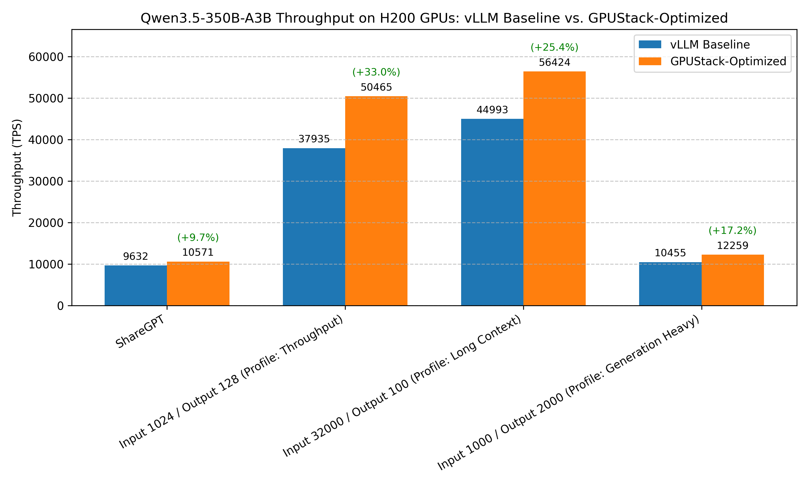

# Optimizing Qwen3.5-35B-A3B Throughput

## Conclusion



Recommended configuration for optimizing throughput of Qwen3.5-35B-A3B on NVIDIA H200:

???+ tip "Serving Command"
    ```bash
    vllm serve Qwen/Qwen3.5-35B-A3B-FP8 \
        --reasoning-parser=qwen3 \
        --performance-mode=throughput \
        --max-model-len=32768 \
        --enable-prefix-caching
    ```


Comparison of benchmark results before and after optimization:

| Benchmark Case | baseline (vLLM without any optimizations) | Optimized |
|----------|-------------------------------------------|-----------|
| **ShareGPT Profile** | Total TPS: 9632.01<br>Mean TPOT(ms): 25.89 | Total TPS: 10570.88 <span style="background-color:lightgreen;">(+9.75%)</span><br>Mean TPOT(ms): 24.71 |
| **Throughput Profile** | Total TPS: 37934.72<br>Mean TPOT(ms): 45.39 | Total TPS: 50464.84 <span style="background-color:lightgreen;">(+33.03%)</span><br>Mean TPOT(ms): 41.12 |
| **Long Context Profile** | Total TPS: 44993.20<br>Mean TPOT(ms): 319.79 | Total TPS: 56424.42 <span style="background-color:lightgreen;">(+25.41%)</span><br>Mean TPOT(ms): 227.43 |
| **Generation Heavy Profile** | Total TPS: 10455.38<br>Mean TPOT(ms): 2.48 | Total TPS: 12258.79 <span style="background-color:lightgreen;">(+17.25%)</span><br>Mean TPOT(ms): 2.92 |


!!! note
    1. Our benchmark tests do not cover all possible optimization combinations. For example, we select the inference engine that performs best under its default configuration as the starting point for further tuning. This pruning approach yields a local optimum, which may not be the global optimum.
    2. There are other optimization methods that depend on specific user scenarios, including max batch size, schedule configuration, extended KV cache, CUDA graph, etc. The conclusions in this document can serve as a starting point for more targeted optimizations.
    3. The tests are conducted on specific hardware and software setups. Advances in the inference engine may lead to new conclusions.
    4. Although using quantization may impact accuracy. FP8 quantization can achieve less than 1% accuracy drop for most models. See the [evaluation results](https://github.com/Tencent/AngelSlim/blob/main/README_en.md#-benchmark) for more details. Therefore, it is highly recommended to use FP8 quantization for low-latency serving scenarios.
    5. Speculative decoding can significantly reduce latency for low-concurrency requests. However, the acceleration effect may vary depending on the data distribution of different benchmark datasets and the choice of draft models. For example, the chosen draft model here is trained on English data, which may lead to suboptimal performance on other languages.

If there are any missing points or updates reflecting new changes, please [let us know](https://github.com/gpustack/gpustack/issues/new/choose).

## Experimental Setup

### Model

- Qwen/Qwen3.5-35B-A3B

### Hardware

NVIDIA H200

### Engine Version

- vLLM v0.17.1
- SGLang v0.5.9

### Benchmark Method

This project uses GPUStack's one-click benchmark capability for serving workloads. The benchmark tests in this document were executed with that workflow.

GPUStack's benchmark implementation is built on top of [guidellm](https://github.com/vllm-project/guidellm) via the wrapper project [benchmark-runner](https://github.com/gpustack/benchmark-runner).

GPUStack handles model deployment, benchmark job submission, and result collection for the benchmark configurations listed below.

#### Benchmark Profiles

##### ShareGPT

```yaml
dataset_name: ShareGPT
request_rate: 1000
total_requests: 1000
```

##### Throughput

```yaml
dataset_name: Random
dataset_input_tokens: 1024
dataset_output_tokens: 128
dataset_seed: 42
request_rate: 1000
total_requests: 1000
```

##### Long Context

```yaml
dataset_name: Random
dataset_input_tokens: 32000
dataset_output_tokens: 100
dataset_seed: 42
request_rate: 1000
total_requests: 100
```

##### Generation Heavy

```yaml
dataset_name: Random
dataset_input_tokens: 1000
dataset_output_tokens: 2000
dataset_seed: 42
request_rate: 1000
total_requests: 200
```

### Open-Source Replacement

If you do not use GPUStack, you can replace the GPUStack benchmark workflow with direct `guidellm benchmark` commands.

For profiles with `dataset_name: ShareGPT`:

```bash
guidellm benchmark \
  --target ${target} \
  --profile constant \
  --rate ${request_rate} \
  --max-requests ${total_request} \
  --processor ${model_path} \
  --data ./ShareGPT_V3_unfiltered_cleaned_split.json
```

For profiles with `dataset_name: Random`:

```bash
guidellm benchmark \
  --target ${target} \
  --profile constant \
  --rate ${request_rate} \
  --max-requests ${total_request} \
  --processor ${model_path} \
  --data "prompt_tokens=${dataset_input_tokens},output_tokens=${dataset_output_tokens}" \
  --random-seed ${dataset_seed:-42}
```

## Experiment Results

### Baseline of the Inference Engine

#### vLLM

- Profile: `ShareGPT`
- Backend Parameters:
  ```bash
  --reasoning-parser=qwen3
  --max-model-len=32768
  ```

??? info "Benchmark result"
    ```
    ============ Serving Benchmark Result ============
    Successful requests:                     1000
    Maximum request concurrency:             512
    Benchmark duration (s):                  70.72
    Total input tokens:                      342058
    Total generated tokens:                  281412
    Request throughput (req/s):              14.14
    Output token throughput (tok/s):         4347.55
    Peak output token throughput (tok/s):    30810010.86
    Peak concurrent requests:                512.00
    Total Token throughput (tok/s):          9632.01
    ----------------------Latency---------------------
    Mean Latency(s):                          30.19
    Median Latency(s):                        27.48
    P95 Latency(s):                           60.73
    P99 Latency(s):                           65.37
    ---------------Time to First Token----------------
    Mean TTFT (ms):                          4072.64
    Median TTFT (ms):                        5786.23
    P95 TTFT (ms):                           9276.23
    P99 TTFT (ms):                           10204.44
    -----Time per Output Token (excl. 1st token)------
    Mean TPOT (ms):                          25.89
    Median TPOT (ms):                        11.63
    P95 TPOT (ms):                           119.58
    P99 TPOT (ms):                           161.45
    ---------------Inter-token Latency----------------
    Mean ITL (ms):                           11.46
    Median ITL (ms):                         0.00
    P95 ITL (ms):                            101.72
    P99 ITL (ms):                            132.49
    ==================================================
    ```

#### SGLang

- Profile: `ShareGPT`
- Backend Parameters:
  ```bash
  --reasoning-parser=qwen3
  --context-length=32768
  ```

??? info "Benchmark result"
    ```
    ============ Serving Benchmark Result ============
    Successful requests:                     1000
    Maximum request concurrency:             512
    Benchmark duration (s):                  124.99
    Total input tokens:                      342058
    Total generated tokens:                  281412
    Request throughput (req/s):              8.00
    Output token throughput (tok/s):         2254.86
    Peak output token throughput (tok/s):    125470.63
    Peak concurrent requests:                512.00
    Total Token throughput (tok/s):          4995.66
    ----------------------Latency---------------------
    Mean Latency(s):                          50.86
    Median Latency(s):                        53.56
    P95 Latency(s):                           82.38
    P99 Latency(s):                           95.75
    ---------------Time to First Token----------------
    Mean TTFT (ms):                          34359.37
    Median TTFT (ms):                        44424.39
    P95 TTFT (ms):                           50796.35
    P99 TTFT (ms):                           53280.79
    -----Time per Output Token (excl. 1st token)------
    Mean TPOT (ms):                          180.73
    Median TPOT (ms):                        145.27
    P95 TPOT (ms):                           376.50
    P99 TPOT (ms):                           743.84
    ---------------Inter-token Latency----------------
    Mean ITL (ms):                           58.84
    Median ITL (ms):                         63.82
    P95 ITL (ms):                            70.78
    P99 ITL (ms):                            73.69
    ==================================================
    ```

- Summary: `vLLM` Total TPS = 9632.01, `SGLang` Total TPS = 4995.66. `vLLM` is faster by 4,636.35 tok/s (92.8%); Mean TPOT = 25.89 ms vs 180.73 ms, reduced by 154.84 ms (85.67%).

### Quantization

- Profile: `ShareGPT`
- Backend Parameters:
  ```bash
  --reasoning-parser=qwen3
  --max-model-len=32768
  ```

??? info "Benchmark result"
    ```
    ============ Serving Benchmark Result ============
    Successful requests:                     1000
    Maximum request concurrency:             512
    Benchmark duration (s):                  65.09
    Total input tokens:                      342058
    Total generated tokens:                  281412
    Request throughput (req/s):              15.36
    Output token throughput (tok/s):         4487.88
    Peak output token throughput (tok/s):    22765417.84
    Peak concurrent requests:                512.00
    Total Token throughput (tok/s):          9942.93
    ----------------------Latency---------------------
    Mean Latency(s):                          28.47
    Median Latency(s):                        25.85
    P95 Latency(s):                           57.18
    P99 Latency(s):                           60.94
    ---------------Time to First Token----------------
    Mean TTFT (ms):                          4477.45
    Median TTFT (ms):                        6644.58
    P95 TTFT (ms):                           10070.32
    P99 TTFT (ms):                           10452.25
    -----Time per Output Token (excl. 1st token)------
    Mean TPOT (ms):                          24.85
    Median TPOT (ms):                        12.27
    P95 TPOT (ms):                           105.60
    P99 TPOT (ms):                           155.56
    ---------------Inter-token Latency----------------
    Mean ITL (ms):                           8.97
    Median ITL (ms):                         0.00
    P95 ITL (ms):                            82.98
    P99 ITL (ms):                            122.57
    ==================================================
    ```

### Prefix Cache && Quantization

- Profile: `ShareGPT`
- Backend Parameters:
  ```bash
  --reasoning-parser=qwen3
  --enable-prefix-caching
  --max-model-len=32768
  ```

??? info "Benchmark result"
    ```
    ============ Serving Benchmark Result ============
    Successful requests:                     1000
    Maximum request concurrency:             512
    Benchmark duration (s):                  66.14
    Total input tokens:                      342058
    Total generated tokens:                  281412
    Request throughput (req/s):              15.12
    Output token throughput (tok/s):         4666.64
    Peak output token throughput (tok/s):    33515595.85
    Peak concurrent requests:                512.00
    Total Token throughput (tok/s):          10338.96
    ----------------------Latency---------------------
    Mean Latency(s):                          28.95
    Median Latency(s):                        26.27
    P95 Latency(s):                           58.15
    P99 Latency(s):                           61.94
    ---------------Time to First Token----------------
    Mean TTFT (ms):                          4274.88
    Median TTFT (ms):                        6301.11
    P95 TTFT (ms):                           9633.89
    P99 TTFT (ms):                           10096.50
    -----Time per Output Token (excl. 1st token)------
    Mean TPOT (ms):                          24.69
    Median TPOT (ms):                        11.84
    P95 TPOT (ms):                           107.47
    P99 TPOT (ms):                           157.98
    ---------------Inter-token Latency----------------
    Mean ITL (ms):                           9.53
    Median ITL (ms):                         0.00
    P95 ITL (ms):                            85.45
    P99 ITL (ms):                            126.18
    ==================================================
    ```

### Performance Mode && Prefix Cache && Quantization

- Profile: `ShareGPT`
- Backend Parameters:
  ```bash
  --reasoning-parser=qwen3
  --performance-mode=throughput
  --max-model-len=32768
  --enable-prefix-caching
  ```

??? info "Benchmark result"
    ```
    ============ Serving Benchmark Result ============
    Successful requests:                     1000
    Maximum request concurrency:             512
    Benchmark duration (s):                  65.94
    Total input tokens:                      342058
    Total generated tokens:                  281412
    Request throughput (req/s):              15.16
    Output token throughput (tok/s):         4715.64
    Peak output token throughput (tok/s):    29553171.28
    Peak concurrent requests:                512.00
    Total Token throughput (tok/s):          10447.52
    ----------------------Latency---------------------
    Mean Latency(s):                          28.85
    Median Latency(s):                        25.78
    P95 Latency(s):                           58.08
    P99 Latency(s):                           61.79
    ---------------Time to First Token----------------
    Mean TTFT (ms):                          4144.76
    Median TTFT (ms):                        6430.34
    P95 TTFT (ms):                           8934.48
    P99 TTFT (ms):                           8979.61
    -----Time per Output Token (excl. 1st token)------
    Mean TPOT (ms):                          25.56
    Median TPOT (ms):                        11.72
    P95 TPOT (ms):                           120.01
    P99 TPOT (ms):                           154.62
    ---------------Inter-token Latency----------------
    Mean ITL (ms):                           10.87
    Median ITL (ms):                         0.00
    P95 ITL (ms):                            99.26
    P99 ITL (ms):                            125.21
    ==================================================
    ```

### KV Cache Dtype && Prefix Cache && Performance Mode && Quantization

- Profile: `ShareGPT`
- Backend Parameters:
  ```bash
  --reasoning-parser=qwen3
  --performance-mode=throughput
  --max-model-len=32768
  --enable-prefix-caching
  --kv-cache-dtype=fp8
  ```

??? info "Benchmark result"
    ```
    ============ Serving Benchmark Result ============
    Successful requests:                     1000
    Maximum request concurrency:             512
    Benchmark duration (s):                  66.34
    Total input tokens:                      342058
    Total generated tokens:                  281412
    Request throughput (req/s):              15.07
    Output token throughput (tok/s):         4677.83
    Peak output token throughput (tok/s):    34141109.18
    Peak concurrent requests:                512.00
    Total Token throughput (tok/s):          10363.77
    ----------------------Latency---------------------
    Mean Latency(s):                          28.91
    Median Latency(s):                        26.27
    P95 Latency(s):                           58.08
    P99 Latency(s):                           62.05
    ---------------Time to First Token----------------
    Mean TTFT (ms):                          4166.57
    Median TTFT (ms):                        6373.29
    P95 TTFT (ms):                           8930.75
    P99 TTFT (ms):                           9126.76
    -----Time per Output Token (excl. 1st token)------
    Mean TPOT (ms):                          24.91
    Median TPOT (ms):                        11.41
    P95 TPOT (ms):                           111.86
    P99 TPOT (ms):                           156.62
    ---------------Inter-token Latency----------------
    Mean ITL (ms):                           10.14
    Median ITL (ms):                         0.00
    P95 ITL (ms):                            89.13
    P99 ITL (ms):                            125.58
    ==================================================
    ```

### Speculative Decoding && Quantization

- Profile: `ShareGPT`
- Backend Parameters:
  ```bash
  --reasoning-parser=qwen3
  --speculative-config={"method":"mtp","num_speculative_tokens":4}
  --max-model-len=32768
  ```

??? info "Benchmark result"
    ```
    ============ Serving Benchmark Result ============
    Successful requests:                     516
    Maximum request concurrency:             512
    Benchmark duration (s):                  17.44
    Total input tokens:                      54307
    Total generated tokens:                  112466
    Request throughput (req/s):              29.59
    Output token throughput (tok/s):         10462.21
    Peak output token throughput (tok/s):    19149104.07
    Peak concurrent requests:                512.00
    Total Token throughput (tok/s):          15514.15
    ----------------------Latency---------------------
    Mean Latency(s):                          16.92
    Median Latency(s):                        17.05
    P95 Latency(s):                           17.28
    P99 Latency(s):                           17.30
    ---------------Time to First Token----------------
    Mean TTFT (ms):                          1956.19
    Median TTFT (ms):                        0.00
    P95 TTFT (ms):                           7744.57
    P99 TTFT (ms):                           8032.17
    -----Time per Output Token (excl. 1st token)------
    Mean TPOT (ms):                          66.41
    Median TPOT (ms):                        44.74
    P95 TPOT (ms):                           149.10
    P99 TPOT (ms):                           477.78
    ---------------Inter-token Latency----------------
    Mean ITL (ms):                           0.00
    Median ITL (ms):                         0.00
    P95 ITL (ms):                            0.00
    P99 ITL (ms):                            0.00
    ==================================================
    ```

### Summary of Optimization Options

| Benchmark Cases                                                    | Optimized                                                                                                                                                            | Baseline                                   |
| ------------------------------------------------------------------ | -------------------------------------------------------------------------------------------------------------------------------------------------------------------- | ------------------------------------------ |
| Quantization                                                       | Total TPS: 9942.93 <span style="background-color:lightgreen;">(+3.23%)</span><br>Mean TPOT(ms): 24.85                                                                | Total TPS: 9632.01<br>Mean TPOT(ms): 25.89 |
| Prefix Cache && Quantization                                       | Total TPS: 10338.96 <span style="background-color:lightgreen;">(+7.34%)</span><br>Mean TPOT(ms): 24.69                                                               | Total TPS: 9632.01<br>Mean TPOT(ms): 25.89 |
| Performance Mode && Prefix Cache && Quantization                   | Total TPS: 10447.52 <span style="background-color:lightgreen;">(+8.47%)</span><br>Mean TPOT(ms): 25.56                                                               | Total TPS: 9632.01<br>Mean TPOT(ms): 25.89 |
| KV Cache Dtype && Performance Mode && Prefix Cache && Quantization | Total TPS: 10363.77 <span style="background-color:yellow;">(+7.60%,lower than previous +8.47%, optimization skipped in final command)</span><br>Mean TPOT(ms): 24.91 | Total TPS: 9632.01<br>Mean TPOT(ms): 25.89 |
| Speculative Decoding && Quantization                               | Total TPS: 15514.15 <span style="background-color:#ffd6d6;">(Success rate: 51.6%, optimization skipped)</span><br>Mean TPOT(ms): 66.41                               | Total TPS: 9632.01<br>Mean TPOT(ms): 25.89 |

### Other Benchmark Cases

#### ShareGPT

- Baseline Backend Parameters:
  ```bash
  --reasoning-parser=qwen3
  --max-model-len=32768
  ```

??? info "Baseline benchmark result"
    ```
    ============ Serving Benchmark Result ============
    Successful requests:                     1000
    Maximum request concurrency:             512
    Benchmark duration (s):                  70.72
    Total input tokens:                      342058
    Total generated tokens:                  281412
    Request throughput (req/s):              14.14
    Output token throughput (tok/s):         4347.55
    Peak output token throughput (tok/s):    30810010.86
    Peak concurrent requests:                512.00
    Total Token throughput (tok/s):          9632.01
    ----------------------Latency---------------------
    Mean Latency(s):                          30.19
    Median Latency(s):                        27.48
    P95 Latency(s):                           60.73
    P99 Latency(s):                           65.37
    ---------------Time to First Token----------------
    Mean TTFT (ms):                          4072.64
    Median TTFT (ms):                        5786.23
    P95 TTFT (ms):                           9276.23
    P99 TTFT (ms):                           10204.44
    -----Time per Output Token (excl. 1st token)------
    Mean TPOT (ms):                          25.89
    Median TPOT (ms):                        11.63
    P95 TPOT (ms):                           119.58
    P99 TPOT (ms):                           161.45
    ---------------Inter-token Latency----------------
    Mean ITL (ms):                           11.46
    Median ITL (ms):                         0.00
    P95 ITL (ms):                            101.72
    P99 ITL (ms):                            132.49
    ==================================================
    ```

- Optimized Backend Parameters:
  ```bash
  --reasoning-parser=qwen3
  --performance-mode=throughput
  --max-model-len=32768
  --enable-prefix-caching
  --async-scheduling
  ```

??? info "Optimized benchmark result"
    ```
    ============ Serving Benchmark Result ============
    Successful requests:                     1000
    Maximum request concurrency:             512
    Benchmark duration (s):                  65.25
    Total input tokens:                      342058
    Total generated tokens:                  281412
    Request throughput (req/s):              15.33
    Output token throughput (tok/s):         4771.31
    Peak output token throughput (tok/s):    41235027.15
    Peak concurrent requests:                512.00
    Total Token throughput (tok/s):          10570.88
    ----------------------Latency---------------------
    Mean Latency(s):                          28.45
    Median Latency(s):                        25.64
    P95 Latency(s):                           57.14
    P99 Latency(s):                           60.99
    ---------------Time to First Token----------------
    Mean TTFT (ms):                          4123.08
    Median TTFT (ms):                        6272.83
    P95 TTFT (ms):                           8823.87
    P99 TTFT (ms):                           9032.36
    -----Time per Output Token (excl. 1st token)------
    Mean TPOT (ms):                          24.71
    Median TPOT (ms):                        11.49
    P95 TPOT (ms):                           108.44
    P99 TPOT (ms):                           153.41
    ---------------Inter-token Latency----------------
    Mean ITL (ms):                           10.10
    Median ITL (ms):                         0.00
    P95 ITL (ms):                            84.74
    P99 ITL (ms):                            124.30
    ==================================================
    ```

#### Throughput Profile

- Baseline Backend Parameters:
  ```bash
  --reasoning-parser=qwen3
  --max-model-len=32768
  ```

??? info "Baseline benchmark result"
    ```
    ============ Serving Benchmark Result ============
    Successful requests:                     1000
    Maximum request concurrency:             512
    Benchmark duration (s):                  40.37
    Total input tokens:                      1033932
    Total generated tokens:                  128000
    Request throughput (req/s):              24.77
    Output token throughput (tok/s):         4178.94
    Peak output token throughput (tok/s):    4782814.36
    Peak concurrent requests:                512.00
    Total Token throughput (tok/s):          37934.72
    ----------------------Latency---------------------
    Mean Latency(s):                          19.96
    Median Latency(s):                        20.63
    P95 Latency(s):                           32.86
    P99 Latency(s):                           34.01
    ---------------Time to First Token----------------
    Mean TTFT (ms):                          5809.82
    Median TTFT (ms):                        5564.25
    P95 TTFT (ms):                           14821.97
    P99 TTFT (ms):                           16424.58
    -----Time per Output Token (excl. 1st token)------
    Mean TPOT (ms):                          45.39
    Median TPOT (ms):                        43.47
    P95 TPOT (ms):                           115.80
    P99 TPOT (ms):                           128.32
    ---------------Inter-token Latency----------------
    Mean ITL (ms):                           0.00
    Median ITL (ms):                         0.00
    P95 ITL (ms):                            0.00
    P99 ITL (ms):                            0.00
    ==================================================
    ```

- Optimized Backend Parameters:
  ```bash
  --reasoning-parser=qwen3
  --performance-mode=throughput
  --max-model-len=32768
  --enable-prefix-caching
  --async-scheduling
  ```

??? info "Optimized benchmark result"
    ```
    ============ Serving Benchmark Result ============
    Successful requests:                     1000
    Maximum request concurrency:             512
    Benchmark duration (s):                  33.09
    Total input tokens:                      1033932
    Total generated tokens:                  128000
    Request throughput (req/s):              30.04
    Output token throughput (tok/s):         5559.27
    Peak output token throughput (tok/s):    8426225.08
    Peak concurrent requests:                512.00
    Total Token throughput (tok/s):          50464.84
    ----------------------Latency---------------------
    Mean Latency(s):                          16.41
    Median Latency(s):                        18.57
    P95 Latency(s):                           25.97
    P99 Latency(s):                           26.61
    ---------------Time to First Token----------------
    Mean TTFT (ms):                          5263.31
    Median TTFT (ms):                        5797.34
    P95 TTFT (ms):                           12306.78
    P99 TTFT (ms):                           13313.63
    -----Time per Output Token (excl. 1st token)------
    Mean TPOT (ms):                          41.12
    Median TPOT (ms):                        45.29
    P95 TPOT (ms):                           96.15
    P99 TPOT (ms):                           104.01
    ---------------Inter-token Latency----------------
    Mean ITL (ms):                           0.00
    Median ITL (ms):                         0.00
    P95 ITL (ms):                            0.00
    P99 ITL (ms):                            0.00
    ==================================================
    ```

#### Long Context Profile

- Baseline Backend Parameters:
  ```bash
  --reasoning-parser=qwen3
  --max-model-len=32768
  ```

??? info "Baseline benchmark result"
    ```
    ============ Serving Benchmark Result ============
    Successful requests:                     100
    Maximum request concurrency:             100
    Benchmark duration (s):                  73.72
    Total input tokens:                      3200993
    Total generated tokens:                  10000
    Request throughput (req/s):              1.36
    Output token throughput (tok/s):         140.12
    Peak output token throughput (tok/s):    309.07
    Peak concurrent requests:                100.00
    Total Token throughput (tok/s):          44993.20
    ----------------------Latency---------------------
    Mean Latency(s):                          47.26
    Median Latency(s):                        48.95
    P95 Latency(s):                           61.84
    P99 Latency(s):                           62.18
    ---------------Time to First Token----------------
    Mean TTFT (ms):                          31979.13
    Median TTFT (ms):                        31950.33
    P95 TTFT (ms):                           55557.79
    P99 TTFT (ms):                           57562.19
    -----Time per Output Token (excl. 1st token)------
    Mean TPOT (ms):                          319.79
    Median TPOT (ms):                        319.50
    P95 TPOT (ms):                           555.58
    P99 TPOT (ms):                           575.62
    ---------------Inter-token Latency----------------
    Mean ITL (ms):                           0.00
    Median ITL (ms):                         0.00
    P95 ITL (ms):                            0.00
    P99 ITL (ms):                            0.00
    ==================================================
    ```

- Optimized Backend Parameters:
  ```bash
  --reasoning-parser=qwen3
  --performance-mode=throughput
  --max-model-len=32768
  --enable-prefix-caching
  --async-scheduling
  ```

??? info "Optimized benchmark result"
    ```
    ============ Serving Benchmark Result ============
    Successful requests:                     100
    Maximum request concurrency:             100
    Benchmark duration (s):                  59.32
    Total input tokens:                      3200993
    Total generated tokens:                  10000
    Request throughput (req/s):              1.69
    Output token throughput (tok/s):         175.72
    Peak output token throughput (tok/s):    950.60
    Peak concurrent requests:                100.00
    Total Token throughput (tok/s):          56424.42
    ----------------------Latency---------------------
    Mean Latency(s):                          44.56
    Median Latency(s):                        46.68
    P95 Latency(s):                           51.00
    P99 Latency(s):                           51.33
    ---------------Time to First Token----------------
    Mean TTFT (ms):                          22743.47
    Median TTFT (ms):                        22414.07
    P95 TTFT (ms):                           42138.77
    P99 TTFT (ms):                           43901.20
    -----Time per Output Token (excl. 1st token)------
    Mean TPOT (ms):                          227.43
    Median TPOT (ms):                        224.14
    P95 TPOT (ms):                           421.39
    P99 TPOT (ms):                           439.01
    ---------------Inter-token Latency----------------
    Mean ITL (ms):                           0.00
    Median ITL (ms):                         0.00
    P95 ITL (ms):                            0.00
    P99 ITL (ms):                            0.00
    ==================================================
    ```

#### Generation Heavy Profile

- Baseline Backend Parameters:
  ```bash
  --reasoning-parser=qwen3
  --max-model-len=32768
  ```

??? info "Baseline benchmark result"
    ```
    ============ Serving Benchmark Result ============
    Successful requests:                     200
    Maximum request concurrency:             200
    Benchmark duration (s):                  57.74
    Total input tokens:                      201982
    Total generated tokens:                  400000
    Request throughput (req/s):              3.45
    Output token throughput (tok/s):         6947.30
    Peak output token throughput (tok/s):    77961040.89
    Peak concurrent requests:                200.00
    Total Token throughput (tok/s):          10455.38
    ----------------------Latency---------------------
    Mean Latency(s):                          57.43
    Median Latency(s):                        57.45
    P95 Latency(s):                           57.54
    P99 Latency(s):                           57.57
    ---------------Time to First Token----------------
    Mean TTFT (ms):                          1915.55
    Median TTFT (ms):                        1956.25
    P95 TTFT (ms):                           3537.91
    P99 TTFT (ms):                           3608.07
    -----Time per Output Token (excl. 1st token)------
    Mean TPOT (ms):                          2.48
    Median TPOT (ms):                        1.00
    P95 TPOT (ms):                           28.70
    P99 TPOT (ms):                           28.76
    ---------------Inter-token Latency----------------
    Mean ITL (ms):                           1.52
    Median ITL (ms):                         0.00
    P95 ITL (ms):                            26.98
    P99 ITL (ms):                            27.96
    ==================================================
    ```

- Optimized Backend Parameters:
  ```bash
  --reasoning-parser=qwen3
  --performance-mode=throughput
  --max-model-len=32768
  --enable-prefix-caching
  --async-scheduling
  ```

??? info "Optimized benchmark result"
    ```
    ============ Serving Benchmark Result ============
    Successful requests:                     200
    Maximum request concurrency:             200
    Benchmark duration (s):                  49.34
    Total input tokens:                      201982
    Total generated tokens:                  400000
    Request throughput (req/s):              4.05
    Output token throughput (tok/s):         8145.62
    Peak output token throughput (tok/s):    100865026.05
    Peak concurrent requests:                200.00
    Total Token throughput (tok/s):          12258.79
    ----------------------Latency---------------------
    Mean Latency(s):                          49.16
    Median Latency(s):                        49.16
    P95 Latency(s):                           49.18
    P99 Latency(s):                           49.20
    ---------------Time to First Token----------------
    Mean TTFT (ms):                          1574.69
    Median TTFT (ms):                        1624.98
    P95 TTFT (ms):                           2718.49
    P99 TTFT (ms):                           2763.35
    -----Time per Output Token (excl. 1st token)------
    Mean TPOT (ms):                          2.92
    Median TPOT (ms):                        0.82
    P95 TPOT (ms):                           24.58
    P99 TPOT (ms):                           24.59
    ---------------Inter-token Latency----------------
    Mean ITL (ms):                           2.14
    Median ITL (ms):                         0.00
    P95 ITL (ms):                            23.67
    P99 ITL (ms):                            23.99
    ==================================================
    ```
