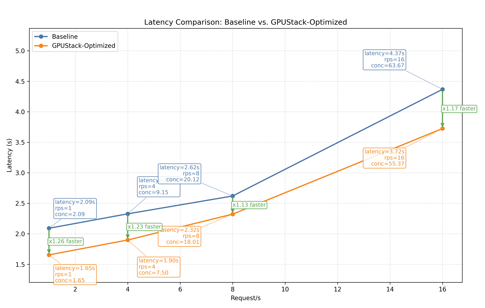

# Optimizing Qwen3.5-9B Latency

## Conclusion



Recommended configuration for optimizing latency of Qwen/Qwen3.5-9B on NVIDIA H100 80GB HBM3:

???+ tip "Serving Command"
    ```bash
    vllm serve Qwen/Qwen3.5-9B \
        --reasoning-parser=qwen3 \
        --max-model-len=32768 \
        --speculative-config={"method":"mtp","num_speculative_tokens":1} \
        --language-model-only \
        --performance-mode=interactivity
    ```

Comparison of benchmark results before and after optimization:

| Benchmark Case | Baseline (vLLM without any optimizations) | Optimized |
|----------|-------------------------------------------|-----------|
| **Rate 1** | Mean latency: 2.09s/req | Mean latency: 1.65s/req <span style="background-color:lightgreen;">(1.26x faster)</span> |
| **Rate 4** | Mean latency: 2.33s/req | Mean latency: 1.90s/req <span style="background-color:lightgreen;">(1.23x faster)</span> |
| **Rate 8** | Mean latency: 2.62s/req | Mean latency: 2.32s/req <span style="background-color:lightgreen;">(1.13x faster)</span> |
| **Rate 16** | Mean latency: 4.37s/req | Mean latency: 3.72s/req <span style="background-color:lightgreen;">(1.17x faster)</span> |

!!! note
    1. Our benchmark tests do not cover all possible optimization combinations. For example, we select the inference engine that performs best under its default configuration as the starting point for further tuning. This pruning approach yields a local optimum, which may not be the global optimum.
    2. There are other optimization methods that depend on specific user scenarios, including max batch size, schedule configuration, extended KV cache, CUDA graph, etc. The conclusions in this document can serve as a starting point for more targeted optimizations.
    3. The tests are conducted on specific hardware and software setups. Advances in the inference engine may lead to new conclusions.
    4. Although using quantization may impact accuracy. FP8 quantization can achieve less than 1% accuracy drop for most models. See the [evaluation results](https://github.com/Tencent/AngelSlim/blob/main/README_en.md#-benchmark) for more details. Therefore, it is highly recommended to use FP8 quantization for low-latency serving scenarios.
    5. Speculative decoding can significantly reduce latency for low-concurrency requests. However, the acceleration effect may vary depending on the data distribution of different benchmark datasets and the choice of draft models. For example, the chosen draft model here is trained on English data, which may lead to suboptimal performance on other languages.

If there are any missing points or updates reflecting new changes, please [let us know](https://github.com/gpustack/gpustack/issues/new/choose).

## Experimental Setup

### Model

Qwen/Qwen3.5-9B

### Hardware

NVIDIA H100 80GB HBM3

### Engine Version

- vLLM v0.17.1
- SGLang v0.5.9

### Benchmark Method

This project uses GPUStack's one-click benchmark capability for serving workloads. The benchmark tests in this document were executed with that workflow.

GPUStack's benchmark implementation is built on top of [guidellm](https://github.com/vllm-project/guidellm) via the wrapper project [benchmark-runner](https://github.com/gpustack/benchmark-runner).

GPUStack handles model deployment, benchmark job submission, and result collection for the benchmark configurations listed below.

#### Benchmark Profiles

##### ShareGPT 8RPS

```yaml
dataset_name: ShareGPT
request_rate: 8
total_requests: 1000
```

##### ShareGPT 1RPS

```yaml
dataset_name: ShareGPT
request_rate: 1
total_requests: 1000
```

##### ShareGPT 4RPS

```yaml
dataset_name: ShareGPT
request_rate: 4
total_requests: 1000
```

##### ShareGPT 16RPS

```yaml
dataset_name: ShareGPT
request_rate: 16
total_requests: 1000
```

### Open-Source Replacement

If you do not use GPUStack, you can replace the GPUStack benchmark workflow with direct `guidellm benchmark` commands.

For profiles with `dataset_name: ShareGPT`:

```bash
guidellm benchmark \
  --target ${target} \
  --profile constant \
  --rate ${request_rate} \
  --max-requests ${total_requests} \
  --processor ${model_path} \
  --data ./ShareGPT_V3_unfiltered_cleaned_split.json
```

## Experiment Results

### Choosing the Inference Engine

#### vLLM

- Profile: `ShareGPT 8RPS`
- Backend Parameters:
  ```bash
  --reasoning-parser=qwen3
  --max-model-len=32768
  ```

??? info "Benchmark result"
    ```
    ============ Serving Benchmark Result ============
    Successful requests:                     1000
    Maximum request concurrency:             31
    Benchmark duration (s):                  130.18
    Total input tokens:                      342058
    Total generated tokens:                  281412
    Request throughput (req/s):              7.68
    Output token throughput (tok/s):         2197.17
    Peak output token throughput (tok/s):    2885041.51
    Peak concurrent requests:                31.00
    Total Token throughput (tok/s):          4867.84
    ----------------------Latency---------------------
    Mean Latency(s):                          2.62
    Median Latency(s):                        2.29
    P95 Latency(s):                           6.81
    P99 Latency(s):                           7.75
    ---------------Time to First Token----------------
    Mean TTFT (ms):                          41.12
    Median TTFT (ms):                        33.92
    P95 TTFT (ms):                           72.24
    P99 TTFT (ms):                           141.44
    -----Time per Output Token (excl. 1st token)------
    Mean TPOT (ms):                          1.34
    Median TPOT (ms):                        0.11
    P95 TPOT (ms):                           9.18
    P99 TPOT (ms):                           10.07
    ---------------Inter-token Latency----------------
    Mean ITL (ms):                           1.19
    Median ITL (ms):                         0.00
    P95 ITL (ms):                            9.08
    P99 ITL (ms):                            10.04
    ==================================================
    ```

#### SGLang

- Profile: `ShareGPT 8RPS`
- Backend Parameters:
  ```bash
  --reasoning-parser=qwen3
  --context-length=32768
  ```

??? info "Benchmark result"
    ```
    ============ Serving Benchmark Result ============
    Successful requests:                     1000
    Maximum request concurrency:             96
    Benchmark duration (s):                  131.60
    Total input tokens:                      342058
    Total generated tokens:                  281412
    Request throughput (req/s):              7.60
    Output token throughput (tok/s):         2145.85
    Peak output token throughput (tok/s):    33380.30
    Peak concurrent requests:                96.00
    Total Token throughput (tok/s):          4754.13
    ----------------------Latency---------------------
    Mean Latency(s):                          8.13
    Median Latency(s):                        6.94
    P95 Latency(s):                           20.20
    P99 Latency(s):                           26.21
    ---------------Time to First Token----------------
    Mean TTFT (ms):                          98.72
    Median TTFT (ms):                        51.48
    P95 TTFT (ms):                           212.72
    P99 TTFT (ms):                           460.47
    -----Time per Output Token (excl. 1st token)------
    Mean TPOT (ms):                          28.88
    Median TPOT (ms):                        28.26
    P95 TPOT (ms):                           43.34
    P99 TPOT (ms):                           51.52
    ---------------Inter-token Latency----------------
    Mean ITL (ms):                           28.63
    Median ITL (ms):                         27.88
    P95 ITL (ms):                            43.23
    P99 ITL (ms):                            50.55
    ==================================================
    ```

- Summary: `vLLM` Mean Latency = 2.62s, `SGLang` Mean Latency = 8.13s. `vLLM` is faster by 5.51s (3.10x faster). TTFT = 41.12 ms vs 98.72 ms, reduced by 57.60 ms (2.40x faster); TPOT = 1.34 ms vs 28.88 ms, reduced by 27.54 ms (21.62x faster).

### Prefix Cache

- Profile: `ShareGPT 8RPS`
- Backend Parameters:
  ```bash
  --reasoning-parser=qwen3
  --max-model-len=32768
  --enable-prefix-caching
  ```

??? info "Benchmark result"
    ```
    ============ Serving Benchmark Result ============
    Successful requests:                     1000
    Maximum request concurrency:             32
    Benchmark duration (s):                  130.23
    Total input tokens:                      342058
    Total generated tokens:                  281412
    Request throughput (req/s):              7.68
    Output token throughput (tok/s):         2212.47
    Peak output token throughput (tok/s):    1443445.16
    Peak concurrent requests:                32.00
    Total Token throughput (tok/s):          4901.75
    ----------------------Latency---------------------
    Mean Latency(s):                          2.69
    Median Latency(s):                        2.36
    P95 Latency(s):                           6.95
    P99 Latency(s):                           7.94
    ---------------Time to First Token----------------
    Mean TTFT (ms):                          46.19
    Median TTFT (ms):                        34.75
    P95 TTFT (ms):                           90.30
    P99 TTFT (ms):                           233.30
    -----Time per Output Token (excl. 1st token)------
    Mean TPOT (ms):                          1.38
    Median TPOT (ms):                        0.12
    P95 TPOT (ms):                           9.49
    P99 TPOT (ms):                           10.50
    ---------------Inter-token Latency----------------
    Mean ITL (ms):                           1.22
    Median ITL (ms):                         0.00
    P95 ITL (ms):                            9.35
    P99 ITL (ms):                            10.40
    ==================================================
    ```

### Max Batch Token

#### 16k

- Profile: `ShareGPT 8RPS`
- Backend Parameters:
  ```bash
  --reasoning-parser=qwen3
  --max-model-len=32768
  --max-num-batched-tokens=16384
  ```

??? info "Benchmark result"
    ```
    ============ Serving Benchmark Result ============
    Successful requests:                     1000
    Maximum request concurrency:             31
    Benchmark duration (s):                  130.20
    Total input tokens:                      342058
    Total generated tokens:                  281412
    Request throughput (req/s):              7.68
    Output token throughput (tok/s):         2220.17
    Peak output token throughput (tok/s):    2763536.75
    Peak concurrent requests:                31.00
    Total Token throughput (tok/s):          4918.81
    ----------------------Latency---------------------
    Mean Latency(s):                          2.64
    Median Latency(s):                        2.30
    P95 Latency(s):                           6.87
    P99 Latency(s):                           7.79
    ---------------Time to First Token----------------
    Mean TTFT (ms):                          42.05
    Median TTFT (ms):                        34.13
    P95 TTFT (ms):                           76.02
    P99 TTFT (ms):                           190.03
    -----Time per Output Token (excl. 1st token)------
    Mean TPOT (ms):                          1.26
    Median TPOT (ms):                        0.11
    P95 TPOT (ms):                           9.19
    P99 TPOT (ms):                           10.11
    ---------------Inter-token Latency----------------
    Mean ITL (ms):                           1.11
    Median ITL (ms):                         0.00
    P95 ITL (ms):                            9.13
    P99 ITL (ms):                            10.04
    ==================================================
    ```

#### 32k

- Profile: `ShareGPT 8RPS`
- Backend Parameters:
  ```bash
  --reasoning-parser=qwen3
  --max-model-len=32768
  --max-num-batched-tokens=32768
  ```

??? info "Benchmark result"
    ```
    ============ Serving Benchmark Result ============
    Successful requests:                     1000
    Maximum request concurrency:             31
    Benchmark duration (s):                  130.20
    Total input tokens:                      342058
    Total generated tokens:                  281412
    Request throughput (req/s):              7.68
    Output token throughput (tok/s):         2196.67
    Peak output token throughput (tok/s):    1167858.46
    Peak concurrent requests:                31.00
    Total Token throughput (tok/s):          4866.73
    ----------------------Latency---------------------
    Mean Latency(s):                          2.64
    Median Latency(s):                        2.31
    P95 Latency(s):                           6.88
    P99 Latency(s):                           7.81
    ---------------Time to First Token----------------
    Mean TTFT (ms):                          41.88
    Median TTFT (ms):                        34.03
    P95 TTFT (ms):                           76.91
    P99 TTFT (ms):                           164.85
    -----Time per Output Token (excl. 1st token)------
    Mean TPOT (ms):                          1.38
    Median TPOT (ms):                        0.11
    P95 TPOT (ms):                           9.34
    P99 TPOT (ms):                           10.14
    ---------------Inter-token Latency----------------
    Mean ITL (ms):                           1.23
    Median ITL (ms):                         0.00
    P95 ITL (ms):                            9.20
    P99 ITL (ms):                            10.09
    ==================================================
    ```

- Summary: `16k` Mean Latency = 2.64s, `32k` Mean Latency = 2.64s. `16k` is faster by 0.00s (1.00x faster). TTFT = 42.05 ms vs 41.88 ms, increased by 0.17 ms (1.00x slower); TPOT = 1.26 ms vs 1.38 ms, reduced by 0.12 ms (1.10x faster).

### Max Num Seqs

#### Seqs 128

- Profile: `ShareGPT 8RPS`
- Backend Parameters:
  ```bash
  --reasoning-parser=qwen3
  --max-model-len=32768
  --max-num-seqs=128
  ```

??? info "Benchmark result"
    ```
    ============ Serving Benchmark Result ============
    Successful requests:                     1000
    Maximum request concurrency:             31
    Benchmark duration (s):                  130.18
    Total input tokens:                      342058
    Total generated tokens:                  281412
    Request throughput (req/s):              7.68
    Output token throughput (tok/s):         2213.28
    Peak output token throughput (tok/s):    3033763.06
    Peak concurrent requests:                31.00
    Total Token throughput (tok/s):          4903.53
    ----------------------Latency---------------------
    Mean Latency(s):                          2.66
    Median Latency(s):                        2.32
    P95 Latency(s):                           6.91
    P99 Latency(s):                           7.82
    ---------------Time to First Token----------------
    Mean TTFT (ms):                          44.11
    Median TTFT (ms):                        35.02
    P95 TTFT (ms):                           75.65
    P99 TTFT (ms):                           197.93
    -----Time per Output Token (excl. 1st token)------
    Mean TPOT (ms):                          1.33
    Median TPOT (ms):                        0.11
    P95 TPOT (ms):                           9.53
    P99 TPOT (ms):                           10.28
    ---------------Inter-token Latency----------------
    Mean ITL (ms):                           1.17
    Median ITL (ms):                         0.00
    P95 ITL (ms):                            9.48
    P99 ITL (ms):                            10.23
    ==================================================
    ```

#### Seqs 256

- Profile: `ShareGPT 8RPS`
- Backend Parameters:
  ```bash
  --reasoning-parser=qwen3
  --max-model-len=32768
  --max-num-seqs=256
  ```

??? info "Benchmark result"
    ```
    ============ Serving Benchmark Result ============
    Successful requests:                     1000
    Maximum request concurrency:             31
    Benchmark duration (s):                  130.18
    Total input tokens:                      342058
    Total generated tokens:                  281412
    Request throughput (req/s):              7.68
    Output token throughput (tok/s):         2196.96
    Peak output token throughput (tok/s):    1994998.46
    Peak concurrent requests:                31.00
    Total Token throughput (tok/s):          4867.37
    ----------------------Latency---------------------
    Mean Latency(s):                          2.64
    Median Latency(s):                        2.30
    P95 Latency(s):                           6.82
    P99 Latency(s):                           7.79
    ---------------Time to First Token----------------
    Mean TTFT (ms):                          42.97
    Median TTFT (ms):                        34.30
    P95 TTFT (ms):                           77.05
    P99 TTFT (ms):                           187.56
    -----Time per Output Token (excl. 1st token)------
    Mean TPOT (ms):                          1.32
    Median TPOT (ms):                        0.11
    P95 TPOT (ms):                           9.23
    P99 TPOT (ms):                           10.28
    ---------------Inter-token Latency----------------
    Mean ITL (ms):                           1.17
    Median ITL (ms):                         0.00
    P95 ITL (ms):                            9.16
    P99 ITL (ms):                            10.16
    ==================================================
    ```

- Summary: `Seqs 256` Mean Latency = 2.64s, `Seqs 128` Mean Latency = 2.66s. `Seqs 256` is faster by 0.02s (1.01x faster). TTFT = 42.97 ms vs 44.11 ms, reduced by 1.13 ms (1.03x faster); TPOT = 1.32 ms vs 1.33 ms, reduced by 0.01 ms (1.01x faster).

### Speculative Decoding

- Profile: `ShareGPT 8RPS`
- Backend Parameters:
  ```bash
  --reasoning-parser=qwen3
  --speculative-config={"method":"mtp","num_speculative_tokens":1}
  --max-model-len=32768
  ```

??? info "Benchmark result"
    ```
    ============ Serving Benchmark Result ============
    Successful requests:                     1000
    Maximum request concurrency:             28
    Benchmark duration (s):                  129.03
    Total input tokens:                      342058
    Total generated tokens:                  281412
    Request throughput (req/s):              7.75
    Output token throughput (tok/s):         2224.24
    Peak output token throughput (tok/s):    9620127.05
    Peak concurrent requests:                28.00
    Total Token throughput (tok/s):          4927.83
    ----------------------Latency---------------------
    Mean Latency(s):                          2.39
    Median Latency(s):                        2.08
    P95 Latency(s):                           6.12
    P99 Latency(s):                           7.17
    ---------------Time to First Token----------------
    Mean TTFT (ms):                          81.50
    Median TTFT (ms):                        55.93
    P95 TTFT (ms):                           96.41
    P99 TTFT (ms):                           788.19
    -----Time per Output Token (excl. 1st token)------
    Mean TPOT (ms):                          1.29
    Median TPOT (ms):                        0.18
    P95 TPOT (ms):                           8.45
    P99 TPOT (ms):                           9.48
    ---------------Inter-token Latency----------------
    Mean ITL (ms):                           1.01
    Median ITL (ms):                         0.00
    P95 ITL (ms):                            8.31
    P99 ITL (ms):                            9.42
    ==================================================
    ```

### Speculative Decoding && Performance Mode

- Profile: `ShareGPT 8RPS`
- Backend Parameters:
  ```bash
  --reasoning-parser=qwen3
  --performance-mode=interactivity
  --max-model-len=32768
  --speculative-config={"method":"mtp","num_speculative_tokens":1}
  ```

??? info "Benchmark result"
    ```
    ============ Serving Benchmark Result ============
    Successful requests:                     1000
    Maximum request concurrency:             28
    Benchmark duration (s):                  129.07
    Total input tokens:                      342058
    Total generated tokens:                  281412
    Request throughput (req/s):              7.75
    Output token throughput (tok/s):         2214.80
    Peak output token throughput (tok/s):    1904162.55
    Peak concurrent requests:                28.00
    Total Token throughput (tok/s):          4906.90
    ----------------------Latency---------------------
    Mean Latency(s):                          2.38
    Median Latency(s):                        2.09
    P95 Latency(s):                           6.09
    P99 Latency(s):                           7.20
    ---------------Time to First Token----------------
    Mean TTFT (ms):                          82.37
    Median TTFT (ms):                        55.71
    P95 TTFT (ms):                           96.16
    P99 TTFT (ms):                           960.28
    -----Time per Output Token (excl. 1st token)------
    Mean TPOT (ms):                          1.42
    Median TPOT (ms):                        0.18
    P95 TPOT (ms):                           8.54
    P99 TPOT (ms):                           9.65
    ---------------Inter-token Latency----------------
    Mean ITL (ms):                           1.13
    Median ITL (ms):                         0.00
    P95 ITL (ms):                            8.39
    P99 ITL (ms):                            9.08
    ==================================================
    ```

### Speculative Decoding && Performance Mode && Language Model

- Profile: `ShareGPT 8RPS`
- Backend Parameters:
  ```bash
  --reasoning-parser=qwen3
  --max-model-len=32768
  --speculative-config={"method":"mtp","num_speculative_tokens":1}
  --language-model-only
  --performance-mode=interactivity
  ```

??? info "Benchmark result"
    ```
    ============ Serving Benchmark Result ============
    Successful requests:                     1000
    Maximum request concurrency:             27
    Benchmark duration (s):                  128.98
    Total input tokens:                      342058
    Total generated tokens:                  281412
    Request throughput (req/s):              7.75
    Output token throughput (tok/s):         2214.46
    Peak output token throughput (tok/s):    4861500.66
    Peak concurrent requests:                27.00
    Total Token throughput (tok/s):          4906.15
    ----------------------Latency---------------------
    Mean Latency(s):                          2.32
    Median Latency(s):                        2.02
    P95 Latency(s):                           5.99
    P99 Latency(s):                           6.89
    ---------------Time to First Token----------------
    Mean TTFT (ms):                          80.63
    Median TTFT (ms):                        54.04
    P95 TTFT (ms):                           96.82
    P99 TTFT (ms):                           933.41
    -----Time per Output Token (excl. 1st token)------
    Mean TPOT (ms):                          1.31
    Median TPOT (ms):                        0.17
    P95 TPOT (ms):                           8.19
    P99 TPOT (ms):                           9.47
    ---------------Inter-token Latency----------------
    Mean ITL (ms):                           1.02
    Median ITL (ms):                         0.00
    P95 ITL (ms):                            8.03
    P99 ITL (ms):                            8.91
    ==================================================
    ```

### Summary of Optimization Options

| Benchmark Case | Group | Optimized | Baseline | Comparison |
|---|---|---:|---:|---|
| ShareGPT 8RPS (r=8) | Choosing the Inference Engine | 2.62s | 2.62s | <span style="background-color:lightgreen;">(1.00x faster)</span> |
| ShareGPT 8RPS (r=8) | Prefix Cache | 2.69s | 2.62s | <span style="background-color:#ffd6d6;">(1.03x slower)</span> |
| ShareGPT 8RPS (r=8) | Max Batch Token | 2.64s | 2.62s | <span style="background-color:#ffd6d6;">(1.01x slower)</span> |
| ShareGPT 8RPS (r=8) | Max Num Seqs | 2.64s | 2.62s | <span style="background-color:#ffd6d6;">(1.01x slower)</span> |
| ShareGPT 8RPS (r=8) | Speculative Decoding | 2.39s | 2.62s | <span style="background-color:lightgreen;">(1.09x faster)</span> |
| ShareGPT 8RPS (r=8) | Speculative Decoding && Performance Mode | 2.38s | 2.62s | <span style="background-color:lightgreen;">(1.10x faster)</span> |
| ShareGPT 8RPS (r=8) | Speculative Decoding && Performance Mode && Language Model | 2.32s | 2.62s | <span style="background-color:lightgreen;">(1.13x faster)</span> |

### Other Benchmark Cases

#### Rate 1

- Baseline Backend Parameters:
  ```bash
  --reasoning-parser=qwen3
  --max-model-len=32768
  ```

??? info "Baseline benchmark result"
    ```
    ============ Serving Benchmark Result ============
    Successful requests:                     1000
    Maximum request concurrency:             6
    Benchmark duration (s):                  1001.23
    Total input tokens:                      342058
    Total generated tokens:                  281412
    Request throughput (req/s):              1.00
    Output token throughput (tok/s):         281.69
    Peak output token throughput (tok/s):    211793.17
    Peak concurrent requests:                6.00
    Total Token throughput (tok/s):          624.09
    ----------------------Latency---------------------
    Mean Latency(s):                          2.09
    Median Latency(s):                        1.85
    P95 Latency(s):                           5.42
    P99 Latency(s):                           6.27
    ---------------Time to First Token----------------
    Mean TTFT (ms):                          37.03
    Median TTFT (ms):                        31.51
    P95 TTFT (ms):                           63.17
    P99 TTFT (ms):                           95.35
    -----Time per Output Token (excl. 1st token)------
    Mean TPOT (ms):                          0.94
    Median TPOT (ms):                        0.10
    P95 TPOT (ms):                           7.38
    P99 TPOT (ms):                           7.51
    ---------------Inter-token Latency----------------
    Mean ITL (ms):                           0.81
    Median ITL (ms):                         0.00
    P95 ITL (ms):                            7.34
    P99 ITL (ms):                            7.47
    ==================================================
    ```

- Optimized Backend Parameters:
  ```bash
  --reasoning-parser=qwen3
  --max-model-len=32768
  --speculative-config={"method":"mtp","num_speculative_tokens":1}
  --language-model-only
  --performance-mode=interactivity
  ```

??? info "Optimized benchmark result"
    ```
    ============ Serving Benchmark Result ============
    Successful requests:                     1000
    Maximum request concurrency:             5
    Benchmark duration (s):                  1000.35
    Total input tokens:                      342058
    Total generated tokens:                  281412
    Request throughput (req/s):              1.00
    Output token throughput (tok/s):         281.69
    Peak output token throughput (tok/s):    271386.26
    Peak concurrent requests:                5.00
    Total Token throughput (tok/s):          624.08
    ----------------------Latency---------------------
    Mean Latency(s):                          1.65
    Median Latency(s):                        1.45
    P95 Latency(s):                           4.28
    P99 Latency(s):                           4.98
    ---------------Time to First Token----------------
    Mean TTFT (ms):                          54.58
    Median TTFT (ms):                        50.45
    P95 TTFT (ms):                           75.37
    P99 TTFT (ms):                           123.14
    -----Time per Output Token (excl. 1st token)------
    Mean TPOT (ms):                          0.91
    Median TPOT (ms):                        0.15
    P95 TPOT (ms):                           5.90
    P99 TPOT (ms):                           6.22
    ---------------Inter-token Latency----------------
    Mean ITL (ms):                           0.72
    Median ITL (ms):                         0.00
    P95 ITL (ms):                            5.75
    P99 ITL (ms):                            6.14
    ==================================================
    ```

#### Rate 4

- Baseline Backend Parameters:
  ```bash
  --reasoning-parser=qwen3
  --max-model-len=32768
  ```

??? info "Baseline benchmark result"
    ```
    ============ Serving Benchmark Result ============
    Successful requests:                     1000
    Maximum request concurrency:             15
    Benchmark duration (s):                  254.36
    Total input tokens:                      342058
    Total generated tokens:                  281412
    Request throughput (req/s):              3.93
    Output token throughput (tok/s):         1126.78
    Peak output token throughput (tok/s):    800262.91
    Peak concurrent requests:                15.00
    Total Token throughput (tok/s):          2496.39
    ----------------------Latency---------------------
    Mean Latency(s):                          2.33
    Median Latency(s):                        2.06
    P95 Latency(s):                           5.96
    P99 Latency(s):                           6.94
    ---------------Time to First Token----------------
    Mean TTFT (ms):                          38.09
    Median TTFT (ms):                        31.67
    P95 TTFT (ms):                           67.05
    P99 TTFT (ms):                           109.44
    -----Time per Output Token (excl. 1st token)------
    Mean TPOT (ms):                          1.15
    Median TPOT (ms):                        0.10
    P95 TPOT (ms):                           8.25
    P99 TPOT (ms):                           8.73
    ---------------Inter-token Latency----------------
    Mean ITL (ms):                           1.02
    Median ITL (ms):                         0.00
    P95 ITL (ms):                            8.19
    P99 ITL (ms):                            8.67
    ==================================================
    ```

- Optimized Backend Parameters:
  ```bash
  --reasoning-parser=qwen3
  --max-model-len=32768
  --speculative-config={"method":"mtp","num_speculative_tokens":1}
  --language-model-only
  --performance-mode=interactivity
  ```

??? info "Optimized benchmark result"
    ```
    ============ Serving Benchmark Result ============
    Successful requests:                     1000
    Maximum request concurrency:             13
    Benchmark duration (s):                  253.27
    Total input tokens:                      342058
    Total generated tokens:                  281412
    Request throughput (req/s):              3.95
    Output token throughput (tok/s):         1126.67
    Peak output token throughput (tok/s):    996666.30
    Peak concurrent requests:                13.00
    Total Token throughput (tok/s):          2496.15
    ----------------------Latency---------------------
    Mean Latency(s):                          1.90
    Median Latency(s):                        1.66
    P95 Latency(s):                           4.91
    P99 Latency(s):                           5.82
    ---------------Time to First Token----------------
    Mean TTFT (ms):                          57.94
    Median TTFT (ms):                        52.57
    P95 TTFT (ms):                           77.15
    P99 TTFT (ms):                           112.48
    -----Time per Output Token (excl. 1st token)------
    Mean TPOT (ms):                          0.97
    Median TPOT (ms):                        0.16
    P95 TPOT (ms):                           6.79
    P99 TPOT (ms):                           7.25
    ---------------Inter-token Latency----------------
    Mean ITL (ms):                           0.76
    Median ITL (ms):                         0.00
    P95 ITL (ms):                            6.64
    P99 ITL (ms):                            7.11
    ==================================================
    ```

#### Rate 8

- Baseline Backend Parameters:
  ```bash
  --reasoning-parser=qwen3
  --max-model-len=32768
  ```

??? info "Baseline benchmark result"
    ```
    ============ Serving Benchmark Result ============
    Successful requests:                     1000
    Maximum request concurrency:             31
    Benchmark duration (s):                  130.18
    Total input tokens:                      342058
    Total generated tokens:                  281412
    Request throughput (req/s):              7.68
    Output token throughput (tok/s):         2197.17
    Peak output token throughput (tok/s):    2885041.51
    Peak concurrent requests:                31.00
    Total Token throughput (tok/s):          4867.84
    ----------------------Latency---------------------
    Mean Latency(s):                          2.62
    Median Latency(s):                        2.29
    P95 Latency(s):                           6.81
    P99 Latency(s):                           7.75
    ---------------Time to First Token----------------
    Mean TTFT (ms):                          41.12
    Median TTFT (ms):                        33.92
    P95 TTFT (ms):                           72.24
    P99 TTFT (ms):                           141.44
    -----Time per Output Token (excl. 1st token)------
    Mean TPOT (ms):                          1.34
    Median TPOT (ms):                        0.11
    P95 TPOT (ms):                           9.18
    P99 TPOT (ms):                           10.07
    ---------------Inter-token Latency----------------
    Mean ITL (ms):                           1.19
    Median ITL (ms):                         0.00
    P95 ITL (ms):                            9.08
    P99 ITL (ms):                            10.04
    ==================================================
    ```

- Optimized Backend Parameters:
  ```bash
  --reasoning-parser=qwen3
  --max-model-len=32768
  --speculative-config={"method":"mtp","num_speculative_tokens":1}
  --language-model-only
  --performance-mode=interactivity
  ```

??? info "Optimized benchmark result"
    ```
    ============ Serving Benchmark Result ============
    Successful requests:                     1000
    Maximum request concurrency:             27
    Benchmark duration (s):                  128.98
    Total input tokens:                      342058
    Total generated tokens:                  281412
    Request throughput (req/s):              7.75
    Output token throughput (tok/s):         2214.46
    Peak output token throughput (tok/s):    4861500.66
    Peak concurrent requests:                27.00
    Total Token throughput (tok/s):          4906.15
    ----------------------Latency---------------------
    Mean Latency(s):                          2.32
    Median Latency(s):                        2.02
    P95 Latency(s):                           5.99
    P99 Latency(s):                           6.89
    ---------------Time to First Token----------------
    Mean TTFT (ms):                          80.63
    Median TTFT (ms):                        54.04
    P95 TTFT (ms):                           96.82
    P99 TTFT (ms):                           933.41
    -----Time per Output Token (excl. 1st token)------
    Mean TPOT (ms):                          1.31
    Median TPOT (ms):                        0.17
    P95 TPOT (ms):                           8.19
    P99 TPOT (ms):                           9.47
    ---------------Inter-token Latency----------------
    Mean ITL (ms):                           1.02
    Median ITL (ms):                         0.00
    P95 ITL (ms):                            8.03
    P99 ITL (ms):                            8.91
    ==================================================
    ```

#### Rate 16

- Baseline Backend Parameters:
  ```bash
  --reasoning-parser=qwen3
  --max-model-len=32768
  ```

??? info "Baseline benchmark result"
    ```
    ============ Serving Benchmark Result ============
    Successful requests:                     1000
    Maximum request concurrency:             97
    Benchmark duration (s):                  68.59
    Total input tokens:                      342058
    Total generated tokens:                  281412
    Request throughput (req/s):              14.58
    Output token throughput (tok/s):         4119.85
    Peak output token throughput (tok/s):    4297231.71
    Peak concurrent requests:                97.00
    Total Token throughput (tok/s):          9127.56
    ----------------------Latency---------------------
    Mean Latency(s):                          4.37
    Median Latency(s):                        3.74
    P95 Latency(s):                           10.93
    P99 Latency(s):                           14.05
    ---------------Time to First Token----------------
    Mean TTFT (ms):                          63.36
    Median TTFT (ms):                        52.12
    P95 TTFT (ms):                           111.22
    P99 TTFT (ms):                           283.00
    -----Time per Output Token (excl. 1st token)------
    Mean TPOT (ms):                          2.07
    Median TPOT (ms):                        0.17
    P95 TPOT (ms):                           16.46
    P99 TPOT (ms):                           18.09
    ---------------Inter-token Latency----------------
    Mean ITL (ms):                           1.85
    Median ITL (ms):                         0.00
    P95 ITL (ms):                            16.34
    P99 ITL (ms):                            17.94
    ==================================================
    ```

- Optimized Backend Parameters:
  ```bash
  --reasoning-parser=qwen3
  --max-model-len=32768
  --speculative-config={"method":"mtp","num_speculative_tokens":1}
  --language-model-only
  --performance-mode=interactivity
  ```

??? info "Optimized benchmark result"
    ```
    ============ Serving Benchmark Result ============
    Successful requests:                     1000
    Maximum request concurrency:             77
    Benchmark duration (s):                  67.27
    Total input tokens:                      342058
    Total generated tokens:                  281412
    Request throughput (req/s):              14.86
    Output token throughput (tok/s):         4191.07
    Peak output token throughput (tok/s):    3207595.57
    Peak concurrent requests:                77.00
    Total Token throughput (tok/s):          9285.35
    ----------------------Latency---------------------
    Mean Latency(s):                          3.72
    Median Latency(s):                        3.31
    P95 Latency(s):                           9.44
    P99 Latency(s):                           11.45
    ---------------Time to First Token----------------
    Mean TTFT (ms):                          81.88
    Median TTFT (ms):                        66.01
    P95 TTFT (ms):                           149.68
    P99 TTFT (ms):                           375.11
    -----Time per Output Token (excl. 1st token)------
    Mean TPOT (ms):                          1.92
    Median TPOT (ms):                        0.22
    P95 TPOT (ms):                           13.69
    P99 TPOT (ms):                           15.01
    ---------------Inter-token Latency----------------
    Mean ITL (ms):                           1.63
    Median ITL (ms):                         0.00
    P95 ITL (ms):                            13.50
    P99 ITL (ms):                            14.78
    ==================================================
    ```
