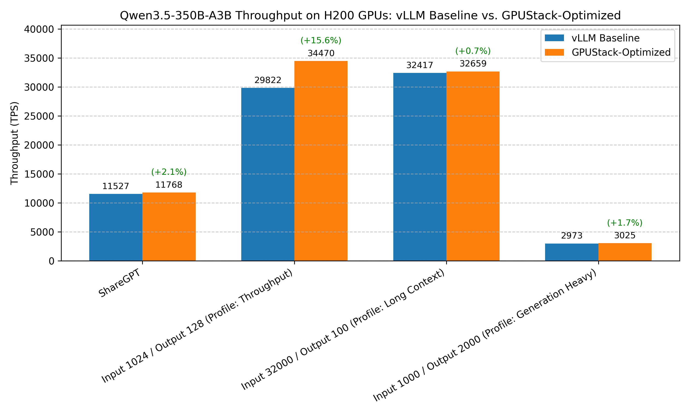

# Optimizing Qwen3.5-9B Throughput

## Conclusion



Recommended configuration for optimizing throughput of Qwen/Qwen3.5-9B on NVIDIA H100 80GB HBM3:

???+ tip "Serving Command"
    ```bash
    vllm serve Qwen/Qwen3.5-9B \
        --reasoning-parser=qwen3 \
        --performance-mode=throughput \
        --max-model-len=32768 \
        --max-num-seqs=512
    ```

Comparison of benchmark results before and after optimization:

| Benchmark Case | baseline (vLLM without any optimizations) | Optimized |
|----------|-------------------------------------------|-----------|
| **ShareGPT Profile** | Total TPS: 11527.14<br>Mean TPOT(ms): 15.12 | Total TPS: 11768.22 <span style="background-color:lightgreen;">(+2.09%)</span><br>Mean TPOT(ms): 15.85 |
| **Throughput Profile** | Total TPS: 29822.16<br>Mean TPOT(ms): 34.63 | Total TPS: 34470.14 <span style="background-color:lightgreen;">(+15.59%)</span><br>Mean TPOT(ms): 36.97 |
| **Long Context Profile** | Total TPS: 32416.84<br>Mean TPOT(ms): 10.21 | Total TPS: 32658.73 <span style="background-color:lightgreen;">(+0.75%)</span><br>Mean TPOT(ms): 9.97 |
| **Generation Heavy Profile** | Total TPS: 2973.42<br>Mean TPOT(ms): 0.33 | Total TPS: 3025.11 <span style="background-color:lightgreen;">(+1.74%)</span><br>Mean TPOT(ms): 0.12 |

!!! note
    1. Our benchmark tests do not cover all possible optimization combinations. For example, we select the inference engine that performs best under its default configuration as the starting point for further tuning. This pruning approach yields a local optimum, which may not be the global optimum.
    2. There are other optimization methods that depend on specific user scenarios, including max batch size, schedule configuration, extended KV cache, CUDA graph, etc. The conclusions in this document can serve as a starting point for more targeted optimizations.
    3. The tests are conducted on specific hardware and software setups. Advances in the inference engine may lead to new conclusions.
    4. Although using quantization may impact accuracy. FP8 quantization can achieve less than 1% accuracy drop for most models. See the [evaluation results](https://github.com/Tencent/AngelSlim/blob/main/README_en.md#-benchmark) for more details. Therefore, it is highly recommended to use FP8 quantization for low-latency serving scenarios.
    5. Speculative decoding can significantly reduce latency for low-concurrency requests. However, the acceleration effect may vary depending on the data distribution of different benchmark datasets and the choice of draft models. For example, the chosen draft model here is trained on English data, which may lead to suboptimal performance on other languages.

If there are any missing points or updates reflecting new changes, please [let us know](https://github.com/gpustack/gpustack/issues/new/choose).

## Experimental Setup

### Model

Qwen/Qwen3.5-9B

### Hardware

NVIDIA H100 80GB HBM3

### Engine Version

- vLLM v0.17.1
- SGLang v0.5.9

### Benchmark Method

This project uses GPUStack's one-click benchmark capability for serving workloads. The benchmark tests in this document were executed with that workflow.

GPUStack's benchmark implementation is built on top of [guidellm](https://github.com/vllm-project/guidellm) via the wrapper project [benchmark-runner](https://github.com/gpustack/benchmark-runner).

GPUStack handles model deployment, benchmark job submission, and result collection for the benchmark configurations listed below.

#### Benchmark Profiles

##### ShareGPT

```yaml
dataset_name: ShareGPT
request_rate: 1000
total_requests: 1000
```

##### Throughput

```yaml
dataset_name: Random
dataset_input_tokens: 1024
dataset_output_tokens: 128
dataset_seed: 42
request_rate: 1000
total_requests: 1000
```

##### Long Context

```yaml
dataset_name: Random
dataset_input_tokens: 32000
dataset_output_tokens: 100
dataset_seed: 42
request_rate: 1
total_requests: 100
```

##### Generation Heavy

```yaml
dataset_name: Random
dataset_input_tokens: 1000
dataset_output_tokens: 2000
dataset_seed: 42
request_rate: 1
total_requests: 200
```

## Experiment Results

### Choosing the Inference Engine

#### vLLM

- Profile: `ShareGPT`
- Backend Parameters:
  ```bash
  --reasoning-parser=qwen3
  --max-model-len=32768
  ```

??? info "Benchmark result"
    ```
    ============ Serving Benchmark Result ============
    Successful requests:                     1000
    Maximum request concurrency:             512
    Benchmark duration (s):                  54.74
    Total input tokens:                      342058
    Total generated tokens:                  281412
    Request throughput (req/s):              18.27
    Output token throughput (tok/s):         5202.94
    Peak output token throughput (tok/s):    20132659.20
    Peak concurrent requests:                512.00
    Total Token throughput (tok/s):          11527.14
    ----------------------Latency---------------------
    Mean Latency(s):                          24.11
    Median Latency(s):                        21.90
    P99 Latency(s):                           51.16
    ---------------Time to First Token----------------
    Mean TTFT (ms):                          1604.23
    Median TTFT (ms):                        646.01
    P95 TTFT (ms):                           N/A
    P99 TTFT (ms):                           5737.27
    -----Time per Output Token (excl. 1st token)------
    Mean TPOT (ms):                          15.12
    Median TPOT (ms):                        3.42
    P95 TPOT (ms):                           N/A
    P99 TPOT (ms):                           127.68
    ---------------Inter-token Latency----------------
    Mean ITL (ms):                           9.45
    Median ITL (ms):                         0.00
    P95 ITL (ms):                            N/A
    P99 ITL (ms):                            118.73
    ==================================================
    ```

#### SGLang

- Profile: `ShareGPT`
- Backend Parameters:
  ```bash
  --reasoning-parser=qwen3
  --context-length=32768
  ```

??? info "Benchmark result"
    ```
    ============ Serving Benchmark Result ============
    Successful requests:                     1000
    Maximum request concurrency:             512
    Benchmark duration (s):                  96.01
    Total input tokens:                      342058
    Total generated tokens:                  281412
    Request throughput (req/s):              10.42
    Output token throughput (tok/s):         2933.60
    Peak output token throughput (tok/s):    92831.68
    Peak concurrent requests:                512.00
    Total Token throughput (tok/s):          6499.41
    ----------------------Latency---------------------
    Mean Latency(s):                          39.08
    Median Latency(s):                        41.18
    P99 Latency(s):                           74.40
    ---------------Time to First Token----------------
    Mean TTFT (ms):                          26217.15
    Median TTFT (ms):                        34401.34
    P95 TTFT (ms):                           N/A
    P99 TTFT (ms):                           41101.27
    -----Time per Output Token (excl. 1st token)------
    Mean TPOT (ms):                          138.86
    Median TPOT (ms):                        112.19
    P95 TPOT (ms):                           N/A
    P99 TPOT (ms):                           591.70
    ---------------Inter-token Latency----------------
    Mean ITL (ms):                           45.86
    Median ITL (ms):                         49.31
    P95 ITL (ms):                            N/A
    P99 ITL (ms):                            59.71
    ==================================================
    ```

- Summary: `vLLM` Total TPS = 11527.14, `SGLang` Total TPS = 6499.41. `vLLM` is faster by 5027.72 tok/s (77.36%); Mean TPOT = 15.12 ms vs 138.86 ms, reduced by 123.74 ms (89.11%).

### Prefix Cache

- Profile: `ShareGPT`
- Backend Parameters:
  ```bash
  --reasoning-parser=qwen3
  --enable-prefix-caching
  --max-model-len=32768
  ```

??? info "Benchmark result"
    ```
    ============ Serving Benchmark Result ============
    Successful requests:                     1000
    Maximum request concurrency:             512
    Benchmark duration (s):                  56.47
    Total input tokens:                      342058
    Total generated tokens:                  281412
    Request throughput (req/s):              17.71
    Output token throughput (tok/s):         5066.42
    Peak output token throughput (tok/s):    31242972.50
    Peak concurrent requests:                512.00
    Total Token throughput (tok/s):          11224.70
    ----------------------Latency---------------------
    Mean Latency(s):                          24.90
    Median Latency(s):                        22.40
    P99 Latency(s):                           52.82
    ---------------Time to First Token----------------
    Mean TTFT (ms):                          1995.45
    Median TTFT (ms):                        1341.75
    P95 TTFT (ms):                           N/A
    P99 TTFT (ms):                           6549.80
    -----Time per Output Token (excl. 1st token)------
    Mean TPOT (ms):                          16.66
    Median TPOT (ms):                        5.21
    P95 TPOT (ms):                           N/A
    P99 TPOT (ms):                           130.98
    ---------------Inter-token Latency----------------
    Mean ITL (ms):                           9.60
    Median ITL (ms):                         0.00
    P95 ITL (ms):                            N/A
    P99 ITL (ms):                            120.90
    ==================================================
    ```

### Speculative Decoding

- Profile: `ShareGPT`
- Backend Parameters:
  ```bash
  --reasoning-parser=qwen3
  --speculative-config={"method":"mtp","num_speculative_tokens":4}
  --max-model-len=32768
  ```

??? info "Benchmark result"
    ```
    ============ Serving Benchmark Result ============
    Successful requests:                     514
    Maximum request concurrency:             512
    Benchmark duration (s):                  12.27
    Total input tokens:                      23313
    Total generated tokens:                  131530
    Request throughput (req/s):              41.90
    Output token throughput (tok/s):         12792.49
    Peak output token throughput (tok/s):    13918875.50
    Peak concurrent requests:                512.00
    Total Token throughput (tok/s):          15059.89
    ----------------------Latency---------------------
    Mean Latency(s):                          11.77
    Median Latency(s):                        11.81
    P99 Latency(s):                           12.07
    ---------------Time to First Token----------------
    Mean TTFT (ms):                          268.95
    Median TTFT (ms):                        0.00
    P95 TTFT (ms):                           N/A
    P99 TTFT (ms):                           3010.96
    -----Time per Output Token (excl. 1st token)------
    Mean TPOT (ms):                          42.50
    Median TPOT (ms):                        31.35
    P95 TPOT (ms):                           N/A
    P99 TPOT (ms):                           214.99
    ---------------Inter-token Latency----------------
    Mean ITL (ms):                           0.00
    Median ITL (ms):                         0.00
    P95 ITL (ms):                            N/A
    P99 ITL (ms):                            0.00
    ==================================================
    ```

### Performance Mode

- Profile: `ShareGPT`
- Backend Parameters:
  ```bash
  --reasoning-parser=qwen3
  --performance-mode=throughput
  --max-model-len=32768
  ```

??? info "Benchmark result"
    ```
    ============ Serving Benchmark Result ============
    Successful requests:                     1000
    Maximum request concurrency:             512
    Benchmark duration (s):                  54.66
    Total input tokens:                      342058
    Total generated tokens:                  281412
    Request throughput (req/s):              18.29
    Output token throughput (tok/s):         5189.06
    Peak output token throughput (tok/s):    30482939.47
    Peak concurrent requests:                512.00
    Total Token throughput (tok/s):          11496.39
    ----------------------Latency---------------------
    Mean Latency(s):                          24.00
    Median Latency(s):                        21.51
    P95 Latency(s):                           N/A
    P99 Latency(s):                           51.01
    ---------------Time to First Token----------------
    Mean TTFT (ms):                          1824.24
    Median TTFT (ms):                        982.10
    P95 TTFT (ms):                           N/A
    P99 TTFT (ms):                           5550.00
    -----Time per Output Token (excl. 1st token)------
    Mean TPOT (ms):                          16.41
    Median TPOT (ms):                        4.53
    P95 TPOT (ms):                           N/A
    P99 TPOT (ms):                           127.10
    ---------------Inter-token Latency----------------
    Mean ITL (ms):                           9.96
    Median ITL (ms):                         0.00
    P95 ITL (ms):                            N/A
    P99 ITL (ms):                            115.72
    ==================================================
    ```

### Max Num Seqs

#### Seqs 512

- Profile: `ShareGPT`
- Backend Parameters:
  ```bash
  --reasoning-parser=qwen3
  --max-model-len=32768
  --max-num-seqs=512
  ```

??? info "Benchmark result"
    ```
    ============ Serving Benchmark Result ============
    Successful requests:                     1000
    Maximum request concurrency:             512
    Benchmark duration (s):                  54.89
    Total input tokens:                      342058
    Total generated tokens:                  281412
    Request throughput (req/s):              18.22
    Output token throughput (tok/s):         5174.68
    Peak output token throughput (tok/s):    21197768.76
    Peak concurrent requests:                512.00
    Total Token throughput (tok/s):          11464.53
    ----------------------Latency---------------------
    Mean Latency(s):                          24.11
    Median Latency(s):                        21.96
    P95 Latency(s):                           48.41
    P99 Latency(s):                           51.17
    ---------------Time to First Token----------------
    Mean TTFT (ms):                          1893.47
    Median TTFT (ms):                        1233.85
    P95 TTFT (ms):                           5659.91
    P99 TTFT (ms):                           6222.94
    -----Time per Output Token (excl. 1st token)------
    Mean TPOT (ms):                          16.18
    Median TPOT (ms):                        4.48
    P95 TPOT (ms):                           91.71
    P99 TPOT (ms):                           127.60
    ---------------Inter-token Latency----------------
    Mean ITL (ms):                           9.48
    Median ITL (ms):                         0.00
    P95 ITL (ms):                            83.92
    P99 ITL (ms):                            116.65
    ==================================================
    ```

#### Seqs 1024

- Profile: `ShareGPT`
- Backend Parameters:
  ```bash
  --reasoning-parser=qwen3
  --max-model-len=32768
  --max-num-seqs=1024
  ```

??? info "Benchmark result"
    ```
    ============ Serving Benchmark Result ============
    Successful requests:                     1000
    Maximum request concurrency:             512
    Benchmark duration (s):                  54.87
    Total input tokens:                      342058
    Total generated tokens:                  281412
    Request throughput (req/s):              18.23
    Output token throughput (tok/s):         5205.42
    Peak output token throughput (tok/s):    22885338.88
    Peak concurrent requests:                512.00
    Total Token throughput (tok/s):          11532.64
    ----------------------Latency---------------------
    Mean Latency(s):                          24.15
    Median Latency(s):                        21.71
    P95 Latency(s):                           48.49
    P99 Latency(s):                           51.24
    ---------------Time to First Token----------------
    Mean TTFT (ms):                          1864.39
    Median TTFT (ms):                        1137.51
    P95 TTFT (ms):                           5803.37
    P99 TTFT (ms):                           6125.80
    -----Time per Output Token (excl. 1st token)------
    Mean TPOT (ms):                          16.87
    Median TPOT (ms):                        4.70
    P95 TPOT (ms):                           93.65
    P99 TPOT (ms):                           127.45
    ---------------Inter-token Latency----------------
    Mean ITL (ms):                           10.28
    Median ITL (ms):                         0.00
    P95 ITL (ms):                            87.39
    P99 ITL (ms):                            116.13
    ==================================================
    ```

#### Seqs 2048

- Profile: `ShareGPT`
- Backend Parameters:
  ```bash
  --reasoning-parser=qwen3
  --max-model-len=32768
  --max-num-seqs=2048
  ```

??? info "Benchmark result"
    ```
    ============ Serving Benchmark Result ============
    Successful requests:                     1000
    Maximum request concurrency:             512
    Benchmark duration (s):                  55.28
    Total input tokens:                      342058
    Total generated tokens:                  281412
    Request throughput (req/s):              18.09
    Output token throughput (tok/s):         5140.19
    Peak output token throughput (tok/s):    23553347.13
    Peak concurrent requests:                512.00
    Total Token throughput (tok/s):          11388.13
    ----------------------Latency---------------------
    Mean Latency(s):                          24.34
    Median Latency(s):                        22.16
    P95 Latency(s):                           48.86
    P99 Latency(s):                           51.63
    ---------------Time to First Token----------------
    Mean TTFT (ms):                          1853.85
    Median TTFT (ms):                        1166.25
    P95 TTFT (ms):                           5543.84
    P99 TTFT (ms):                           6126.03
    -----Time per Output Token (excl. 1st token)------
    Mean TPOT (ms):                          16.91
    Median TPOT (ms):                        4.35
    P95 TPOT (ms):                           100.86
    P99 TPOT (ms):                           129.26
    ---------------Inter-token Latency----------------
    Mean ITL (ms):                           10.36
    Median ITL (ms):                         0.00
    P95 ITL (ms):                            94.30
    P99 ITL (ms):                            118.29
    ==================================================
    ```

- Summary: `Seqs 1024` Total TPS = 11532.64, `Seqs 2048` Total TPS = 11388.13. `Seqs 1024` is faster by 144.51 tok/s (1.27%); Mean TPOT = 16.87 ms vs 16.91 ms, reduced by 0.04 ms (0.25%).

### Max Batched Tokens && Performance Mode

#### 24k

- Profile: `ShareGPT`
- Backend Parameters:
  ```bash
  --reasoning-parser=qwen3
  --performance-mode=throughput
  --max-model-len=32768
  --max-num-batched-tokens=24576
  ```

??? info "Benchmark result"
    ```
    ============ Serving Benchmark Result ============
    Successful requests:                     1000
    Maximum request concurrency:             512
    Benchmark duration (s):                  54.56
    Total input tokens:                      342058
    Total generated tokens:                  281412
    Request throughput (req/s):              18.33
    Output token throughput (tok/s):         5196.51
    Peak output token throughput (tok/s):    32356059.43
    Peak concurrent requests:                512.00
    Total Token throughput (tok/s):          11512.90
    ----------------------Latency---------------------
    Mean Latency(s):                          23.98
    Median Latency(s):                        21.78
    P99 Latency(s):                           50.95
    ---------------Time to First Token----------------
    Mean TTFT (ms):                          1870.77
    Median TTFT (ms):                        1771.31
    P95 TTFT (ms):                           N/A
    P99 TTFT (ms):                           5297.37
    -----Time per Output Token (excl. 1st token)------
    Mean TPOT (ms):                          15.83
    Median TPOT (ms):                        4.86
    P95 TPOT (ms):                           N/A
    P99 TPOT (ms):                           125.06
    ---------------Inter-token Latency----------------
    Mean ITL (ms):                           9.22
    Median ITL (ms):                         0.00
    P95 ITL (ms):                            N/A
    P99 ITL (ms):                            113.92
    ==================================================
    ```

#### 32k

- Profile: `ShareGPT`
- Backend Parameters:
  ```bash
  --reasoning-parser=qwen3
  --performance-mode=throughput
  --max-model-len=32768
  --max-num-batched-tokens=32768
  ```

??? info "Benchmark result"
    ```
    ============ Serving Benchmark Result ============
    Successful requests:                     1000
    Maximum request concurrency:             512
    Benchmark duration (s):                  54.20
    Total input tokens:                      342058
    Total generated tokens:                  281412
    Request throughput (req/s):              18.45
    Output token throughput (tok/s):         5268.65
    Peak output token throughput (tok/s):    29985425.61
    Peak concurrent requests:                512.00
    Total Token throughput (tok/s):          11672.72
    ----------------------Latency---------------------
    Mean Latency(s):                          23.72
    Median Latency(s):                        21.21
    P99 Latency(s):                           50.44
    ---------------Time to First Token----------------
    Mean TTFT (ms):                          1970.35
    Median TTFT (ms):                        1344.71
    P95 TTFT (ms):                           N/A
    P99 TTFT (ms):                           5206.15
    -----Time per Output Token (excl. 1st token)------
    Mean TPOT (ms):                          16.53
    Median TPOT (ms):                        5.04
    P95 TPOT (ms):                           N/A
    P99 TPOT (ms):                           125.98
    ---------------Inter-token Latency----------------
    Mean ITL (ms):                           9.56
    Median ITL (ms):                         0.00
    P95 ITL (ms):                            N/A
    P99 ITL (ms):                            111.59
    ==================================================
    ```

- Summary: `32k` Total TPS = 11672.72, `24k` Total TPS = 11512.90. `32k` is faster by 159.82 tok/s (1.39%); Mean TPOT = 16.53 ms vs 15.83 ms, increased by 0.70 ms (4.43% slower).

### Max Num Seqs && Performance Mode

#### Max Num Seqs 256

- Profile: `ShareGPT`
- Backend Parameters:
  ```bash
  --reasoning-parser=qwen3
  --performance-mode=throughput
  --max-model-len=32768
  --max-num-seqs=256
  ```

??? info "Benchmark result"
    ```
    ============ Serving Benchmark Result ============
    Successful requests:                     1000
    Maximum request concurrency:             512
    Benchmark duration (s):                  57.32
    Total input tokens:                      342058
    Total generated tokens:                  281412
    Request throughput (req/s):              17.45
    Output token throughput (tok/s):         4973.66
    Peak output token throughput (tok/s):    30062067.31
    Peak concurrent requests:                512.00
    Total Token throughput (tok/s):          11019.18
    ----------------------Latency---------------------
    Mean Latency(s):                          23.57
    Median Latency(s):                        22.86
    P99 Latency(s):                           49.24
    ---------------Time to First Token----------------
    Mean TTFT (ms):                          11061.67
    Median TTFT (ms):                        14983.14
    P95 TTFT (ms):                           N/A
    P99 TTFT (ms):                           18807.73
    -----Time per Output Token (excl. 1st token)------
    Mean TPOT (ms):                          44.58
    Median TPOT (ms):                        31.66
    P95 TPOT (ms):                           N/A
    P99 TPOT (ms):                           229.02
    ---------------Inter-token Latency----------------
    Mean ITL (ms):                           5.29
    Median ITL (ms):                         0.00
    P95 ITL (ms):                            N/A
    P99 ITL (ms):                            54.12
    ==================================================
    ```

#### Max Num Seqs 512

- Profile: `ShareGPT`
- Backend Parameters:
  ```bash
  --reasoning-parser=qwen3
  --performance-mode=throughput
  --max-model-len=32768
  --max-num-seqs=512
  ```

??? info "Benchmark result"
    ```
    ============ Serving Benchmark Result ============
    Successful requests:                     1000
    Maximum request concurrency:             512
    Benchmark duration (s):                  53.72
    Total input tokens:                      342058
    Total generated tokens:                  281412
    Request throughput (req/s):              18.62
    Output token throughput (tok/s):         5311.75
    Peak output token throughput (tok/s):    23159852.52
    Peak concurrent requests:                512.00
    Total Token throughput (tok/s):          11768.22
    ----------------------Latency---------------------
    Mean Latency(s):                          23.50
    Median Latency(s):                        21.13
    P99 Latency(s):                           50.04
    ---------------Time to First Token----------------
    Mean TTFT (ms):                          1826.53
    Median TTFT (ms):                        1004.67
    P95 TTFT (ms):                           N/A
    P99 TTFT (ms):                           5582.79
    -----Time per Output Token (excl. 1st token)------
    Mean TPOT (ms):                          15.85
    Median TPOT (ms):                        4.49
    P95 TPOT (ms):                           N/A
    P99 TPOT (ms):                           123.40
    ---------------Inter-token Latency----------------
    Mean ITL (ms):                           9.39
    Median ITL (ms):                         0.00
    P95 ITL (ms):                            N/A
    P99 ITL (ms):                            112.55
    ==================================================
    ```

- Summary: `Max Num Seqs 512` Total TPS = 11768.22, `Max Num Seqs 256` Total TPS = 11019.18. `Max Num Seqs 512` is faster by 749.05 tok/s (6.80%); Mean TPOT = 15.85 ms vs 44.58 ms, reduced by 28.73 ms (64.45%).

### Max Num Seqs && Max Batched Tokens

- Profile: `ShareGPT`
- Backend Parameters:
  ```bash
  --reasoning-parser=qwen3
  --performance-mode=throughput
  --max-model-len=32768
  --max-num-batched-tokens=32768
  --max-num-seqs=512
  ```

??? info "Benchmark result"
    ```
    ============ Serving Benchmark Result ============
    Successful requests:                     1000
    Maximum request concurrency:             512
    Benchmark duration (s):                  55.33
    Total input tokens:                      342058
    Total generated tokens:                  281412
    Request throughput (req/s):              18.07
    Output token throughput (tok/s):         5115.71
    Peak output token throughput (tok/s):    34751436.57
    Peak concurrent requests:                512.00
    Total Token throughput (tok/s):          11333.89
    ----------------------Latency---------------------
    Mean Latency(s):                          24.34
    Median Latency(s):                        22.08
    P99 Latency(s):                           51.69
    ---------------Time to First Token----------------
    Mean TTFT (ms):                          1831.81
    Median TTFT (ms):                        1345.90
    P95 TTFT (ms):                           N/A
    P99 TTFT (ms):                           5161.86
    -----Time per Output Token (excl. 1st token)------
    Mean TPOT (ms):                          16.39
    Median TPOT (ms):                        4.48
    P95 TPOT (ms):                           N/A
    P99 TPOT (ms):                           127.14
    ---------------Inter-token Latency----------------
    Mean ITL (ms):                           9.92
    Median ITL (ms):                         0.00
    P95 ITL (ms):                            N/A
    P99 ITL (ms):                            116.48
    ==================================================
    ```

### Max Num Seqs && Max Batched Tokens && Performance Mode

#### Batch Token 32k and Seqs 512

- Profile: `ShareGPT`
- Backend Parameters:
  ```bash
  --reasoning-parser=qwen3
  --performance-mode=throughput
  --max-model-len=32768
  --max-num-batched-tokens=32768
  --max-num-seqs=512
  ```

??? info "Benchmark result"
    ```
    ============ Serving Benchmark Result ============
    Successful requests:                     1000
    Maximum request concurrency:             512
    Benchmark duration (s):                  55.33
    Total input tokens:                      342058
    Total generated tokens:                  281412
    Request throughput (req/s):              18.07
    Output token throughput (tok/s):         5115.71
    Peak output token throughput (tok/s):    34751436.57
    Peak concurrent requests:                512.00
    Total Token throughput (tok/s):          11333.89
    ----------------------Latency---------------------
    Mean Latency(s):                          24.34
    Median Latency(s):                        22.08
    P95 Latency(s):                           N/A
    P99 Latency(s):                           51.69
    ---------------Time to First Token----------------
    Mean TTFT (ms):                          1831.81
    Median TTFT (ms):                        1345.90
    P95 TTFT (ms):                           N/A
    P99 TTFT (ms):                           5161.86
    -----Time per Output Token (excl. 1st token)------
    Mean TPOT (ms):                          16.39
    Median TPOT (ms):                        4.48
    P95 TPOT (ms):                           N/A
    P99 TPOT (ms):                           127.14
    ---------------Inter-token Latency----------------
    Mean ITL (ms):                           9.92
    Median ITL (ms):                         0.00
    P95 ITL (ms):                            N/A
    P99 ITL (ms):                            116.48
    ==================================================
    ```

#### Batch Token 48k and Seqs 512

- Profile: `ShareGPT`
- Backend Parameters:
  ```bash
  --reasoning-parser=qwen3
  --performance-mode=throughput
  --max-model-len=32768
  --max-num-batched-tokens=49152
  --max-num-seqs=512
  ```

??? info "Benchmark result"
    ```
    ============ Serving Benchmark Result ============
    Successful requests:                     1000
    Maximum request concurrency:             512
    Benchmark duration (s):                  54.48
    Total input tokens:                      342058
    Total generated tokens:                  281412
    Request throughput (req/s):              18.36
    Output token throughput (tok/s):         5223.82
    Peak output token throughput (tok/s):    33459752.45
    Peak concurrent requests:                512.00
    Total Token throughput (tok/s):          11573.41
    ----------------------Latency---------------------
    Mean Latency(s):                          23.96
    Median Latency(s):                        21.63
    P95 Latency(s):                           N/A
    P99 Latency(s):                           50.92
    ---------------Time to First Token----------------
    Mean TTFT (ms):                          2022.91
    Median TTFT (ms):                        2480.42
    P95 TTFT (ms):                           N/A
    P99 TTFT (ms):                           5146.54
    -----Time per Output Token (excl. 1st token)------
    Mean TPOT (ms):                          16.20
    Median TPOT (ms):                        5.63
    P95 TPOT (ms):                           N/A
    P99 TPOT (ms):                           124.01
    ---------------Inter-token Latency----------------
    Mean ITL (ms):                           9.04
    Median ITL (ms):                         0.00
    P95 ITL (ms):                            N/A
    P99 ITL (ms):                            111.00
    ==================================================
    ```

#### Batch Token 48k and Seqs 768

- Profile: `ShareGPT`
- Backend Parameters:
  ```bash
  --reasoning-parser=qwen3
  --performance-mode=throughput
  --max-model-len=32768
  --max-num-batched-tokens=49152
  --max-num-seqs=768
  ```

??? info "Benchmark result"
    ```
    ============ Serving Benchmark Result ============
    Successful requests:                     1000
    Maximum request concurrency:             512
    Benchmark duration (s):                  54.07
    Total input tokens:                      342058
    Total generated tokens:                  281412
    Request throughput (req/s):              18.49
    Output token throughput (tok/s):         5248.67
    Peak output token throughput (tok/s):    36318641.50
    Peak concurrent requests:                512.00
    Total Token throughput (tok/s):          11628.47
    ----------------------Latency---------------------
    Mean Latency(s):                          23.72
    Median Latency(s):                        21.75
    P95 Latency(s):                           N/A
    P99 Latency(s):                           50.48
    ---------------Time to First Token----------------
    Mean TTFT (ms):                          1817.87
    Median TTFT (ms):                        1821.59
    P95 TTFT (ms):                           N/A
    P99 TTFT (ms):                           5041.22
    -----Time per Output Token (excl. 1st token)------
    Mean TPOT (ms):                          15.65
    Median TPOT (ms):                        4.57
    P95 TPOT (ms):                           N/A
    P99 TPOT (ms):                           123.59
    ---------------Inter-token Latency----------------
    Mean ITL (ms):                           9.23
    Median ITL (ms):                         0.00
    P95 ITL (ms):                            N/A
    P99 ITL (ms):                            114.09
    ==================================================
    ```

- Summary: `Batch Token 48k and Seqs 768` Total TPS = 11628.47, `Batch Token 32k and Seqs 512` Total TPS = 11333.89. `Batch Token 48k and Seqs 768` is faster by 294.57 tok/s (2.60%); Mean TPOT = 15.65 ms vs 16.39 ms, reduced by 0.74 ms (4.51%).

### Summary of Optimization Options

| Benchmark Cases | Optimized | Baseline |
| --------------------------------------- | ------------------------------------------------------------------------------------------------------- | ------------------------------------------ |
| Choosing the Inference Engine | Total TPS: 11527.14 <span style="background-color:lightgreen;">(+0.00%)</span><br>Mean TPOT(ms): 15.12 | Total TPS: 11527.14<br>Mean TPOT(ms): 15.12 |
| Prefix Cache | Total TPS: 11224.70 <span style="background-color:#ffd6d6;">(-2.62%)</span><br>Mean TPOT(ms): 16.66 | Total TPS: 11527.14<br>Mean TPOT(ms): 15.12 |
| Speculative Decodng | Total TPS: 15059.89 <span style="background-color:#ffd6d6;">(Success rate: 51.5%, optimization skipped)</span><br>Mean TPOT(ms): 42.50 | Total TPS: 11527.14<br>Mean TPOT(ms): 15.12 |
| Performance Mode | Total TPS: 11496.39 <span style="background-color:#ffd6d6;">(-0.27%)</span><br>Mean TPOT(ms): 16.41 | Total TPS: 11527.14<br>Mean TPOT(ms): 15.12 |
| Max Num Seqs | Total TPS: 11532.64 <span style="background-color:lightgreen;">(+0.05%)</span><br>Mean TPOT(ms): 16.87 | Total TPS: 11527.14<br>Mean TPOT(ms): 15.12 |
| Max Batched Tokens && Performance Mode | Total TPS: 11672.72 <span style="background-color:lightgreen;">(+1.26%)</span><br>Mean TPOT(ms): 16.53 | Total TPS: 11527.14<br>Mean TPOT(ms): 15.12 |
| Max Num Seqs && Performance Mode | Total TPS: 11768.22 <span style="background-color:lightgreen;">(+2.09%)</span><br>Mean TPOT(ms): 15.85 | Total TPS: 11527.14<br>Mean TPOT(ms): 15.12 |
| Max Num Seqs && Max Batched Tokens | Total TPS: 11333.89 <span style="background-color:#ffd6d6;">(-1.68%)</span><br>Mean TPOT(ms): 16.39 | Total TPS: 11527.14<br>Mean TPOT(ms): 15.12 |
| Max Num Seqs && Max Batched Tokens && Performance Mode | Total TPS: 11628.47 <span style="background-color:lightgreen;">(+0.88%)</span><br>Mean TPOT(ms): 15.65 | Total TPS: 11527.14<br>Mean TPOT(ms): 15.12 |

### Other Benchmark Cases

#### ShareGPT Profile

- Baseline Backend Parameters:
  ```bash
  --reasoning-parser=qwen3
  --max-model-len=32768
  ```

??? info "Baseline benchmark result"
    ```
    ============ Serving Benchmark Result ============
    Successful requests:                     1000
    Maximum request concurrency:             512
    Benchmark duration (s):                  54.74
    Total input tokens:                      342058
    Total generated tokens:                  281412
    Request throughput (req/s):              18.27
    Output token throughput (tok/s):         5202.94
    Peak output token throughput (tok/s):    20132659.20
    Peak concurrent requests:                512.00
    Total Token throughput (tok/s):          11527.14
    ----------------------Latency---------------------
    Mean Latency(s):                          24.11
    Median Latency(s):                        21.90
    P99 Latency(s):                           51.16
    ---------------Time to First Token----------------
    Mean TTFT (ms):                          1604.23
    Median TTFT (ms):                        646.01
    P95 TTFT (ms):                           N/A
    P99 TTFT (ms):                           5737.27
    -----Time per Output Token (excl. 1st token)------
    Mean TPOT (ms):                          15.12
    Median TPOT (ms):                        3.42
    P95 TPOT (ms):                           N/A
    P99 TPOT (ms):                           127.68
    ---------------Inter-token Latency----------------
    Mean ITL (ms):                           9.45
    Median ITL (ms):                         0.00
    P95 ITL (ms):                            N/A
    P99 ITL (ms):                            118.73
    ==================================================
    ```

- Optimized Backend Parameters:
  ```bash
  --reasoning-parser=qwen3
  --performance-mode=throughput
  --max-model-len=32768
  --max-num-seqs=512
  ```

??? info "Optimized benchmark result"
    ```
    ============ Serving Benchmark Result ============
    Successful requests:                     1000
    Maximum request concurrency:             512
    Benchmark duration (s):                  53.72
    Total input tokens:                      342058
    Total generated tokens:                  281412
    Request throughput (req/s):              18.62
    Output token throughput (tok/s):         5311.75
    Peak output token throughput (tok/s):    23159852.52
    Peak concurrent requests:                512.00
    Total Token throughput (tok/s):          11768.22
    ----------------------Latency---------------------
    Mean Latency(s):                          23.50
    Median Latency(s):                        21.13
    P99 Latency(s):                           50.04
    ---------------Time to First Token----------------
    Mean TTFT (ms):                          1826.53
    Median TTFT (ms):                        1004.67
    P95 TTFT (ms):                           N/A
    P99 TTFT (ms):                           5582.79
    -----Time per Output Token (excl. 1st token)------
    Mean TPOT (ms):                          15.85
    Median TPOT (ms):                        4.49
    P95 TPOT (ms):                           N/A
    P99 TPOT (ms):                           123.40
    ---------------Inter-token Latency----------------
    Mean ITL (ms):                           9.39
    Median ITL (ms):                         0.00
    P95 ITL (ms):                            N/A
    P99 ITL (ms):                            112.55
    ==================================================
    ```

#### Throughput Profile

- Baseline Backend Parameters:
  ```bash
  --reasoning-parser=qwen3
  --max-model-len=32768
  ```

??? info "Baseline benchmark result"
    ```
    ============ Serving Benchmark Result ============
    Successful requests:                     1000
    Maximum request concurrency:             512
    Benchmark duration (s):                  43.00
    Total input tokens:                      1033932
    Total generated tokens:                  128000
    Request throughput (req/s):              23.26
    Output token throughput (tok/s):         3285.25
    Peak output token throughput (tok/s):    4418690.63
    Peak concurrent requests:                512.00
    Total Token throughput (tok/s):          29822.16
    ----------------------Latency---------------------
    Mean Latency(s):                          21.27
    Median Latency(s):                        21.11
    P99 Latency(s):                           36.40
    ---------------Time to First Token----------------
    Mean TTFT (ms):                          4433.02
    Median TTFT (ms):                        1510.44
    P95 TTFT (ms):                           N/A
    P99 TTFT (ms):                           14914.93
    -----Time per Output Token (excl. 1st token)------
    Mean TPOT (ms):                          34.63
    Median TPOT (ms):                        11.80
    P95 TPOT (ms):                           N/A
    P99 TPOT (ms):                           116.52
    ---------------Inter-token Latency----------------
    Mean ITL (ms):                           0.00
    Median ITL (ms):                         0.00
    P95 ITL (ms):                            N/A
    P99 ITL (ms):                            0.00
    ==================================================
    ```

- Optimized Backend Parameters:
  ```bash
  --reasoning-parser=qwen3
  --performance-mode=throughput
  --max-model-len=32768
  --max-num-seqs=512
  ```

??? info "Optimized benchmark result"
    ```
    ============ Serving Benchmark Result ============
    Successful requests:                     1000
    Maximum request concurrency:             512
    Benchmark duration (s):                  39.10
    Total input tokens:                      1033932
    Total generated tokens:                  128000
    Request throughput (req/s):              25.55
    Output token throughput (tok/s):         3797.28
    Peak output token throughput (tok/s):    7724761.32
    Peak concurrent requests:                512.00
    Total Token throughput (tok/s):          34470.14
    ----------------------Latency---------------------
    Mean Latency(s):                          19.38
    Median Latency(s):                        19.24
    P99 Latency(s):                           31.36
    ---------------Time to First Token----------------
    Mean TTFT (ms):                          4731.56
    Median TTFT (ms):                        2442.61
    P95 TTFT (ms):                           N/A
    P99 TTFT (ms):                           13309.82
    -----Time per Output Token (excl. 1st token)------
    Mean TPOT (ms):                          36.97
    Median TPOT (ms):                        19.08
    P95 TPOT (ms):                           N/A
    P99 TPOT (ms):                           103.98
    ---------------Inter-token Latency----------------
    Mean ITL (ms):                           0.00
    Median ITL (ms):                         0.00
    P95 ITL (ms):                            N/A
    P99 ITL (ms):                            0.00
    ==================================================
    ```

#### Long Context Profile

- Baseline Backend Parameters:
  ```bash
  --reasoning-parser=qwen3
  --max-model-len=32768
  ```

??? info "Baseline benchmark result"
    ```
    ============ Serving Benchmark Result ============
    Successful requests:                     100
    Maximum request concurrency:             9
    Benchmark duration (s):                  100.89
    Total input tokens:                      3200993
    Total generated tokens:                  10000
    Request throughput (req/s):              0.99
    Output token throughput (tok/s):         100.96
    Peak output token throughput (tok/s):    198.08
    Peak concurrent requests:                9.00
    Total Token throughput (tok/s):          32416.84
    ----------------------Latency---------------------
    Mean Latency(s):                          7.88
    Median Latency(s):                        8.10
    P95 Latency(s):                           N/A
    P99 Latency(s):                           8.54
    ---------------Time to First Token----------------
    Mean TTFT (ms):                          1021.12
    Median TTFT (ms):                        1020.12
    P95 TTFT (ms):                           N/A
    P99 TTFT (ms):                           1041.80
    -----Time per Output Token (excl. 1st token)------
    Mean TPOT (ms):                          10.21
    Median TPOT (ms):                        10.20
    P95 TPOT (ms):                           N/A
    P99 TPOT (ms):                           10.42
    ---------------Inter-token Latency----------------
    Mean ITL (ms):                           0.00
    Median ITL (ms):                         0.00
    P95 ITL (ms):                            N/A
    P99 ITL (ms):                            0.00
    ==================================================
    ```

- Optimized Backend Parameters:
  ```bash
  --reasoning-parser=qwen3
  --performance-mode=throughput
  --max-model-len=32768
  --max-num-seqs=512
  ```

??? info "Optimized benchmark result"
    ```
    ============ Serving Benchmark Result ============
    Successful requests:                     100
    Maximum request concurrency:             14
    Benchmark duration (s):                  100.13
    Total input tokens:                      3200993
    Total generated tokens:                  10000
    Request throughput (req/s):              1.00
    Output token throughput (tok/s):         101.71
    Peak output token throughput (tok/s):    227.24
    Peak concurrent requests:                14.00
    Total Token throughput (tok/s):          32658.73
    ----------------------Latency---------------------
    Mean Latency(s):                          8.00
    Median Latency(s):                        8.00
    P99 Latency(s):                           12.36
    ---------------Time to First Token----------------
    Mean TTFT (ms):                          997.50
    Median TTFT (ms):                        981.01
    P95 TTFT (ms):                           N/A
    P99 TTFT (ms):                           1421.73
    -----Time per Output Token (excl. 1st token)------
    Mean TPOT (ms):                          9.97
    Median TPOT (ms):                        9.81
    P95 TPOT (ms):                           N/A
    P99 TPOT (ms):                           14.22
    ---------------Inter-token Latency----------------
    Mean ITL (ms):                           0.00
    Median ITL (ms):                         0.00
    P95 ITL (ms):                            N/A
    P99 ITL (ms):                            0.00
    ==================================================
    ```

#### Generation Heavy Profile

- Baseline Backend Parameters:
  ```bash
  --reasoning-parser=qwen3
  --max-model-len=32768
  ```

??? info "Baseline benchmark result"
    ```
    ============ Serving Benchmark Result ============
    Successful requests:                     200
    Maximum request concurrency:             18
    Benchmark duration (s):                  214.96
    Total input tokens:                      201982
    Total generated tokens:                  400000
    Request throughput (req/s):              0.93
    Output token throughput (tok/s):         1975.75
    Peak output token throughput (tok/s):    123795.17
    Peak concurrent requests:                18.00
    Total Token throughput (tok/s):          2973.42
    ----------------------Latency---------------------
    Mean Latency(s):                          17.48
    Median Latency(s):                        17.59
    P99 Latency(s):                           17.60
    ---------------Time to First Token----------------
    Mean TTFT (ms):                          54.95
    Median TTFT (ms):                        55.17
    P95 TTFT (ms):                           N/A
    P99 TTFT (ms):                           59.50
    -----Time per Output Token (excl. 1st token)------
    Mean TPOT (ms):                          0.33
    Median TPOT (ms):                        0.03
    P95 TPOT (ms):                           N/A
    P99 TPOT (ms):                           8.79
    ---------------Inter-token Latency----------------
    Mean ITL (ms):                           0.31
    Median ITL (ms):                         0.00
    P95 ITL (ms):                            N/A
    P99 ITL (ms):                            8.77
    ==================================================
    ```

- Optimized Backend Parameters:
  ```bash
  --reasoning-parser=qwen3
  --performance-mode=throughput
  --max-model-len=32768
  --max-num-seqs=512
  ```

??? info "Optimized benchmark result"
    ```
    ============ Serving Benchmark Result ============
    Successful requests:                     200
    Maximum request concurrency:             18
    Benchmark duration (s):                  214.98
    Total input tokens:                      201982
    Total generated tokens:                  400000
    Request throughput (req/s):              0.93
    Output token throughput (tok/s):         2010.10
    Peak output token throughput (tok/s):    59750.47
    Peak concurrent requests:                18.00
    Total Token throughput (tok/s):          3025.11
    ----------------------Latency---------------------
    Mean Latency(s):                          17.55
    Median Latency(s):                        17.66
    P99 Latency(s):                           17.67
    ---------------Time to First Token----------------
    Mean TTFT (ms):                          55.85
    Median TTFT (ms):                        56.01
    P95 TTFT (ms):                           N/A
    P99 TTFT (ms):                           60.00
    -----Time per Output Token (excl. 1st token)------
    Mean TPOT (ms):                          0.12
    Median TPOT (ms):                        0.03
    P95 TPOT (ms):                           N/A
    P99 TPOT (ms):                           0.03
    ---------------Inter-token Latency----------------
    Mean ITL (ms):                           0.09
    Median ITL (ms):                         0.00
    P95 ITL (ms):                            N/A
    P99 ITL (ms):                            0.00
    ==================================================
    ```
