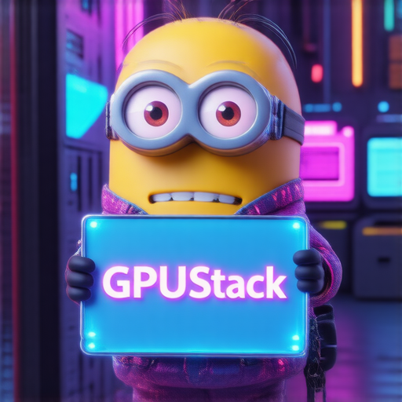

# Quickstart

## Installation

### Linux or MacOS

GPUStack provides a script to install it as a service on systemd or launchd based systems. To install GPUStack using this method, just run:

```bash
curl -sfL https://get.gpustack.ai | sh -s -
```

### Windows

Run PowerShell as administrator (**avoid** using PowerShell ISE), then run the following command to install GPUStack:

```powershell
Invoke-Expression (Invoke-WebRequest -Uri "https://get.gpustack.ai" -UseBasicParsing).Content
```

### Other Installation Methods

For manual installation, docker installation or detailed configuration options, please refer to the [Installation Documentation](installation/installation-script.md).

## Getting Started

1. Run and chat with the **llama3.2** model:

```bash
gpustack chat llama3.2 "tell me a joke."
```

2. Generate an image with the **stable-diffusion-v3-5-large-turbo** model:

!!!tip

      This command downloads the model (~12GB) from Hugging Face. The download time depends on your network speed. Ensure you have enough disk space and VRAM (12GB) to run the model. If you encounter issues, you can skip this step and move to the next one.

```bash
gpustack draw hf.co/gpustack/stable-diffusion-v3-5-large-turbo-GGUF:stable-diffusion-v3-5-large-turbo-Q4_0.gguf \
"A minion holding a sign that says 'GPUStack'. The background is filled with futuristic elements like neon lights, circuit boards, and holographic displays. The minion is wearing a tech-themed outfit, possibly with LED lights or digital patterns. The sign itself has a sleek, modern design with glowing edges. The overall atmosphere is high-tech and vibrant, with a mix of dark and neon colors." \
--sample-steps 5 --show
```

Once the command completes, the generated image will appear in the default viewer. You can experiment with the prompt and CLI options to customize the output.



3. Open `http://myserver` in the browser to access the GPUStack UI. Log in to GPUStack with username `admin` and the default password. You can run the following command to get the password for the default setup:

**Linux or MacOS**

```bash
cat /var/lib/gpustack/initial_admin_password
```

**Windows**

```powershell
Get-Content -Path "$env:APPDATA\gpustack\initial_admin_password" -Raw
```

3. Click `Playground` in the navigation menu. Now you can chat with the LLM in the UI playground.


4. Click `API Keys` in the navigation menu, then click the `New API Key` button.

5. Fill in the `Name` and click the `Save` button.

6. Copy the generated API key and save it somewhere safe. Please note that you can only see it once on creation.

7. Now you can use the API key to access the OpenAI-compatible API. For example, use curl as the following:

```bash
export GPUSTACK_API_KEY=myapikey
curl http://myserver/v1-openai/chat/completions \
  -H "Content-Type: application/json" \
  -H "Authorization: Bearer $GPUSTACK_API_KEY" \
  -d '{
    "model": "llama3.2",
    "messages": [
      {
        "role": "system",
        "content": "You are a helpful assistant."
      },
      {
        "role": "user",
        "content": "Hello!"
      }
    ],
    "stream": true
  }'
```

## Cleanup

After you complete using the deployed models, you can go to the `Models` page in the GPUStack UI and delete the models to free up resources.
