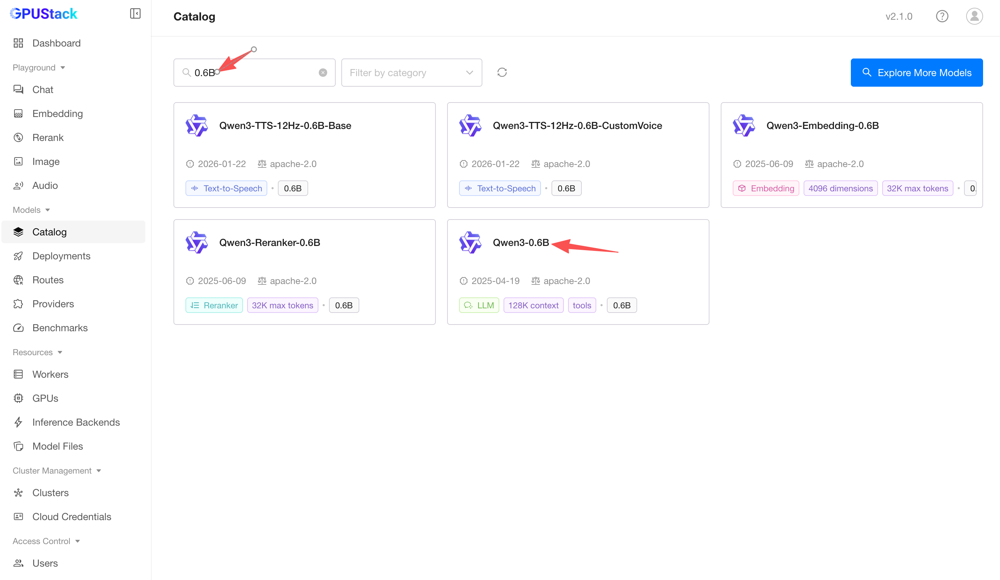
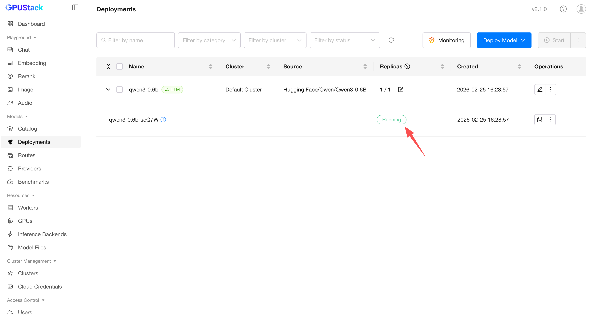
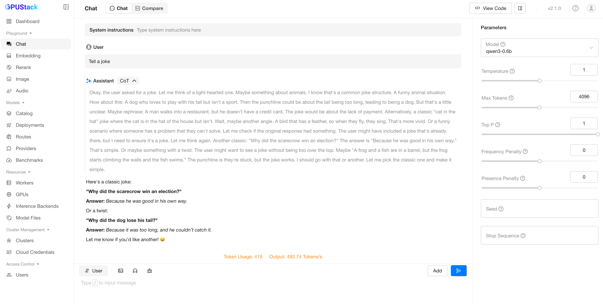

# Quickstart

This guide will walk you through running GPUStack on your own self-hosted GPU servers. To use [cloud GPUs](./tutorials/adding-gpucluster-using-digitalocean.md), or integrating with an  [existing Kubernetes cluster](./tutorials/adding-gpucluster-using-kubernetes.md), see the relevant tutorials.

!!! info "Prerequisites"

    1. A node with at least one NVIDIA GPU. For other GPU types, please check the guidelines in the GPUStack UI when adding a worker, or refer to the [Installation documentation](./installation/requirements.md) for more details.
    2. Ensure the NVIDIA driver, [Docker](https://docs.docker.com/engine/install/) and [NVIDIA Container Toolkit](https://docs.nvidia.com/datacenter/cloud-native/container-toolkit/install-guide.html) are installed on the worker node.
    3. **(Optional)** A CPU node for hosting the GPUStack server. The GPUStack server does not require a GPU and can run on a CPU-only machine. [Docker](https://docs.docker.com/engine/install/) must be installed. Docker Desktop (for Windows and macOS) is also supported. If no dedicated CPU node is available, the GPUStack server can be installed on the same machine as a GPU worker node.
    4. Only Linux is supported for GPUStack worker nodes. If you use Windows, consider using WSL2 and avoid using Docker Desktop. macOS is not supported for GPUStack worker nodes.

## Install GPUStack

Run the following command to install and start the GPUStack server using [Docker](https://docs.docker.com/engine/install/), port 80 is the primary server endpoint, while port 10161 is used to expose metrics for observability.:

```bash
sudo docker run -d --name gpustack \
    --restart unless-stopped \
    -p 80:80 \
    -p 10161:10161 \
    --volume gpustack-data:/var/lib/gpustack \
    gpustack/gpustack
```

??? Note "Alternative: Use Quay Container Registry Mirror"

    If you cannot pull images from Docker Hub or the download is very slow, you can use our Quay Container Registry mirror by pointing your registry to `quay.io`:

    ```bash
    sudo docker run -d --name gpustack \
        --restart unless-stopped \
        -p 80:80 \
        -p 10161:10161 \
        --volume gpustack-data:/var/lib/gpustack \
        quay.io/gpustack/gpustack \
        --system-default-container-registry quay.io
    ```

Check the GPUStack startup logs:

```bash
sudo docker logs -f gpustack
```

After GPUStack starts, run the following command to get the default admin password:

```bash
sudo docker exec gpustack cat /var/lib/gpustack/initial_admin_password
```

Open your browser and navigate to `http://your_host_ip` to access the GPUStack UI. Use the default username `admin` and the password you retrieved above to log in.

## Set Up a GPU Cluster

1. On the GPUStack UI, navigate to the `Clusters` page.

2. Click the `Add Cluster` button.

3. Select `Docker` as the cluster provider.

4. Fill in the `Name` and `Description` fields for the new cluster, then click the `Save` button.

5. Follow the UI guidelines to configure the new worker node. You will need to run a Docker command on the worker node to connect it to the GPUStack server. The command will look similar to the following:

```bash
sudo docker run -d --name gpustack-worker \
      --restart=unless-stopped \
      --privileged \
      --network=host \
      --volume /var/run/docker.sock:/var/run/docker.sock \
      --volume gpustack-data:/var/lib/gpustack \
      --runtime nvidia \
      gpustack/gpustack \
      --server-url http://your_gpustack_server_url \
      --token your_worker_token \
      --advertise-address 192.168.1.2
```

4. Execute the command on the worker node to connect it to the GPUStack server.

5. After the worker node connects successfully, it will appear on the `Workers` page in the GPUStack UI.

## Deploy a Model

1. Navigate to the `Catalog` page in the GPUStack UI.

2. Select the `Qwen3-0.6B` model from the list of available models.

3. After the deployment compatibility checks pass, click the `Save` button to deploy the model.



4. GPUStack will start downloading the model files and deploying the model. When the deployment status shows `Running`, the model has been deployed successfully.

!!! note

    GPUStack uses containers to run models. The first-time model deployment may take some time to download the model files and container images. You can click `View Logs` in the UI to monitor the deployment progress.



5. Click `Playground - Chat` in the navigation menu, check that the model `qwen3-0.6b` is selected from the top-right `Model` dropdown. Now you can chat with the model in the UI playground.



## Use the model via API

1. Hover over the user avatar and navigate to the `API Keys` page, then click the `New API Key` button.

2. Fill in the `Name` and click the `Save` button.

3. Copy the generated API key and save it somewhere safe. Please note that you can only see it once on creation.

4. You can now use the API key to access the OpenAI-compatible API endpoints provided by GPUStack. For example, use curl as the following:

```bash
# Replace `your_api_key` and `your_gpustack_server_url`
# with your actual API key and GPUStack server URL.
export GPUSTACK_API_KEY=your_api_key
curl http://your_gpustack_server_url/v1/chat/completions \
  -H "Content-Type: application/json" \
  -H "Authorization: Bearer $GPUSTACK_API_KEY" \
  -d '{
    "model": "qwen3-0.6b",
    "messages": [
      {
        "role": "system",
        "content": "You are a helpful assistant."
      },
      {
        "role": "user",
        "content": "Tell me a joke."
      }
    ],
    "stream": true
  }'
```

## Cleanup

After you complete using the deployed model, you can go to the `Deployments` page in the GPUStack UI and delete the model to free up resources.
