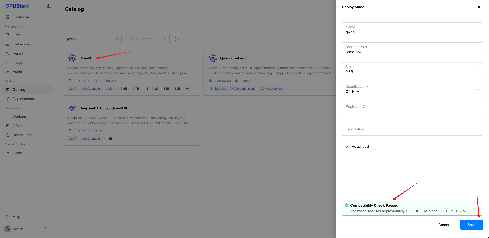

# Quickstart

## Install GPUStack

!!! note

    GPUStack now supports Linux only.

If you are using NVIDIA GPUs, ensure the NVIDIA driver, [Docker](https://docs.docker.com/engine/install/) and [NVIDIA Container Toolkit](https://docs.nvidia.com/datacenter/cloud-native/container-toolkit/install-guide.html) are installed. Then start the GPUStack with the following command:

```bash
sudo docker run -d --name gpustack \
    --restart unless-stopped \
    --privileged \
    --network host \
    --volume /var/run/docker.sock:/var/run/docker.sock \
    --volume gpustack-data:/var/lib/gpustack \
    --runtime nvidia \
    gpustack/gpustack
```

If you cannot pull images from `Docker Hub` or the download is very slow, you can use our `Quay.io` mirror by pointing your registry to `quay.io`:

```bash
sudo docker run -d --name gpustack \
    --restart unless-stopped \
    --privileged \
    --network host \
    --volume /var/run/docker.sock:/var/run/docker.sock \
    --volume gpustack-data:/var/lib/gpustack \
    --runtime nvidia \
    quay.io/gpustack/gpustack \
    --system-default-container-registry quay.io
```

For more details on the installation or other GPU hardware platforms, please refer to the [Installation Requirements](installation/requirements.md).

Check the GPUStack startup logs:

```bash
sudo docker logs -f gpustack
```

After GPUStack starts, run the following command to get the default admin password:

```bash
sudo docker exec gpustack cat /var/lib/gpustack/initial_admin_password
```

Open your browser and navigate to `http://your_host_ip` to access the GPUStack UI. Use the default username `admin` and the password you retrieved above to log in.

## Deploy a Model

1. Navigate to the `Catalog` page in the GPUStack UI.

2. Select the `Qwen3 0.6B` model from the list of available models.

3. After the deployment compatibility checks pass, click the `Save` button to deploy the model.



4. GPUStack will start downloading the model files and deploying the model. When the deployment status shows `Running`, the model has been deployed successfully.


5. Click `Playground - Chat` in the navigation menu, check that the model `qwen3-0.6b` is selected from the top-right `Model` dropdown. Now you can chat with the model in the UI playground.


## Use the model via API

1. Hover over the user avatar and navigate to the `API Keys` page, then click the `New API Key` button.

2. Fill in the `Name` and click the `Save` button.

3. Copy the generated API key and save it somewhere safe. Please note that you can only see it once on creation.

4. You can now use the API key to access the OpenAI-compatible API endpoints provided by GPUStack. For example, use curl as the following:

```bash
# Replace `your_api_key` and `your_gpustack_server_url`
# with your actual API key and GPUStack server URL.
export GPUSTACK_API_KEY=your_api_key
curl http://your_gpustack_server_url/v1/chat/completions \
  -H "Content-Type: application/json" \
  -H "Authorization: Bearer $GPUSTACK_API_KEY" \
  -d '{
    "model": "qwen3-0.6b",
    "messages": [
      {
        "role": "system",
        "content": "You are a helpful assistant."
      },
      {
        "role": "user",
        "content": "Tell me a joke."
      }
    ],
    "stream": true
  }'
```

## Cleanup

After you complete using the deployed model, you can go to the `Deployments` page in the GPUStack UI and delete the model to free up resources.
