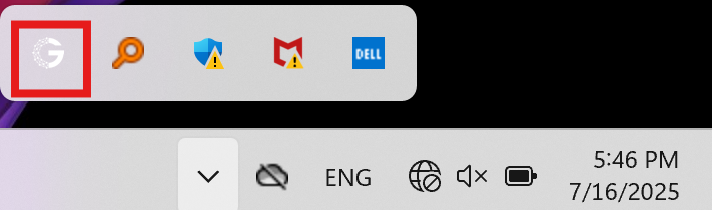

# Quickstart

## Install GPUStack

=== "Linux"

    **For Example: NVIDIA CUDA**

    Run the following command to start the GPUStack server.

    ```bash
    docker run -d --name gpustack \
          --restart=unless-stopped \
          --gpus all \
          --network=host \
          --ipc=host \
          -v gpustack-data:/var/lib/gpustack \
          gpustack/gpustack
    ```

    !!! tip
        If the quick installation fails, please refer to the [Docker Installation](installation/nvidia-cuda/online-installation/#docker-installation) guide for more detailed instructions.

    
    For on other hardware platforms Docker installation or pip installation details please refer to the [Installation Documentation](installation/installation-requirements.md).


=== "macOS"

    **Supported platforms:** Apple Silicon (M series), macOS 14 or later

    1. [Download the installer](https://gpustack.ai)

    2. Run the installer
    
    3. Installation Successful
    
    After successful installation, the GPUStack icon appears in the status bar.

    


=== "Windows"

    **Supported platforms:** Windows 10, Windows 11
    
    1. [Download the installer](https://gpustack.ai)

    2. Run the installer
    
    3. Installation Successful
    
    After successful installation, the GPUStack icon will appear in the system tray.
    
    


## Open GPUStack UI

- If you installed GPUStack using **Docker**, open `http://localhost` in your browser to access the GPUStack UI.

- If you installed it using the **installer** (macOS or Windows), you can also click the `Web Console` option from the GPUStack icon in the menu bar or system tray.

## Deploy a Model
1. Navigate to the `Catalog` page in the GPUStack UI.

2. In the catalog list page, use the search bar in the top left to search for the model keyword `qwen3`.

3. In the search results, select `Qwen3`. If the **Compatibility Check Passed** message appears, click the `Save` button to deploy the model. You will be automatically redirected to the `Models` page once the deployment starts successfully.


4. When the status shows `Running`, the model has been deployed successfully.


5. Click `Playground - Chat` in the navigation menu, then select the  model from the top-right corner `Model` dropdown. Now you can chat with the LLM in the UI playground.


## Try the Model with curl

1. Hover over the user avatar and navigate to the `API Keys` page, then click the `New API Key` button.

2. Fill in the `Name` and click the `Save` button.

3. Copy the generated API key and save it somewhere safe. Please note that you can only see it once on creation.

4. Now you can use the API key to access the OpenAI-compatible API. For example, use curl as the following:

```bash
export GPUSTACK_API_KEY=your_api_key
curl http://your_gpustack_server_url/v1-openai/chat/completions \
  -H "Content-Type: application/json" \
  -H "Authorization: Bearer $GPUSTACK_API_KEY" \
  -d '{
    "model": "qwen3",
    "messages": [
      {
        "role": "system",
        "content": "You are a helpful assistant."
      },
      {
        "role": "user",
        "content": "Hello!"
      }
    ],
    "stream": true
  }'
```

## Cleanup

After you complete using the deployed models, you can go to the `Models` page in the GPUStack UI and delete the models to free up resources.
