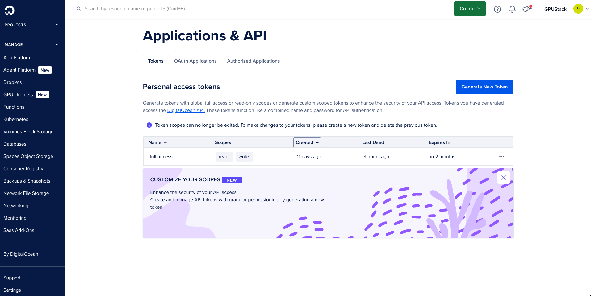
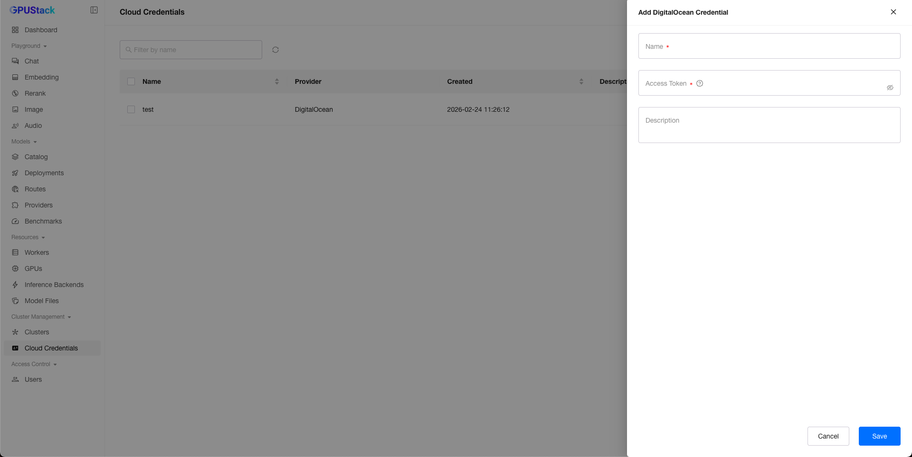
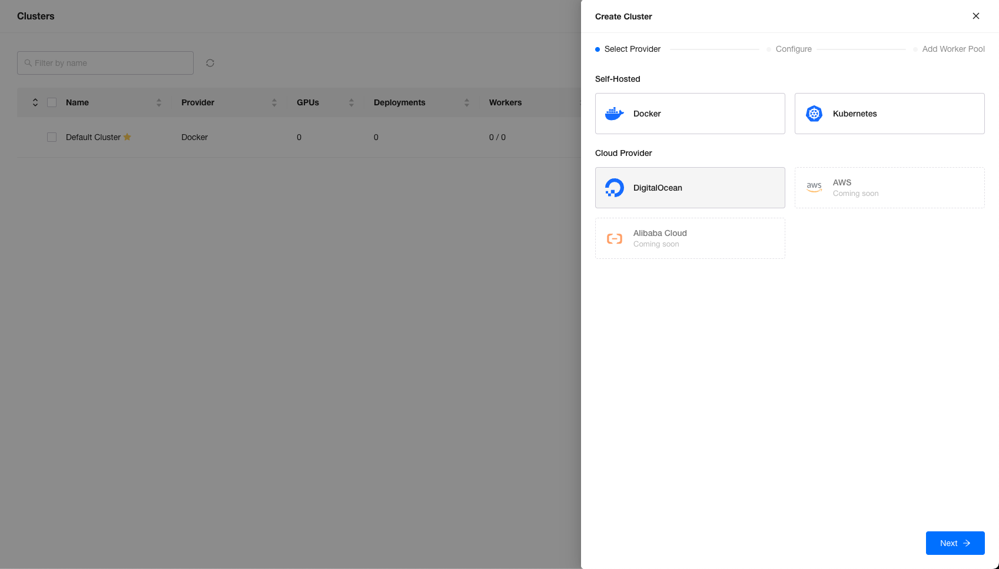
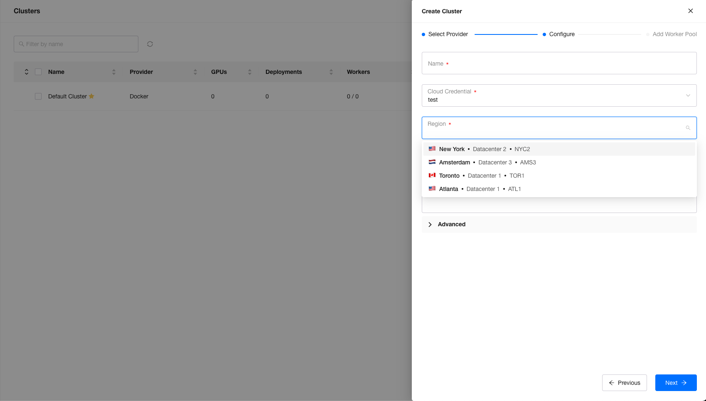
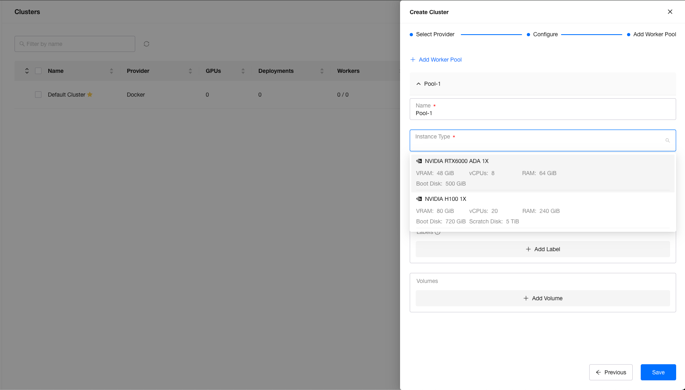
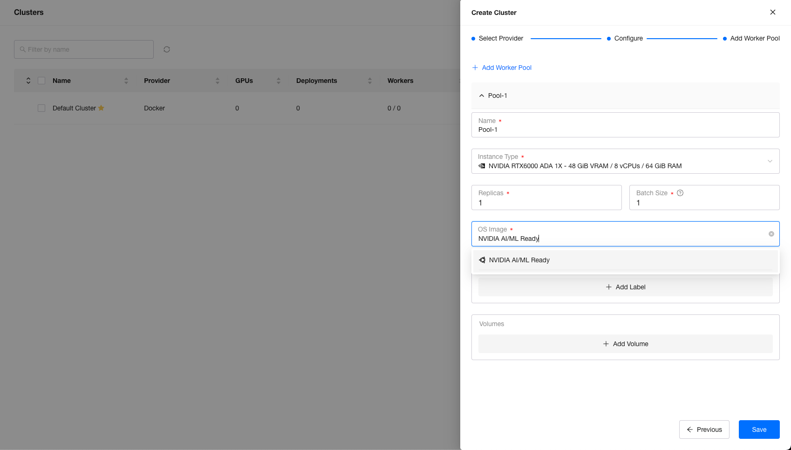
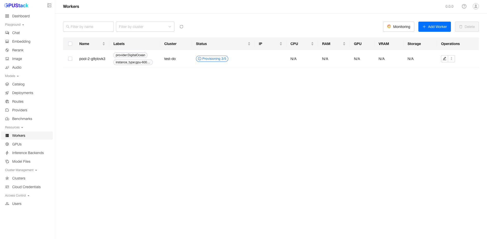
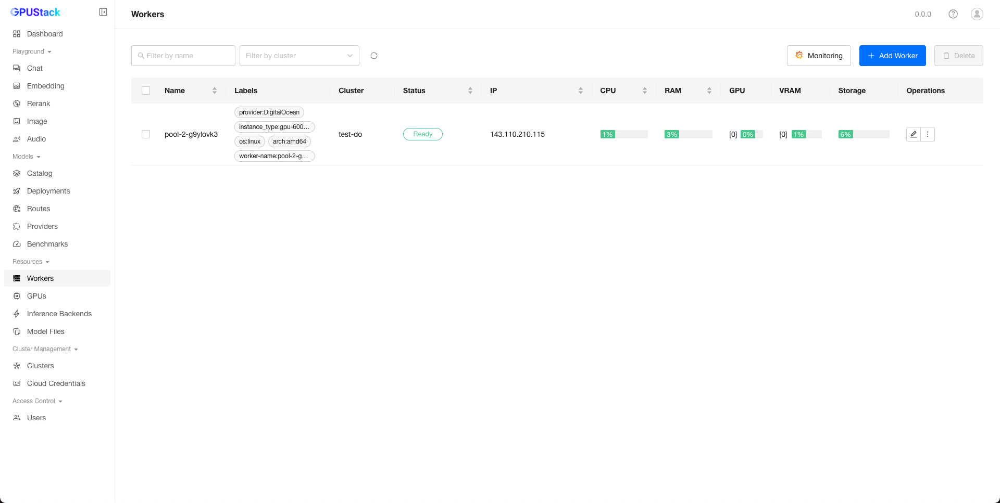

# Adding a GPU Cluster Using DigitalOcean

When creating a cluster, GPUStack can leverage DigitalOcean to create workers and add them to the GPUStack cluster.

## Preparation

You need to sign up for a DigitalOcean account and create a Personal Access Token on the API page.

> Note: The token scope must be set to Full Access. If you select permissions using Custom Scopes, you may encounter issues deleting droplets.

When starting the GPUStack Server, you need to specify the `--server-external-url` parameter. This parameter is used to configure the worker's `--server-url` after the droplet is created and the worker is started. If your server is running behind a proxy, please set the proxy address to ensure that droplets running on the public network can access the GPUStack Server API using this address after startup.

## Create DigitalOcean Cluster

Please refer to the steps in [Creating DigitalOcean Cluster](../user-guide/cluster-management.md#creating-digitalocean-cluster)

### Create Cloud Credential

Create a DigitalOcean cloud credential on the `Cloud Credentials` page.

### Create Cluster with Cloud Credential

On the cluster creation page, select `DigitalOcean` as the `Cloud Provider`:

Enter a name, select the cloud credential you just created, and choose a region that supports GPU droplets.

Click `Next` to create a worker pool for the cluster.

### Create Worker Pool

Fill in the `Name`, `Replicas`, and `Batch Size` as needed. Then select the `Instance Type` (droplet size in DigitalOcean terms) for the worker pool.

Next, select the `OS Image`.

Currently, only Nvidia series GPU Droplets are supported, as AMD GPU Droplets are often unavailable. Only Debian-based operating systems are supported.

- For Nvidia AI/ML Ready (**Recommended**), which is based on Ubuntu 22.04 and includes drivers, CUDA, and container-toolkit pre-installed, no extra packages are needed.
- For Debian distributions, the droplet is bootstrapped with the `nvidia-open` driver, CUDA 12.8, and nvidia-container-toolkit 1.17.8-1 via cloud-init.
- For Ubuntu distributions, the droplet is bootstrapped with the `nvidia-driver-570` driver, CUDA 12.8, and nvidia-container-toolkit 1.17.8-1 via cloud-init.

Labels and volumes are supported to set in worker pool to provision worker. The volumes created and attached for droplet won't be mount into worker container automatically. You can modify the run worker script in `/opt/gpustack-run-worker.sh` to mount the volumes as needed.

Click `Save` if all set.

## Waiting for Workers to be Provisioned

After saving the cluster, navigate to the `Workers` page to view the provisioning progress of DigitalOcean workers.

The provisioning process includes several steps:

1. Create an SSH key.
2. Create a droplet with the SSH key.
3. Wait for the droplet to start.
4. Wait for the public IP to be assigned.
5. Create volumes and attach them to the droplet.
6. The worker enters the `Initialized` status and waits for the worker container to start and connect to the server.

Once the worker reaches the `Ready` status, you can deploy models on it.

## Safely Scale Down DigitalOcean Workers

When a DigitalOcean worker is no longer needed, follow these steps to safely destroy the droplet:

- Adjust the replica count of the worker pool to match the number of workers you want to delete. Note that workers are not deleted automatically in this step.
- Ensure that no model instances are deployed on the workers you intend to delete.
- Delete the workers as needed. The corresponding droplets will be deleted accordingly.
