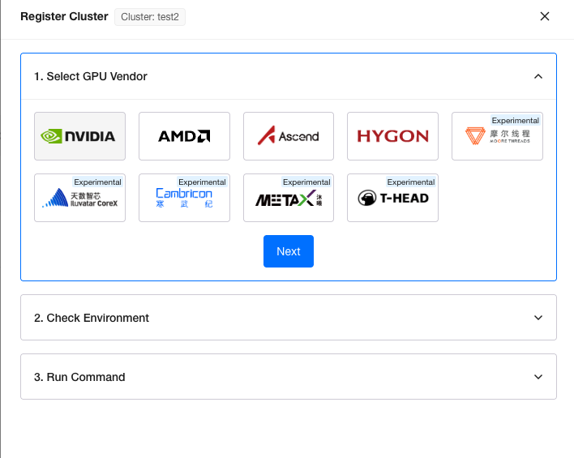
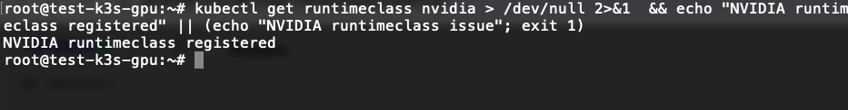
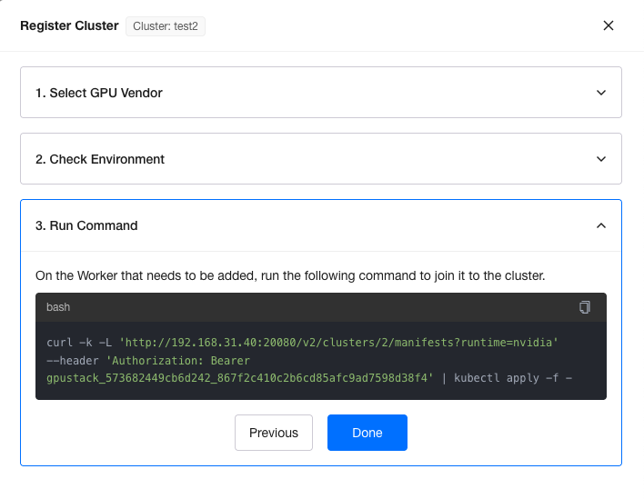
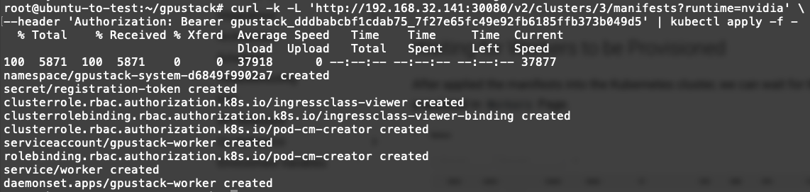
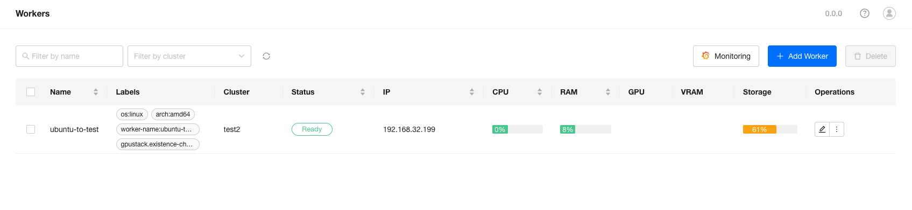

# Adding a GPU Cluster Using Kubernetes

GPUStack supports adding a Kubernetes cluster as a GPU cluster.

## Preparation

A Kubernetes cluster should be built with runtime class installed and configured on all nodes. In this tutorial, we will use a k3s cluster as example.

## Create Kubernetes Cluster

Please refer to the steps in [Register Kubernetes Cluster](../user-guide/cluster-management.md#register-kubernetes-cluster)

After created the `Kubernetes` provider cluster, select Nvidia as the `GPU Vendor` and click `Next`.

Use the script to check the environment, run the bash script in the k3s installed host.

Please keep in mind that, the `runtimeclass` resource in k8s is just a data record and doesn't represent the container runtime is well configured in every node. Make sure the container runtime for specified GPU vendor is configured or the worker won't be able to start.

Copy the script in `Run Command` step and run it in the k3s installed host.

## Waiting for Workers to be Provisioned

After applied the manifests into the Kubernetes cluster, we can wait for the worker nodes populated in `Workers` Page.

Once the worker reaches the `Ready` status, you can deploy models on it.
