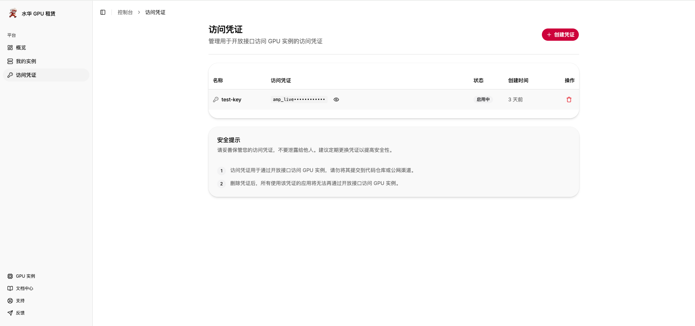
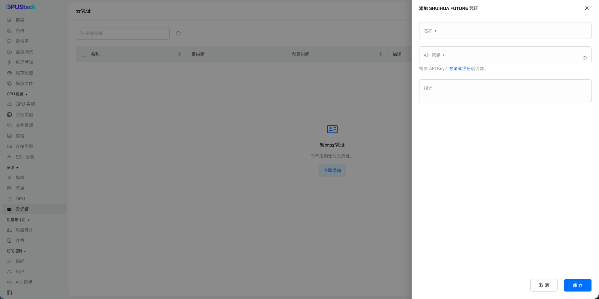
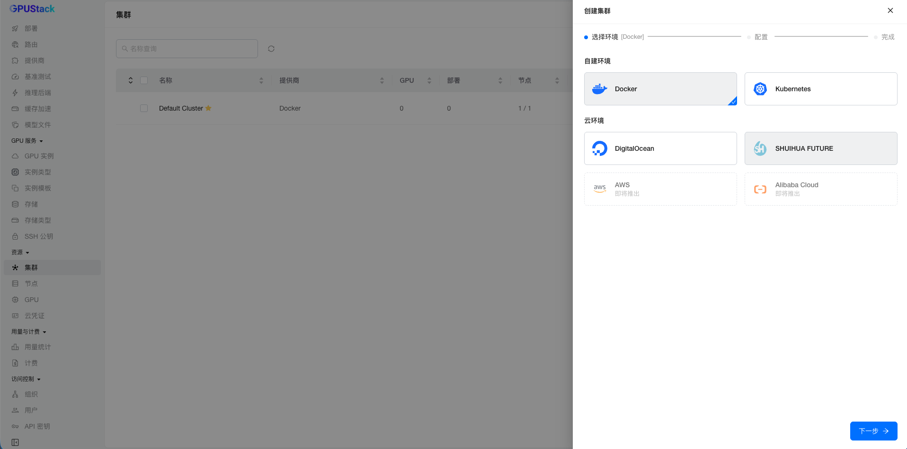
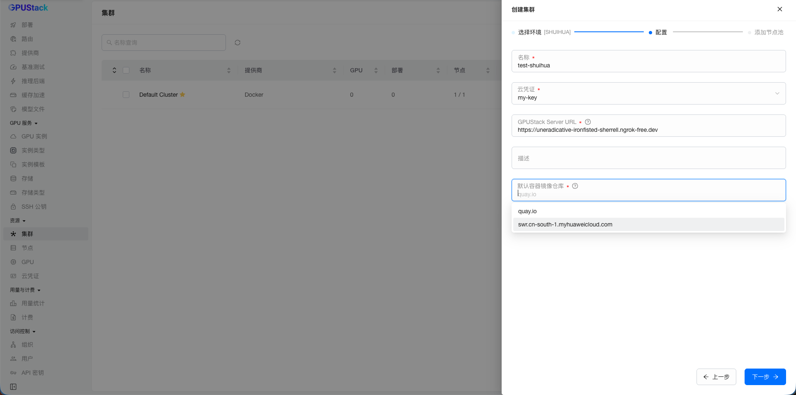
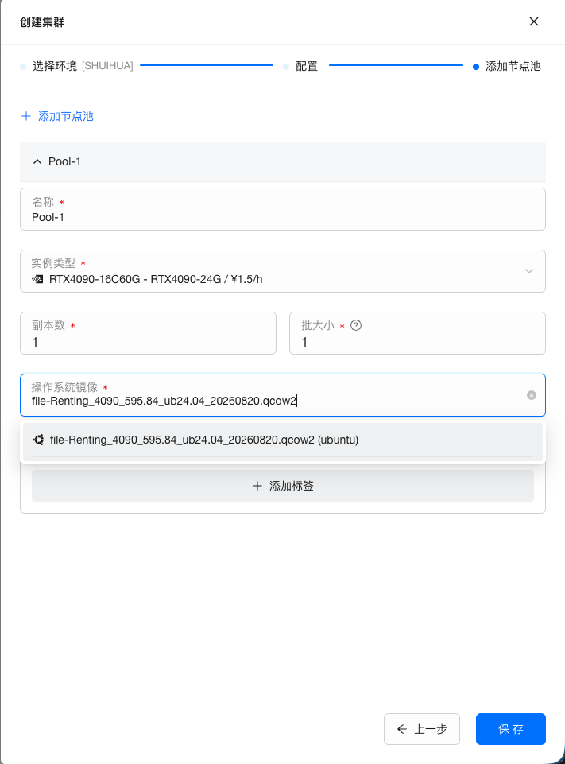
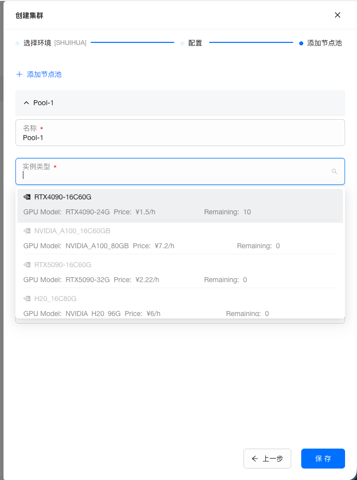
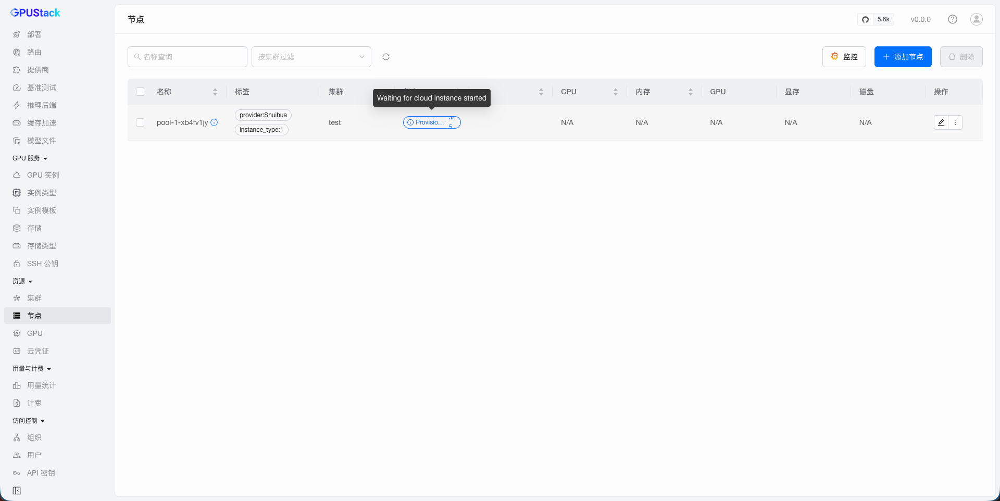
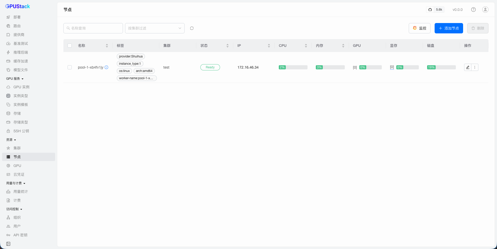
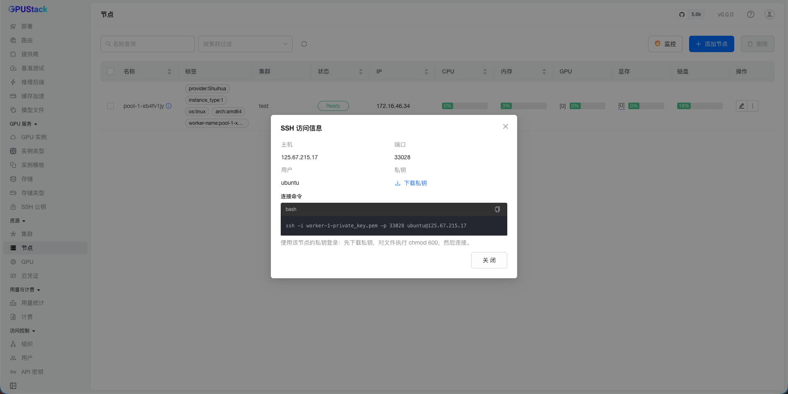

# Adding a GPU Cluster Using Shuihua

When creating a cluster, GPUStack can leverage SHUIHUA FUTURE to create workers and add them to the GPUStack cluster.

## Preparation

You need a SHUIHUA FUTURE account and an API key, created from the [Shuihua console](https://hub.do.top/cn/signin). The key is prefixed with `amp_live_`.



When starting the GPUStack Server, you need to specify the `--server-external-url` parameter. Shuihua instances reach the server through this address to register and to keep their tunnel open, so it must be reachable from them. If your server is running behind a proxy, set the proxy address here.

## Create Shuihua Cluster

### Create Cloud Credential

Create a `SHUIHUA FUTURE` cloud credential on the `Cloud Credentials` page. The `API Key` is the only field to fill in.



### Create Cluster with Cloud Credential

On the cluster creation page, select `SHUIHUA FUTURE` as the `Cloud Provider`:



Enter a name, select the cloud credential you just created, and configure the `GPUStack Server URL`. Shuihua has no regions, so there is no region to pick.

`Default Container Registry` is required here. Shuihua instances cannot reach Docker Hub, so the GPUStack worker image has to come from somewhere else — the field suggests `quay.io` and `swr.cn-south-1.myhuaweicloud.com`, and accepts any other registry you can type, such as your own Harbor or mirror. A value resolving to a Docker Hub host is rejected.



> Note: the server's `--image-name-override` takes precedence over this field. If the server runs with an override, that image name is used verbatim and the registry setting has no effect, so the override itself must name a reachable registry.

Click `Next` to create a worker pool for the cluster.

### Create Worker Pool

Fill in the `Name`, `Replicas`, and `Batch Size` as needed.



Then select the `Instance Type`, which in Shuihua terms is a spec template. Each option shows its GPU model, hourly price and remaining stock; a template that is sold out stays in the list but cannot be selected, so you can see why it is unavailable.



Next, select the `OS Image`.

Shuihua only rents NVIDIA GPUs, and its images ship with the driver and the container toolkit already installed. Cloud-init therefore only points Docker at the NVIDIA runtime and starts the worker — nothing is installed and the instance is not rebooted, so these workers come up faster than ones that have to build a driver.

Volumes are not offered for this provider: Shuihua has no block storage API. Labels are supported.

Click `Save` if all set.

## Waiting for Workers to be Provisioned

After saving the cluster, navigate to the `Workers` page to view the provisioning progress of Shuihua workers.



The provisioning process includes several steps:

1. Generate an SSH key. Shuihua has no SSH key API, so the key is not registered with the provider; it is written into the instance's cloud-init instead.
2. Create the instance. Creation is asynchronous — Shuihua accepts the request and reports `creating`, then `processing`, then `active`.
3. Wait for the instance to start.
4. Wait for its address to be assigned.
5. The worker enters the `Initialized` status and waits for the worker container to start and connect to the server.

Once the worker reaches the `Ready` status, you can deploy models on it.



## Connecting to a Worker over SSH

Shuihua publishes every instance behind one shared public IP, mapping only ports 22 and 80 to an instance-specific port. The IP shown for the worker is the instance's own private address, which identifies it but cannot be connected to.

Use `View SSH Access` in the worker's operations menu instead. It shows the `Host`, `Port` and `Connection Command` that actually reach the instance, and lets you download the `Private Key` (saved as `worker-<id>-private_key.pem`).



Because the worker's own port is never mapped, the gateway cannot reach these workers inbound. They serve inference through the server's WebSocket tunnel, which is why a Shuihua cluster uses the `tunnel` proxy mode by default. Leave it as it is unless your network routes to the instances directly.

## Safely Scale Down Shuihua Workers

When a Shuihua worker is no longer needed, follow these steps to safely destroy the instance:

- Adjust the replica count of the worker pool to match the number of workers you want to delete. Note that workers are not deleted automatically in this step.
- Ensure that no model instances are deployed on the workers you intend to delete.
- Delete the workers as needed. The corresponding instances will be terminated accordingly.

## Troubleshooting

**The worker stays in `Initialized` and never becomes `Ready`.** The instance booted but the worker container did not start, most often because the image could not be pulled. Connect over SSH and check:

```bash
sudo cloud-init status --long
sudo grep -iE "pull|denied|manifest" /var/log/cloud-init-output.log
docker ps -a
```

**The worker is `Ready` but reports no GPUs.** Docker is not using the NVIDIA runtime:

```bash
nvidia-smi
which nvidia-ctk
docker info | grep -i runtime
```

**A worker failed to provision and cannot be retried in place.** Delete the worker and let the pool create a replacement. Each creation attempt carries a replay-protection key derived from the worker row, so getting a new instance takes a new worker.
