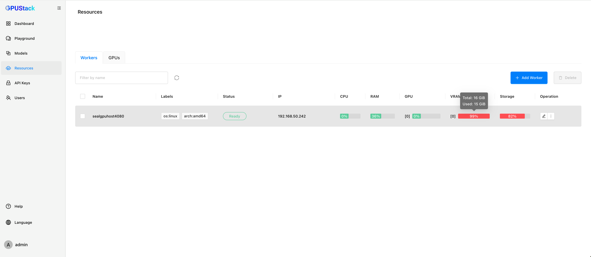
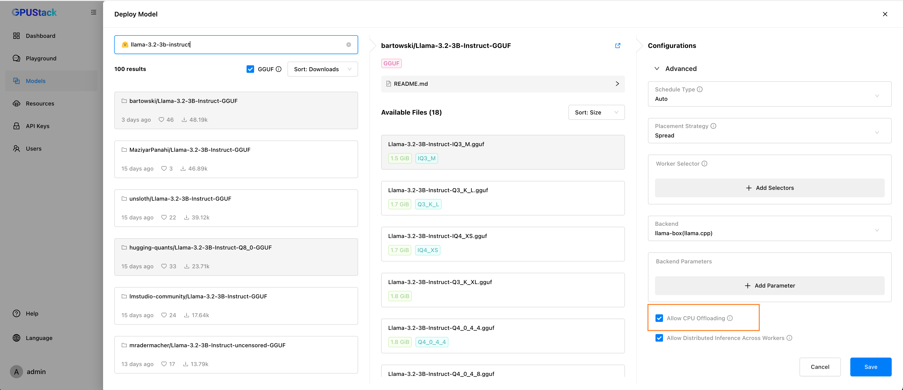
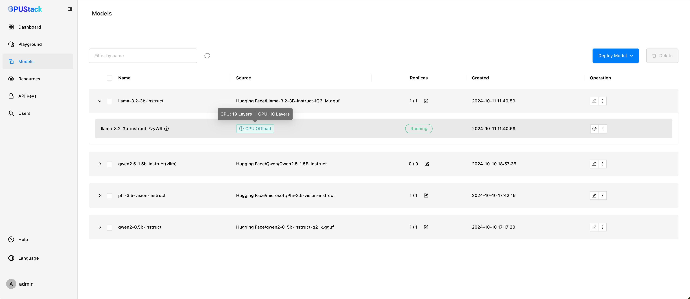
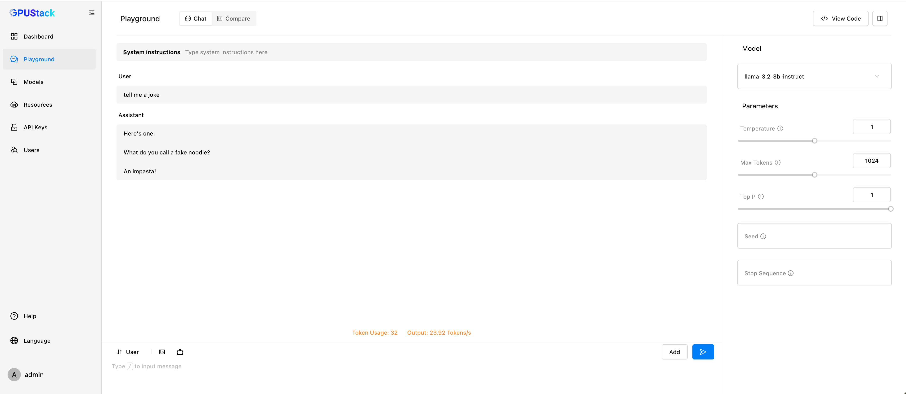

# CPU Inference

When GPU resources are limited, some model layers can be offloaded to the CPU, and full CPU inference will be used if no GPU is available.

To deploy the model with CPU offloading, enable the `Allow CPU Offloading` option during deployment.

Once the deployment is complete, you can see how many layers have been offloaded to the CPU.

Next, you can test the model's inference performance in the `Playground`.

