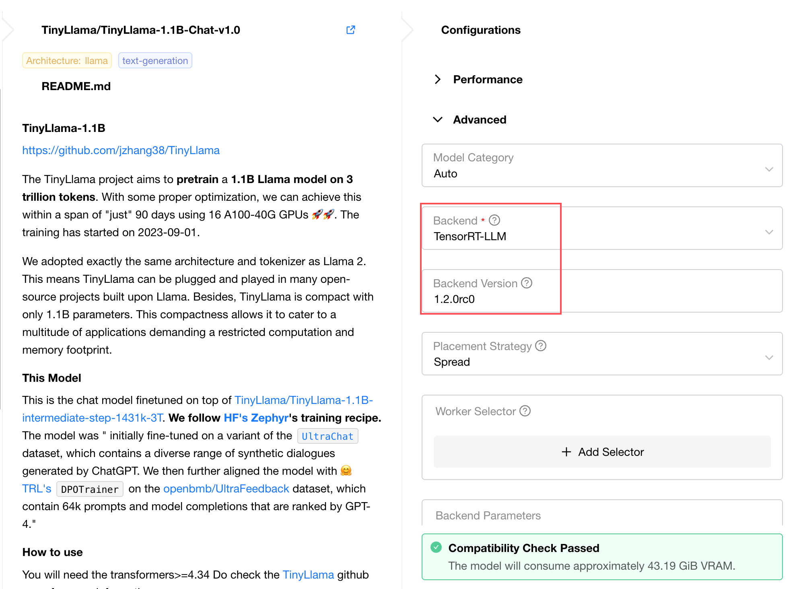
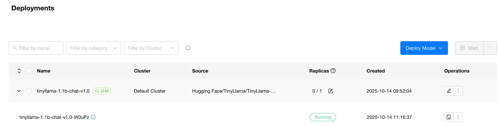
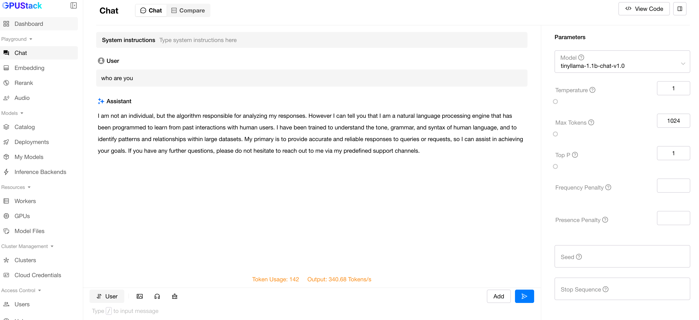

# Custom Inference Backend

This article demonstrates how to add a custom inference backend that is not yet supported by GPUStack, using TensorRT-LLM as an example.

## Core Steps
1. Prepare the Docker image for the required inference backend
2. Understand the image's ENTRYPOINT or CMD to determine the inference backend startup command
3. Add configuration in the Inference Backend page
4. Deploy models in the Deployment page and select the newly added inference backend

## Example
The following uses TensorRT-LLM as an example to illustrate how to add and use an inference backend.
> The following examples do not represent the optimal performance configuration and are for functional demonstration only. For better inference performance, please refer to the official documentation of each inference backend for tuning, or use GPUStack's Catalog.

1. Find the required image from the [release page](https://catalog.ngc.nvidia.com/orgs/nvidia/teams/tensorrt-llm/containers/release) mentioned in TensorRT-LLM documentation.
2. TensorRT-LLM images must launch the inference service using `trtllm-serve`; otherwise, it will start a regular bash session. The run_command supports {{model_path}} and {{port}} templates, which are automatically replaced with the actual model path and port number after scheduling.
3. Add configuration in Inference Backend page, supporting YAML import. Example:
```yaml
backend_name: TensorRT-LLM
default_version: 1.2.0rc0
version_configs:
  1.2.0rc0:
    image_name: nvcr.io/nvidia/tensorrt-llm/release:1.2.0rc0
    run_command: 'trtllm-serve {{model_path}} --port {{port}}'
    custom_framework: cuda
```
!!! note

    You may see some inference backends labeled as Built-in (such as vLLM, MindIE) in the Inference Backend page. These are GPUStack's built-in inference backends. When using built-in backends, appropriate container images matching the worker environment are automatically obtained based on the runtime.
    You can also add custom versions to these Built-in inference backends and specify the image names you need.

4. In Deployment page, select the newly added inference backend and deploy the model.


**Result**

After the inference backend service starts, you can see the model_instance status becomes RUNNING.

You can engage in conversations in the Playground.


## Parameter Description
When adding a Backend, besides the YAML import method shown in the example, you can also use the form. Detailed parameter descriptions are as follows:

| Parameter Name                  | Description                                                                                                                                                       | Required |
|---------------------------------|-------------------------------------------------------------------------------------------------------------------------------------------------------------------|----------|
| Name                            | Inference backend name                                                                                                                                           | Yes      |
| Health Check Path               | Health check path used to verify if the inference backend has started and is running properly. Default value is /v1/models (OpenAI API specification)            | No       |
| Default Execution Command       | Execution command passed as `args` when the inference backend container starts. For example, for vllm backend, this would be `vllm serve {{model_path}} --port {{port}}`. Note that this command supports {{model_path}} and {{port}} templates, allowing automatic substitution of model path and port number after scheduling | No       |
| Default Backend Parameters      | Default backend parameters used to pre-fill Advanced-Backend Parameters during deployment for convenient deployment and adjustment                              | No       |
| Description                     | Description                                                                                                                                                       | No       |
| Version Configs                 | Inference backend version configurations, used to add inference backend versions                                                                                  | Yes      |
| Default Version                 | Dropdown option used to pre-fill during deployment. If no version is selected during deployment, the image corresponding to Default Version will be used         | No       |

Version Configs parameter description:

| Parameter Name                  | Description                                         | Required |
|---------------------------------|-----------------------------------------------------|----------|
| Version                         | Version name, displayed in BackendVersion options during deployment | Yes      |
| Image Name                      | Inference backend image name                         | Yes      |
| Framework<br/>(custom_framework) | Inference backend framework. Deployment and scheduling will filter based on supported Frameworks | Yes      |
| Execution Command               | Execution command for this version. If not set, uses Default Execution Command | No       |

## Flexible Testing Deployment
For quick and flexible verification or adjustment of the image and startup command, select `Custom` in the backend options on the deployment page. This will reveal two new input fields for specifying the custom `image_name` and `run_command` respectively.

