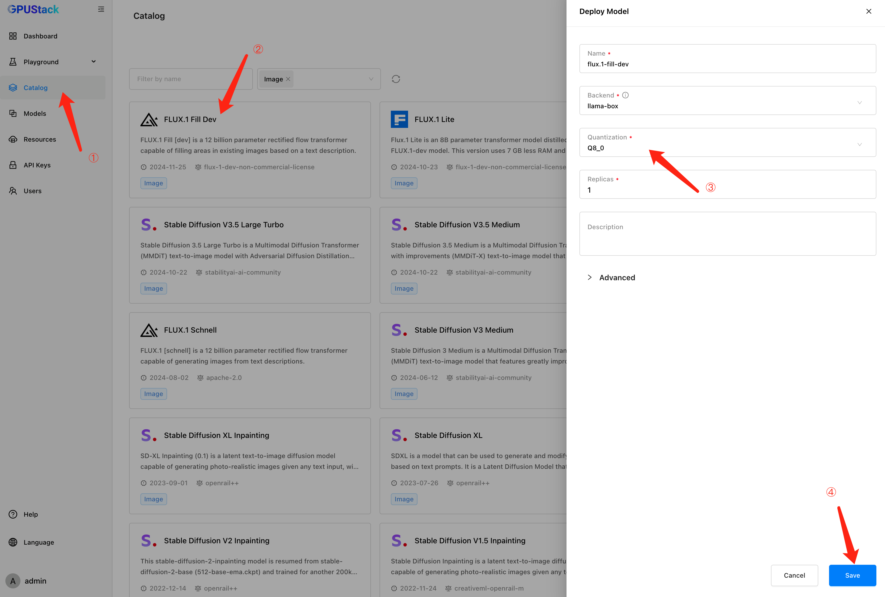

# Editing Images

You can use image models to edit images by selecting an area of the image to edit and describing the desired changes. The model will generate the edited image based on your description. This tutorial demonstrates how to edit images in GPUStack.

## Prerequisites

Before you begin, ensure that you have the following:

- A GPU with at least 24 GB of VRAM.
- Access to Hugging Face for downloading the model files.
- GPUStack is installed and running. If not, refer to the [Quickstart Guide](../quickstart.md).

In this tutorial, we will use the `FLUX.1-Fill-dev` model in `Q8_0` quantization to edit images.

## Step 1: Deploy the Model

Follow these steps to deploy the model from Hugging Face:

1. Navigate to the `Catalog` page in the GPUStack UI.
2. Search and select the `FLUX.1 Fill Dev` model.
3. In the popup, select the `Q8_0` quantization.
4. Leave everything as default and click the `Save` button to deploy the model.



After deployment, you can monitor the model's status on the `Models` page.

## Step 2: Use the Model to Edit Images

1. Navigate to the `Playground` > `Image` page in the GPUStack UI.
2. Click the `Edit` tab on the top
3. Verify that the deployed model is selected from the top-right `Model` dropdown.
4. Upload the [example image](../assets/tutorials/editing-images/image-edit-example.png) by clicking the center upload area.
5. Draw a mask over the hair area of the example image.
6. Input the following text prompt in the `Text Prompt` field:
   ```
   Pink short hair bang, natural
   ```
7. Click the `Submit` button to generate the edited image.


The generated image will be displayed in the UI. Your image may look different given the seed and randomness involved in the generation process.


If you want to reproduce the result shown above, you can use the following parameters:

```
Size: 768x1024(3:4)
Sample Method: euler
Schedule Method: discrete
Sampling Steps: 50
Guidance: 30.0
CFG Scale: 1.0
Strength: 1.0
Seed: 656821733471329
Text Prompt: Pink short hair bang, natural
```

## Step 3: Using the Edit Images API

Click the `View Code` button to see example code snippets for using the edit images API programmatically.


## Conclusion

In this tutorial, you learned how to edit images using image models in GPUStack. You can experiment with different models and parameters to modify existing images.
