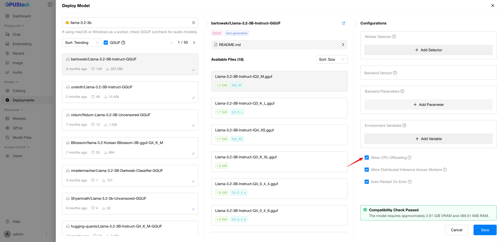
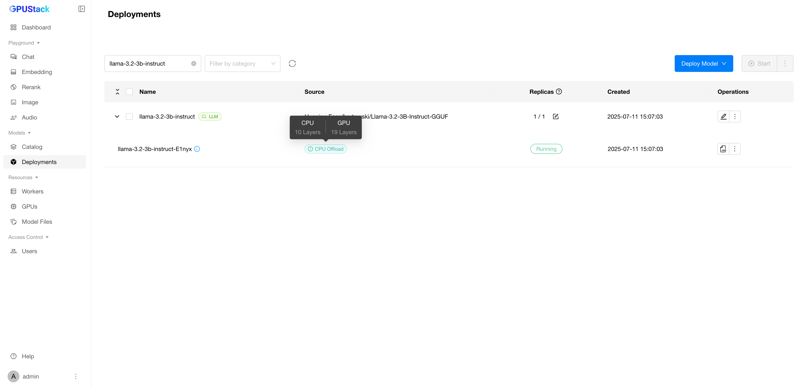

# Running Inference on CPUs

GPUStack supports inference on CPUs, offering flexibility when GPU resources are limited or when model sizes exceed available GPU memory. The following CPU inference modes are available:

- **CPU+GPU Hybrid Inference**: Enables partial acceleration by offloading portions of large models to the CPU when VRAM capacity is insufficient.
- **Full CPU Inference**: Operates entirely on CPU when no GPU resources are available.

!!! note

    CPU inference is supported when using the llama-box backend.

To deploy a model with CPU offloading, enable the `Allow CPU Offloading` option in the deployment configuration (this setting is enabled by default).

After deployment, you can view the number of model layers offloaded to the CPU.

