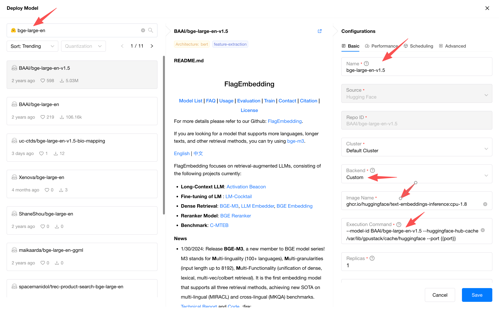
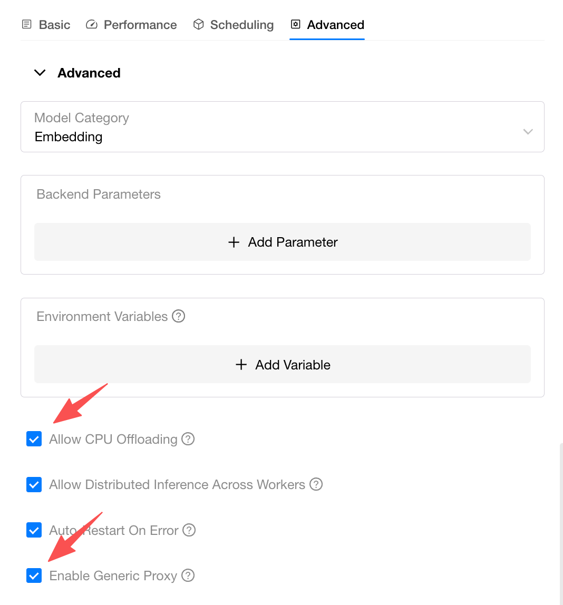

# Running Inference on CPUs

GPUStack supports inference on CPUs, offering flexibility when GPU resources are limited or when model sizes exceed allocatable GPU memory. The following CPU inference modes are available:

- **Hybrid CPU+GPU Inference**: Enables partial acceleration by offloading portions of large models to the CPU when VRAM capacity is insufficient.
- **Full CPU Inference**: Runs entirely on CPU when no GPU resources are available.

!!! note

    Available for custom backends only.

    When CPU offloading is enabled, GPUStack will allocate CPU memory if GPU resources are insufficient. You must correctly configure the inference backend to use hybrid CPU+GPU or full CPU inference.

    It is strongly recommended to use CPU inference only on CPU workers.

For example, to deploy a model with CPU inference by [Text Embeddings Inference](https://huggingface.co/docs/text-embeddings-inference/index), follow the configuration below:

Source: `HuggingFace`

Repo ID: `BAAI/bge-large-en-v1.5`

Backend: `Custom`

Image Name: `ghcr.io/huggingface/text-embeddings-inference:cpu-1.8`

Execution Command: `--model-id BAAI/bge-large-en-v1.5 --huggingface-hub-cache /var/lib/gpustack/cache/huggingface --port {{port}}`

!!! note

    `TEI (Text Embeddings Inference)` only supports deploying models from `HuggingFace`.

    `ghcr.io/huggingface/text-embeddings-inference:cpu-1.8` is the CPU inference image for TEI. See: [TEI Supported Hardware](https://huggingface.co/docs/text-embeddings-inference/supported_models#supported-hardware).

    `--huggingface-hub-cache /var/lib/gpustack/cache/huggingface` sets the location of the HuggingFace Hub cache for TEI to the path where GPUStack stores downloaded HuggingFace models. The default path is `/var/lib/gpustack/cache/huggingface`. See: [TEI CLI Arguments](https://huggingface.co/docs/text-embeddings-inference/cli_arguments).

    `{{port}}` is a placeholder that represents the port automatically assigned by GPUStack.

And in Advanced Settings, check `Allow CPU Offloading`:

If you need to access non-OpenAI-compatible APIs, you can also check `Enable Generic Proxy`.

For more details, see [Enable Generic Proxy](../user-guide/model-deployment-management.md#enable-generic-proxy).
