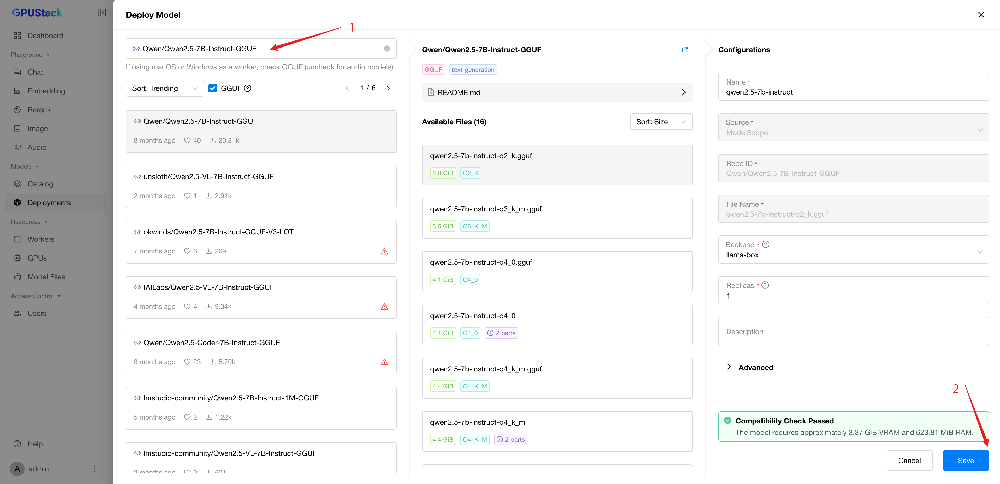
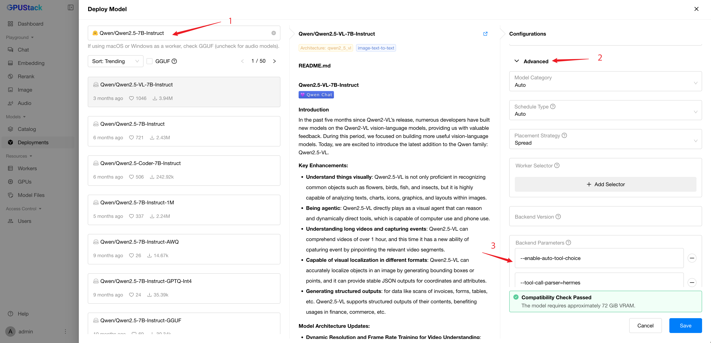

# Inference with Tool Calling

Tool calling allows you to connect models to external tools and systems. This is useful for many things such as empowering AI assistants with capabilities, or building deep integrations between your applications and the models.

In this tutorial, you’ll learn how to set up and use tool calling within GPUStack to extend your AI’s capabilities.

!!! note

    1. Tool calling is supported in both [llama-box](../user-guide/inference-backends.md#llama-box) and [vLLM](../user-guide/inference-backends.md#vllm) inference backends.
    2. Tool calling is essentially achieved through prompt engineering, requiring models to be trained with internalized templates to enable this capability. Therefore, not all LLMs support tool calling.

## Prerequisites

Before proceeding, ensure the following:

- GPUStack is installed and running.
- A Linux worker node with a GPU is available. We'll use [Qwen2.5-7B-Instruct](https://huggingface.co/Qwen/Qwen2.5-7B-Instruct) as the model for this tutorial. The model requires a GPU with at least 18GB VRAM.
- Access to Hugging Face for downloading the model files.

## Step 1: Deploy the Model

### Deploy from Catalog

LLMs that support tool calling are marked with the `tools` capability in the catalog. When you select such a model from the catalog, tool calling is enabled by default.

### Example of Custom Deployment Using llama-box

When you deploy GGUF models using llama-box, tool calling is enabled by default for models that support it.

1. Navigate to the `Deployments` page in the GPUStack UI and click the `Deploy Model` button. In the dropdown, select `Hugging Face` as the source for your model.
2. Enable the `GGUF` checkbox to filter models by GGUF format.
3. Use the search bar to find the `Qwen/Qwen2.5-7B-Instruct-GGUF` model.
4. Click the `Save` button to deploy the model.



### Example of Custom Deployment Using vLLM

When you deploy models using vLLM, you need to enable tool calling with additional parameters.

1. Navigate to the `Deployments` page in the GPUStack UI and click the `Deploy Model` button. In the dropdown, select `Hugging Face` as the source for your model.
2. Use the search bar to find the `Qwen/Qwen2.5-7B-Instruct` model.
3. Expand the `Advanced` section in configurations and scroll down to the `Backend Parameters` section.
4. Click on the `Add Parameter` button and add the following parameters:

- `--enable-auto-tool-choice`
- `--tool-call-parser=hermes`

5. Click the `Save` button to deploy the model.



After deployment, you can monitor the model's status on the `Deployments` page.

## Step 2: Generate an API Key

We will use the GPUStack API to interact with the model. To do this, you need to generate an API key:

1. Hover over the user avatar and navigate to the `API Keys` page.
2. Click the `New API Key` button.
3. Enter a name for the API key and click the `Save` button.
4. Copy the generated API key for later use.

## Step 3: Do Inference

With the model deployed and an API key, you can call the model via the GPUStack API. Here is an example script using `curl` (replace `<your-server-url>` with your GPUStack server URL and `<your-api-key>` with the API key generated in the previous step):

```bash
export GPUSTACK_SERVER_URL=<your-server-url>
export GPUSTACK_API_KEY=<your-api-key>
curl $GPUSTACK_SERVER_URL/v1-openai/chat/completions \
-H "Content-Type: application/json" \
-H "Authorization: Bearer $GPUSTACK_API_KEY" \
-d '{
  "model": "qwen2.5-7b-instruct",
  "messages": [
    {
      "role": "user",
      "content": "What'\''s the weather like in Boston today?"
    }
  ],
  "tools": [
    {
      "type": "function",
      "function": {
        "name": "get_current_weather",
        "description": "Get the current weather in a given location",
        "parameters": {
          "type": "object",
          "properties": {
            "location": {
              "type": "string",
              "description": "The city and state, e.g. San Francisco, CA"
            },
            "unit": {
              "type": "string",
              "enum": ["celsius", "fahrenheit"]
            }
          },
          "required": ["location"]
        }
      }
    }
  ],
  "tool_choice": "auto"
}'
```

Example response:

```json
{
  "model": "qwen2.5-7b-instruct",
  "choices": [
    {
      "index": 0,
      "message": {
        "role": "assistant",
        "content": null,
        "tool_calls": [
          {
            "id": "chatcmpl-tool-b99d32848b324eaea4bac5a5830d00b8",
            "type": "function",
            "function": {
              "name": "get_current_weather",
              "arguments": "{\"location\": \"Boston, MA\", \"unit\": \"fahrenheit\"}"
            }
          }
        ]
      },
      "finish_reason": "tool_calls"
    }
  ],
  "usage": {
    "prompt_tokens": 212,
    "total_tokens": 242,
    "completion_tokens": 30
  }
}
```
