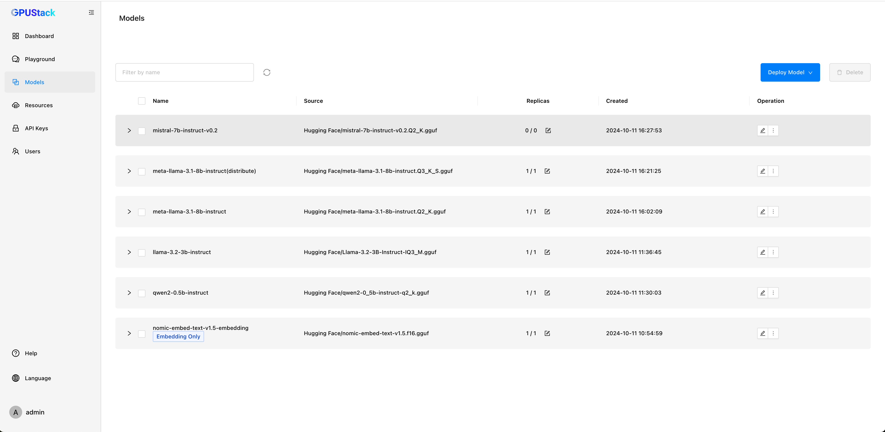
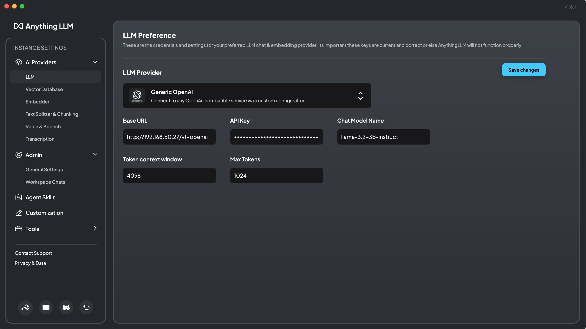
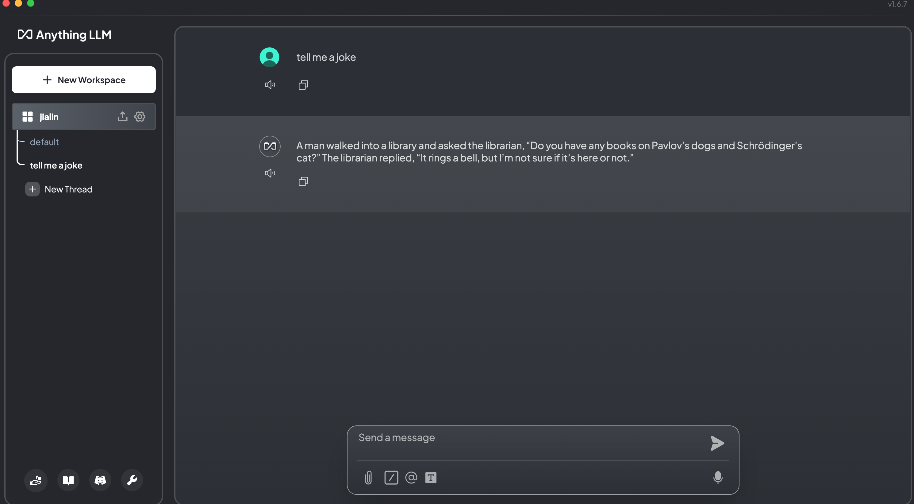

First, deploy some models.

## Integration With AnythingLLM

1. Create a `API Key` on **GPUStack**
2. Configure the `LLM Provider` in `AnythingLLM`.
  - Enter `Base URL` as `yourserver/v1-openai`
  - Enter the`API Key` you created on **GPUStack**
  - Enter a deployed chat model.

3. Start chatting

