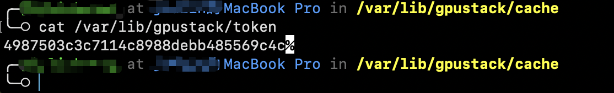
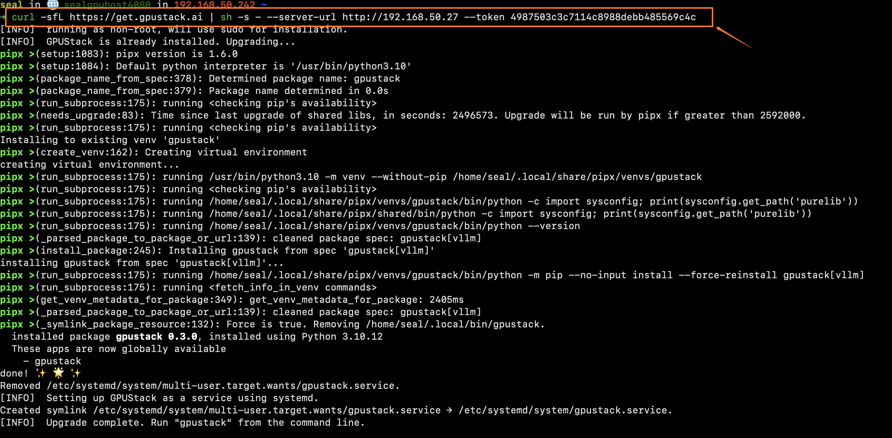
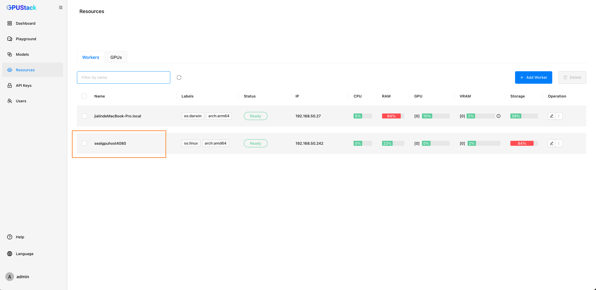

# Multiple Node Cluster

To connect a remote worker to your existing GPUstack service and form a cluster, follow these steps:

1. On the **local host**, retrieve the service token using the appropriate command for your operating system:

**For Linux or MacOS**
```bash
cat /var/lib/gpustack/token
```
**For Windows**
```bash
Get-Content -Path (Join-Path -Path $env:APPDATA -ChildPath "gpustack\token") -Raw
```



2. Your current service address is: `http://myserver`.

3. On the **remote host**, run the following command. Be sure to replace `mytoken` with the token you obtained in Step 1:
```bash
curl -sfL https://get.gpustack.ai | sh -s - --server-url http://myserver --token mytoken
```



4. Go to `http://myserver` and refresh the worker list. You should now see the newly added worker.


