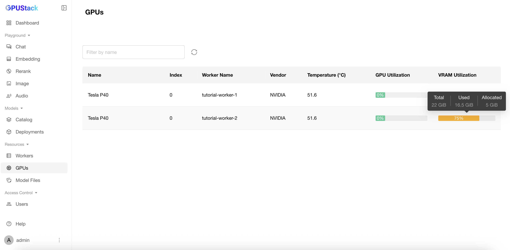

# Performing Distributed Inference Across Workers (llama-box)

This tutorial will guide you through the process of configuring and running distributed inference across multiple workers using GPUStack. Distributed inference allows you to handle larger language models by distributing the computational workload among multiple workers. This is particularly useful when individual workers do not have sufficient resources, such as VRAM, to run the entire model independently.

## Prerequisites

Before proceeding, ensure the following:

- A multi-node GPUStack cluster is installed and running.
- Access to Hugging Face for downloading the model files.

In this tutorial, we’ll assume a cluster with two nodes, each equipped with an NVIDIA P40 GPU (22GB VRAM), as shown in the following image:


We aim to run a large language model that requires more VRAM than a single worker can provide. For this tutorial, we’ll use the `Qwen/Qwen2.5-72B-Instruct` model with the `q2_k` quantization format. The required resources for running this model can be estimated using the [gguf-parser](https://github.com/gpustack/gguf-parser-go) tool:

```bash
gguf-parser --hf-repo Qwen/Qwen2.5-72B-Instruct-GGUF --hf-file qwen2.5-72b-instruct-q2_k-00001-of-00007.gguf --ctx-size=8192 --in-short --skip-architecture --skip-metadata --skip-tokenizer
```

```
+--------------------------------------------------------------------------------------+
| ESTIMATE                                                                             |
+----------------------------------------------+---------------------------------------+
|                      RAM                     |                 VRAM 0                |
+--------------------+------------+------------+----------------+----------+-----------+
| LAYERS (I + T + O) |     UMA    |   NONUMA   | LAYERS (T + O) |    UMA   |   NONUMA  |
+--------------------+------------+------------+----------------+----------+-----------+
|      1 + 0 + 0     | 259.89 MiB | 409.89 MiB |     80 + 1     | 2.50 GiB | 28.89 GiB |
+--------------------+------------+------------+----------------+----------+-----------+
```

From the output, we can see that the estimated VRAM requirement for this model exceeds the 22GB VRAM available on each worker node. Thus, we need to distribute the inference across multiple workers to successfully run the model.

### Step 1: Deploy the Model

Follow these steps to deploy the model from Hugging Face, enabling distributed inference:

1. Navigate to the `Deployments` page in the GPUStack UI.
2. Click the `Deploy Model` button.
3. In the dropdown, select `Hugging Face` as the source for your model.
4. Enable the `GGUF` checkbox to filter models by GGUF format.
5. Use the search bar in the top left to search for the model name `Qwen/Qwen2.5-72B-Instruct-GGUF`.
6. In the `Available Files` section, select the `q2_k` quantization format.
7. Expand the `Advanced` section and scroll down. Verify that the `Allow Distributed Inference Across Workers` option is enabled (this is enabled by default). GPUStack will evaluate the available resources in the cluster and run the model in a distributed manner if required.
8. Click the `Save` button to deploy the model.


### Step 2: Verify the Model Deployment

Once the model is deployed, verify the deployment on the `Deployments` page, where you can view details about how the model is running across multiple workers.


You can also check worker and GPU resource usage by navigating to the `Workers` or the `GPUs` page.



Finally, go to the `Playground` page to interact with the model and verify that everything is functioning correctly.


