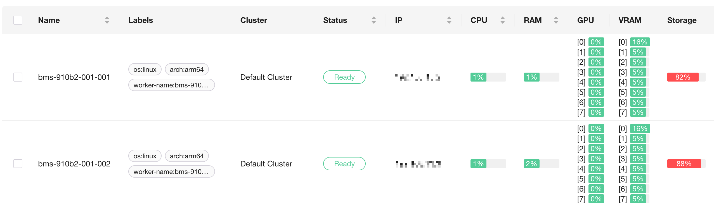
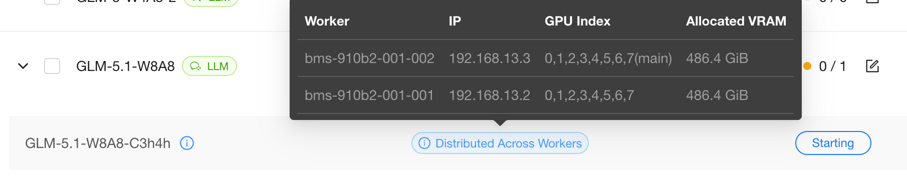
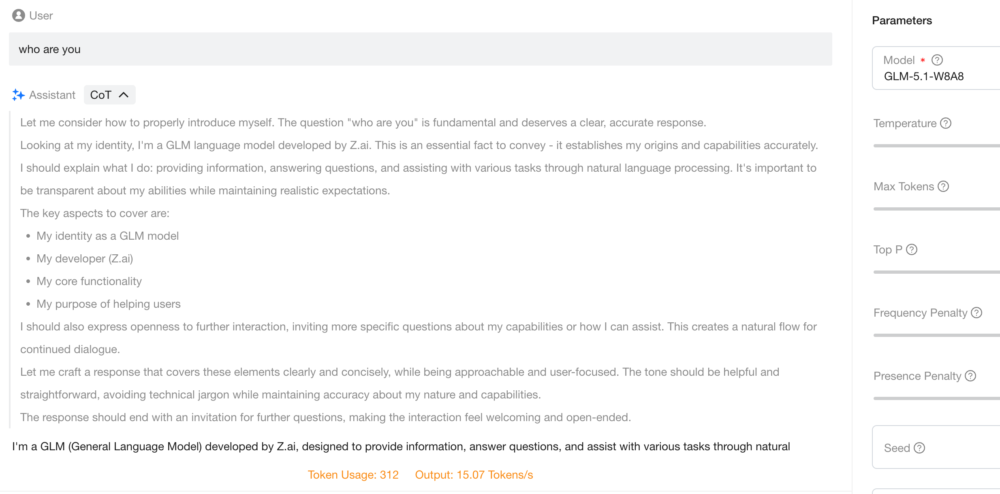

# Running Distributed vLLM with the MultiProcessing Backend

When a single worker does not have enough GPU memory or compute to host a model, vLLM can split one model instance across multiple workers for collaborative inference. GPUStack orchestrates these cross-node processes as a **single** model instance and exposes only one OpenAI-compatible endpoint. vLLM offers two execution paths through the `--distributed-executor-backend` parameter: `ray` and `mp` (MultiProcessing). This tutorial shows how to use the **MP backend** to run distributed inference across multiple workers with a combination of tensor parallelism (TP) and data parallelism (DP).

In this tutorial, you will learn how to enable cross-worker distributed inference on GPUStack, explicitly select the MP backend, and combine tensor parallelism with data parallelism to deploy a single model instance across two nodes.

!!! note

    - The MP backend takes effect when you explicitly set `--distributed-executor-backend=mp` in `Backend Parameters`, or when you use a custom image (a backend version with the `-custom` suffix) with vLLM ≥ `0.18.0`. Starting from `0.18.0`, vLLM no longer depends on Ray by default, so GPUStack automatically falls back to `mp` to avoid startup failures.
    - For the conceptual differences between the Ray and MP paths, the headless follower, and the `dp_only` / `mp_only` / `nested` topologies, see the `Distributed Inference Across Workers` section in [Built-in Inference Backends](../user-guide/built-in-inference-backends.md).
    - This feature is currently experimental.

## Prerequisites

Before you begin, ensure that you have the following:

- GPUStack is installed and running.
- At least **2 Linux nodes**, each with the **same number and the same model** of GPUs. This tutorial uses **2 nodes × 8 GPUs** (16 GPUs in total) as an example, applicable to accelerators from various vendors such as NVIDIA, AMD, and Ascend.
- A high-speed interconnect between nodes (such as NVLink or InfiniBand) is recommended for better performance.
- The model files must be accessible at the **same path on every participating node**. Use a shared filesystem, or download the model files to the same path on each node in advance.
- The selected model is suitable for a `tensor-parallel-size=8`, `data-parallel-size=2` layout (that is, each data-parallel replica occupies one full 8-GPU node).

!!! note

    This tutorial assumes that each data-parallel replica (`tensor-parallel-size=8`) fully occupies one 8-GPU node. Adjust `--tensor-parallel-size` and `--data-parallel-size` according to your model and hardware.

## Step 1: Add GPUStack Workers

Following [Installation](../installation/installation.md), run the join command on each node to add them to the same GPUStack cluster.

After they join, confirm on the `Workers` page in the GPUStack UI that both nodes are in the Ready state and that their GPUs are listed.



## Step 2: Deploy the Model with the MP Backend

1. Navigate to the `Deployments` page.
2. Click `Deploy Model`, select the model source (such as `Local Path`), and enter the model path that is consistent across all nodes.
3. Confirm that `Backend` is set to `vLLM`.
4. Under the advanced settings, check `Allow Distributed Inference Across Workers` to enable cross-worker distributed inference.
5. Add the following parameters in `Backend Parameters`:

    ```bash
    --distributed-executor-backend=mp
    --tensor-parallel-size=8
    --data-parallel-size=2
    --enable-expert-parallel
    ```

6. After passing the compatibility check, click `Save` to deploy.


!!! tip "Deploy the entire distributed instance as a single deployment"

    We recommend deploying a cross-node distributed instance as a **single** deployment. When you create only one deployment as described above, GPUStack will:

    - select GPUs across both workers (16 in this example) and automatically derive the per-node `--data-parallel-size-local`, so you **do not need to set** `--data-parallel-size-local` manually;
    - inject the multi-node topology parameters `--nnodes`, `--node-rank`, `--master-addr`, and `--master-port`;
    - automatically add `--headless` to the follower instances, so they only participate in distributed computation and do not start an API endpoint. Seeing `--headless` in the follower logs is expected.

!!! note "When automatic scheduling cannot be satisfied"

    If automatic scheduling cannot allocate resources because a condition is not met (for example, the GPU memory does not satisfy `gpu_memory_utilization`), switch `Scheduling Mode` to `Manual` or `Specify GPU`, and then use the `GPU Selector` to select 8 GPUs on each of the two workers (16 in total). See [Built-in Inference Backends](../user-guide/built-in-inference-backends.md) for the full conditions of automatic scheduling.


!!! note "When splitting into multiple deployments manually: use `GPUSTACK_SKIP_GPU_COUNT_CHECK` to skip the GPU count check"

    In some scenarios, you may want to create one deployment per node (for example, to manage an external load balancer yourself), selecting GPUs manually and setting `--data-parallel-size-local 1` by hand. In this case, each deployment selects only 8 GPUs, while `tensor-parallel-size × data-parallel-size = 16`, so GPUStack reports an error because the GPU count does not match the world size: `the selected gpu count (8) does not match the world size (16)`.

    If this is your intended layout, set `GPUSTACK_SKIP_GPU_COUNT_CHECK=1` in each deployment's `Environment Variables` to skip the check and keep your manually selected GPU count. This switch **takes effect only when GPUs are selected manually** (`Scheduling Mode` is `Manual` or `Specify GPU`) and does not affect automatic scheduling.

## Step 3: Monitor Deployment

Monitor the deployment status on the `Deployments` page. Hover over `Distributed Across Workers` to view the instance's GPU usage on each worker. Click `View Logs` to see real-time logs:

- The **leader** instance loads the model and exposes the OpenAI-compatible endpoint;
- The **follower** instance logs show `--headless`, which means it only participates in distributed computation and does not occupy an API port. This is expected.

Loading the model may take a few minutes.



## Step 4: Verify via the Playground

Once the deployment is running, verify it directly in the GPUStack Playground. All external requests enter through the leader, which dispatches them to the followers, so the usage is identical to a single-worker deployment:

1. Navigate to `Playground` > `Chat`.
2. If only one model is deployed, it is selected by default; otherwise, select your model from the drop-down menu in the top-right corner.
3. Enter a prompt and interact with the model.



You have now successfully deployed and run distributed inference across multiple nodes on a GPUStack cluster using vLLM's MP backend.

If you need further assistance, feel free to reach out to the GPUStack community or support team.
