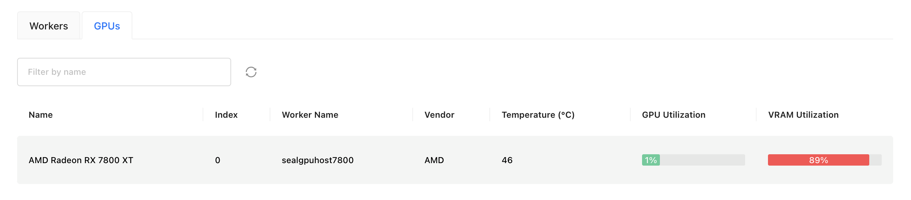

# Running Inference With AMD GPUs

GPUStack supports running inference on AMD GPUs. This tutorial will guide you through the configuration steps.

## Docker Installation

### System and Hardware Support

| OS    | Architecture | Status  | Verified           |
| ----- | ------------ | ------- | ------------------ |
| Linux | x86_64       | Support | Ubuntu 20.04/22.04 |

| Device                                              | Status              | Verified |
| --------------------------------------------------- | ------------------- | -------- |
| AMD Radeon RX 7800                                  | Support(Linux only) | Yes      |
| AMD Radeon RX 7900                                  | Support(Linux only) |          |
| AMD Instinct MI300X/MI300A/MI250X/MI250/MI210/MI100 | Support(Linux only) |          |

| GPUStack Inference Backend | Status  | Verified |
| -------------------------- | ------- | -------- |
| llama-box                  | Support | Yes      |
| vLLM                       | Support | Yes      |
| vox-box                    | Support | Yes      |

### Setup Instructions

#### Install ROCm

Select the appropriate installation method for your system. Here, we provide steps for Linux (Ubuntu). For other systems, refer to the ROCm documentation:

- [Installation on Linux](https://rocm.docs.amd.com/projects/install-on-linux/en/docs-6.2.4/install/install-overview.html#package-manager-versus-amdgpu)

1. Install Required Packages

```bash
sudo apt update
wget https://repo.radeon.com/amdgpu-install/6.2.4/ubuntu/jammy/amdgpu-install_6.2.60204-1_all.deb
sudo apt install ./amdgpu-install_6.2.60204-1_all.deb

amdgpu-install -y --usecase=graphics,rocm
sudo reboot
```

2. Set Groups permissions

```bash
sudo usermod -a -G render,video $LOGNAME
sudo reboot
```

3. Verify Installation

```bash
# Verify that the current user is added to the render and video groups.
# Expected result: <username> adm cdrom sudo dip video plugdev render lpadmin lxd sambashare
groups

# Check if amdgpu kernel driver is installed.
# Exptected result: amdgpu/x.x.x-xxxxxxx.xx.xx, x.x.x-xx-generic, x86_64: installed
dkms status

# Check if the GPU is listed as an agent.
rocminfo

# Check rocm-smi.
rocm-smi -i --showmeminfo vram --showpower --showserial --showuse --showtemp --showproductname
```

#### Configure the Container Runtime

Follow the [Docker Installation Guide](https://docs.docker.com/desktop/install/linux/) to install and configure the container runtime.

#### Installing GPUStack

To set up an isolated environment for GPUStack, we recommend using Docker.

```bash
docker run -it \
   --network=host \
   --ipc=host \
   --group-add=video \
   --cap-add=SYS_PTRACE \
   --security-opt seccomp=unconfined \
   --device /dev/kfd \
   --device /dev/dri \
   gpustack/gpustack:v0.5.0-rocm
```

If the following message appears, the GPUStack container is running successfully:

```bash
2024-11-15T23:37:46+00:00 - gpustack.server.server - INFO - Serving on 0.0.0.0:80.
2024-11-15T23:37:46+00:00 - gpustack.worker.worker - INFO - Starting GPUStack worker.
```

Once the container is running, access the GPUStack web interface by navigating to `http://localhost:80` in your browser, you should see that GPUStack successfully recognizes the AMD Device in the resources page.



#### Running Inference

After installation, you can deploy models and run inference. Refer to the [model management](../user-guide/model-management.md) for detailed usage instructions.

## non-Docker Installation

### System and Hardware Support

| OS      | Architecture | Status  | Verified           |
| ------- | ------------ | ------- | ------------------ |
| Linux   | x86_64       | Support | Ubuntu 20.04/22.04 |
| Windows | x86_64       | Support | Windows 11         |

| Device                                              | Status              | Verified |
| --------------------------------------------------- | ------------------- | -------- |
| AMD Radeon RX 7800                                  | Support             | Yes      |
| AMD Radeon RX 7900                                  | Support             |          |
| AMD Radeon PRO W7900/W7800/W6800/V620               | Support             |          |
| AMD Instinct MI300X/MI300A/MI250X/MI250/MI210/MI100 | Support(Linux only) |          |

| GPUStack Inference Backend | Status  | Verified |
| -------------------------- | ------- | -------- |
| llama-box                  | Support | Yes      |
| vox-box                    | Support | Yes      |

### Setup Instructions

#### Install ROCm

Select the appropriate installation method for your system. The Linux (Ubuntu) could follow the same instrustion as Above `Docker Installation`. For other systems, refer to the ROCm documentation:

- [Installation on Linux](https://rocm.docs.amd.com/projects/install-on-linux/en/docs-6.2.4/install/install-overview.html#package-manager-versus-amdgpu)
- [Installation on Windows](https://rocm.docs.amd.com/projects/install-on-windows/en/docs-6.2.4/index.html#hip-sdk-installation)

#### Installing GPUStack

Once the environment is set up, install GPUStack following the [installation guide](../installation/installation-script.md).

After installation, GPUStack will detect AMD GPUs automatically.

Example:


#### Running Inference

After installation, you can deploy models and run inference. Refer to the [model management](../user-guide/model-management.md) for usage details.

!!! note
      vllm backend is not supported in non-Docker deployment.
