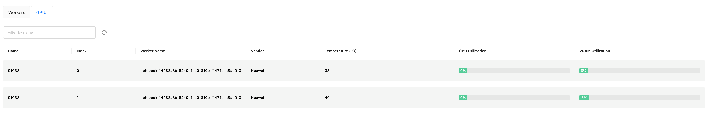

# Running Inference With Ascend Device

GPUStack supports running inference on Ascend NPUs. This tutorial will guide you through the configuration steps.

## System and Hardware Support

| OS    | Status  | Verified     |
| ----- | ------- | ------------ |
| Linux | Support | Ubuntu 20.04 |

| Device           | Status  | Verified    |
| ---------------- | ------- | ----------- |
| Ascend 910       | Support | Ascend 910B |

## Setup Steps

### Install Ascend packages

1. Download Ascend packages

    Choose the packages according to your system, hardware and GPUStack is compatible with CANN 8.x from resources download center(links below).

    Download the driver and firmware from [here](https://www.hiascend.com/hardware/firmware-drivers/community).

    | Package Name                                                 | Description           |
    | ------------------------------------------------------------ | --------------------- |
    | Ascend-hdk-{chip_type}-npu-driver_{version}_linux-{arch}.run | Ascend Driver (run format) |
    | Ascend-hdk-{chip_type}-npu-firmware_{version}.run            | Ascend (run format) |


    Download the toolkit and kernels from [here](https://www.hiascend.com/zh/developer/download/community/result?module=cann).


    | Package Name                                               | Description               |
    | ---------------------------------------------------------- | ------------------------- |
    | Ascend-cann-toolkit_{version}_linux-{arch}.run             | CANN Toolkit (run format) |
    | Ascend-cann-kernels-{chip_type}_{version}_linux-{arch}.run | CANN Kernels (run format) |

2. Create the user and group for running
   
    ```bash
    sudo groupadd -g HwHiAiUser
    sudo useradd -g HwHiAiUser -d /home/HwHiAiUser -m HwHiAiUser -s /bin/bash
    sudo usermod -aG HwHiAiUser $USER
    ```

3. Install driver

    ```bash
    sudo chmod +x Ascend-hdk-xxx-npu-driver_x.x.x_linux-{arch}.run
    # Driver installation, default installation path: "/usr/local/Ascend"
    sudo sh Ascend-hdk-xxx-npu-driver_x.x.x_linux-{arch}.run --full --install-for-all
    ```

    If you see the following message, the firmware installation is complete:
    ```bash
    Driver package installed successfully! 
    ```

4. Verify successful driver installation

    After the driver successful installation, run the `npu-smi info` command to check if the driver was installed correctly.

    ```bash
    $npu-smi info
    +------------------------------------------------------------------------------------------------+
    | npu-smi 23.0.1                   Version: 23.0.1                                               |
    +---------------------------+---------------+----------------------------------------------------+
    | NPU   Name                | Health        | Power(W)    Temp(C)           Hugepages-Usage(page)|
    | Chip                      | Bus-Id        | AICore(%)   Memory-Usage(MB)  HBM-Usage(MB)        |
    +===========================+===============+====================================================+
    | 4     910B3               | OK            | 93.6        40                0    / 0             |
    | 0                         | 0000:01:00.0  | 0           0    / 0          3161 / 65536         |
    +===========================+===============+====================================================+
    +---------------------------+---------------+----------------------------------------------------+
    | NPU     Chip              | Process id    | Process name             | Process memory(MB)      |
    +===========================+===============+====================================================+
    | No running processes found in NPU 4                                                            |
    +===========================+===============+====================================================+
    ```

5. Install firmware

    ```bash
    sudo chmod +x Ascend-hdk-xxx-npu-firmware_x.x.x.x.X.run
    sudo sh Ascend-hdk-xxx-npu-firmware_x.x.x.x.X.run --full
    ```

    If you see the following message, the firmware installation is complete:
    ```bash
    Firmware package installed successfully!
    ```

6. Install toolkit and kernels

    As an example for Ubuntu, adapt commands according to your system.

    Check for dependencies to ensure Python, GCC, and other required tools are installed.
    ```bash
    gcc --version
    g++ --version
    make --version
    cmake --version
    dpkg -l zlib1g| grep zlib1g| grep ii
    dpkg -l zlib1g-dev| grep zlib1g-dev| grep ii
    dpkg -l libsqlite3-dev| grep libsqlite3-dev| grep ii
    dpkg -l openssl| grep openssl| grep ii
    dpkg -l libssl-dev| grep libssl-dev| grep ii
    dpkg -l libffi-dev| grep libffi-dev| grep ii
    dpkg -l libbz2-dev| grep libbz2-dev| grep ii
    dpkg -l libxslt1-dev| grep libxslt1-dev| grep ii
    dpkg -l unzip| grep unzip| grep ii
    dpkg -l pciutils| grep pciutils| grep ii
    dpkg -l net-tools| grep net-tools| grep ii
    dpkg -l libblas-dev| grep libblas-dev| grep ii
    dpkg -l gfortran| grep gfortran| grep ii
    dpkg -l libblas3| grep libblas3| grep ii
    ```

    If the commands return messages showing missing packages, install them as follows (adjust the command if only specific packages are missing):

    ```bash
    sudo apt-get install -y gcc g++ make cmake zlib1g zlib1g-dev openssl libsqlite3-dev libssl-dev libffi-dev libbz2-dev libxslt1-dev unzip pciutils net-tools libblas-dev gfortran libblas3
    ```

    Install Python dependencies:

    ```bash
    pip3 install --upgrade pip
    pip3 install attrs numpy decorator sympy cffi pyyaml pathlib2 psutil protobuf scipy requests absl-py wheel typing_extensions
    ```

    Install the toolkit and kernels:

    ```bash
    chmod +x Ascend-cann-toolkit_{vesion}_linux-{arch}.run
    chmod +x Ascend-cann-kernels-{chip_type}_{version}_linux-{arch}.run

    sh Ascend-cann-toolkit_{vesion}_linux-{arch}.run --install
    sh Ascend-cann-kernels-{chip_type}_{version}_linux-{arch}.run --install
    ```

    Once installation completes, you should see a success message like this:
    ```bash
    xxx install success
    ```

7. Configure environment variables

    ```bash
    echo "source ~/Ascend/ascend-toolkit/set_env.sh" >> ~/.bashrc
    source ~/.bashrc
    ```

For more details, refer to the [Ascend Documentation](https://www.hiascend.com/document/detail/zh/CANNCommunityEdition/80RC2alpha002/softwareinst/instg/instg_0019.html).

### Installing GPUStack

Once your environment is ready, you can install GPUStack following the [installation guide](../installation/installation-script.md).

Once installed, you should see that GPUStack successfully recognizes the Ascend Device in the resources page.



### Running Inference

After installation, you can deploy models and run inference. Refer to the [model management](../user-guide/model-management.md) for usage details. 

The Ascend NPU supports inference through the llama-box (llama.cpp) backend. For supported models, see the [llama.cpp Ascend NPU model supports](https://github.com/ggerganov/llama.cpp/blob/958367bf530d943a902afa1ce1c342476098576b/docs/backend/CANN.md).
