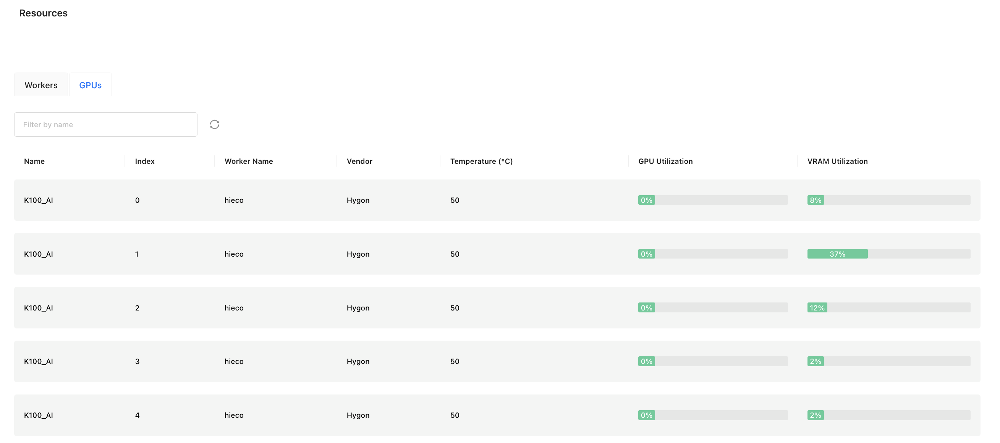

# Running Inference With Hygon DCUs

GPUStack supports running inference on Hygon GPUs. This tutorial will guide you through the configuration steps.

## Docker Installation

### System and Hardware Support

| OS    | Architecture | Status  | Verified     |
| ----- | ------------ | ------- | ------------ |
| Linux | x86_64       | Support | Ubuntu 22.04 |

| Tools  | Verified               |
| ------ | ---------------------- |
| Driver | rock-5.7.1-6.2.26-V1.5 |
| DTK    | DTK-24.04.3            |

| Supported Backends | Verified |
| ------------------ | -------- |
| llama-box          | Yes      |
| vLLM               | Yes      |
| vox-box            | Yes      |

### Setup Instructions

#### Install Driver and DTK

1. Install Required Packages

Register and log in to Hygon Developer Community: https://developer.hpccube.com/tool/#sdk

Select the appropriate installation method for your system. Download the Driver and DTK(DCU Toolkit), install base on the document community provided.

2. Verify Installation

```bash
# Verify the rocminfo.
# Expected result: Device Type: DCU
rocminfo | grep DCU

# Check if the GPU is listed as an agent.
rocminfo

# Check rocm-smi.
rocm-smi -i --showmeminfo vram --showpower --showserial --showuse --showtemp --showproductname

# Check hy-smi
hy-smi
```

#### Configure the Container Runtime

Follow the [Docker Installation Guide](https://docs.docker.com/desktop/install/linux/) to install and configure the container runtime.

#### Installing GPUStack

To set up an isolated environment for GPUStack, we recommend using Docker.

```bash
docker run -itd --shm-size 500g \
   --network=host --privileged \
   --group-add video \
   --cap-add=SYS_PTRACE \
   --security-opt seccomp=unconfined \
   --device=/dev/kfd --device=/dev/dri \
   -v /opt/hyhal:/opt/hyhal:ro \
   gpustack/gpustack:v0.5.1-dcu
```

If the following message appears, the GPUStack container is running successfully:

```bash
2024-11-15T23:37:46+00:00 - gpustack.server.server - INFO - Serving on 0.0.0.0:80.
2024-11-15T23:37:46+00:00 - gpustack.worker.worker - INFO - Starting GPUStack worker.
```

Once the container is running, access the GPUStack web interface by navigating to `http://localhost:80` in your browser, you should see that GPUStack successfully recognizes the Hygon DCU Device in the resources page.



#### Running Inference

After installation, you can deploy models and run inference. Refer to the [model management](../user-guide/model-management.md) for detailed usage instructions.

## non-Docker Installation

### System and Hardware Support

| OS    | Architecture | Status  | Verified           |
| ----- | ------------ | ------- | ------------------ |
| Linux | x86_64       | Support | Ubuntu 20.04/22.04 |

| Tools  | Verified               |
| ------ | ---------------------- |
| Driver | rock-5.7.1-6.2.26-V1.5 |
| DTK    | DTK-24.04.3            |

| Supported Backends | Verified |
| ------------------ | -------- |
| llama-box          | Yes      |
| vox-box            | Yes      |

### Setup Instructions

#### Install Driver and DTK

The method of installing the Driver and DTK is the same as that in the Docker part above.

#### Installing GPUStack

Once the environment is set up, install GPUStack following the [installation guide](../installation/installation-script.md).

After installation, GPUStack will detect Hygon DCUs automatically.

Example:


#### Running Inference

After installation, you can deploy models and run inference. Refer to the [model management](../user-guide/model-management.md) for usage details.

!!! note
      vllm backend is not supported in non-Docker deployment.
